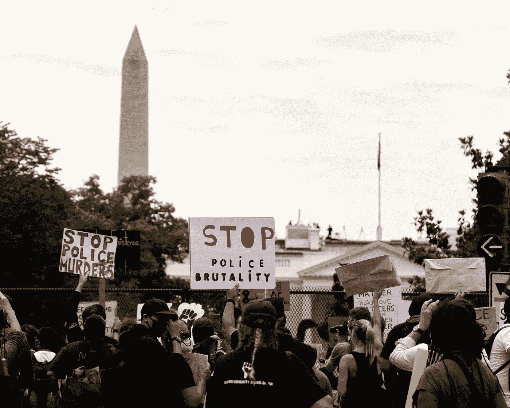
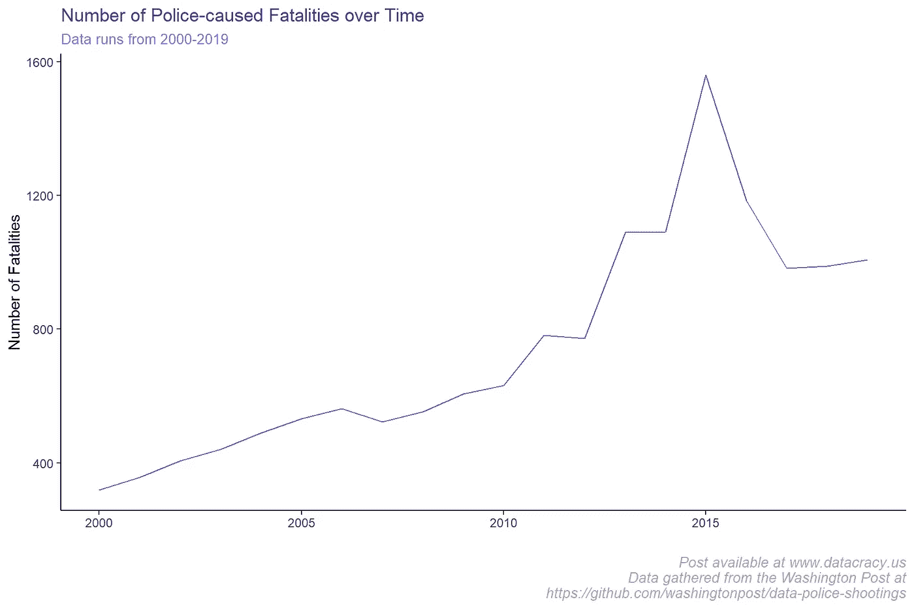
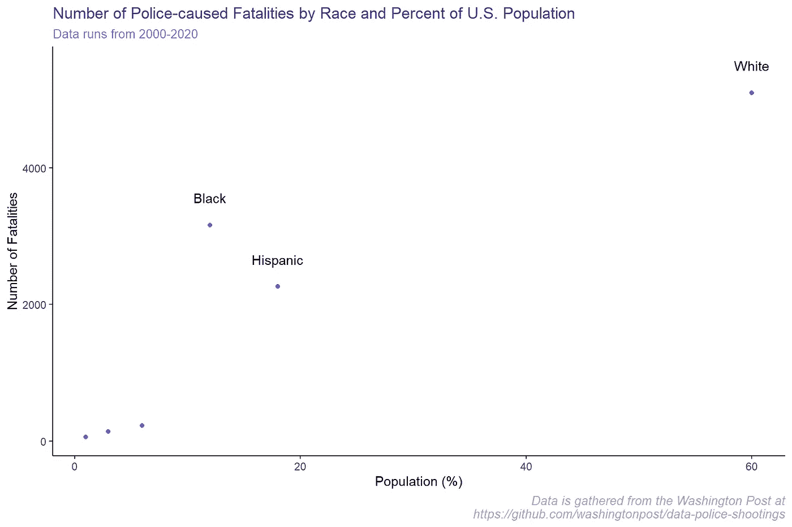
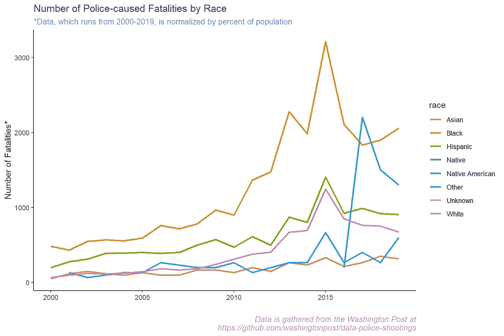
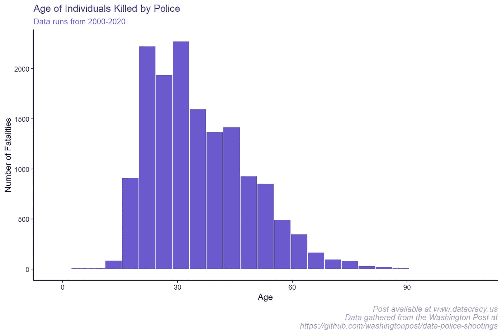
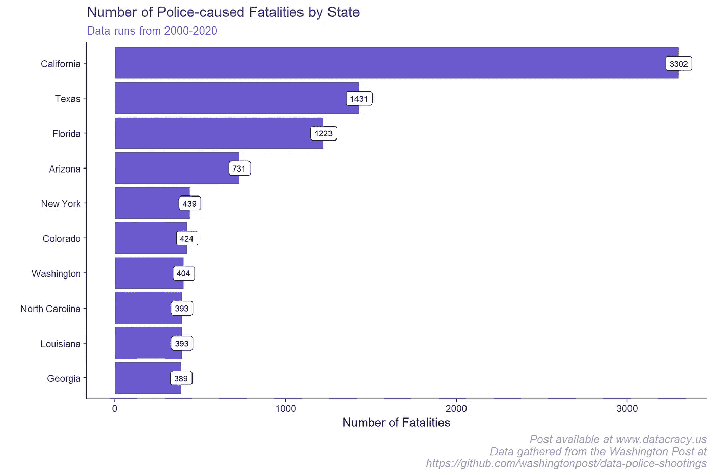
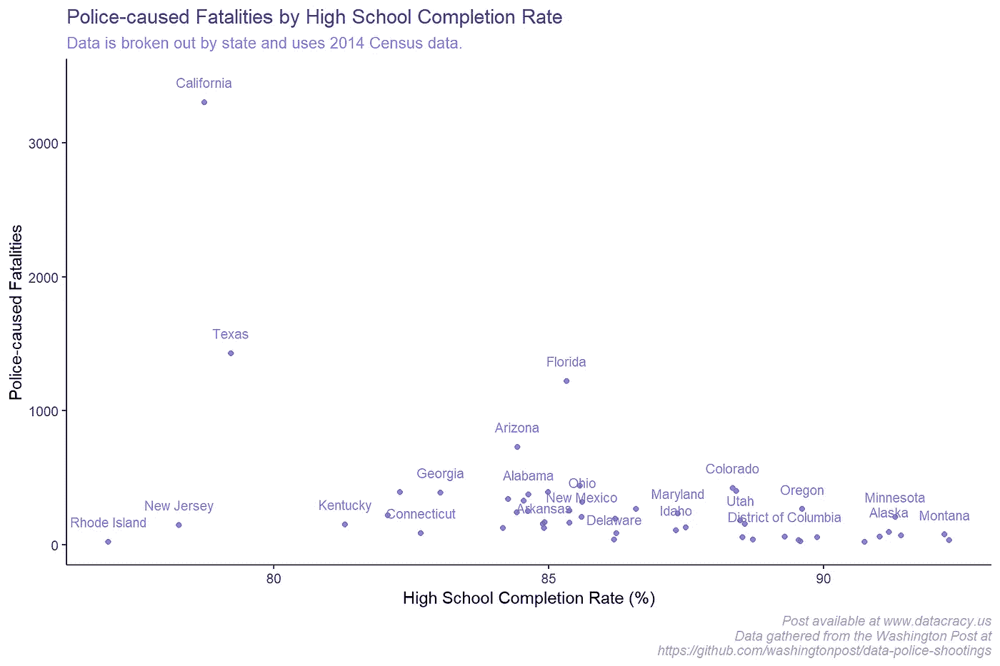
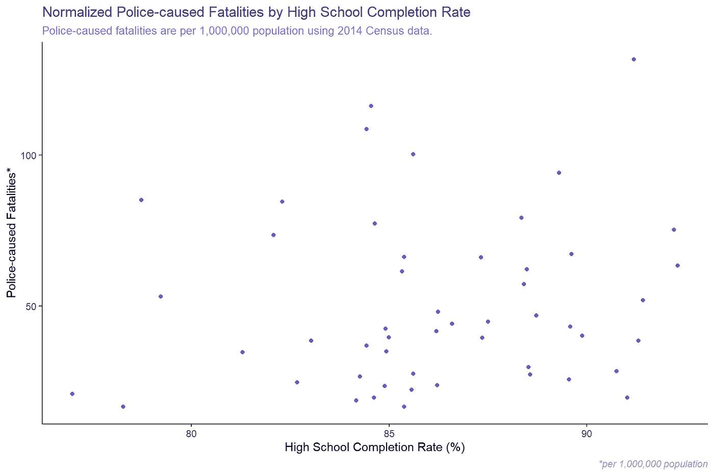
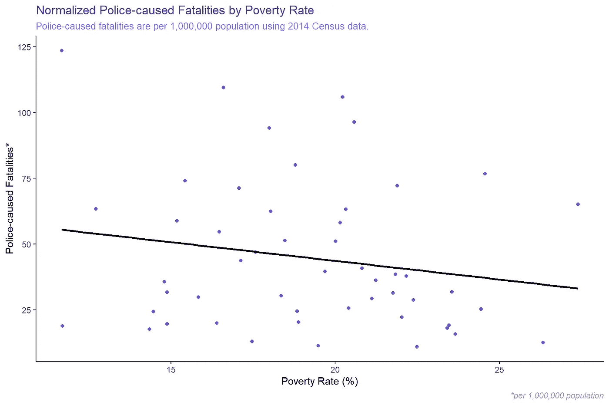
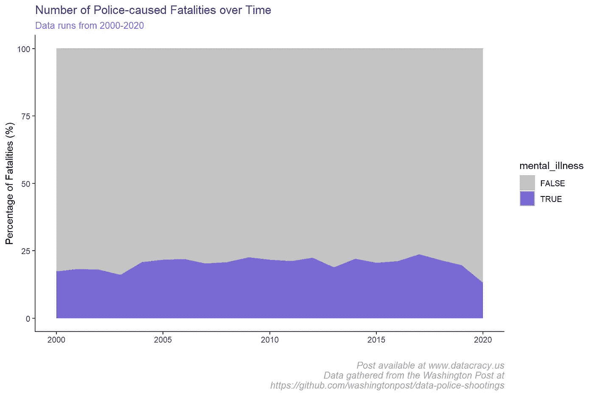

# 美国警方造成的死亡

> 原文：<https://towardsdatascience.com/exploratory-data-analysis-of-u-s-police-caused-fatalities-fce47a2b7198?source=collection_archive---------54----------------------->

## R 中的探索性数据分析

# 美国警方造成的死亡

乔治·弗洛伊德。埃里克·加纳。塔米尔·赖斯。

在成千上万的其他名字中，这些名字是美国致命警察暴力的象征。像野火一样在美国蔓延的抗议运动使警察暴行成为每个人最关心的问题。

随着新闻站和社交媒体信息的泛滥，我不禁想知道，这些数据说明了什么？这些是新趋势还是长期存在的现实？警察对美国黑人的暴行有多不相称？心理健康起到什么作用？为了引发变革，我们需要对手头的问题有很强的经验性理解。查看数据使这成为可能。

在这篇文章中，我将分析 20 年来美国警察杀人的数据。我将使用各种探索和建模技术来回答以下问题:—随着时间的推移，有多少人被警察杀害？—这些人的种族/年龄/性别是什么？—事件发生时，一般人群的人口统计学特征是什么？心理健康状况如何影响警察杀人的可能性？

# 警察造成的死亡数据

在本次分析中，我将使用一些数据集。不同的数据集包括 2000 年至 2020 年被警察杀害的个人。除此之外，我还有一些人口普查、事件和主题级别的数据。这些数据来自 **2000 年至 2020 年**，这使得它成为*过去 20 年*由警察导致的死亡/杀戮的极其庞大的数据集。

在将五个不同的数据集连接和绑定在一起之后，我们得到了上面看到的数据集，它将驱动本文的大部分分析。我们可以看到，我们正在处理多行数据，这些数据显示了死于警察之手的个人、他们的一些人口统计信息、他们来自的城市/州，以及关于谋杀的信息。值得指出的是，人口统计数据来自 2014 年人口普查局的数据，这些数据只能作为一个城市/州的实际人口统计数据的估计，主要是因为该数据集中的一些杀人事件早在 2000 年就发生了。

现在我们知道了我们正在处理的数据，让我们开始进一步探索它。

在过去 20 年中，警察造成的死亡有什么趋势？正如我们在下面看到的，警察造成的死亡人数在过去 20 年中显著增长，在 2015 年达到高峰。

# 一段时间内警察造成的死亡

这是令人担忧的，尽管从 2015 年**的峰值开始总体下降，但这表明警方处理这些情况的方式发生了变化。这令人担忧，尽管自 2015 年以来总体有所下降，但表明警方处理这些情况的方式发生了变化。2020 年的低数字可能是由于当年的数据不完整，以及由于新冠肺炎，警察造成的杀戮较少。是什么导致了这种上升和随后的下降呢？我不是专家，很想听听你的想法。以下是我的猜测:**

1.  2014 年至 2015 年展示了一些最严重的警察暴力案件(塔米尔·赖斯、弗格森骚乱等。).抗议警察暴行的人可能在抗议时被杀，这似乎是有道理的。随着更多的关注，警察在 2015 年后可能会更加小心。
2.  在这些事件发生后，更实质性的政策可能已经到位(警察使用武力政策、旁观者干预政策、逃生训练等)。).显然这还不够，但可能归因于 2015 年以来的一些下降。
3.  数据收集！看起来《华盛顿邮报》的收集方法在 2015 年发生了变化，这*可能*会对我们看到的趋势产生影响。关于这方面的更多信息包含在我的原始帖子的底部。

# 按种族划分的警察造成的死亡

有趣的是，根据数据集，被警察杀害的美国白人比美国黑人多。这让我很惊讶，尤其是最近新闻报道的所有事情。为了帮助解释这一点，我加入了美国境内每个种族的比例。由此，我们可以清楚地看到，美国黑人是第二大被警察盯上的群体，但**只占美国人口的 12**。另一方面，被警察杀害的美国白人略多，但却占美国人口的 60%。

从另一个角度来看，在美国，每八个人中就有一个是非西班牙裔美国黑人。每八个人中就有五个是白人。在被警察杀害的美国人中，每 8 人中有 2.3 人是黑人，每 8 人中有 3.7 人是白人。只看表格，美国黑人是唯一一个因警察造成死亡的比例比他们在人口中所占比例有显著增加的种族。最重要的是，如果你把黑人和西班牙裔美国人结合起来，他们占了美国白人人口的一半；然而，他们构成了更多的警察死亡。

让我们通过每个种族在人口中所占的比例进行标准化，以更公平的方式来展示这一点。

现在我们可以清楚地看到，在我们的数据集中，几乎每一年，美国黑人的死亡率都高于其他任何种族。我在这里注意到的一件事是 2015 年黑人和白人被杀的人数激增。到 2016 年，这一峰值急剧下降，但远不如其他比赛那么显著。

# 按年龄分列的警察造成的死亡

这看起来像是一个非常正常的年龄分布，数据中可能存在右偏。大多数被杀害的人都比较年轻，我们数据中的中位年龄是 33 岁。

# 各州警方造成的死亡人数

这是没有帮助的，因为人口是如此不同。例如，我们一些人口最多的州，像加利福尼亚和德克萨斯，都出现在这里。我有一种预感，如果我们使用 2014 年的一些人口普查数据，按州人口进行标准化，我们会对死亡人数有更好的认识。

超级有趣！我们现在在可视化中有许多新的州，表明仅仅因为一个州，如德克萨斯州，有许多警察造成的死亡，并不意味着它与其他州的人口比例一样高。值得在未来的迭代中探索这些状态的共同点。

# 高中毕业率分析

我想分析完成高中学业的城市平均人口的枪击数量。我在这里的假设是，高中毕业率低的城市会发生更多枪击案。

要做的第一件事是多填一点我们的数据。有许多地理数据没有在更早的时候引入。为了填写这些数据，我计划*通过找到每个州的平均比率并使用它来估算*。之后，让我们看一个高中毕业率的箱线图，以更好地了解数据分布。

箱线图显示了数据分布；也就是说，在上面的方框中，我们可以看到中间 50%的数据(第 25 百分位到第 75 百分位)。看起来大多数地区都有相当高的高中毕业率，中位数为 **85.6068493** ，平均数为 **86.2** 。

同样，这没有考虑到按人口标准化我们的数据。让我们看看这是如何改变事情的。

在这两个图表之间，我看不出数据中有任何关联。令人欣慰的是，我最初的假设是错误的，即在高中毕业率较低的地区，警察导致的死亡人数会大幅增加。为了给我们的分析增加更多的统计严谨性，让我们快速看看高中毕业率和警察造成的死亡人数之间的相关性。

这是什么意思？当两个变量高度相关时，我们期望上表中的值接近+/-1。另一方面，当两个变量没有明显的关系(没有相关性)时，我们会看到一个非常接近 0 的值。由此我们可以看出，人口和死亡之间的相关性最高(. 88)，这是有道理的——我们之前看到，人口越多，死亡就越多。但是我们在这里关心的相关性，高中毕业率和人口标准化死亡率之间的相关性，只有 0 . 1233，相当低。总的来说，我认为死亡人数和高中毕业率之间几乎没有关联。

# 贫困率分析

我想根据城市平均贫困率来分析枪击案的数量。我在这里的假设是，贫困率高的城市会有更多的枪击事件，虽然我早先的假设被揭穿了，所以我们拭目以待！

首先，让我们看看贫困率和警察导致的死亡数量之间是否有关联。

这里有一点相关性(-.1845)，比我们看到的高中毕业率略高。有趣的是，这种相关性是负的。这意味着，随着贫困率的普遍上升，每 100 万人口中由警察造成的死亡人数会下降，这与我最初的想法正好相反。同样，负相关性相当弱，所以我不会过多解读。

让我们快速浏览一下散点图，看看这种负相关关系。我将叠加一条回归线来帮助显示这种关系。

同样，虽然有轻微的负面关系，但这看起来不是一个强劲的趋势。

# 心理健康分析

有一件事我经常听不到媒体报道，那就是警察造成死亡的受害者中存在精神健康问题。我们来看看数据显示了什么。

在 15348 名受害者中，大约有五分之一的人有心理健康问题。我们的数据可以追溯到 2000 年，坦率地说，当时围绕精神健康的讨论远没有现在这样进步。因此，我预计有心理健康问题的受害者的比例会随着时间的推移而下降。我们来看看这个。

让我们放大这张图的紫色部分。

有趣的是，在警察造成的死亡中，当时正在与精神健康作斗争的受害者的比例似乎略有上升趋势。然而，从 2016 年开始，警察杀害有精神健康问题的个人的事件似乎急剧减少。这似乎表明，警察开始对那些有心理健康问题的人做出不同的反应，这可能是因为围绕心理健康的全国性讨论增加了。

虽然相对较小，但我们可以看到约会和有心理健康问题的受害者比例之间的强烈趋势。

# 结论

感谢阅读！我希望你能够了解更多关于美国警察杀人背后的数据。如果你觉得这篇文章很有教育意义，很有趣，或者你只是想支持我，请随时在任何社交媒体平台上关注我(所有这些都在主页上以图标形式列出)，并关注下一篇文章。如果你有关于公共政策/政治话题的想法，可以使用一些数据专业知识，请给我发送你的建议——想法越多越好！

# 关于数据的注释

*数据可信吗？*大部分情况下，是的。由于[华盛顿邮报](https://github.com/washingtonpost/data-police-shootings)的大量工作，本分析中使用的数据已经收集完毕。尽管他们尽了最大努力，但数据(以及所有与警方导致的杀戮相关的数据)仍存在一些潜在的问题。数据收集 |华盛顿邮报通过分析“当地新闻报道、执法网站和社交媒体”收集这些数据，并试图通过向每个警察部门提交请求来提高数据质量。虽然他们的工作范围很广，但这个过程并不完美。
2。政府跟踪数据 |虽然联邦调查局和疾病预防控制中心记录了警察的致命枪击事件，但这些数据是不完整的。联邦调查局目前正在彻底检查他们收集这些数据的方式。
**3。数据漏报** |已经[很好地记录了](https://scholar.princeton.edu/sites/default/files/jmummolo/files/klm.pdf?fbclid=IwAR3x9W6mTybcnkst7s4UHDkki93g7ItLJ-ak0-Ukul0tkib7zNBy4hxO59o)警察暴行的行政记录中存在的偏见。这会让我们认为我文章中的数据低估了问题的严重性。

*原载于 2020 年 6 月 14 日*[*https://data cracy . netlify . app*](https://datacracy.netlify.app/post/2020-06-14-u-s-police-caused-fatalities/)*。*