# 动漫数据的探索性数据分析

> 原文：<https://towardsdatascience.com/exploratory-data-analysis-on-anime-data-468cc15e13b8?source=collection_archive---------18----------------------->

## 得把它们都画出来

这篇文章的重点是让你了解我们如何使用图表来探索数据，并从中获得有价值的见解。我将使用 kaggle 上公开提供的[动漫推荐数据库数据集](https://www.kaggle.com/CooperUnion/anime-recommendations-database?select=anime.csv)来进行分析。帖子中涉及的主题的快速目录如下。

*   [简介](#5138)
*   [描述性分析](#0c77)
*   [视觉分析](#cab5)
*   [参考文献&更多阅读](#d3ad)

您可以点击上面的任何主题，导航到相应的部分。


新海诚动漫艺术来自 [Animatrix Network](http://www.animatrixnetwork.com/2020/05/paramount-tribute-to-makoto-shinkai.html)

# 介绍

动漫太牛逼了！虽然我不是看着动漫长大的，但我对动漫的热爱最近在看了日喀则 wa kimi no uso 之后开花了，然后我就被深深地吸引进了动漫的世界。就我个人而言，我喜欢通过动漫来解释许多想法和概念的方式——可能是像《海丘》、《黑子野巴介》和《羽扇豆》这样的体育动漫中，年轻的 Kaneki 在一个人类与食尸鬼共存的世界中为和平而战时面临的困境，或者是《Clannad & Clannad:After Story》中表达的你必须经历的充满挑战的生活方式……

我可以就此滔滔不绝，但让我不要离题，紧扣主题。因为有很多很棒的动漫内容，如果有人可以做一些数据探索(因为关于动漫的数据是公开的，可以通过查看类型、其他人的意见和观察等来识别他们喜欢的动漫或他们的选择，那将是非常棒的。

> 人类有很强的视觉感知能力。当数据被可视化地表达，而不是写成一个脚本，这让我们更容易理解。

这就是为什么在数据科学的世界里，我们求助于使用各种图形、图表、绘图等。从数据中获得洞察力或探索数据。这也被称为探索性数据分析，它只是通过视觉或非视觉手段来了解你的数据，通常是机器学习或深度学习管道的第一步。

Python 提供了一个名为 *seaborn* 的伟大包，它可以与名为 *matplotlib* 的包的绘图功能结合使用，以便可视化我们的数据。我们将浏览数据科学中常见的几种不同的图，并使用它们来研究我们的数据集。在此之前，我们还会做一些描述性分析。所以，事不宜迟，让我们开始吧！

# 描述性分析

在转到图之前，我们将读入数据并进行一些描述性分析，以找出与数据相关的重要统计数据。我们还将处理数据，以便为绘图做好准备。


图片由 Vinayak 提供

我们可以看到，类型中有 0.5%的缺失字段，类型中有 0.2%的缺失数据，剧集中有 3%的缺失数据，收视率中有大约 2%的缺失数据。许多数据集中通常都是这种情况。丢失数据可能是由多种原因造成的:其中一些原因可能包括用户提供的数据不完整、从数据源抓取数据时数据丢失等。

当缺失数据的百分比很小而数据本身很大时，即至少超过一千条记录左右，在许多领域中，处理这种情况的两种最常用的方法是丢弃具有缺失值的行或者用相应列的平均值/模式对它们进行估算。现在，让我们选择删除缺少值的记录。

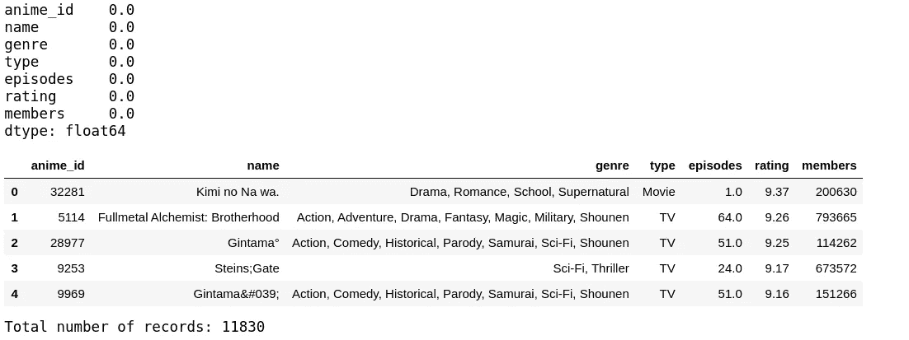

看看记录的描述性统计。

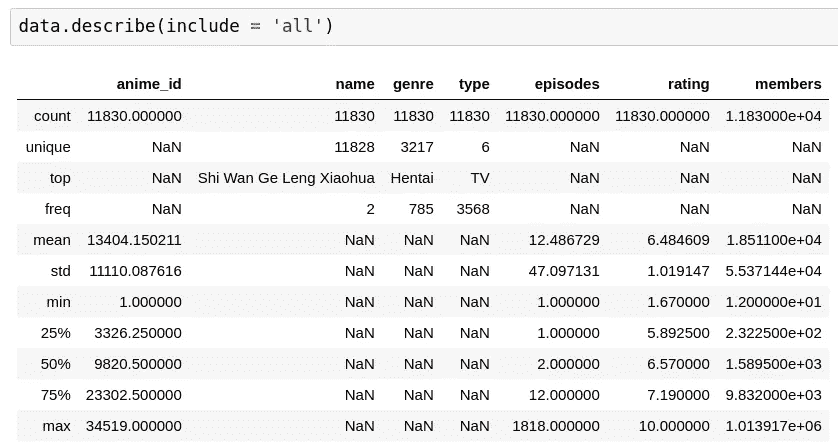

图片由 Vinayak 提供

我们可以看到，平均每部动漫有 12 集，所有动漫的平均评级约为 6.5。此外，MyAnimeList 平台上谈论该动漫的平均成员数约为 18.5k，可以说这是相当可观的。对于分类变量，mean、std、quartiles 等度量没有意义，因此这些位置使用上面的 NaN 填充；对于连续变量，unique、top 和 frequency 等度量没有太大意义，因此这些位置也使用 NaN 值填充。

需要注意的一点是，就剧集和成员而言，差异相当大；这表明，与大量评级集中在 6.5 左右的评级不同，在剧集和成员中，分布相当平坦，没有在平均值附近达到峰值。我们将在下面的直方图部分对此进行更详细的探讨。

此外，在分类栏中，我们可以看到大部分的动画都是电视动画，其中最流行的类型是《非常》，有 785 个条目。这是一个误导性的统计，我将在直方图和计数图部分解释原因。


图片由 Vinayak 提供

排名前 5 的动漫都是电影和一部电视动漫。我在这里试着保持客观，但我真的希望你看 Kimi no Na wa，不要忘记和你一起连续看《风化》，看看多喜和光羽目前在他们的生活中做些什么！

现在，回到手头的主题，Taka no Tsume，Mogura no Motoro 和 Kahei no 海是成员非常非常小的动漫。这意味着有一些人看了他们，他们都非常喜欢他们。由于这里的成员数量很少，即使他们的评分很高，我也有点不愿意看(除非我看到成员对这 3 部电影的描述)。


图片由 Vinayak 提供

伙计们，这有什么意义吗？每个宅男如果没有看过这些动漫，至少也听过。此外，它们中的大多数已经存在了大约十年或更长时间。随着时间的推移，随着一个系列的名气越来越大，越来越多不同的人观看它，其中一些人会不喜欢它，这使得收视率与前一个例子中只有 13 名成员的 Taka no Tsume 的高收视率相比大幅下降。


图片由 Vinayak 提供

只是为了好玩，看看有很多集的动漫，毫无疑问哆啦 a 梦榜上有名。每个千年都会记得在电视、海报或商品上至少看过一次哆啦 a 梦。但是在这个有限的集合中，我们可以看到，更多的剧集并不一定意味着更高的收视率，反之亦然。

# 视觉分析

> 一幅画最大的价值是当它迫使我们注意到我们从来没想到会看到的东西
> 
> 约翰·图基

现在我们已经对数据集的描述性统计有了一个概念，让我们尝试可视化地分析数据集。我们将理解并使用几种不同类型的图来可视化使用 seaborn 的数据。

在此之前，我们需要知道数据集的两种主要特征。

1.  分类变量—取离散值的变量称为分类变量。它们可以是数字，甚至可以是非数字的，例如考试中的成绩(A、B、C 等。)、排名(第一、第二、第三)、交通信号上的标志(红色、黄色、绿色)等。在 A 和 b 之间没有 1.5 级或紫色信号或等级，这些变量可以取的值是预先定义的集合中的一个。也就是说，类别中可能存在等级(A > B > C ),也可能没有等级(如红色、黄色、绿色)。前者被称为序数变量，后者被称为名义变量。不管是名义变量还是基数变量，它们都是范畴变量。
2.  数字变量——采用连续值的变量，如一个人的体重/身高、每平方英尺的财产数量、黄金价格等。被称为数值变量。

根据变量是数值型还是分类型，我们可以借助不同种类的图来直观地表达它们之间的关系。

下面是我们将在下一节介绍的不同类型的图表。

*   直方图/计数图
*   条形图
*   饼图
*   盒子情节和小提琴情节
*   散点图
*   热图

# 直方图和计数图

# 直方图

只看均值和标准差你只能得到一个变量分布的大概概念；直方图有助于实际可视化变量的分布。

当我们有一个连续变量时，我们创建一个直方图，当我们有一个离散变量时，我们创建一个计数图。因此，我们将使用 matplotlib 和 seaborn 分别创建一个流派计数图和一个评级直方图，以查看这些变量的分布。

```
Utils.histogram(data, "rating")
Utils.histogram(data, "members", 50)
```


成员直方图


评分直方图

观察这两个图，我们实际上可以看到，平均值是总体评级的一个很好的估计值，因为大多数评级都包含在非常接近平均值的区域内。覆盖在二进制顶部的连续线被称为核密度估计，它是一种适合于近似该特定变量范围内所有连续值的观察频率的估计量。

在会员中，我们可以看到某些动漫有很多会员，而其中很多动漫的会员非常少。这种行为可以说是非常自然的，因为在大量的动漫中，有些非常受欢迎，这些动漫的成员/粉丝非常多，但鲜为人知的却没有多少人谈论它们…

这就是为什么我们在描述表中观察到，成员的标准偏差与其平均值相比是巨大的，而评级的标准偏差与其平均值相比是巨大的。

# 计数图

计数图与直方图非常相似，唯一的区别是它们用于离散变量。顾名思义，它计算特定类别的条目数，并简单地将它们绘制成条形。我们试着形象化一下流派的计数，看看所有动漫中哪个流派最受欢迎。

我们需要为流派执行一些预处理步骤。由于一部动画有多种类型，我们首先必须为类型的计数创建一个单独的表，并创建一个相同的计数图。我们开始吧！

```
Utils.genre_countplot(data, 'genre')
```


类型情节的计数

现在看看这个，我们可以看到，实际上来说，喜剧是最常见的类型，不像 hentai，在我们做预处理和策划之前，它应该是最常见的。

# 条形图

当我们有一个分类变量和一个数字变量时，我们可以使用柱状图。根据分类列是在 x 轴上还是在 y 轴上，图表的同义词分别是垂直条形图或水平条形图。

让我们就类型(分类变量)来研究评级和情节(数字变量)。从条形图的角度来看，这是一个很好的用例。

```
Utils.barplot(data, 'type', 'rating')
Utils.barplot(data, 'type', 'episodes')
```


作为类型函数的情节

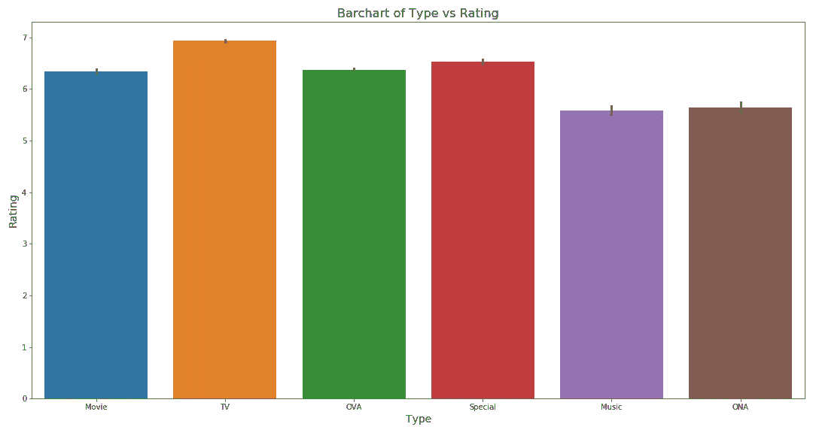

作为类型函数的评级

我们可以看到，平均而言，任何类型的动漫的评分都在 5 到 6 之间。

然而，对于电视来说，集数似乎偏高，平均每部动漫约 35 集。对于电影，特别节目和 OVA，它大约是 1 或 2 集，而对于 ONA，它大约是每部动漫 5 集。

# 饼图

为了直观显示分类变量的计数分布，我们可以使用饼状图作为计数图的替代方法，以百分比的方式更好地理解相对比例。让我们看看类型和流派的馅饼。

```
from collections import Counter
typedata = Counter(data.type)all_genres = []
for item in data.genre:
    item = item.strip().split(', ')
    all_genres.extend(item)genredata = Counter(all_genres)Utils.pieplot(typedata, "type")
Utils.pieplot(genredata, "genre")
```

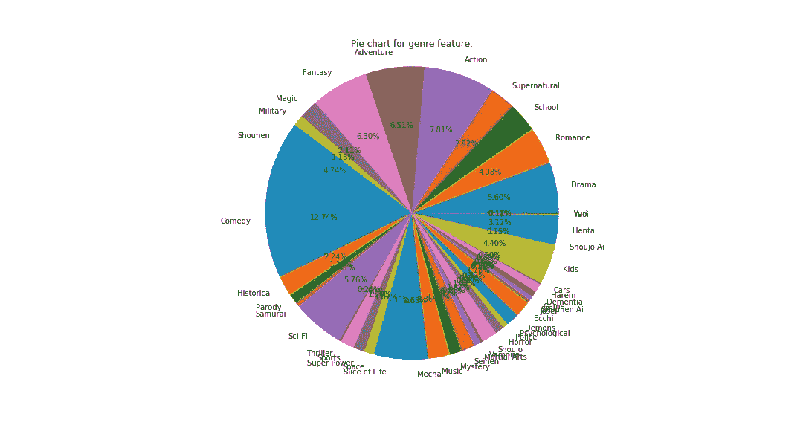

图片由 Vinayak 提供

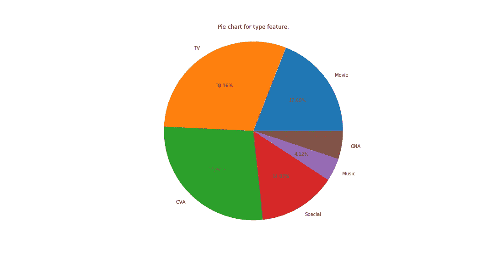

图片由 Vinayak 提供

查看上面的图表，我们可以看到，当一个类别中的级别数量很高时，饼图并不是可视化数据的好方法，因为数据不能很好地进行美学和语义分析。那么选择传统的计数图是个好主意。

然而，对于相对较少的级别，它在传达百分比分割方面非常有效，通俗地说，这接近于许多人的理解。我们可以看到，电视，OVA 和电影在动漫产业中占主导地位，而特别节目，ONA 和音乐动漫的数量相对较少。

# 箱线图和紫线图

# 箱线图

直方图是研究数据分布的一种好方法，但是它有时是无关紧要的，直方图的大部分信息可以用另一种称为盒图或盒须图的图来更简洁地表达。这是一个直方图的压缩版本，你可以从中了解中位数和四分位数，也可以用它来标记潜在的异常值。关于如何使用方框图的详细解释可以在[这篇文章](https://flowingdata.com/2008/02/15/how-to-read-and-use-a-box-and-whisker-plot/)中找到。

基本上，我们感兴趣的是找出四分位数，并确认大部分数据位于 IQR 和晶须内。位于这些范围之外的记录是潜在的异常值，需要对它们进行调查，如果发现正常，将在未来的分析中考虑它们，否则这些记录将被阻止。

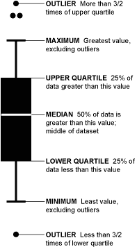

箱线图的解释

那么，让我们来看一下评级的箱线图，看看它是如何随类型变量而变化的。

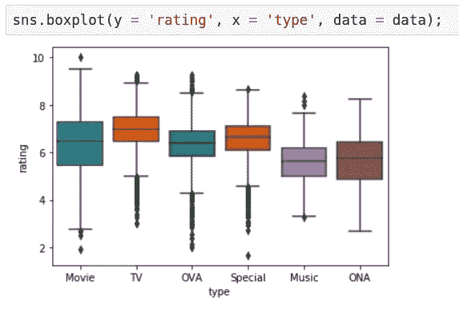

图片由 Vinayak 提供

我们可以看到有大量的异常值，特别是在电视、OVA 和特别节目的低端。这就需要注意那些远远超出正常评级范围的点。为什么他们会被这样评价？这些评级是伪造的吗，是否有一些负面的宣传影响了这些动漫，它们是否被足够多的人评级，或者评级仅仅是基于对这些动漫的 1 或 2 个评论而获得的？

因此，该图有助于我们识别可能异常的记录，我们需要进一步挖掘以确保这些异常是真实的，并决定是否保留这些记录以供我们分析。

还有一点需要注意的是，有时 y 变量的范围可以呈指数变化。在这种情况下，在绘制箱线图之前进行对数变换确实有助于使事情更容易理解。

```
fig, ax = plt.subplots(1, 2, figsize = (15, 6))Utils.boxplot(data, "type", "members", ax[0], log = False)
Utils.boxplot(data, "type", "members", ax[1], log = True)plt.savefig('./img/boxplot_members_type')
plt.close()fig, ax = plt.subplots(1, 2, figsize = (15, 6))Utils.boxplot(data, "type", "episodes", ax[0], log = False)
Utils.boxplot(data, "type", "episodes", ax[1], log = True)plt.savefig('./img/boxplot_episodes_type')
plt.close()
```

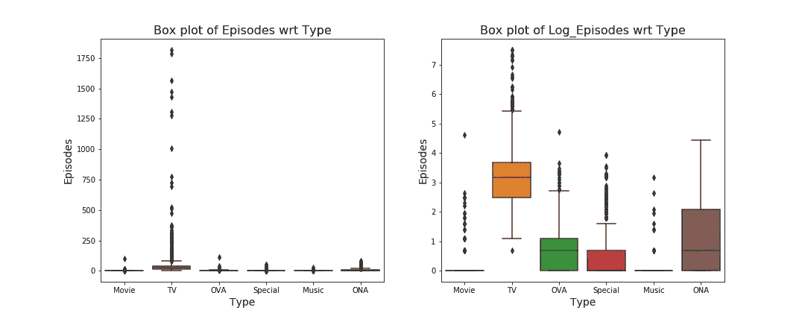

图片由 Vinayak 提供

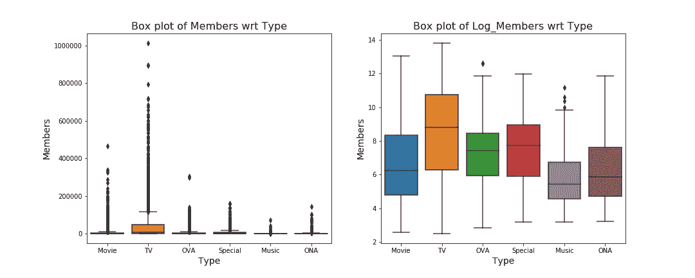

图片由 Vinayak 提供

我们可以看到，对于平面图，很难解释箱线图，因为大部分数据都集中在这么短的时间间隔内，而且数据的分布范围很大。为了减轻这种情况，我们可以进行对数变换，然后研究分布。

我们可以看到，就成员而言，OVA 和音乐中有一些潜在的异常值，当谈到剧集时，大多数类别都有几个问题。

一部电影必须只有一集，再多就有嫌疑了。图表显示有一些这样的数据点。也许它应该是电视，但却被贴错了电影的标签，反之亦然。让我们找出答案。

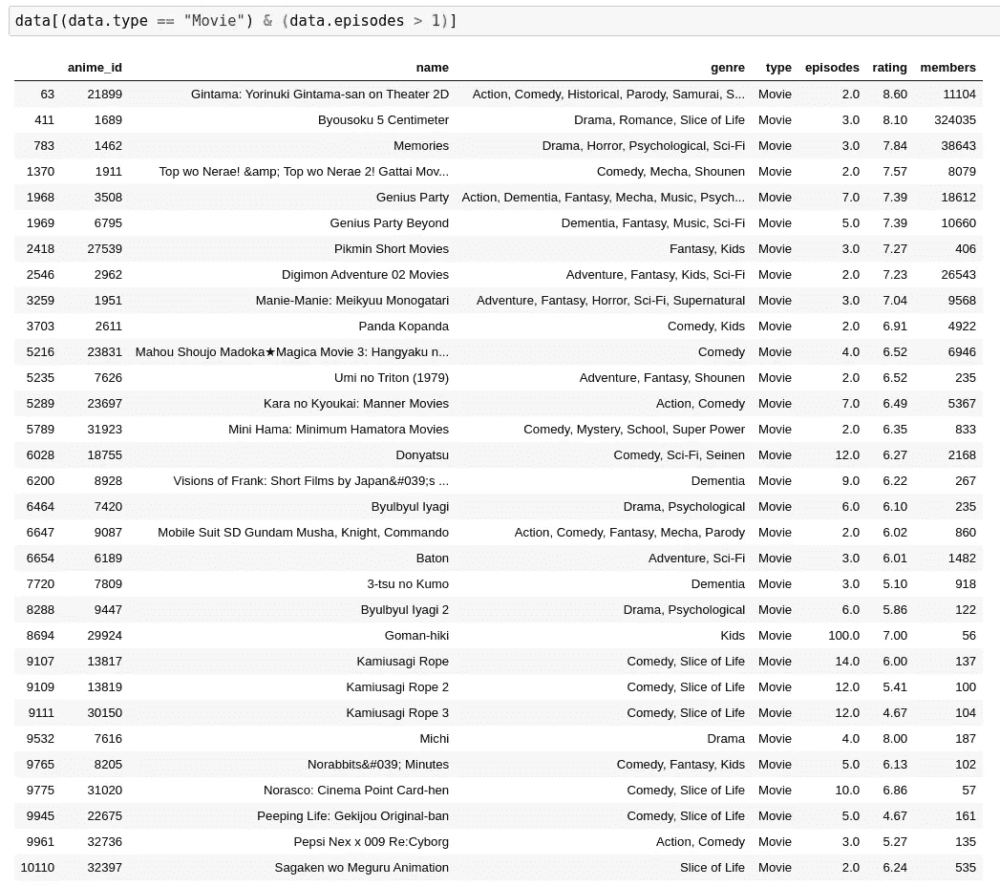

图片由 Vinayak 提供

虽然这些我都没有亲自看过，但是我看过 Byousoku 5 厘米。这是一部有三个小故事的电影。这可能是为什么在这种情况下，集数是 3，在我看来是相当可观的。

然而，戈曼-希基和卡米·天兔·罗珀分别以 100 集和 14 集的电影首映集引起了争议。它们可能是电视连续剧，但由于它们有一个潜在的故事，而且都是很短的插曲，所以它们可以被统称为电影。

现在，数据科学家可以自行决定是否将这些记录视为电影或连续剧，或者完全放弃。没有方法是错误的，这只是个人的思维过程和他的推理方式，以证明排除/包含/更改记录在这里是重要的。

# 紫罗兰花

想象一下直方图和箱线图的最佳组合——这就是紫线图。*我们在直方图中看到的内核密度估计覆盖在盒状和须状图的顶部。*这不仅为我们提供了中位数、IQR 和晶须，而且还在一个单独的图中概述了分布的性质。

虽然它是如此的信息密集，但美学和缺乏简单性限制了它们在现实世界中的使用；然而，为了向了解这个情节及其代表意义的人展示信息，我个人想不出比小提琴更好的选择了。

让我们为评级分类画一张小提琴图。


图片由 Vinayak 提供

我们可以清楚地观察到传播和潜在的异常值。虽然电影的评级最分散，但它们没有很多异常值，而在 OVA 中，我们可以看到很大一部分数据超出了晶须，这表明存在几个异常值。

```
fig, ax = plt.subplots(1, 2, figsize = (15, 6))Utils.violinplot(data, "type", "members", ax[0], log = False)
Utils.violinplot(data, "type", "members", ax[1], log = True)plt.savefig('./img/violinplot_members_type')
plt.close()fig, ax = plt.subplots(1, 2, figsize = (15, 6))Utils.violinplot(data, "type", "episodes", ax[0], log = False)
Utils.violinplot(data, "type", "episodes", ax[1], log = True)plt.savefig('./img/violinplot_episodes_type')
plt.close()
```

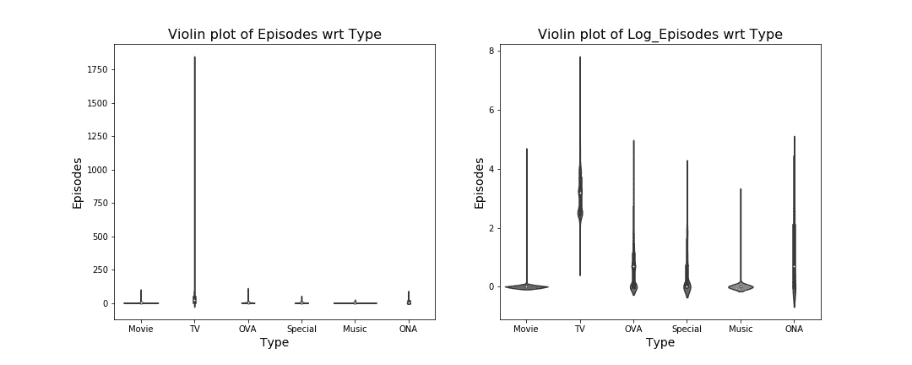

图片由 Vinayak 提供


图片由 Vinayak 提供

从 violinplot 的成员中，我们可以看到，除了大部分数据包含在 IQR 之内，数据的集中程度不仅在平均值附近，而且在整个范围内相当分散。

另一方面，当我们比较剧集 wrt 类型的小提琴情节时，大多数类型都有一些记录，这些记录对于特定类型的动漫来说剧集数量多得离谱(正如我们从上面的盒子情节中看到的)。

# 散点图

当我们需要研究两个连续变量之间的变化时，我们求助于散点图。它们帮助我们理解这两个变量之间的相关性，即如果一个变量增加，另一个变量会增加、减少还是保持不变。

它们提供了一个很好的视觉检查来衡量线性回归模型的性能，或者更确切地说，在实际构建一个回归模型之前设置对其性能的预期。Seaborn 提供了一个很好的功能，在散点图的顶部覆盖一条回归线来解决这一点。

让我们来看看评分的相关性作为成员的函数，大概我期望他们应该是成正比的，因为高评分的动漫会有更多的成员关注该动漫，反之亦然。

```
Utils.scatterplot(data, "members", "rating")
```

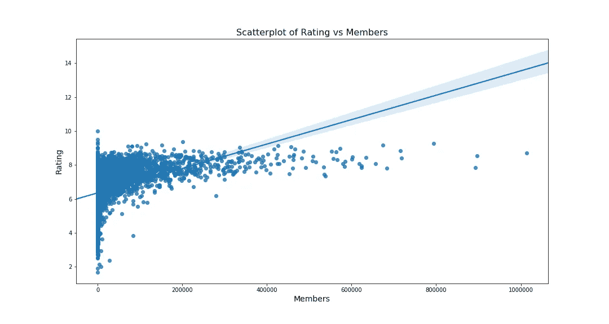

图片由 Vinayak 提供

正如我们所看到的，集中在 0 到 400000 个成员中的大量数据点显示出正相关关系，即一个成员的增加会导致另一个成员的增加。

请记住，y 轴实际上被限制在 0 到 10 之间。不能有大于 10 的分数，这就是为什么虽然很多人喜欢一些动漫，但他们将被迫给出不超过 10 的评分，即使他们非常喜欢它。如果没有这种限制，我预测 100000 个成员中的线和点会更加接近。

再来一个，看看一部剧的集数和收视率的关系。

```
Utils.scatterplot(data, "episodes", "rating")
```

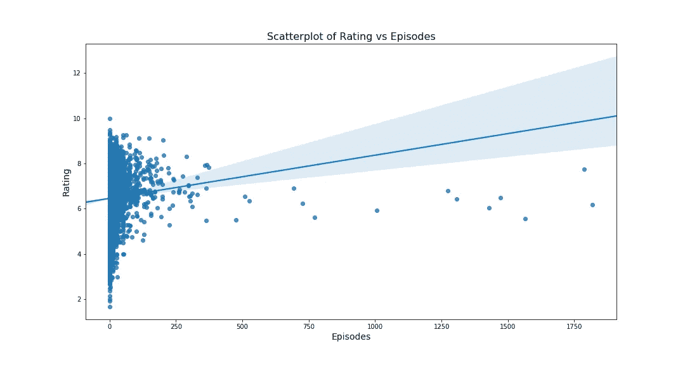

图片由 Vinayak 提供

看起来剧集和收视率之间确实存在正相关，但并不像在成员和收视率之间观察到的那样强。此外，该模型的 95%置信区间更宽，这意味着回归线不如成员和评级之间的回归线拟合得好。

这就是我们如何利用散点图来理解两个量是如何相互变化的。

# 热图

另一个有用的视觉效果是热图。当我们有两个分类变量和一个与这两个分类变量相关联的数值度量时，热图是一个非常好的可视化工具。我们可以看到有多少动漫属于某个特定的流派和类型，并建立一个相同数量的热图或相同评级的热图，并以色标的形式显示出来。

让我们先来看看制作一个动画类型和流派的热图，感受一下热图。

```
# Get a list of all the unique types
types = data.type.unique()# Create a mapping between genre and type and initialize it to all zeros
mapping = pd.DataFrame(np.zeros((len(genredata.keys()), len(types)), dtype = np.int), index = list(genredata.keys()), columns=types)
rating_mapping = pd.DataFrame(np.zeros((len(genredata.keys()), len(types)), dtype = np.float), index = list(genredata.keys()), columns=types)# Each time an item is encountered for genre and type, increment the count by 14
# Each time an item is encountered for genre and type, increment the rating by the respective rating
for item in genredata.keys():
    for row in data.itertuples():
        if item in row[3]:
            mapping.loc[item, row[4]] += 1
            rating_mapping.loc[item, row[4]] += row[6]# Divide the rating by the counts to get average rating for the pair
rating_mapping = rating_mapping / mappingUtils.heatmap(mapping, "Type", "Genre")
Utils.heatmap(rating_mapping, "Type", "Genre", quantity = "Rating")
```

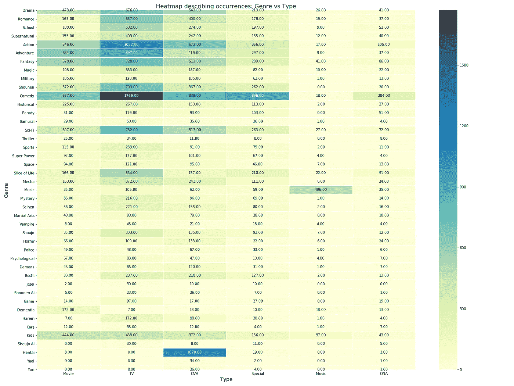

图片由 Vinayak 提供

我们可以从类型类型热图中直观地看到，有一些组合制作了很多动画，而其他一些组合则没有。

例如，我们没有任何年轻的音乐剧、亨泰电视或 ONA 动漫，另一方面，我们有许多电视喜剧、科幻电影、生活片段电视等等。最常见的组合是电视喜剧，Hentai 不出现在电视上，这是有道理的，因为电视是一个家庭的每个人都在看的，儿童不应该在年幼时接触敏感内容。

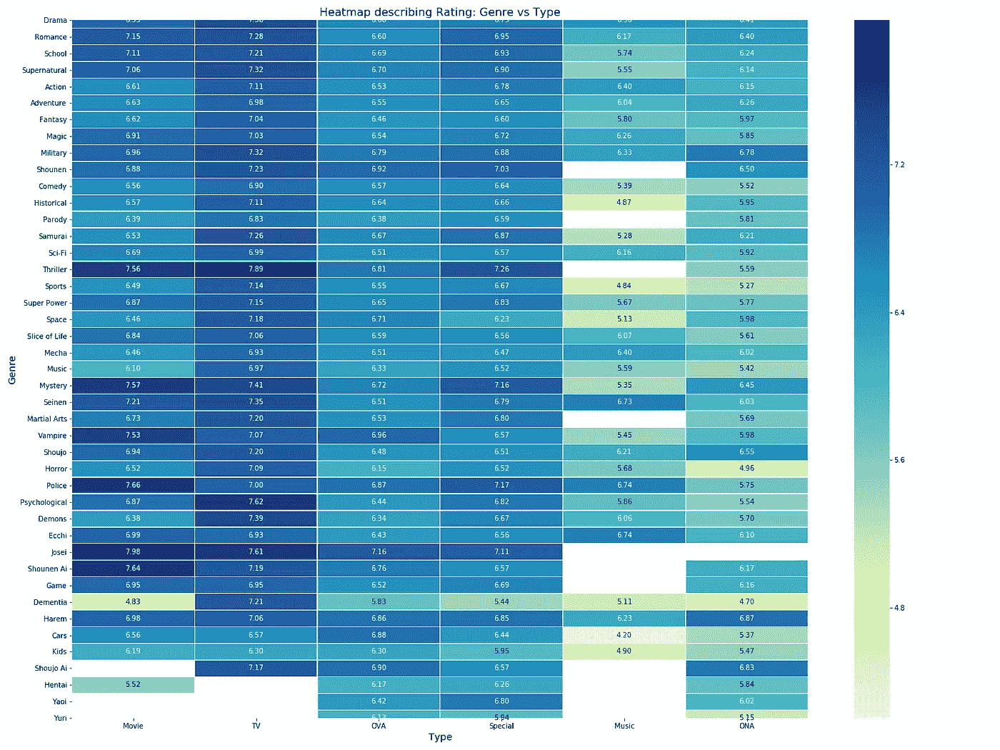

图片由 Vinayak 提供

如果我们看上面的热图，大多数组合的平均评分在 5-6 分左右，一些组合的评分为零(白色的组合)。收视率最高的节目是朝鲜电影，其次是电视惊悚片，然后是警察电影等(总之，包括悬疑、阴谋和青少年爱情/青少年漫画在内的短片平均受到观众群体的欢迎)。


来自九州的日向翔阳——图片来源:[音云](https://soundcloud.com/erza-scarlet-265523344/sets/skyrim)

这就是这篇文章的全部内容！希望你觉得有用。这篇文章附带的代码和其他东西可以在我的 [github repo 这里](https://github.com/ElisonSherton/AnimeEDA)找到。EDA，尤其是绘图，是一些很棒的工具，可以帮助你很好地理解和交流这种理解。我希望这里提到的情节成为你解决数据科学问题的工具箱中的无价工具:)。

# 参考文献和更多阅读

1.  [Kaggle 上的动漫推荐数据库](https://www.kaggle.com/CooperUnion/anime-recommendations-database?select=anime.csv)
2.  [了解箱线图](https://flowingdata.com/2008/02/15/how-to-read-and-use-a-box-and-whisker-plot/)
3.  [使用 matplotlib 进行数据可视化](/data-visualization-using-matplotlib-16f1aae5ce70)
4.  [Seaborn 官方文档](https://seaborn.pydata.org/)
5.  [Matplotlib 官方文档](https://matplotlib.org/)
6.  [代码实现的 Github repo](https://github.com/ElisonSherton/AnimeEDA)