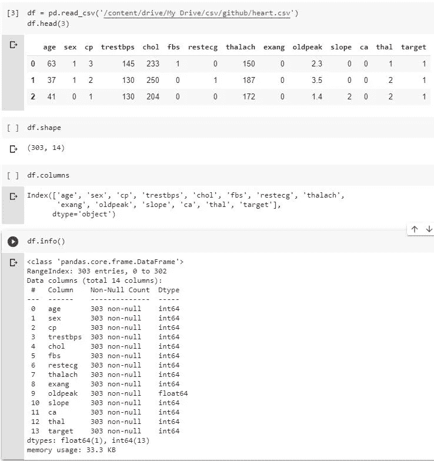
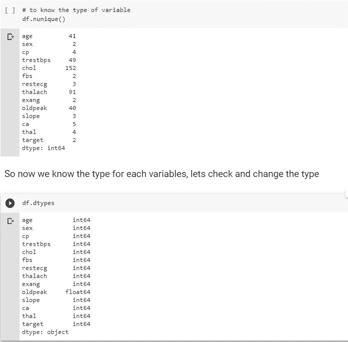

# 心脏病 UCI 数据集的探索性数据分析**

> 原文：<https://towardsdatascience.com/exploratory-data-analysis-on-heart-disease-uci-data-set-ae129e47b323?source=collection_archive---------5----------------------->

## |一个完整的逐步探索性数据分析，并附有简单的解释。


Jair Lázaro 在 [Unsplash](https://unsplash.com?utm_source=medium&utm_medium=referral) 上的照片

## *动机*

*   探索性数据分析(EDA)是理解数据的预处理步骤。执行 EDA 有许多方法和步骤，但是，大多数方法和步骤都是特定的，集中在可视化或分布上，并且是不完整的。因此，在这里，我将一步一步地了解、探索和提取数据中的信息，以回答问题或假设。没有结构化的步骤或方法可以遵循，但是，这个项目将为你和我未来的自己提供一个关于 EDA 的洞察力。

## **简介**

心血管疾病或心脏病是全球头号死亡原因，每年有 1790 万例死亡。心血管疾病是由高血压、糖尿病、超重和不健康的生活方式共同造成的。你可以阅读更多关于[心脏病统计数据和](https://www.ahajournals.org/doi/10.1161/CIR.0000000000000757)病因的自我了解。这个项目包括手动探索性数据分析和使用谷歌 Colab 上的 Jupyter 笔记本中的熊猫概况。本项目使用的数据集为 [UCI 心脏病数据集](https://www.kaggle.com/ronitf/heart-disease-uci)，本项目的[数据](https://github.com/aishahismail3/Heart-Disease-Prediction-Classification/blob/master/heart.csv)和[代码](https://github.com/aishahismail3/Heart-Disease-Prediction-Classification/blob/master/Heart_Disease_Prediction_Part_1_EDA.ipynb)均可在我的 [GitHub 库](https://github.com/aishahismail3/Heart-Disease-Prediction-Classification)中获得。

## 数据集解释

最初，数据集包含来自 303 名患者的 76 个特征或属性；然而，发表的研究只选择了 14 个与预测心脏病相关的特征。因此，这里我们将使用由 303 名患者组成的数据集，具有 14 个特征集。

## EDA 的概要如下:

1.  **导入并了解数据**
2.  **数据清理**

> a)检查数据类型
> 
> b)检查数据字符错误
> 
> c)检查缺失值并替换它们
> 
> d)检查重复行
> 
> e)统计摘要
> 
> f)异常值以及如何消除它们

**3。分布和关系**

> a)分类变量分布
> 
> b)连续变量分布
> 
> c)分类变量和连续变量之间的关系

**4。使用 pandas 评测报告的自动化 EDA**

[**变量或特性解释**](https://archive.ics.uci.edu/ml/datasets/Heart+Disease) **:**

1.  年龄(以年为单位的年龄)
2.  性别:(1 =男性，0 =女性)
3.  cp(胸痛型):[ 0:无症状，1:不典型心绞痛，2:非心绞痛性疼痛，3:典型心绞痛]
4.  trestbps(静息血压，单位为毫米/毫米汞柱)
5.  血清胆固醇(毫克/分升)
6.  fps(空腹血糖> 120 mg/dl): [0 =否，1 =是]
7.  restecg(静息心电图):[0:根据 Estes 标准显示可能或明确的左心室肥大，1:正常，2:ST-T 波异常]
8.  thalach(达到的最大心率)
9.  exang(运动诱发的心绞痛):[1 =是，0 =否]
10.  oldpeak(相对于静息运动诱发的 ST 段压低)
11.  斜率(最大运动 ST 段的斜率):【0:下坡；1:平；2:上坡]
12.  ca[主要血管数量(0-3)
13.  thal : [1 =正常，2 =固定缺陷，3 =可逆缺陷]
14.  目标:[0 =疾病，1 =无疾病]

此处提供了数据集描述[。](https://www.kaggle.com/ronitf/heart-disease-uci/discussion/105877)

> 让我们开始吧…！！

# **1。导入并了解数据**



作者的图像快照

这里我们有 303 行，14 个变量。

# 2.数据清理

> **a)检查数据类型**。

变量类型有

*   绝对的
*   连续的:年龄，trestbps，胆固醇，塔拉克，旧峰

**python 对变量的类型分类正确吗？**我们来了解一下数据类型。



作者的图像快照

请注意，python 将二进制和分类变量分类为不同的整数类型。我们需要将它们更改为“对象”类型。

> b .检查数据字符错误

1.  特征**‘ca’**的范围是 0-3，然而`**df.nunique()**`列出的是 0-4。所以让我们找到 4，把它们改成 NaN。


作者的图像快照

2.特征**‘thal’**范围为 1-3，然而`**df.nunique()**`列出了 0-3。“0”有两个值。所以让我们把它们改成 NaN。


作者的图像快照

> **c)检查缺失的数值并替换它们**


作者的图像快照

并且**使用 Missingno 库可视化**丢失的值。缺少的值用水平线表示。这个库提供了一种信息丰富的方式来可视化位于每一列中的缺失值，并查看不同列的缺失值之间是否有任何关联。这里要为一篇关于 Missingno 的[伟大文章欢呼。](/visualize-missing-values-with-missingno-ad4d938b00a1)

```
msno.matrix(df)
```


作者的图像快照

**用中位数代替 NaN。**

```
df = df.fillna(df.median())
df.isnull().sum()
```

> **d)检查重复行**


作者的图像快照

> **e)统计汇总**


作者的图像快照

基本上，使用`df.describe()`，我们应该检查分类变量的最小值和最大值(min-max)。性别(0–1)，CP(0–3)，FBS(0–1)，rest ECG(0–2)，exang(0–1)，斜率(0–2)，ca(0–3)，thal(0–3)。我们还应该观察连续变量的平均值、标准差、25%和 75%。

## 在我们绘制离群值之前，让我们更改标签，以便更好地可视化和解释。

> **f)异常值以及如何移除它们**


作者的图像快照

还有其他几种绘制箱线图的方法。

```
fig = px.box(df, x=”target”, y=”chol”)
fig.show()
```


作者的图像快照

或者使用 seaborn

```
sns.boxplot(x=’target’, y=’oldpeak’, data=df)
```


作者的图像快照

现在，让我们定义并列出离群值..！！

这是列出的异常值。


作者的图像快照

让我们去掉离群值。


作者的图像快照

# **3。分布和关系。**

**a)目标变量分布**


作者的图像快照

患病者比健康者多。

**b)年龄变量分布**

```
# print(df.age.value_counts())
df[‘age’].hist().plot(kind=’bar’)
plt.title(‘Age Distribution’)
```


作者的图像快照

年龄呈正态分布。

```
# Analyze distribution in age in range 10
print(df.age.value_counts()[:10])
sns.barplot(x=df.age.value_counts()[:10].index,
y=df.age.value_counts()[:10].values,
palette=’Set2')
plt.xlabel(‘Age’)
plt.ylabel(‘Age distribution’)
```


作者的图像快照

大多数病人年龄在 50 岁到 60 岁之间。让我们快速浏览一下基本数据。平均年龄约为 54 岁，std 为 9.08，最小的为 29 岁，最大的为 77 岁。


作者的图像快照

**c)根据目标变量的性别分布**


作者的图像快照

从柱状图中，我们可以观察到在疾病患者中，男性高于女性。

**d)根据目标变量得出的胸痛分布**


作者的图像快照

胸痛(cp)或心绞痛是由[流向心脏的血液减少](https://www.mayoclinic.org/diseases-conditions/angina/symptoms-causes/syc-20369373)引起的一种不适，引发手臂、肩膀、颈部等不适。

然而，看上面的柱状图，它提出了具有典型心绞痛的健康受试者的更高数量的问题。或者换句话说，大多数健康的受试者都有胸痛，这也是这里讨论的。胸痛可能是由于压力、身体活动和许多其他因素造成的主观症状，并因性别而异。女性和老年患者通常有非典型症状和病史。这篇[文章](https://www.ncbi.nlm.nih.gov/pmc/articles/PMC5680106/)提供了一项临床试验中典型心绞痛患者与非典型心绞痛患者的对比分析。

**e)根据目标变量的空腹血糖分布**


作者的图像快照

空腹血糖或 fbs 是糖尿病指标，fbs >120 mg/d 被认为是糖尿病(真级)。在这里，我们观察到，与类 false 相比，类 true 的数量较低。然而，如果我们仔细观察，就会发现没有糖尿病的心脏病患者人数更多。这表明 fbs 可能不是区分心脏病患者和非疾病患者强有力的特征。

**f)根据目标变量的斜率分布**


作者的图像快照

**g)连续变量分布图。**


作者的图像快照

*   正态分布为:年龄，trestbps 和几乎为胆固醇
*   旧峰向左倾斜
*   thalac 是右倾的

**h) Sns pairplot 可视化分布。**


作者的图像快照

*   在疾病和非疾病之间具有线性分离关系的旧峰。
*   thalach 在疾病和非疾病之间具有温和的分离关系。
*   其他特征没有形成任何明显的分离

**i)相关性**


作者的图像快照

*   cp '，' thalach '，' slope '与目标呈良好正相关
*   “老峰”、“额”、“钙”、“身高”、“性别”、“年龄”与目标呈良好的负相关
*   fbs' 'chol '，' trestbps '，' restecg '与我们目标的相关性较低

# **4。使用 Jupyter 笔记本电脑上的 pandas profiling 报告进行自动化 EDA，Google Colab**

1.  ！皮普安装熊猫档案

`! pip install [https://github.com/pandas-profiling/pandas-profiling/archive/master.zip](https://github.com/pandas-profiling/pandas-profiling/archive/master.zip)`


这是自动化 EDA 的快照


*   所以你去，一个完整的 UCI 心脏病走一遍 EDA。
*   我希望你觉得这个指南有用，我将继续使用另一种类型的数据集探索 EDA。
*   请随意评论/纠正/提问。
*   探索愉快！！❤

你可以在 Jupyter Google Colab 我的文章下面查看应用熊猫概况报告的步骤。

[](https://medium.com/python-in-plain-english/how-to-use-pandas-profiling-on-google-colab-e34f34ff1c9f) [## 如何使用谷歌 Colab 上的熊猫简介

### 使用 Google Colab 上 Jupyter 中的 Pandas Profiling 进行自动探索性数据分析。

medium.com](https://medium.com/python-in-plain-english/how-to-use-pandas-profiling-on-google-colab-e34f34ff1c9f)