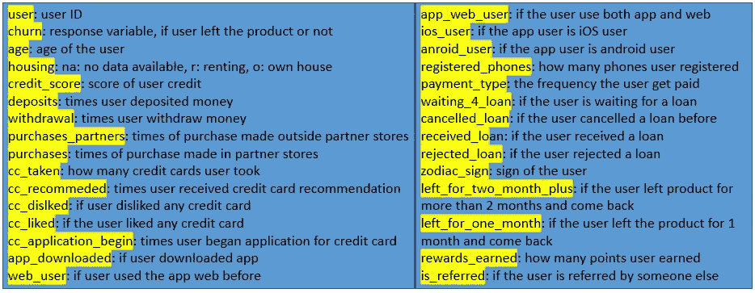
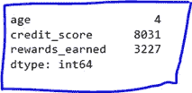
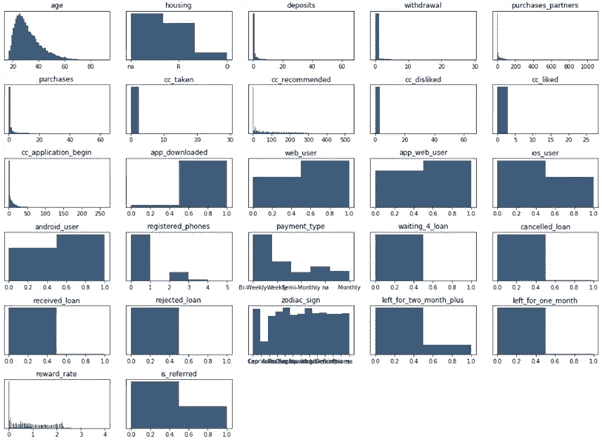
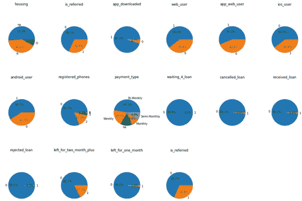
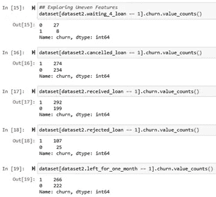
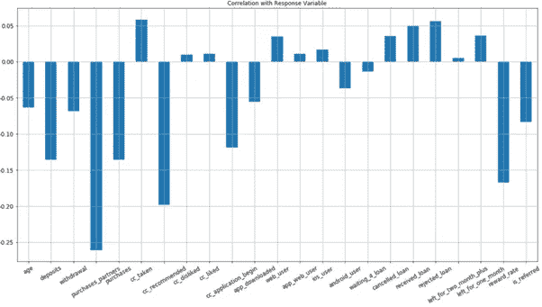
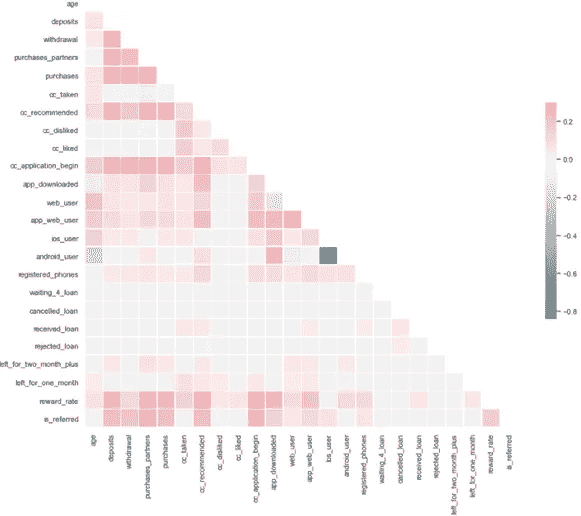

# 移动应用行为数据的探索性数据分析

> 原文：<https://towardsdatascience.com/exploratory-data-analysis-on-mobile-app-behavior-data-2777fc937973?source=collection_archive---------60----------------------->

## 使用可视化和相关性分析，深入了解具有大量原始数据的 EDA，以提高您的动手技能


来自 Unsplash 的 Img 通过[链接](https://unsplash.com/photos/jrh5lAq-mIs)

在之前的[文章](/eda-how-to-on-app-behavior-data-77fde7384a70)中，我们介绍了如何在小型 app 行为数据集上执行 EDA。希望你在那里学到了很多。**这篇文章旨在用更复杂的数据集提高你的 EDA 技能，并介绍新的技巧。**它被分成 6 部分。

1.数据审查

2.数据清理

3.数值变量分布

4.二元变量分布

5.相关分析

6.摘要

现在，让我们开始旅程🏃‍♂️🏃‍♀️.

1.  **数据审核**

快速查看下面视频中显示的数据，您会发现有 31 列 27，000 行。有了这么多特性，最好为每一列的解释创建一个视图，如图 1 所示，以增强我们的理解。

视频 1 原始数据的简要视图



图 1 表格视图中的变量说明

2.**数据清理**

原始数据通常包含缺失值。所以我们需要知道每一列中是否有 *NaN* 。具体来说，

```
dataset.columns[dataset.isna().any()].tolist()
```

我们得到了列 *['年龄'，'信用分数'，'奖励收入']。*但是这些列中有多少条记录是 *NaN* ？所以，

```
dataset.isna().sum()
```

如图 2 所示，在' *credit_score'* 栏中有 8000 多名 *NaN* ，在' *rewards_earned'* 栏中有 3227 名 *NaN* 。**我们将删除这两列，并删除年龄为*男*的 4 条记录。**



图 2 *列中的 NaN* 记录

具体来说，

```
dataset = dataset[pd.notnull(dataset.age)]
dataset = dataset.drop(columns = [‘credit_score’, ‘rewards_earned’])
```

3.**数值变量分布**

为了更好地理解数据分布，可视化是最好的方法。让我们尝试一个**直方图**。具体来说，

```
dataset2 = dataset.drop(columns = [‘user’, ‘churn’])
for i in range(1, dataset2.shape[1] + 1):
    plt.subplot(6, 5, i)
    f = plt.gca()
    vals = np.size(dataset2.iloc[:, i — 1].unique()
    plt.hist(dataset2.iloc[:, i — 1], bins=vals, color=’#3F5D7D’)
```

如图 3 所示，许多变量是正偏的。一些二元变量均匀分布，而另一些则高度集中在一边。**对于高度集中的变量，审查因变量是否不平衡非常重要。例如，对于列' *waiting_4_loan* '，小于 10%为 1。如果大多数等待贷款的人退订了该产品，该模型很可能会在这个功能上适得其反。**



图 3 数值变量直方图

4.**二元变量分布**

如上所述，让我们使用一个**饼状图**来关注二元变量的分布。具体来说，

```
dataset2 = dataset[[‘housing’, ‘is_referred’, ‘app_downloaded’, ‘web_user’, ‘app_web_user’, ‘ios_user’, ‘android_user’, ‘registered_phones’, ‘payment_type’, ‘waiting_4_loan’, ‘cancelled_loan’, ‘received_loan’, ‘rejected_loan’, ‘left_for_two_month_plus’, ‘left_for_one_month’, ‘is_referred’]]for i in range(1, dataset2.shape[1] + 1):
    f = plt.gca()
    values = dataset2.iloc[:, i — 1].value_counts(normalize = True).values
    index = dataset2.iloc[:, i — 1].value_counts(normalize = True).index
    plt.pie(values, labels = index, autopct=’%1.1f%%’)
```

如图 4 所示，有 5 列需要进一步探索，因为它们的分布高度集中: *'waiting_4_loan '、' cancelled _ loan '、' received_loan '、' rejected_loan '、' left_for_one_month'* 。



图 4 二元变量饼图

对于这 5 列，让我们回顾一下少数类别中的因变量分布。具体来说，



图 5 集中变量的因变量分布

图 5 告诉我们，在少数民族类别中，因变量并不严重失衡。太好了。没什么好担心的。

**总之，可视化的全部目的就是了解每个变量的分布是如何均匀的，以及每个二元变量中因变量的分布是如何均匀的。因此，我们可以识别需要过采样或下采样的变量。**

5.**相关性分析**

5.1 自变量和因变量之间

这一步是为了了解哪些特征或变量可能对因变量有很大影响。这里我们只分析**数值变量**。

具体来说，

```
dataset.drop(columns = [‘user’, ‘churn’, ‘housing’, ‘payment_type’, ‘registered_phones’,‘zodiac_sign’]).corrwith(dataset.churn).plot.bar(figsize=(20,10), title = ‘Correlation with Response variable’,fontsize = 15, rot = 45,grid = True)
```

图 6 显示了一些有趣的发现。例如，对于变量' *cc_taken'* ，客户获得的信用越多，他们流失的可能性就越大。这可能表明顾客对信用卡不满意。



图 6 自变量和因变量之间的相关性

5.2 自变量之间

理想情况下，我们只使用“独立”变量作为输入。相关矩阵表明变量是否相互独立。具体来说，

```
corr = dataset.drop(columns = [‘user’, ‘churn’]).corr()
```

如图 7 所示，' *android_user* '和' *ios_user* '之间有很强的负相关关系。另一列是“ *app_web_user* ”，表示同时使用 app 和 web 的用户。当' *app_downloaded* '为 1 且' *web_user* '为 1 时，只能为 1。所以' *app_web_user* '不是一个需要去掉的自变量。具体来说，

```
dataset = dataset.drop(columns = [‘app_web_user’])
dataset.to_csv(‘new_churn_data.csv’, index = False)
```



图 7 独立变量间的相关矩阵

6.**总结**

在许多情况下，您将面临比我们在这里处理的更多的脏数据。因此，您需要首先清理数据，检查数据分布，并了解是否出现了不平衡。此外，使用相关性分析来消除对要素的任何依赖性。幸运的是，不管你有多少数据，思维过程或多或少都是一样的。

**太好了！这就是旅程的全部！如果需要源代码，可以随时访问我的** [**Github**](https://github.com/luke4u/Customer_Behaviour_Prediction/tree/main/churn_prediction) **页面**🤞🤞**。下一篇文章将介绍数据处理、模型构建和优化**。