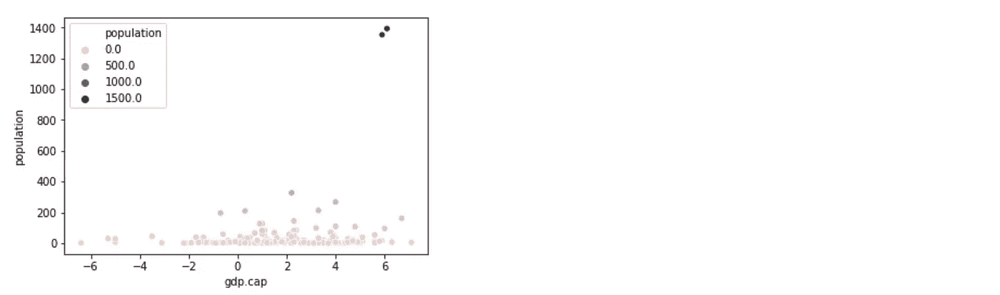

# 类固醇探索性数据分析

> 原文：<https://towardsdatascience.com/exploratory-data-analysis-on-steroids-e1488324fbaa?source=collection_archive---------21----------------------->

## Python 中 EDA 的一种表达方法


机器学习的讨论通常围绕算法及其性能展开:如何提高模型精度或降低其错误率，擅长特征工程或微调超参数。但是有一个概念比任何事情都重要:探索性数据分析，或 EDA。

EDA 就是在我们忙于任何模型之前，从数据中找出意义。这完全说得通，对吗？如果我们还不知道我们的数据，我们将使用哪个模型？

> 在有机器学习模型之前，有 EDA

这是数据科学的一个核心方面，但有时会被忽视。你做任何事情的第一步都应该是**了解你的数据**:理解它，熟悉它。你想从这些数据中得到什么答案？你使用了哪些变量，它们的含义是什么？从统计学的角度看如何？数据格式是否正确？你有缺失值吗？复制的吗？离群值呢？

随着数据量的增加，这一概念变得更加重要:想象一下，试图解析成千上万个寄存器，并从中找出意义。接下来，我想分享我的 Python 方法，以最有效的方式回答其中的一些问题。

# 描述数据集

在这篇文章中，我使用了世界银行的经济数据集，描述了一些世界范围内的关键因素，如 GDP、人口水平、地表等。你可以在这里找到数据集和完整代码

首先，我们需要导入一些库:

```
import pandas as pd
import numpy as np
import seaborn as sns
import xlrd
```

熊猫、 **Numpy** 和 **Seaborn** 是任何 EDA 练习中的关键。“xlrd”包仅在我们的示例中需要，因为我们使用 Excel 文件作为数据源。

现在，让我们导入数据集:

```
df = pd.read_excel(“wbdata.xlsx”)
```

看一下数据:

```
df.head()
```


```
df.describe()
```


数据集中数值变量的一些基本统计。

```
df.shape
```


查看数据集结构的快速方法:215 行和 10 列。

```
df.dtypes
```


检查变量类型:它们都是浮动的，除了国家名称是一个字符串。在这里找到如何改变变量类型[的教程。](https://pbpython.com/pandas_dtypes.html)

```
df.info()
```


在这里，我们看到一些变量具有空值(例如，变量“人口”有一行缺少值，“表面”2，等等)。我们将在下面看到如何处理它们。

# 缺少值

缺失值可能由不同的原因造成，如数据输入错误或记录不完整。这是非常常见的，并且会对从数据中得出的结论产生重大影响。

我们在上面已经看到，本例中的数据集有几个缺失值，但是让我们看看如何测试任何数据集。你可能要问你的第一个问题是:有没有缺失的值？

```
print(df.isnull().values.any())
```


接下来，您可能想要检查它们的数量:

```
print(df.isnull().sum().sum())
```


现在，让我们回顾一下这些缺失值的总结

```
print(df.isnull().sum())
```


你看到什么熟悉的东西了吗？这是世界的另一面。info()函数。处理缺失值有不同的策略，但没有通用的方法。对于本例，我们将放弃它们，因为进行插补没有意义:

```
df1 = df.copy()df1.dropna(inplace=True)
```

我们回顾新的数据集:

```
df1.info()
```


剩下 188 条记录，没有空值。现在我们准备向前迈进。

您可以在这里找到处理缺失值[的其他方法。](/how-to-handle-missing-data-8646b18db0d4)

# 设想

让我们用 Seaborn 可视化新数据集:

```
sns.pairplot(df1)
```


这样，您可以快速识别异常值、聚类和变量之间的明显相关性。

让我们结合变量“gdp”和“人口”:

```
sns.scatterplot(x='gdp.cap', y='population', data=df1, hue='population')
```



你在右上角看到两个明显的异常值了吗？2 个国家的人口水平与数据世界中的其他国家相比处于极端水平。您可以通过单独分析“人口”变量来验证观察结果:

```
sns.kdeplot(df1[‘population’], shade=True, color=’orangered’)
```


检测异常值的另一种方法是绘制一些箱线图:

```
df1.plot(kind=’box’, subplots=True, layout=(3,3), sharex=False, sharey=False, figsize=(20, 20), color=’deeppink’)
```


您还可以显示这些变量的密度图，并分析它们的偏斜度:

```
df1.plot(kind=’density’, subplots=True, layout=(3,3), sharex=False, figsize=(20, 20))
```


查看这个[链接](https://python-graph-gallery.com/100-calling-a-color-with-seaborn/)获得更多的 Seaborn 造型技巧。

在这个例子中，我故意没有处理**异常值**，但是有多种方法可以做到这一点。你可以在这里找到一些异常值识别和处理的例子。

# 相互关系

关联变量将为您节省大量的分析时间，这是对数据进行任何假设之前的必要步骤。相关性仅针对数值变量进行计算，因此了解数据集中的变量类型非常重要。

你可以在这里找到非数字变量[的其他系数。](https://www.analyticsvidhya.com/blog/2016/12/introduction-to-feature-selection-methods-with-an-example-or-how-to-select-the-right-variables/)

```
mask = np.tril(df1.corr())
sns.heatmap(df1.corr(), fmt=’.1g’, annot = True, cmap= ‘cool’, mask=mask)
```


我已经屏蔽了左下方的值，以避免重复，并给出一个更清晰的视图。右边的价值尺度也提供了一个极端值的快速参考指南:您可以很容易地发现变量之间的高相关性和低相关性(例如，“国民收入”与“购买力”高度正相关)

在此处找到定制关联矩阵的其他方法。

# 最后的想法

EDA 对于理解任何数据集都至关重要。这是你可以提供见解和发现的地方。这里是你运用知识的地方。

但是 EDA 需要大量的准备工作，因为现实世界中的数据很少是干净的和同质的。人们常说[数据科学家 80%的宝贵时间都花在了简单地查找、清理和组织数据上](https://www.ibm.com/cloud/blog/ibm-data-catalog-data-scientists-productivity)，只留下 20%的时间来实际执行分析。

同时，**完美是好**的敌人，你需要在有限的时间框架内驱动你的洞察力。为分析准备数据是不可避免的，而你这样做的方式将决定你的 EDA 的质量。

> *对这些话题感兴趣？在*[*Linkedin*](https://www.linkedin.com/in/lopezyse/)*或* [*Twitter*](https://twitter.com/lopezyse) 上关注我