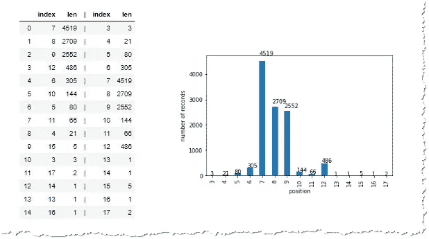
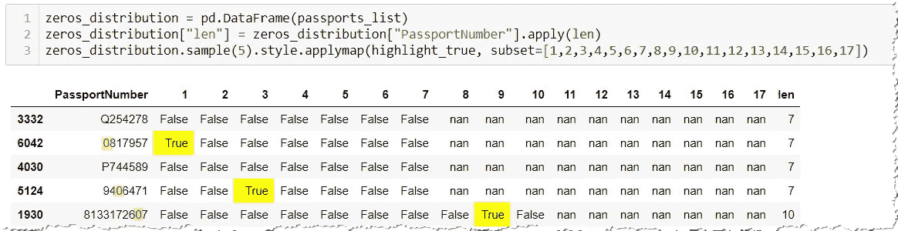
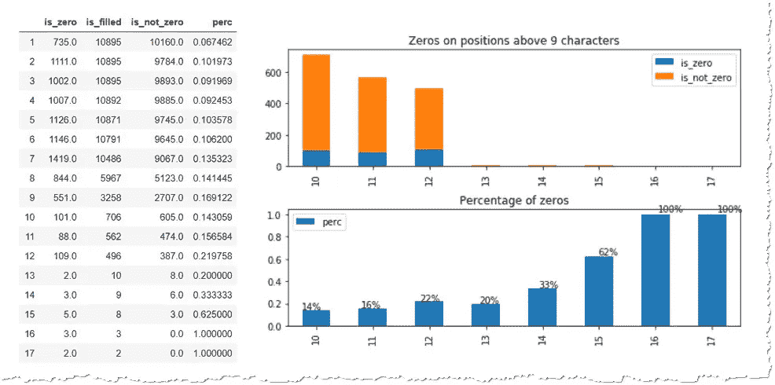
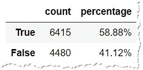
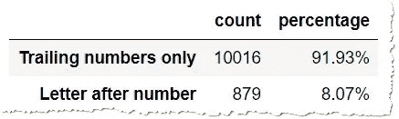
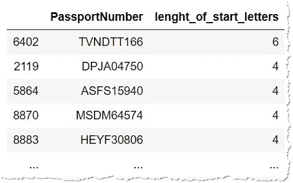

# 探索性数据分析——熊猫的护照号码

> 原文：<https://towardsdatascience.com/exploratory-data-analysis-passport-numbers-in-pandas-4ccb567115b6?source=collection_archive---------37----------------------->

## 探索前导零和尾随零、字母和数字的分布、常见前缀、正则表达式和数据集的随机化。


照片由 [mana5280](https://unsplash.com/@mana5280?utm_source=medium&utm_medium=referral) 在 [Unsplash](https://unsplash.com?utm_source=medium&utm_medium=referral) 上拍摄

根据国际民航组织的标准，护照号码最长应为 9 个字符，可以包含数字和字母。在你作为一名分析师的工作中，你会遇到一个包含护照的数据集，你会被要求去研究它。

我最近处理过一个这样的数据集，我想与您分享这种分析的步骤，包括:

*   记录数量
*   [重复记录](#5c17)
*   [记录的长度](#b78c)
*   [前导零和尾随零的分析](#0f47)
*   [特定位置的人物出现](#a61e)
*   [使用正则表达式(regexes)的字符串中，字母出现在哪里](#4c69)
*   字母序列的长度
*   [有没有共同的前缀](#ca59)
*   [匿名化/随机化数据，同时保持数据集的特征](#7a58)

你可以和我一起完成这些步骤。从 [github](https://github.com/vaasha/Data-Analysis_in-Examples/blob/master/EDA_Passport_Numbers/data.csv) 获取(随机数据)。它还包含了[木星笔记本](https://github.com/vaasha/Data-Analysis_in-Examples/blob/master/EDA_Passport_Numbers/Passport%20Numbers%20Statistics.ipynb)的所有步骤。

## 基本数据集探索

首先，让我们加载数据。因为数据集只包含一列，所以非常简单。

```
# import the packages which will be used
import pandas as pd
import matplotlib.pyplot as plt
import seaborn as snsdf = pd.read_csv(r"path\data.csv")
df.info()
```

的。info()命令将告诉我们，我们在数据集中有 10902 本护照，并且全部作为“object”导入，这意味着格式是`string`。

## 复制

任何分析的第一步都应该是检查是否有重复的值。在我们的例子中，有，所以我们将使用 pandas 的`.drop_duplicates()`方法删除它们。

```
print(len(df["PassportNumber"].unique()))# if lower than 10902 there are duplicatesdf.drop_duplicates(inplace=True) # or df = df.drop_duplicates()
```

## **护照长度**

通常，你继续检查最长和最短的护照。

```
[In]: df["PassportNumber"].agg(["min","max"])
[Out]: 
   min 000000050
   max ZXD244549
   Name: PassportNumber, dtype: object
```

你可能会高兴，所有的护照都是 9 个字符长，但你会被误导。数据具有字符串格式，因此最小的“字符串”值是从最大数量的零开始的值，最大的值是在开始时具有最多 zed 的值。

```
# ordering of the strings is not the same as order of numbers
0 > 0001 > 001 > 1 > 123 > AB > Z > Z123 > ZZ123
```

为了看到护照的长度，让我们看看他们的长度。

```
[In]: df["PassportNumber"].apply(len).agg(["min","max"])
[Out]: 
   min 3
   max 17
   Name: PassportNumber, dtype: object
```

根据我们最初的想法，在合同中，最短的护照只有 3 个字符，而最长的护照有 17 个字符(远远超过预期的最大长度 9 个字符)。

让我们用`'len'`列扩展我们的数据框，这样我们可以看看例子:

```
# Add the 'len' column
df['len'] = df["PassportNumber"].apply(len)# look on the examples having the maximum lenght
[In]: df[df["len"]==df['len'].max()]
[Out]: 
   PassportNumber    len
   25109300000000000 17
   27006100000000000 17# look on the examples having the minimum lenght
[In]: df[df["len"]==df['len'].min()]
[Out]: 
   PassportNumber    len
   179               3
   917               3
   237               3
```

3 位数的护照号码看起来可疑，但它们符合国际民航组织的标准，但最长的一个显然太长了，然而，它们包含相当多的尾随零。也许有人只是为了满足某些数据存储要求而添加了零。

让我们来看看数据样本的总体长度分布。

```
# calculate count of appearance of various lengths
counts_by_value = df["len"].value_counts().reset_index()
separator = pd.Series(["|"]*df["len"].value_counts().shape[0])
separator.name = "|"
counts_by_index = df["len"].value_counts().sort_index().reset_index()lenght_distribution_df = pd.concat([counts_by_value, separator, counts_by_index], axis=1)# draw the chart
ax = df["len"].value_counts().sort_index().plot(kind="bar")
ax.set_xlabel("position")
ax.set_ylabel("number of records")
for p in ax.patches:
    ax.annotate(str(p.get_height()), (p.get_x() * 1.005, p.get_height() * 1.05))
```



数据样本中护照长度的分布

我们看到，在我们的样本中，大多数护照号码的长度是 7、8 或 9 个字符。然而，相当多的字符长度为 10 或 12 个字符，这是意料之外的。

## 前导零和尾随零

也许长护照有前导零或尾随零，就像我们有 17 个字符的例子。

为了探究这些补零，让我们在数据集上再添加两列——“前导零”和“尾随零”，以包含前导零和尾随零的数量。

```
# number of leading zeros can be calculated by subtracting the length of the string l-stripped off the leading zeros from the total length of the stringdf["**leading_zeros**"] = df["PassportNumber"].apply(lambda x: len(x) - len(x.**lstrip**("0")))# similarly the number of the trailing zeros can be calculated by subtracting the length of the string r-stripped off the leading zeros from the total length of the stringdf["**trailing_zeros**"] = df["PassportNumber"].apply(lambda x: len(x) - len(x.**rstrip**("0")))
```

然后，我们可以轻松地显示超过 9 个字符的 passport，以检查是否有任何前导或尾随零:

```
[In]: df[df["len"]>9]
[Out]:
   PassportNumber  len  leading_zeros trailing_zeros
   73846290957     11   0             0
   N614226700      10   0             2
   WC76717593      10   0             0
   ...
```

## 零点在特定位置的分布

集合中的大多数护照没有任何零，但它们仍然长于 9 个字符。只是为了显示它，让我们来看看零在护照号码的每个位置上的分布。

我们知道最短的护照有 3 个位置，最长的有 17 个。让我们遍历所有的护照号码，然后遍历所有的字符，看看哪里是零。

```
passports_list = []
# for each passport number
for passport_number in df["PassportNumber"]:
    # let's create a dictionary with the passport number
    pos = {"PassportNumber": passport_number}
    # and let's add to each position if it's a zero or not
    for i, c in enumerate(passport_number):      
        # and for each position check if it's 0 -> True or something else --> False
        pos[i+1] = True if c == "0" else False
    passports_list.append(pos)# let's turn the dictionary into pandas dataframe
zeros_distribution = pd.DataFrame(**passports_list**)
zeros_distribution["len"] = zeros_distribution["PassportNumber"].apply(len)
```

该操作的输出是新的数据帧`'zeros_distribution'`,其在护照号码中有零的每个位置包含**真**



零在其出现的位置被标记为真

注意，我用黄色背景突出显示了`True`。熊猫的造型可以用`.style`的方法来做，但是你一定要小心。样式将绘制整个数据集，这可能很耗时，所以指定您想要显示多少行—例如通过`sample(5)`。您可以仅使用`subset`参数将样式应用于某些列。

```
# styling functiondef highlight_true(val):
    return 'background-color: yellow' if val == 1 else ''# apply the style to each value, using applymap
# subset for position columns 1-17
zeros_distribution.sample(5).style.applymap(highlight_true, subset=list(range(1,18)))
```

通过**对**每个位置的零求和，我们可以看到那里出现了多少个零。通过**统计**该位置的所有值，我们将看到，该位置在数据集中被填充了多少次(例如位置 17 很少被填充)，因为 count(N/A)为 0。我们仅通过`range(1,18)`在第 1–17 列上运行这些聚合

```
# summing the zeros at each position.
zero_count = zeros_distribution[range(1,18)].sum()
zero_count.name = "is_zero"# count how many times this position is filled in
position_filled_count = zeros_distribution[range(1,18)].count()
position_filled_count.name = "is_filled"
```



以表格和图表形式显示 10 位或以上位置的零分布

我们看到，除了位置 16 和 17，这些值都不是尾随零。很明显，这些值可能是前导零和尾随零的组合，但这种可能性不大。我们之前也已经看到过超过 9 个字符的护照号码的例子。

我们可以简单地`.strip("0")`删除前导零和尾随零，我们会看到仍然有超过 9 个字符的无效护照号码:

```
df[“PassportNumber”].str.strip(“0”).apply(len).value_counts().sort_index().plot(kind=”bar”)
```


即使我们去掉了两端的零，一些护照号码仍超过 9 个字符

## 用正则表达式分析字符串

要回顾字符串模式，使用正则表达式是很有帮助的。尽管它们的语法有点麻烦，但是一旦正确使用，它们会非常快速有效。

首先，让我们添加一列，如果护照号码以字母开头，则该列为真，否则为假。

```
df["starts_with_letter"] = df["PassportNumber"].apply(lambda x: True if re.match("**^[a-zA-Z]+.***", x) else False)
```

`^[a-zA-Z]+.*"`这个正则表达式的意思是

*   `^`开始时
*   `[a-zA-Z]`是小写还是大写字母
*   一次或多次
*   `.`后接任意字符
*   `*`零次或多次

我喜欢显示结果，不只是作为一个系列，而是作为一个数据帧，因为我通常想显示更多的信息，例如，**计数**和**百分比**，就像以字母开头的护照一样。

```
start_with_letter_count = df["starts_with_letter"].value_counts()
pd.DataFrame({"count": start_with_letter_count,
             "percentage": start_with_letter_count/df.shape[0]}).style.format("{:.2%}", subset=["percentage"])
```



以字母开头的护照数量和百分比

人们可能还会对护照号码的开头有字母或者中间也有字母(至少在一个号码之后)感兴趣。这也可以通过正则表达式轻松解决:

*   `^`开始时
*   `.`是某物(字母、数字或字符)
*   `*`零次或多次
*   `\d`然后是一个数字
*   `+`一次或多次
*   `[a-zA-Z]`小写或大写字母
*   `+`一次或多次

```
df["letter_after_number"] = df["PassportNumber"].apply(lambda x: "Leter after number" if re.match("^.*\d+[a-zA-Z]+", x) else "trailing numbers only"
```

如果我们使用与上面相同的代码显示计数和百分比，我们会看到大多数护照中间没有任何字母。



在我们的数据集中，不到 10%的护照号码中间有一个字母

另一个问题是，当我们为我们的系统设计护照模式时，字符串的开头可以出现多少个字母。为了找出答案，让我们使用 regex 设计一个简单的函数。

```
def **lenght_of_start_letter_sequence**(string):
    # re.match returns None in case no match is found, and applying of .group(0) would lead to an error
    if re.match("**^[a-zA-Z]+**", string) is not None:
        return len(re.match("^[a-zA-Z]+", string).group(0))
    else:
        return 0
```

`^[a-zA-z]+`表示开头有一个或多个字母。`re.match`的`.group(0)`方法返回第一个匹配这个正则表达式的组。所以在 T3 的情况下，它将返回 T4，我们将简单地计算它的长度。唯一的问题是，如果不符合模式，`re.match`返回`None`而`group()`失败，所以我们必须在护照只包含数字的情况下处理它。

一旦我们有了自己的函数，就只需要`apply`将它添加到 passportNumber 列:

```
df["lenght_of_start_letters"] = df["PassportNumber"].apply(**lenght_of_start_letter_sequence**)
```

在这种情况下，我们不显示统计数据，而是根据开头字母序列的长度列出值:

```
df.sort_values(by="lenght_of_start_letters", ascending=False).loc[df["lenght_of_start_letters"]>0,["PassportNumber","lenght_of_start_letters"]]
```



开头最长的字母序列是 6 个字母，有些护照有 4 个

有时会要求您提供示例值，这很容易通过`sample()`方法完成。

```
# 5 examples of the passports which start with 3 letters
[In]: df[df["lenght_of_start_letters"]==3]["PassportNumber"].sample(5).to_list()[Out]: ['DZO795085', 'SNJ370118', 'UJR13307234', 'DSG229101', 'VAA353972']
```

## 常见前缀

有可能是数据供应商为这些值添加了一个前缀，而这个前缀最初并不包含在护照号码中。在大多数情况下，这样的前缀必须删除。但是怎么找呢？

让我们首先假设，我们的前缀有 3 个字符。然后，我们可以轻松地`slice`前 3 个字符和`value_counts`来查看哪些是最常见的:

```
[In]: df["PassportNumber"].str.slice(stop=3).value_counts()
[Out]: 
   000 41
   009 37
   005 33
```

我们可以看到，值的出现频率比 3 个字母前缀的平均出现频率高得多(应用于上面代码的`.mean()`是 2.3)。009 出现了 37 次，比 2.3 次多得多。

您可以展开您的分析，并检查前缀是否仅出现在特定长度。我们可以假设有 12 个字符的护照至少有 3 个字母前缀。以下代码将掩饰前缀`932`在 12 个字符长的护照中比通常更常见。

```
c = df[["PassportNumber", "len"]]
c["prefix"] = c["PassportNumber"].str.slice(stop=3)# group by both prefix and the full length of the passport
prefix_by_length_df = c.**groupby(["prefix", "len"]).size()**.reset_index()prefix_by_length_df[prefix_by_length_df["len"]==12].sort_values(by=0, ascending=False)
```

值`932`出现了 27 次，而 12 个字符长的平均值仅为 1.3。您可以重新运行这些简单的大小计数，以更短或更长的前缀或限制任何其他特征。

## 随机化护照

如果您有敏感数据，但需要与数据科学家共享，大多数客户会同意共享匿名数据或随机样本。在我们的例子中，让我们尝试简单的随机化，它:

*   保留前导零和尾随零
*   将任意数字更改为随机数
*   将任意字母更改为随机字母

```
import random
import string def **passport_randomizer**(list_of_passports):
    processed = {} # dictionaly which will keep the {"old": "new value"} # loop through all the values
    for p in list_of_passports:
        leading_zeros_up_to = len(p) - len(p.lstrip("0"))
        trailing_zeros_up_to = len(p) - (len(p) - len(p.rstrip("0")))
        out = []
        for i, c in enumerate(p):
            # keep the leading and trailing zeros intact
            if i < leading_zeros_up_to or i >= trailing_zeros_up_to:
                out.append(c)
            # then change any number to a random number
            elif c.isnumeric():
                out.append(str(random.randint(0,9)))
            # finally the rest for a random letter
            else:
                out.append(random.choice(string.ascii_letters).upper())
        processed[p] = "".join(out)
    return processed
```

这样的函数一个字符一个字符地把值改成新的随机值。结果是一本字典`{"old value": "new value"}`

```
{'0012300': '0050100',
 'ABC': 'LNZ',
 '00EFG': '00AQT',
 'IJK00': 'KVP00',
 '012DF340': '032DT030'}
```

这种方法为随机化数据的分析保留前导/尾随零，但是，它会重置任何重复的前缀，这样的方法会更复杂，您可以在家里尝试。

有了旧值到新值的映射，我们可以简单地将它`.map()`到护照列表，以获得一个新的随机列表，它保留了我们原始集合的大部分特征。

```
df["PassportNumber"].map(passport_randomizer(df["PassportNumber"].unique())).to_csv(r"new_data.csv", index=False, header=True)
```

该功能应用于`.unique()`护照，以避免相同的复制护照变成两个不同的新随机值。两本不同的护照仍然有可能变得一样。为了避免这种风险，在创建每个新字符串的过程中，您必须检查新的随机值是否还没有在现有的映射中使用。

# 结论

在本文中，我们回顾了如何分析字母数字字符串列表来揭示它们的模式。我们使用的技术是每个**数据分析**或**数据清理程序**中最常见的要求，可以调整以涵盖大量类似的任务，如:

*   计算绳子的长度
*   检查前导零和尾随零
*   检查特定字符(零)在特定位置的出现
*   查看有多少值以字母开头
*   复习有多少个字母在中间
*   分析是否有共同的前缀
*   随机化数据集

您可以随意使用这些数据:

*   github 上的 data—[data . CSV](https://github.com/vaasha/Data-Analysis_in-Examples/blob/master/EDA_Passport_Numbers/data.csv)
*   Jupyter 笔记本—[github 上的 Passport Numbers statistics . ipynb](https://github.com/vaasha/Data-Analysis_in-Examples/blob/master/EDA_Passport_Numbers/Passport%20Numbers%20Statistics.ipynb)

[](/dealing-with-extra-white-spaces-while-reading-csv-in-pandas-67b0c2b71e6a) [## 阅读熊猫 CSV 时处理多余的空格

### 为什么我们关心空白？内置熊猫功能，自定义处理。创建 1M 测试数据和…

towardsdatascience.com](/dealing-with-extra-white-spaces-while-reading-csv-in-pandas-67b0c2b71e6a)