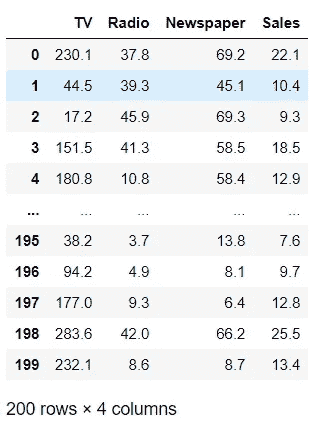
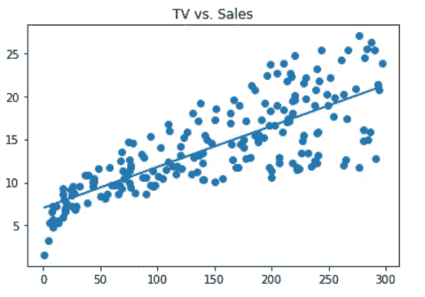
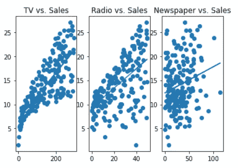
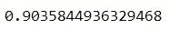
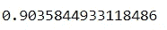

# 使用 Dora 进行探索性数据分析

> 原文：<https://towardsdatascience.com/exploratory-data-analysis-using-dora-ac596e5a32a6?source=collection_archive---------28----------------------->

## 自动化探索性数据分析和数据建模


威廉·艾文在 [Unsplash](https://unsplash.com?utm_source=medium&utm_medium=referral) 上的照片

探索性数据分析是最关键的部分，无论我们何时处理数据集，都要从它开始。它允许我们分析数据，并从数据中获得初步发现。EDA 是一种方法，在这种方法中，我们使用不同的方法主要是可视化来总结数据的主要特征。在建模之前，应该对数据进行分析、清理和清楚地理解，以使建模成功。

EDA 花费了我们大部分时间，因为我们必须清楚地分析数据，以便我们可以清理数据，并在建模前对数据进行可视化预处理。这就是为什么 EDA 是最重要的，但我们可以通过自动化所有的 EDA 工作来节省时间，并可以在建模中使用节省的时间。

Dora 是一个开源的 python 库，用于自动化探索性数据分析的痛苦部分。它只是清理你的数据，让你可视化，不仅如此，它还让你准备你的数据建模的目的。

在本文中，我们将探索 dora，看看它为我们提供了哪些不同的功能。

# 安装:

我们可以通过在 anaconda 命令提示符下运行下面给出的命令来轻松安装 dora。

```
pip install dora
```

# 实施:

**答:导入所需的库**

我们将从导入所需的库开始。我们将导入 pandas 以加载数据集，并导入 Dora 用于 EDA 目的。

```
import pandas as pd
from Dora import Dora
dora = Dora()  #Intialize dora
```

**b .加载数据集**

我们将在这里使用的数据集是一个跨国公司的广告数据，它包含不同的属性，如“销售”、“电视”等。其中“销售”是因变量，其他属性是特征变量。加载数据集后，我们将把它传递给 dora，以创建一个 dora 数据集并定义目标变量。

```
df = pd.read_csv('Advertising.csv')
dora.configure(output = 'Sales', data = df)
dora.data
```



广告数据集

c.**数据预处理**

Dora 允许我们用该列的平均值估算空数据，也允许我们缩放数据。这里我们将估算空数据，如果有的话。

```
dora.impute_missing_values()
```

在此之后，我们将可视化数据，看看数据试图告诉我们什么。对于可视化，我们可以一次完成整个数据集，也可以选择想要可视化的列。

```
dora.plot_feature('TV') #Visualizing Single Feature
```



特征和目标变量图

```
dora.explore()  #Visualizing all feature variable
```



所有特征变量与目标变量的关系图

接下来，我们将看看 dora 用于建模的数据拆分功能。默认情况下，dora 将数据分割成 80:20 的比例。

**d .数据建模**

这里我们将拆分数据，使用 sklearn 创建机器学习模型。

```
dora.set_training_and_validation() #Splitting the data
#Linear Regression Model
from sklearn.linear_model import LinearRegression
X = dora.training_data[dora.input_columns()]
y = dora.training_data[dora.output]
```

上面给出的命令将让我们为正在使用的数据集创建线性回归模型，现在让我们拟合数据并打印模型的分数以显示其准确性。

```
reg = LinearRegression().fit(X, y)
reg.score(X, y)
```



模型精度

同样，我们也可以创建其他模型，如下面我创建的岭回归模型。

```
from sklearn.linear_model import Ridge
clf = Ridge(alpha=1.0)
a = clf.fit(X, y)
a.score(X,y)
```



模型精度

# 结论:

在本文中，我们首先加载数据，并通过将目标变量传递为“Sales”来将数据传递给 Dora，然后我们对数据执行操作，以对其进行分析和可视化。最后，我们对数据进行预处理，创建不同的机器学习模型。

[](/technical-analysis-of-stocks-using-ta-lib-305614165051) [## 使用 TA-Lib 对股票进行技术分析

### 技术分析 python 库

towardsdatascience.com](/technical-analysis-of-stocks-using-ta-lib-305614165051) [](/automating-machine-learning-a486d365e423) [## 自动化机器学习

### 使用 H2O 汽车公司自动化机器学习

towardsdatascience.com](/automating-machine-learning-a486d365e423) 

# 在你走之前

***感谢*** *的阅读！如果你想与我取得联系，请随时通过 hmix13@gmail.com 联系我或我的* [***LinkedIn 个人资料*** *。*](https://www.linkedin.com/in/himanshusharmads/) *您还可以查看我的*[*G****it hub***](https://github.com/hmix13/)**关于数据科学不同项目的简介。**