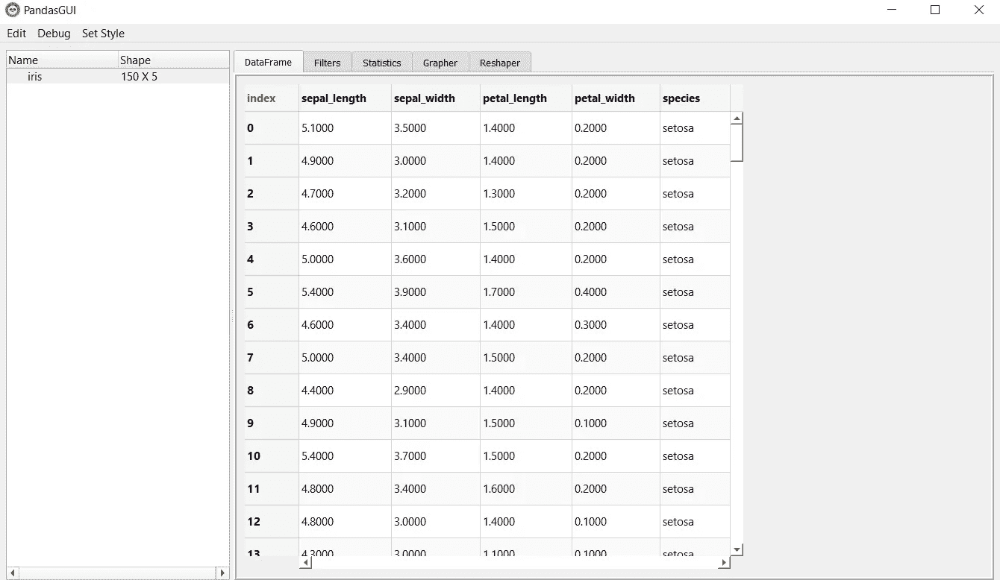
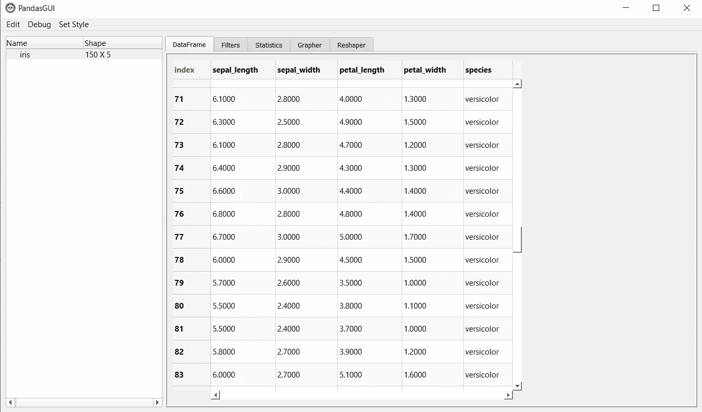
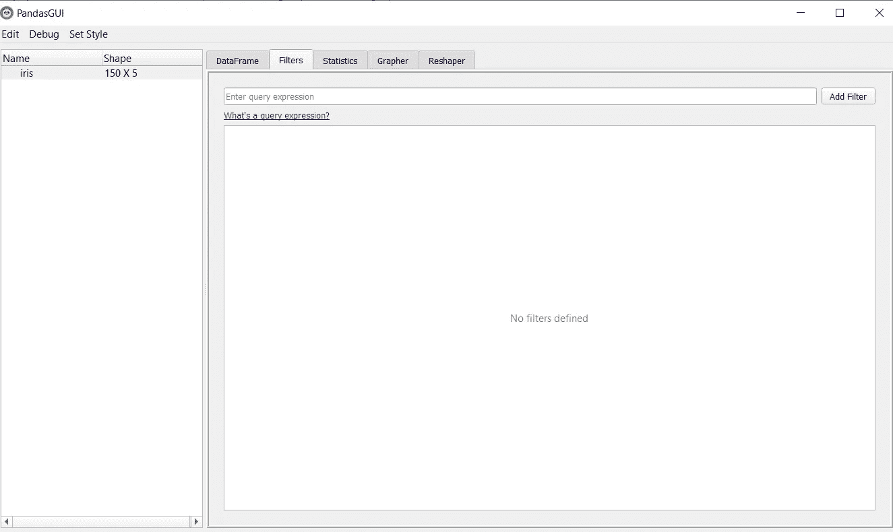
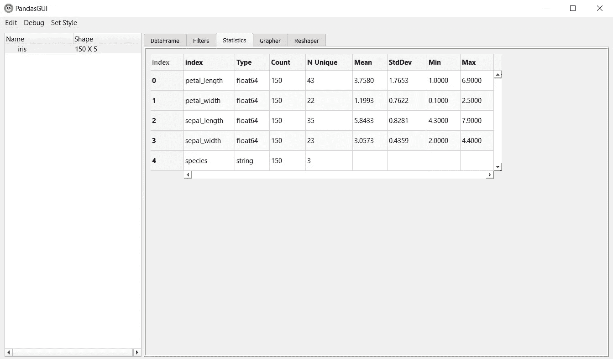
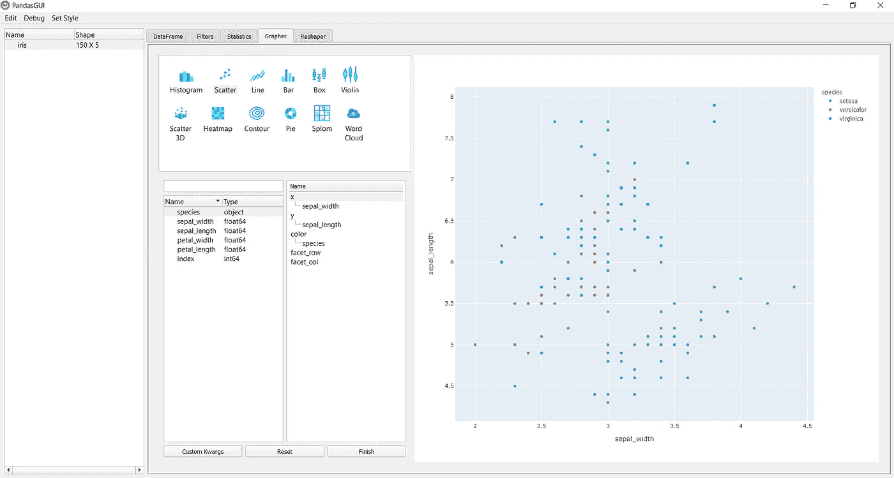
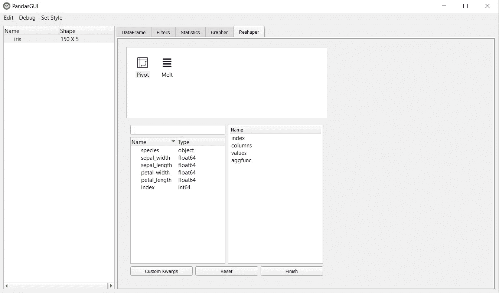

# 使用 PandasGUI 进行探索性数据分析

> 原文：<https://towardsdatascience.com/exploratory-data-analysis-using-pandasgui-8c119c3447ea?source=collection_archive---------32----------------------->

## 用于分析熊猫数据帧的图形用户界面


威廉·艾文在 [Unsplash](https://unsplash.com?utm_source=medium&utm_medium=referral) 上的照片

探索性数据分析是最关键的部分，无论我们何时处理数据集，都要从它开始。它允许我们分析数据，并让我们探索数据的初始发现，如有多少行和列，不同的列是什么，等等。EDA 是一种方法，在这种方法中，我们使用不同的方法主要是可视化来总结数据的主要特征。

如果您正在处理数据，EDA 是一个重要且最关键的步骤。探索数据并找出它的全部内容几乎占据了项目总时间的 30%。EDA 允许我们并告诉我们如何在建模前预处理数据。这就是为什么 EDA 是最重要的，但我们可以通过自动化所有时间采取 EDA 工作来节省时间，并可以在建模中使用节省的时间。

Pandasgui 是一个开源 python 模块/包，它创建了一个 gui 界面，我们可以在其中分析 pandas 数据帧并使用不同的功能来可视化和分析数据并执行探索性数据分析。

在本文中，我们将探索 Pandasgui，并了解如何使用它来自动化探索性数据分析过程，并节省我们的时间和精力。

# 安装 Pandasgui

像任何其他库一样，我们可以使用 pip 安装 pandasgui。

```
pip install pandasgui
```

# 正在加载数据集

pandasgui 中预定义了大量数据集。我们将使用 pandasgui 加载一个名为“IRIS”的数据集，这是一个非常著名的数据集，并将使用 pandasgui 的 gui 界面来探索它。我们还将导入“show”函数，它将数据集加载到 GUI 中。

```
from pandasgui.datasets import iris
#importing the show function
from pandasgui import show
```

# 创建界面

现在，我们只需要通过将数据集名称作为参数传递来调用 show 函数，它将启动一个 GUI，我们可以在其中浏览它的不同部分，并尝试浏览数据集的不同属性。

```
show(iris)
```



PandasGUI 的主屏幕(来源:作者)

在这里，您可以看到 show 功能启动了 GUI，我们可以清楚地看到包含不同功能的不同选项卡。

让我们分析一下这个界面的不同部分。

## **1。数据帧**



数据框架(来源:作者)

在这一节中，我们可以清楚地分析不同的属性是什么，它包含哪些值。我们可以清楚地分析所有的值和属性。在左侧，我们还可以看到数据帧的形状。

## 2.过滤



过滤器(来源:作者)

在这一部分，我们可以应用不同的过滤器来分析数据。我们可以简单地输入我们想要运行的查询并应用过滤器。你可以查看这个链接，了解熊猫中的[查询。](https://pandas.pydata.org/pandas-docs/stable/reference/api/pandas.DataFrame.query.html)

## 3.统计数字



统计数据(来源:作者)

该部分类似于熊猫数据帧的描述功能。它帮助我们分析数据集的统计属性。

## 4.Grapher



塑造者(来源:作者)

这是最重要的部分，在这里我们可以清楚地看到不同类型的可视化，我们可以使用界面创建，并节省我们为每个可视化编写代码的努力。在上图中，我已经为萼片长度和萼片宽度创建了散点图。类似地，您可以通过拖放 x、y 和其他参数中的列名来创建不同的可视化。

## 5.整形器



整形者(来源:作者)

在本节中，我们可以通过应用不同的函数和更改数据集的形状来分析数据集。提供的两种形状格式是“枢轴”和“熔化”。我们可以在不同的函数中拖放列，并相应地分析数据集的不同形状。

这是 PandasGUI 提供的 5 个部分，通过它们我们可以分析 pandas 数据帧并在任何给定的数据集上执行 EDA。PandasGUI 是一个有用的工具，因为它减少了反复编写代码的工作量，还节省了时间。

同样，您可以使用不同的数据集探索 PandasGUI。试试吧，在这篇文章的回复中让我知道你的经历。

# 在你走之前

***感谢*** *的阅读！如果你想与我取得联系，请随时在 hmix13@gmail.com 上联系我或我的* [***LinkedIn 个人资料***](http://www.linkedin.com/in/himanshusharmads) *。可以查看我的*[***Github***](https://github.com/hmix13)**简介针对不同的数据科学项目和包教程。还有，随意探索* [***我的简介***](https://medium.com/@hmix13) *，阅读我写过的与数据科学相关的不同文章。**