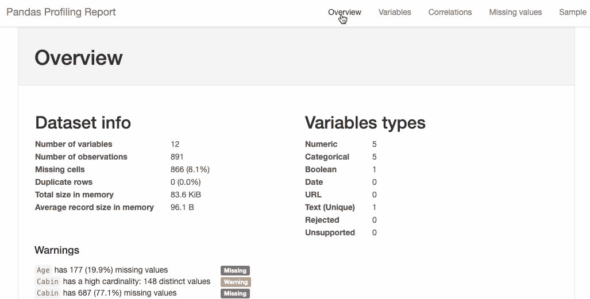

# 用一行 Python 代码进行探索性数据分析

> 原文：<https://towardsdatascience.com/exploratory-data-analysis-with-1-line-of-python-code-5fe25387c84b?source=collection_archive---------20----------------------->

## 熊猫概述-特征库


图片来自 [Pixabay](https://pixabay.com/?utm_source=link-attribution&amp;utm_medium=referral&amp;utm_campaign=image&amp;utm_content=1874791) 的[佩吉和](https://pixabay.com/users/Peggy_Marco-1553824/?utm_source=link-attribution&amp;utm_medium=referral&amp;utm_campaign=image&amp;utm_content=1874791)马可·拉赫曼-安克

探索性数据分析(EDA)是一种分析数据并总结其主要特征的方法。一个人花很多时间做 EDA 来了解数据。

EDA 涉及许多步骤，包括一些统计测试、使用不同类型的图来可视化数据等等。EDA 的一些步骤讨论如下:

*   **数据质量检查:**可以使用`describe()`、`info()`、`dtypes()`等熊猫库函数来完成。它用于查找多个特征、其数据类型、重复值、缺失值等。
*   **统计测试:**进行一些统计测试，如皮尔逊相关、斯皮尔曼相关、肯德尔测试等，以获得特征之间的相关性。它可以使用 *stats* 库在 python 中实现。
*   **定量检验:**一些定量检验用于发现数字特征的扩散，计数分类特征。它可以使用 pandas 库的函数在 python 中实现。
*   **可视化:**特征可视化对于理解数据非常重要。条形图、饼图等图形技术用于了解分类特征，而散点图、直方图则用于数字特征。

为了执行上述任务，我们需要输入几行代码。这里 **pandas-profiling** 开源库发挥了作用，它可以使用一行代码执行所有这些任务。使用 pandas-profiling 的 EDA 结果可以显示在 jupyter 笔记本中，也可以转换为 HTML 页面。

## 安装:

安装 Pandas-profiling 库的方法:

*   直接从 [GitHub repo](https://github.com/pandas-profiling/pandas-profiling/) 安装 pandas-profiling 库到 jupyter 笔记本；

```
! pip install [https://github.com/pandas-profiling/pandas-profiling/archive/master.zip](https://github.com/pandas-profiling/pandas-profiling/archive/master.zip)
```

*   使用 pip 安装 pandas-profiling 库:

```
pip install pandas-profiling
```

*   使用 conda forge 命令安装 pandas-profiling 库:

```
conda install -c conda-forge pandas-profiling
```

## 导入包:

要将 pandas-profiling 库用于 EDA，我们需要导入所需的必要库:

```
import pandas as pd
import numpy as np
from pandas_profiling import ProfileReport
```

## 用一行 Python 代码实现 EDA:

```
profile = ProfileReport(pd.read_csv('titanic.csv'),explorative=True)
```

是的，就是这样，你完成了探索性的数据分析。结果可以在 jupyter notebook 或 google colab 中观察到，或者文件可以保存为 HTML 格式并在网络浏览器中使用。

```
#to view result in jupyter notebook or google colab
profile.to_widgets()# to save results of pandas-profiling to a HTML file
profile.to_file("EDA.html")
```

## Titanic 数据集的 EDA 的一些结果:

使用 pandas-profiling 库进行探索性数据分析的数据集是从 Kaggle 下载的[。](https://www.kaggle.com/c/titanic/data)

(作者代码)



(作者 GIF)

# 结论:

我更喜欢使用几个 python 库，通过自定义函数来完成我的 EDA。

对于初学者来说，在尝试这个库之前，使用熊猫库开始做 EDA 并编写 python 代码是很好的，因为更重要的是具备基础知识和编程实践。

你可以在这里获得熊猫档案库[的文档和用法。](https://github.com/pandas-profiling/pandas-profiling) [**sweetviz**](https://pypi.org/project/sweetviz/) 是 **pandas-profiling** 的一个备选库，给出了类似的结果。

> 感谢您的阅读