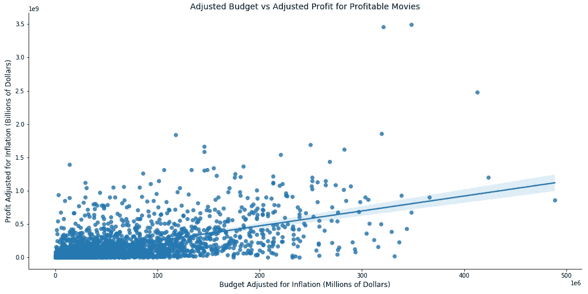
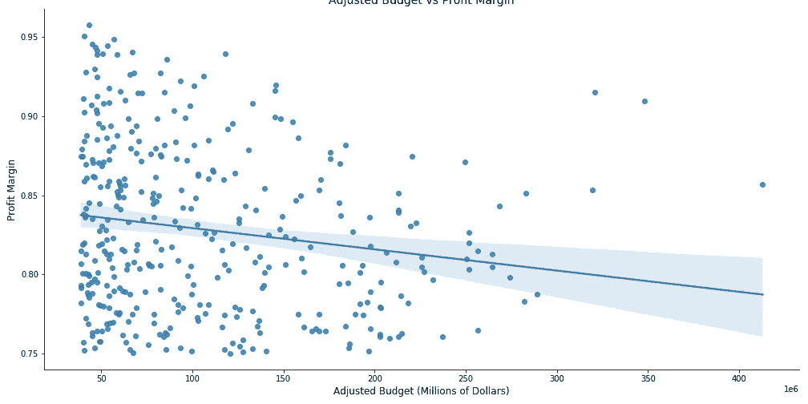
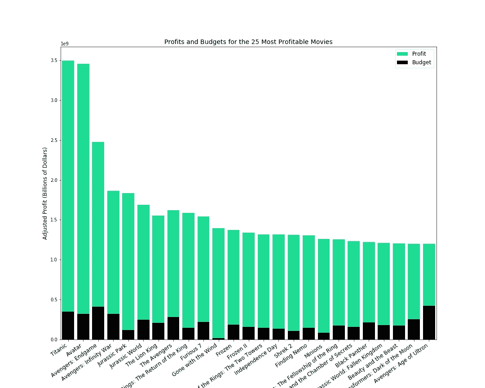
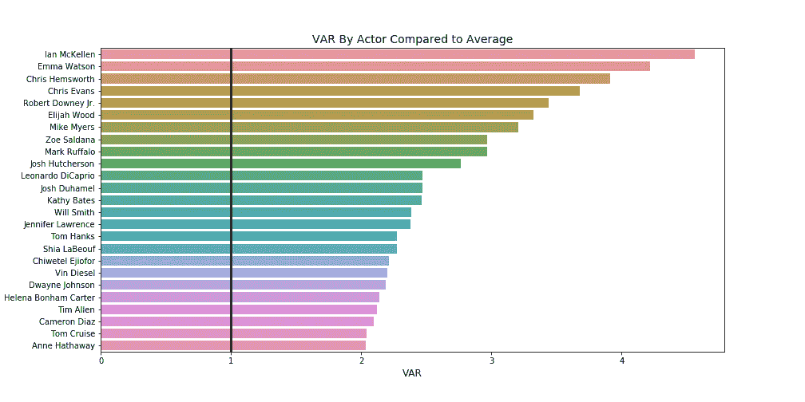
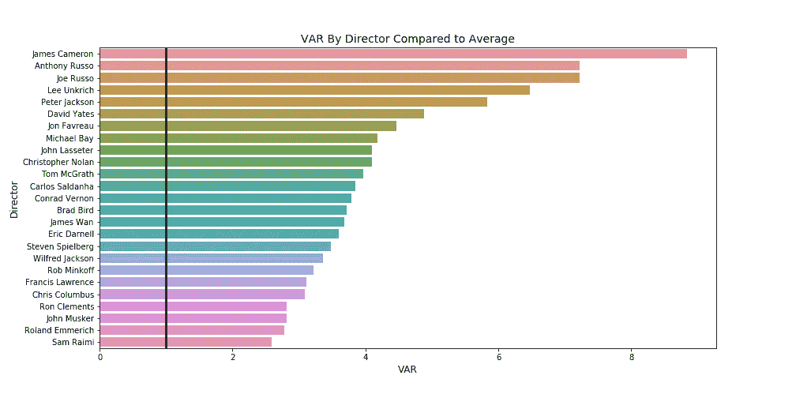

# 电影的探索性数据分析

> 原文：<https://towardsdatascience.com/exploratory-data-analysis-with-movies-3f32a4c3f2f3?source=collection_archive---------25----------------------->

## 对制作大片和获奖电影的标准的调查


GR Stocks 在 [Unsplash](https://unsplash.com/photos/q8P8YoR6erg) 上的照片

作为熨斗学校训练营要求的一部分，我们需要在每个学习模块结束时完成一个项目，展示我们应用所学知识的能力。

第一个项目的提示如下:

## 微软想进入电影行业，但是他们之前没有这个行业的知识，他们需要帮助，这样他们的电影工作室才能成功。

执行电影行业探索性数据分析(EDA)所需的主要技能包括:在 pandas 数据帧中进行网络搜集、存储和清理数据，以及使用 seaborn 和 matplotlib 进行数据可视化。我将描述一些我用于网络抓取和清理的方法，我将回顾一些我们为了成为一个成功的电影工作室而提出的建议。

# 网络抓取

在训练营开始之前，我对网络抓取并不熟悉，但我可以毫无疑问地说，这是我在过去几周里学到的最有用、最有趣的技能之一。Web 抓取本质上是查看网页的 HTML 并解构该 HTML 以便您可以提取相关信息进行分析的过程。通过使用请求和漂亮的汤库，我们可以很容易地把所有的 html 放进一个 Jupyter 笔记本中，并开始把它们分开。我们用来开发推荐的一些网站是 moviefone.com 的、[imdb.com 的](https://www.imdb.com/)和[boxofficemojo.com 的](https://www.boxofficemojo.com/)。例如，这个页面有 2019 年上映的电影的电影上映日期，所以我最终编写了这样的代码:

```
movies_= requests.get("https://www.moviefone.com/movies/2019/?     page=1")
soup = BeautifulSoup(movie_dates_page.content,'lxml')
movie_title = soup.find_all("a", class_="hub-movie-title")
```

然后，我简单地使用`movie_title`变量中每个元素的`.text`方法，就可以将网页上的每个电影标题放到一个列表中。我使用与上面所示类似的方法将所有发布日期放入一个列表中。然后，可以将这两个列表放入一个数据帧中，并使用 datetime 库来操作日期列，这样我们就可以计算某个月或某一天上映的电影数量。数据帧的构造如下所示:

```
movie_dict = {'movies':movie_list, 'release_date':dates_list}
dates_df = pd.DataFrame(data=movie_dict)#movie_list and dates_list are previously constructed lists from #webscraping
```

对于这个特定的项目，最简单的方法是确定网页的哪些元素对 EDA 最有用，然后定义一个函数来抓取这些元素并构建数据帧。抓取网页时，一个很好的经验法则是在抓取每个页面之间使用睡眠计时器。重复呼叫网页可能会面临被网站禁止的风险，因为这些重复呼叫会导致大量流量。

# 数据清理

从不同的网页抓取各种数据并将数据编译成数据帧后，下一步是清理数据。幸运的是，许多网站以一种使清理相对简单的方式来组织他们的电影数据。使用类似于`.replace()`的字符串方法被用来从预算和利润中删除逗号和美元符号，这样`.astype()` pandas 方法可以用来将数字从字符串转换成整数。

使用上面描述的电影日期数据帧的示例，使用日期时间库创建的新列如下所示:

```
import datetime as dtdates_df['release_date'] = pd.to_datetime(movie_releases_df['release_date'], format='%B **%d**, %Y')dates_df['release_month'] = dates_df['release_date'].map(**lambda** z: z.strftime('%B'))

dates_df['release_day'] = dates_df['release_date'].map(**lambda** z: z.strftime('%A'))dates_df['release_year'] = dates_df['release_date'].map(**lambda** z: z.strftime('%Y'))

dates_df['release_year'] = dates_df['release_year'].astype(int)
```

最难清理的是在维基百科页面上清理一个表格，其中包含电影、奥斯卡提名以及随后获奖的数据。虽然提名和奖项的数量被列在各自独立的栏目中，但也有特定条目有脚注的情况，被美丽的汤认为是文本。只有 11 部电影出现了脚注，所以在数据帧中手动纠正并不是很大的负担。然而，值得注意的是，您应该留意杂乱的数据，以便您可以开发适当的方法来清理这些数据。如果有数百或数千行，那么就需要一个更健壮的解决方案，这样您就不必手动逐行清理数据。

# 成功电影制片厂的推荐

我们决定为这个项目解决几个问题，我会在下面给那些想看完整个项目的人留一个我的 GitHub repo 的链接。我将讨论这个博客的两个问题/建议。

**问题 1:拍一部成功的电影应该花多少钱？**

为了回答这个问题，我们选择只查看利润大于零的电影数据。所有预算、收入和利润都使用 3.22%的平均通货膨胀率进行了调整。利用 seaborn，我创建了一个散点图，看看我是否可以确定任何趋势。



作者图片

从上面的图中我们可以看到，趋势线是正的，这让我们相信，如果我们花的钱比我们能赚的钱多。但是，仅凭这个情节，不足以做出认定。下图显示了盈利电影的预算和利润率。在这里，散点图显示了一个消极的趋势线，警告不要花太多的钱，因为你有降低利润率的风险。



调整后的预算与盈利电影的利润率(图片由作者提供)

那么，我们是如何决定一个合适的搬迁预算的呢？我们决定查看有史以来最赚钱的 25 部电影的利润率，并将利润率的中位数作为成功的目标。我们选择使用中位数是因为存在极端的异常值，这将使平均值作为集中趋势的衡量标准不太可靠(《泰坦尼克号》、《阿凡达》和《复仇者联盟 4：终局之战》对于首次涉足电影业的公司来说是不切实际的目标)。



作者图片

我们发现利润率的中位数是 0.84，我们选择推荐在一部电影上花费 82，500，000 美元，因为这与利润率大约为 0.8 相关。82，500，000 美元的预算远远低于前 25 部最赚钱电影的预算(这些预算约为 2 亿美元)。因此，我们认为，在制作一部利润率可以与一些最成功的电影相媲美的电影时，花费少得多是可能的。

**问题二:哪些演员和导演给一部电影带来的价值最大？**

如果我们知道我们应该在一部电影上花多少钱，那么显而易见，我们也应该知道我们应该雇佣谁来出演和导演这部电影，这样我们就可以实现利润最大化。为了确定谁给一部电影带来了最大的价值，我们创建了自己的统计数据，称为价值高于替代(VAR)。对于棒球迷来说，这是我们自己淡化的战争统计数据。VAR 背后的数学很简单:如果所有电影的平均净利润是 100 美元，而《演员:X》的平均净利润是 200 美元，他/她就会有 2 的 VAR。这个数字是平均值的 X 倍。我们对演员使用了 10 部电影的最小值，对导演使用了 5 部电影的最小值。

用于计算 VAR 的电影数据来自 imdb.com，我们用于计算 VAR 的代码如下:

```
actor_counts = actors_df['value'].value_counts()
actor_list = actor_counts[actor_counts >= 10].index.tolist()
actors_df = actors_df[actors_df['value'].isin(actor_list)]actor_total = actors_df.groupby(['value'],  as_index=False)['Net Profit'].mean().sort_values(by='Net Profit', ascending=False)actor_total['VAR'] = (actor_total['Net Profit']/actor_total['Net Profit'].mean())
```



作者图片



作者图片

我们看到，与演员相比，导演往往有更高的 var，这无疑有助于确定您应该如何为您的人员编制预算。

我们还探讨了其他主题:

1.  拍一部奥斯卡获奖电影应该花多少钱？
2.  你应该在一年中的什么时候发行电影？
3.  哪些流派最赚钱？
4.  我们应该效仿哪些工作室的最佳实践？

# 后续步骤

考虑到我们在这个项目中只使用了探索性的数据分析，我们可以采取更多的步骤来尝试并做出更准确的建议。我们收集的数据量当然可以让我们尝试并创建一些线性回归模型，根据一个或多个输入来尝试和预测利润。我们可以使用简单的线性回归来预测基于预算的利润，或者使用多元线性回归并选择几个输入，如预算、发行月份、演员、导演和获奖。像发行月份、演员和导演这样的变量是分类变量，而预算是连续变量。显然，通过查看上面的散点图，我们首先需要确保我们的数据在试图建立模型之前满足某些假设。研究和收集有关流媒体服务的数据，看看流媒体与传统票房相比是否有更大的回报，也将是有益的。大流行后的票房数据肯定会被证明是有价值的，因为电影公司正试图将自己与未来的经济衰退隔离开来，从而做出恢复或调整的决定。

对于理解数据科学过程的开端和练习各种编码技能来说，这是一个很好的项目。一旦我掌握了更多的数据科学技能，我一定会重新查看这些数据，这样我就可以在之前的建议基础上进行改进和完善！

GitHub:[https://GitHub . com/Jeremy-lee 93/DSC-mod-1-project-v2-1-on l01-dtsc-pt-052620](https://github.com/jeremy-lee93/dsc-mod-1-project-v2-1-onl01-dtsc-pt-052620)

Youtube 演示:【https://youtu.be/C9YgIYwHaIQ 