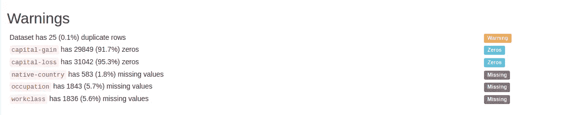

# 探索性数据分析与熊猫概况

> 原文：<https://towardsdatascience.com/exploratory-data-analysis-with-pandas-profiling-de3aae2ddff3?source=collection_archive---------2----------------------->


Pandas profiling 是一个开源的 Python 模块，使用它我们只需几行代码就可以快速进行探索性的数据分析。此外，如果这还不足以说服我们使用这个工具，它还可以生成 web 格式的交互式报告，可以呈现给任何人，即使他们不懂编程。

简而言之，熊猫概况分析所做的是为我们省去可视化和理解每个变量分布的所有工作。它会生成一份报告，其中包含所有易于获取的信息。

# 一幅画胜过千言万语

为了向您清楚地展示它是如何工作的，这是一个由 pandas profiling 生成的报告示例:


点击此链接，您还可以查看互动报道[。](https://pandas-profiling.github.io/pandas-profiling/examples/census/census_report.html)

生成的报告的优点之一是在开始时出现警告。它告诉我们包含 NaN 值的变量，有许多零的变量，有高基数的分类变量，等等。



告诉我们警告的部分

# 如何使用熊猫概况

第一步是用这个命令安装它:

```
pip install pandas-profiling
```

然后，我们使用以下命令生成报告:

```
from pandas_profiling import ProfileReport
prof = ProfileReport(df)
prof.to_file(output_file='output.html')
```

我们到了，就这么简单。我们可以看到在 output.html 文件中生成的*报告。*

# 熊猫剖析劣势

pandas profiling 的主要缺点是使用大型数据集。随着数据量的增加，生成报告的时间也增加了很多。

解决这个问题的一个方法是仅从我们拥有的所有数据的一部分生成报告。确保选择用于生成报告的数据代表我们拥有的所有数据是很重要的，例如，前 X 行数据可能只包含一个类别的数据。在本例中，我们希望随机排列数据，并选择一个有代表性的样本。

代码示例:

```
from pandas_profiling import ProfileReport
#We only use the first 10000 data points
prof = ProfileReport(df.sample(n=10000)) 
prof.to_file(output_file='output.html')
```

另一种选择是使用*最小模式*，这是在*熊猫档案*的 2.4 版本中引入的。您可以使用以下命令检查您安装了哪个版本:

```
pandas_profiling.version.__version__
```

在最小模式下，生成的简化报告包含的信息比完整报告少，但对于大型数据集，生成该报告的速度相对较快。这是要使用的代码:

```
profile = ProfileReport(df, minimal=True)
profile.to_file(output_file="output_min.html")
```