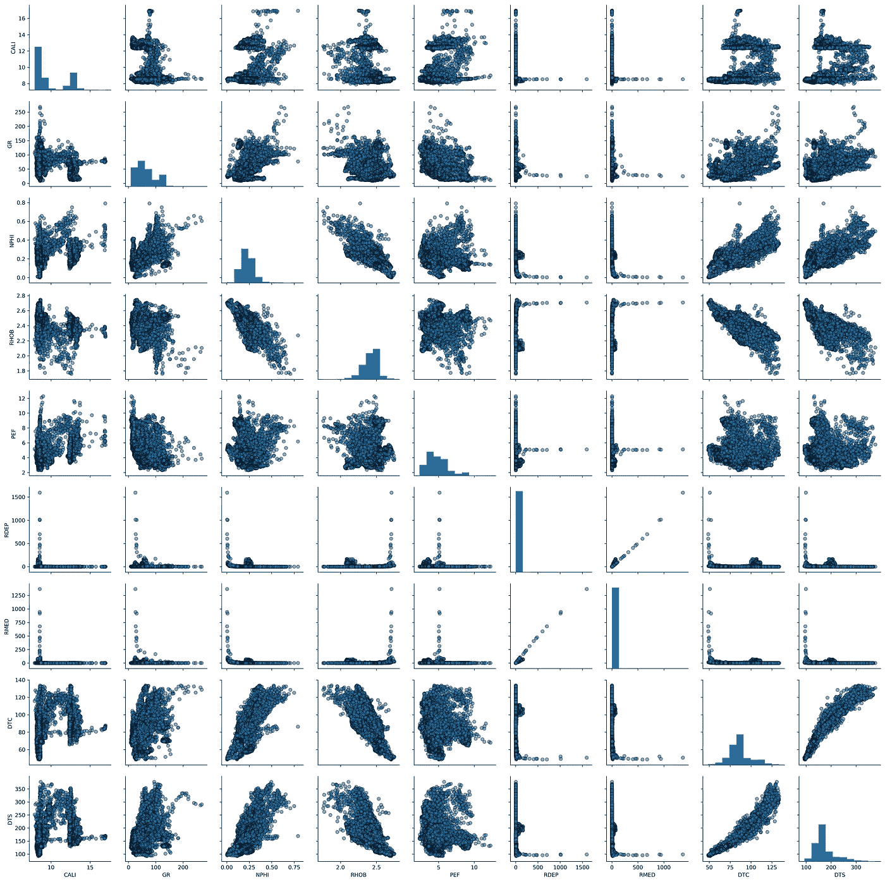

# 利用测井数据进行探索性数据分析

> 原文：<https://towardsdatascience.com/exploratory-data-analysis-with-well-log-data-98ad084c4e7?source=collection_archive---------18----------------------->


卢卡斯·布拉塞克在 [Unsplash](https://unsplash.com?utm_source=medium&utm_medium=referral) 上的照片

一旦数据经过整理和分类，数据科学过程的下一步就是进行探索性数据分析(EDA)。这一步使我们能够识别数据中的模式，了解特征(测井记录)之间的关系，并识别数据集中可能存在的异常值。在这一阶段，我们了解数据，并检查是否需要进一步处理或是否需要清理。

作为岩石物理学家/地球科学家，我们通常使用测井图、直方图和交会图(散点图)来分析和探索测井数据。Python 提供了一个很好的工具集，可以快速简单地从不同的角度可视化数据。

在本文中，我们将使用由 [Xeek](https://xeek.ai/challenges/force-well-logs/overview) 和 [FORCE](https://www.npd.no/en/force/events/) 发布的数据集子集，作为从测井曲线预测相的竞赛的一部分。我们将混合使用 [matplotlib](https://matplotlib.org/) 、 [seaborn](https://seaborn.pydata.org/) 和 [missingno](https://github.com/ResidentMario/missingno) 数据可视化库来可视化数据。

我们将涵盖的观想将允许我们:

*   确定我们哪里有或没有数据
*   了解数据分布
*   可视化受恶劣井眼条件影响的数据

这篇文章的笔记本可以在我的 Python 和 Petrophysics Github 系列中找到，可以通过下面的链接访问:

[https://github.com/andymcdgeo/Petrophysics-Python-Series](https://github.com/andymcdgeo/Petrophysics-Python-Series)

# 加载数据和库

任何项目的第一步都是加载所需的库和数据。

对于这项工作，我们将调用一些绘图库:seaborn、matplotlib 和 missingno 以及 math、pandas 和 numpy。

```
import pandas as pd
import matplotlib.pyplot as plt
import seaborn as sns
import math
import missingno as msno
import numpy as np
```

我们正在使用的数据集是 Xeek 和 FORCE([https://xeek.ai/challenges/force-well-logs/overview](https://xeek.ai/challenges/force-well-logs/overview))举办的机器学习竞赛的一部分。竞赛的目的是从由 98 口训练井组成的数据集中预测岩性，每口井的测井完整性程度不同。目的是根据测井测量预测岩相。

为了使本文中的图和数据易于管理，我使用了来自训练数据的 12 口井的子集。数据已经整理成一个单一的 csv 文件，无需担心曲线记忆。为了加载数据子集，我们可以调用`pd.read_csv.`

```
data = pd.read_csv('Data/xeek_train_subset.csv')
```

加载数据后，我们可以使用以下命令确认井的数量和名称:

```
# Counts the number of unique values in the WELL column
data['WELL'].nunique()
```

它将返回预期的 12。

```
# Gets the unique names from the WELL column
data['WELL'].unique()
```

这将返回一个带有井名的数组对象。

```
array(['15/9-13', '15/9-15', '15/9-17', '16/1-2', '16/1-6 A', '16/10-1', '16/10-2', '16/10-3', '16/10-5', '16/11-1 ST3', '16/2-11 A', '16/2-16'], dtype=object)
```

# 找出差距

测井中的数据缺失可能是由多种原因造成的，包括:

*   工具故障和问题
*   选择遗漏(即由于预算限制，工具没有运行)
*   人为误差
*   复古数据集
*   钻孔环境产生的问题

我们可以使用多种方法来确定哪里有数据，哪里没有。我们将看两种方法来可视化丢失的数据。

## 缺少图书馆

我们要看的第一种方法是使用 missingno 库，它提供了一个很好的小工具箱，由 Aleksy Bilgour 创建，作为一种可视化和理解数据完整性的方法。更多关于图书馆的细节可以在 https://github.com/ResidentMario/missingno[找到。如果您没有这个库，您可以使用`pip install missingno`将它快速安装到您的终端中。](https://github.com/ResidentMario/missingno)

missingno 工具箱包含许多不同的可视化，但是对于本文，我们将重点关注矩阵图和条形图。矩阵图可通过以下方式调用:

```
msno.matrix(data)
```


将 matplotlib.pyplot 作为 plt 导入

这向我们展示了所有特征的数据密度(对数曲线)。在图的右边是迷你图，它显示了数据中最大或最小的零值。

从可视化我们可以看到，只有少数几个列是完整的井，深度 _MD，GR，组，岩相 _ 岩性和岩相 _ 置信度。

其他国家有接近完整的数据值，如 DTC、CALI 和 ROP，而一些国家的数据覆盖范围很小，如 RMIC、SGR 和 ROPA。

我们还可以调用`msno.bar(data)`来生成一个条形图，显示每一列中非空数据值的数量(对数曲线)。沿着图表的顶部，我们得到了非空数据值的总数。


msno.bar(数据)中缺少数值计数。

快速浏览一下矩阵图和条形图，就可以知道数据集中缺少什么数据，尤其是在数据集中有大量列的情况下。

## 使用 Matplotlib 可视化缺失数据

在我的上一篇文章:[使用 Matplotlib 可视化油井数据覆盖范围](/visualising-well-data-coverage-using-matplotlib-f30591c89754)中，我介绍了一种逐井查看数据覆盖范围的方法。这使您可以看到关键曲线中的缺口。

如果我们想为每口井的所有曲线生成一个图，我们可以将每条曲线保存为一个文件，或者将数据显示在一个单独的列中。在这个例子中，我只选择了岩石物理学家可能在解释中使用的普通曲线。

```
data_nan = data[['WELL','DEPTH_MD','CALI', 'BS', 'GR', 'NPHI', 'RHOB', 'PEF', 'RDEP', 'RMED', 'DTC', 'DTS']].copy()
for num, col in enumerate(data_nan.columns[2:]):
    data_nan[col] = data_nan[col].notnull() * (num + 1)
    data_nan[col].replace(0, num, inplace=True)
    print(col, num) #Print out the col name and number to verify it works
grouped = data_nan.groupby('WELL')#Setup the labels we want to display on the x-axis
labels = ['CALI', 'BS', 'GR', 'NPHI', 'RHOB', 'PEF', 'RDEP', 'RMED', 'DTC', 'DTS']#Setup the figure and the subplots
fig, axs = plt.subplots(4, 3, figsize=(20,20))#Loop through each well and column in the grouped dataframe
for (name, df), ax in zip(grouped, axs.flat):
    ax.set_xlim(0,9)

    #Setup the depth range
    ax.set_ylim(5000, 0)

    #Create multiple fill betweens for each curve# This is between
    # the number representing null values and the number representing
    # actual values

    ax.fill_betweenx(df.DEPTH_MD, 0, df.CALI, facecolor='grey')
    ax.fill_betweenx(df.DEPTH_MD, 1, df.BS, facecolor='lightgrey')
    ax.fill_betweenx(df.DEPTH_MD, 2, df.GR, facecolor='mediumseagreen')
    ax.fill_betweenx(df.DEPTH_MD, 3, df.NPHI, facecolor='lightblue')
    ax.fill_betweenx(df.DEPTH_MD, 4, df.RHOB, facecolor='lightcoral')
    ax.fill_betweenx(df.DEPTH_MD, 5, df.PEF, facecolor='violet')
    ax.fill_betweenx(df.DEPTH_MD, 6, df.RDEP, facecolor='darksalmon')
    ax.fill_betweenx(df.DEPTH_MD, 7, df.RMED, facecolor='wheat')
    ax.fill_betweenx(df.DEPTH_MD, 8, df.DTC, facecolor='thistle')
    ax.fill_betweenx(df.DEPTH_MD, 9, df.DTS, facecolor='tan')

    #Setup the grid, axis labels and ticks
    ax.grid(axis='x', alpha=0.5, color='black')
    ax.set_ylabel('DEPTH (m)', fontsize=14, fontweight='bold')

    #Position vertical lines at the boundaries between the bars
    ax.set_xticks([1,2,3,4,5,6,7,8,9,10], minor=False)

    #Position the curve names in the centre of each column
    ax.set_xticks([0.5, 1.5 ,2.5 ,3.5 ,4.5 ,5.5 ,6.5 , 7.5, 8.5, 9.5], minor=True)

    #Setup the x-axis tick labels
    ax.set_xticklabels(labels,  rotation='vertical', minor=True, verticalalignment='bottom')
    ax.set_xticklabels('', minor=False)
    ax.tick_params(axis='x', which='minor', pad=-10)

    #Assign the well name as the title to each subplot
    ax.set_title(name, fontsize=16, fontweight='bold')plt.savefig('missingdata.png')
plt.tight_layout()
plt.subplots_adjust(hspace=0.15, wspace=0.25)
plt.show()
```


多孔图，显示数据集中每孔的数据覆盖率。

从生成的图像中，我们可以确定主曲线中的缺口在哪里。从这个图中，我们可以确定哪些井对机器学习建模或进一步研究有用。

# 熟悉数据

在本节中，我们将研究一些可视化技术，这些技术可用于深入了解我们的数据，以及这些数据与岩相和地质地层学的关系。

Python 世界有多个绘图和数据可视化库。其中之一是 [Seaborn](https://seaborn.pydata.org) ，这是一个建立在 [matplotlib](https://matplotlib.org/) 之上的数据可视化库，并与 [pandas](https://pandas.pydata.org/) 密切合作。它提供了一种简单且更直观的方式来显示和浏览您的数据。

以下示例说明了一些不同的绘图，可用于混合使用 FacetGrid 和 matplotlib 来快速了解数据。

## 密度——岩性的中子分布

与 matplotlib 相比，FacetGrid 提供了一种使用少量代码在网格中绘制多个子情节的更简单、更流畅的方法。

在使用我们的数据之前，我们首先必须将数字岩性数据转换成实际的描述性标签。这可以通过使用一个简单的字典来实现:

```
lithology_numbers = {30000: 'Sandstone',
                 65030: 'Sandstone/Shale',
                 65000: 'Shale',
                 80000: 'Marl',
                 74000: 'Dolomite',
                 70000: 'Limestone',
                 70032: 'Chalk',
                 88000: 'Halite',
                 86000: 'Anhydrite',
                 99000: 'Tuff',
                 90000: 'Coal',
                 93000: 'Basement'}
```

在我们的数据框架中，我们创建了一个名为 LITH 的新列，并使用 map 函数快速获得描述性标签，如下所示:

```
data['LITH'] = data['FORCE_2020_LITHOFACIES_LITHOLOGY'].map(lithology_numbers)
```

对于第一个 FacetGrid，我们将按地层查看密度-中子数据。当我们这样做时，我们只需要指定几行代码，而不是多行或使用 for 循环，就像上面的例子中看到的丢失数据一样。我们可以用密度中子数据初始化 FacetGrid，并将 LITH 列传入`col`参数。此外，我们可以使用`col_wrap`参数来指定网格中需要多少列。

最后，由于我们熟悉使用特定比例在交会图上处理密度-中子数据，我们需要相应地设置`xlim`和`ylim`，否则它将自动缩放。

```
g = sns.FacetGrid(data, col='LITH', col_wrap=4)
g.map(sns.scatterplot, 'NPHI', 'RHOB', alpha=0.5)
g.set(xlim=(-0.15, 1))
g.set(ylim=(3, 1))
```


根据岩性划分密度-中子数据面网格。

这将生成一系列按岩性划分的密度-中子数据的微型散点图/交会图。你可以从上面的代码中看到，我们必须指定的只是绘图的类型、轴和设置轴限制，这样我们就有了一个可以立即使用的好绘图。

## 密度——岩性和井的中子分布

通过查看多口井的岩性分布，我们可以进一步增强密度中子数据。使用转换后的岩性数据列，我们可以通过向`hue`参数提供岩性来为不同的岩性类型创建阴影。然后，我们可以将数据框中的井列输入到`col`参数中。

可以通过向标记和大小参数提供值来更改标记。这将有助于清理绘图，以便我们可以看到更多的数据。

最后，由于我们使用的是色调，我们可以使用`add_legend().`自动生成图例

```
g = sns.FacetGrid(data, col='WELL', hue='LITH', col_wrap=4)
g.map(sns.scatterplot, 'NPHI', 'RHOB', linewidth=1, size=0.1, marker='+')
g.set(xlim=(-0.15, 1))
g.set(ylim=(3, 1))
g.add_legend()
```


FacetGrid 密度-中子数据按井划分，并按岩性着色。

## 密度——按岩性和地质组的中子分布

我们可以很容易地将地质组列的分组选项换成按组查看岩性变化。

```
g = sns.FacetGrid(data, col='GROUP', hue='LITH', col_wrap=4)
g.map(sns.scatterplot, 'NPHI', 'RHOB', linewidth=1, size=0.1, marker='+')
g.set(xlim=(-0.15, 1))
g.set(ylim=(3, 1))
g.add_legend()
```


按地质组划分密度-中子数据网格，并按岩性着色

从该图中，我们可以很快看出 Rotliegendes Gp 主要是砂岩，而 Nordaland Gp 是页岩和砂岩/页岩岩性的混合物。

## Seaborn 配对图

Seaborn 库还有一个非常强大的可视化功能，称为 pairplot，可以通过一行代码调用。这允许我们在一个网格上比较多个列/测量值。matplotlib 中的等效代码会扩展几行。

在显示配对图之前，我们需要修改我们正在使用的数据。首先，我们将使用由一些常用测井记录组成的数据子集。如果我们使用本文示例中的所有列，我们将无法查看详细信息。其次，我们需要删除任何丢失的数据值，否则在绘图时会出现问题。

要创建我们想要的曲线列表:

```
key_logs = ['CALI', 'GR', 'NPHI', 'RHOB', 'PEF', 'RDEP', 'RMED', 'DTC', 'DTS']
```

然后，我们可以提取数据的一个子集:

```
subset = data[key_logs]
subset = subset.dropna()
```

一旦我们有了关键曲线的列表，我们可以将它传递给 pair 图中的`vars` 参数。

```
sns.pairplot(subset, vars=key_logs, diag_kind='hist', plot_kws={'alpha':0.6, 'edgecolor':'k'})
```



我们的油井数据对绘图。直方图沿着每条对数曲线分布的对角线。

这将生成多个散点图，每条曲线沿对角线有一个直方图。如您所见，这使我们能够快速了解不同测井曲线之间的数据分布和关联。很厉害的剧情！

# 识别不良井眼数据

在本节中，我们将简要介绍一种方法，该方法可以直观地显示因井眼扩大而产生的井眼数据。井眼壁的劣化可能因多种原因而发生，包括欠压实岩石和作用在这些岩石上的应力变化，如泥浆比重的变化。

如缺失数据部分所述，我们只有 10 口井有钻头尺寸曲线。因此，将不对 2 口井进行绘图。我们可以使用 bitsize 曲线和 caliper 曲线来创建一个不同的 caliper。负数表示井眼尺寸缩小(例如页岩膨胀)，正数表示井眼尺寸增大。

```
data['DIF_CAL'] = data['CALI'] - data['BS']
```

由于我们将使用 matplotlib 绘制这些图，我们首先需要按井对数据帧进行分组:

```
grouped = data.groupby('WELL')
```

然后计算我们绘图所需的行数:

```
nrows = int(math.ceil(len(grouped)/3.))
```

最后，我们可以使用一个小的 for 循环来遍历每个井，并在我们的图中添加一个密度与中子的子图。`df.plot`中的`c`参数允许我们在数据帧中指定一列来给数据着色。在这种情况下，我们将使用我们计算的 DIF _ 卡尔数据。

```
fig, axs = plt.subplots(nrows, 3, figsize=(20,20))
for (name, df), ax in zip(grouped, axs.flat):
    df.plot(kind='scatter', x='NPHI', y='RHOB', ax=ax, c='DIF_CAL', cmap='jet', vmin=-1, vmax=10)
    ax.set_xlim(-0.15,1)
    ax.set_ylim(3,1)
    ax.set_title(name)
plt.tight_layout()
```


密度-中子测井数据的多井图，用计算的差分井径曲线着色。

快速浏览一下，我们可以看到我们可能对两口井的数据有问题:15/9–15 和 16/1–2。这些应该进一步调查。

我们也可以把同样的想法应用到我们的岩性上。如果我们发现某个岩性受到了不良井眼条件的严重影响，那么在尝试使用机器学习算法预测该岩性时，可能会出现潜在的后果。

为此，我们通过 LITH 对数据进行分组，并使用与上面相同的绘图逻辑。

```
# Determine number of rows
nrows = int(math.ceil(len(grouped)/3.))# Group our data
grouped_lith = data.groupby('LITH')# Plot our data
fig, axs = plt.subplots(nrows, 3, figsize=(20,20))
for (name, df), ax in zip(grouped_lith, axs.flat):
    df.plot(kind='scatter', x='NPHI', y='RHOB', c='DIF_CAL', cmap='jet', ax=ax, vmin=-1, vmax=10)
    ax.set_xlim(-0.05,1)
    ax.set_ylim(3,0)
    ax.set_title(name)
plt.tight_layout()
```


密度-中子测井数据的多井图，按岩性划分，用计算的井径差曲线着色。

从图中我们可以看出，所有岩性都有很大程度的“好”数据。

# 结论

在本文中，我们介绍了使用常见 Python 库探索和可视化测井数据的三种方法。我们已经看到了如何使用 Seaborn 在单个图形上快速绘制多个数据集，并按井和岩性分割数据。我们还看到了如何快速识别缺失数据和受井眼条件影响的数据。

探索数据是熟悉和理解数据的一个很好的方式，尤其是在进行机器学习或进一步解释之前。

# 参考

鲍曼，奥桑德，迪里布，迪辛顿，曼拉尔，2020。2020 原力机器学习大赛。[https://github . com/bolgebrygg/Force-2020-机器学习-竞赛](https://github.com/bolgebrygg/Force-2020-Machine-Learning-competition)

力:机器预测的岩性:【https://xeek.ai/challenges/force-well-logs/overview 