# 漫威宇宙的探索性网络分析

> 原文：<https://towardsdatascience.com/exploratory-network-analysis-of-marvel-universe-c557f4959048?source=collection_archive---------26----------------------->

## [动手教程](https://towardsdatascience.com/tagged/hands-on-tutorials)，漫威网络分析

## 在图形数据科学库中引入新的 k-最近邻算法

一位智者曾经说过，2020-30 年将是图形数据科学的十年。事实上，这就发生在几天前的 2020 节点会议上，这位智者就是在 2020 节点的[主题演讲上发言的 Emil Eifrem。如果你错过了会议，所有的演讲都可以在网上](https://www.youtube.com/watch?v=ivOPeDe8IDc)找到[。](https://neo4j.com/video/nodes-2020/)

几天前发布了 1.4 版本的 [Neo4j 图形数据科学](https://neo4j.com/docs/graph-data-science/current/)库，这正好符合 Emil 的说法。这是 GDS 图书馆的一个重要里程碑。这个版本中添加了许多新功能。如果有兴趣了解更多，可以查阅[发布声明](https://github.com/neo4j/graph-data-science/releases/tag/1.4.0-alpha07)。在这篇博文中，我们将看看新的 k 近邻算法。但在此之前，我们将进行适当的图形探索性分析。

我写了这么多博客文章，要找到一些我还没有探索过的优秀数据集需要付出努力。这次我在 Kaggle 上看到了一个[很酷的知识库，里面有关于漫威宇宙的数据。可惜后来才知道，只有漫画和人物文件才有匹配的 id。作为一名图形分析师，我们想要连接所有相关的数据，而没有匹配的 id，这有点困难。然后我意识到那些匹配的 id 是从漫威 API 中刮出来的。我从 API 中获取了一些额外的数据来丰富我们的图表。关于角色的信息不能通过 API 获得，但是可以在他们的网站上获得。这让我穿上蜘蛛侠服，测试我的网络爬行能力。我很自豪地说，我学会了使用硒，并有效地从漫威网站上搜集了有关人物的信息。](https://www.kaggle.com/dannielr/marvel-superheroes)

# **图形导入**

你可以通过运行这个[要点](https://gist.github.com/tomasonjo/fbc6d617c3f6476a3a825b5dd22fd29a)中的 cypher 语句来轻松导入这个漫威宇宙图。它包含十个简单的`LOAD CSV` cypher 语句和一个`apoc.schema.assert`过程来定义唯一的约束和索引。如果您使用 Neo4j 浏览器，请确保您已经启用了多语句查询编辑器。


这样，您可以复制整个要点的内容，而不必担心单独执行每个语句。

# 图表模式

既然我们已经导入了图表，我们可以通过以下过程来检查它的模式:

```
CALL db.schema.visualization()
```

如果您在 Neo4j 浏览器中运行这个过程，您将获得这个图形模式的可视化效果。

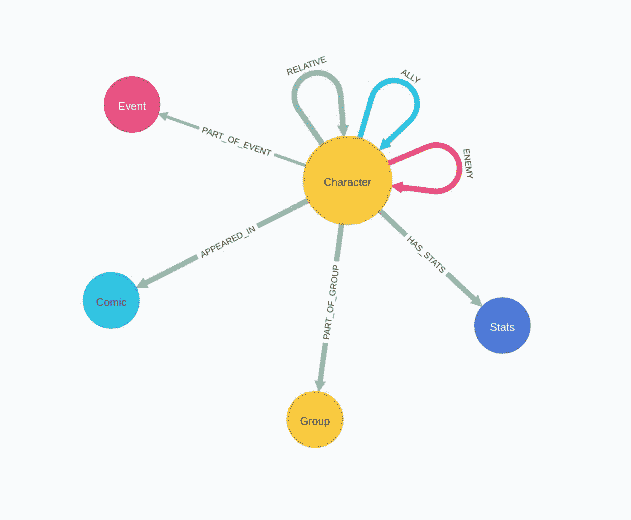

在图形的中心，有一些字符，也称为英雄。他们可以出现在多个漫画中，是一个事件的一部分，也可以属于一个团体。对于一些角色，我们也知道他们的数据，比如速度和战斗技能。最后，我们有代表亲戚、盟友或敌人关系的角色之间的社会关系。

为了感受一下图形的大小，我们可以运行以下 APOC 过程:

```
CALL apoc.meta.stats() YIELD labels
return labels
```

结果

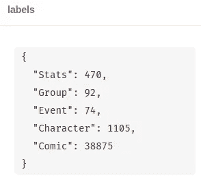

在 38875 部漫画中出现过的角色有 1105 个。
我们有 470 个角色的数据。图中还存储了 92 个组和 74 个事件。

# 探索性图形分析

为了了解我们的图表，我们将从一个基本的图表数据探索过程开始。首先，我们来看看漫画中出现频率最高的角色。

```
MATCH (c:Character)
RETURN c.name as character, 
       size((c)-[:APPEARED_IN]->()) as comics
ORDER BY comics DESC
LIMIT 5
```

结果

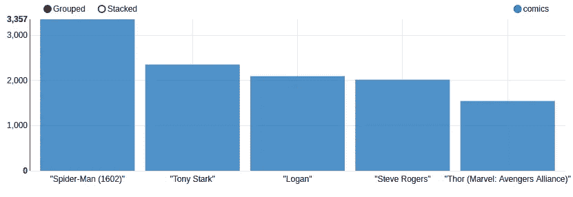

你可能想知道我是从哪里得到这个条形图的。 [Apache Zeppelin 笔记本](https://zeppelin.apache.org/)有一个内置功能，可以让你创建各种可视化。幸运的是， [Andrea Santurbano](https://twitter.com/santand84) 为 Apache Zeppelin 开发了 Neo4j 连接器，使得编写 cypher 语句来读取或写入数据到 Neo4j 数据库变得很容易。

前五个最常见的字符不足为奇。蜘蛛侠是最常见或最受欢迎的角色。鉴于蜘蛛侠的受欢迎程度，难怪他们最近创造了一个年轻版的蜘蛛侠。托尼·斯塔克，又名钢铁侠，位居第二。似乎洛根，也被称为金刚狼，在历史上很受欢迎，但我认为他的知名度在最近一段时间慢慢消失了。史蒂夫·罗杰斯，更受欢迎的名字是美国队长，也很有名。似乎最近的漫威电影展示了漫画中更受欢迎的角色。

您可能想知道我们图表中的事件是什么，让我们来看看。我们将检查参与英雄的最高计数的事件。

```
MATCH (e:Event)
RETURN e.title as event, 
       size((e)<-[:PART_OF_EVENT]-()) as count_of_heroes,
       e.start as start,
       e.end as end,
       e.description as description 
ORDER BY count_of_heroes DESC 
LIMIT 5
```

结果

我不知道这些事件代表了什么，但有趣的是看到许多角色参与其中。大多数事件的时间跨度不到一年，而复仇行为的时间跨度超过二十年。在被 Michael Piper 告知这一数据很可能不正确后，我与其他来源进行了交叉引用，看起来这确实是不正确的数据。复仇行动事件从 1989 年 12 月持续到 1992 年 2 月。我也已经通知漫威在他们的 API 中更正这个信息，作为对传播错误信息的道歉，其他人不会遇到同样的问题。从描述来看，洛基和 92 号也有关系！其他角色。不幸的是，我们没有存储在图表中的漫画和事件之间的联系来进行进一步的分析。如果有人愿意收集漫威 API，我会很乐意把它添加到数据集中。

让我们也来看看最大的人物群体。

```
MATCH (g:Group)
RETURN g.name as group, 
       size((g)<-[:PART_OF_GROUP]-()) as members
ORDER BY members DESC LIMIT 5
```

结果

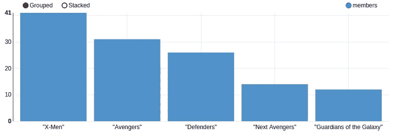

《x 战警》中有 41 个角色，这很有意义，因为他们有一个完整的学院。你可能会对复仇者联盟的 31 名成员感到惊讶，但在[漫画](https://www.marvel.com/teams-and-groups/avengers/in-comics)中，有许多复仇者联盟的成员，尽管大多数是前成员。

正因为可以，我们来考察一下，是不是同一个群体的某些成员也是敌人。

```
MATCH (c1:Character)-[:PART_OF_GROUP]->(g:Group)<-[:PART_OF_GROUP]-(c2:Character)
WHERE (c1)-[:ENEMY]-(c2) and id(c1) < id(c2)
RETURN c1.name as character1, c2.name as character2, g.name as group
```

结果

看起来洛根和其他 x 战警相处的并不好。对于一些角色，我们也有他们的出生地和教育背景，所以让我们快速看一下。在刮的过程中，我注意到一个来自南斯拉夫的英雄，所以我想知道是否有更多来自南斯拉夫的角色。

```
MATCH (c:Character)
WHERE c.place_of_origin contains "Yugoslavia"
RETURN c.name as character, 
       c.place_of_origin as place_of_origin,
       c.aliases as aliases
```

结果

两个人物起源于今天的克罗地亚，离我住的地方不到两个小时车程。让我们看看所有完成博士学位的角色。

```
MATCH (c:Character)
WHERE c.education contains "Ph.D"
RETURN c.name as character, c.education as education
LIMIT 10
```

结果

看起来这些英雄中的很多人都很适合工作。只有龙葵似乎有点危险。这感觉就像是人们在搜索博士简介时会放在 LinkedIn 个人资料上以引起注意的东西。顺便问一下，你知道 X 教授有四个博士学位，同时也是精神病学的医学博士吗？受过良好教育的人。

# 分析盟友和亲戚的社区

我们已经研究了基本的图统计，现在我们将更多地关注网络分析。我们将调查人物之间的社会关系。
首先，我们将计算角色之间每种关系类型的等级值，并显示总体等级最高的英雄。

```
MATCH (c:Character)
RETURN c.name as name,
       size((c)-[:ALLY]->()) as allies,
       size((c)-[:ENEMY]->()) as enemies,
       size((c)-[:RELATIVE]->()) as relative
ORDER BY allies + enemies + relative DESC 
LIMIT 5
```

结果

猩红女巫和雷神似乎有最直接的敌人。金刚狼有最多的盟友，但也有很多敌人。看起来 Triton 是一个有 17 个直系亲属关系的大家庭。我们可以使用`apoc.path.subgraphAll`程序来检查 Triton 的亲属社区。查看[文档](https://neo4j.com/labs/apoc/4.0/graph-querying/expand-subgraph/)了解更多信息。

```
MATCH p=(c:Character{name:"Triton"})
CALL apoc.path.subgraphAll(id(c), {relationshipFilter:"RELATIVE"})
YIELD nodes, relationships
RETURN nodes, relationships
```

结果

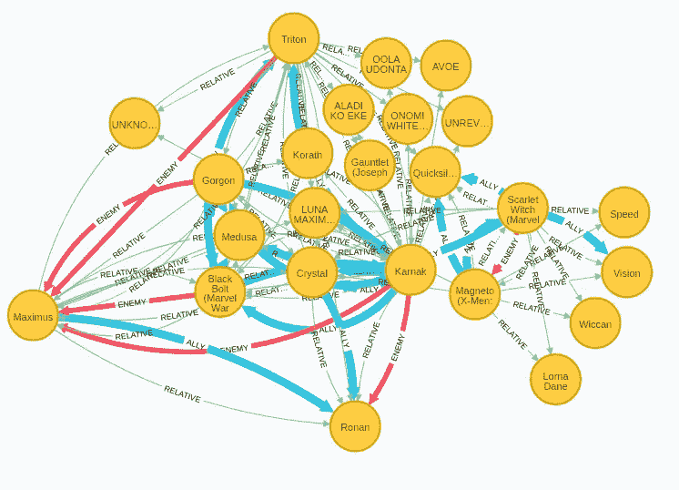

我从来不知道有些漫威英雄有一个幸福的大家庭。如果没有败家子在场就不准确了。马克西姆斯在这里看起来像是家族中的害群之马，因为他在家族中有四个敌人。你可能会奇怪，当我们只遍历相对关系时，为什么会显示盟友和敌人的关系。Neo4j 浏览器有一个功能，在屏幕上显示节点之间的所有连接。

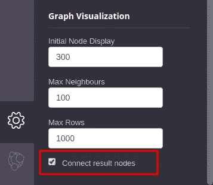

如果你有一个密集的图表，你可能应该取消这个设置，否则在 Neo4j 浏览器中会显示很多连接。

## 弱连通分量算法

[弱连通分量](https://neo4j.com/docs/graph-data-science/current/algorithms/wcc/)是几乎所有图形分析工作流的一部分。它用于查找网络中断开的组件或孤岛。

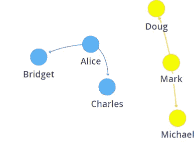

WCC 算法的示例结果

在本例中，图表由两部分组成。迈克尔、马克和道格属于第一部分，而布里奇特、爱丽丝和查尔斯属于第二部分。我们将应用弱连通分量算法来寻找关联字符的最大分量。由于我们不打算在这个网络上运行任何其他算法，我们将使用[匿名图投影](https://neo4j.com/docs/graph-data-science/current/management-ops/anonymous-graph/)。

```
CALL gds.wcc.stream({
  nodeProjection:'Character',
  relationshipProjection:'ALLY'})
YIELD nodeId, componentId
WITH componentId, count(*) as members
WHERE members > 1
RETURN componentId, members
ORDER BY members DESC
LIMIT 5
```

结果

同盟的最大组成部分有 195 个成员。然后我们有几个只有几个成员的小联盟岛。如果我们在 Neo4j 浏览器中可视化 alliances 的最大组件，并选择 connect results nodes 选项，我们将得到以下可视化结果。

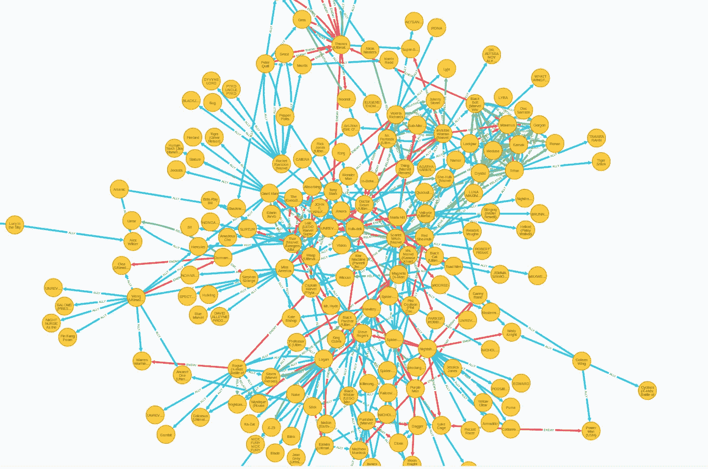

虽然我们已经找到了最大的盟友组件，但我们可以观察到组件中的许多角色实际上是敌人(红色关系)。为了更好地理解为什么会出现这种情况，让我们看下面的例子。

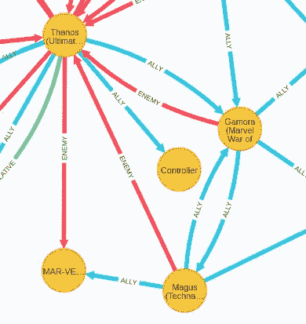

在这个例子中，灭霸是加莫拉、法师和惊奇队长的敌人，但仍然是同一个盟国的成员。它们属于同一个组件，因为人们可以仅使用联盟关系(如果我们将它们视为无向图)从任何成员到所有其他组成员遍历该图。

## 定制 ally 组件算法

假设我们想要找到在给定组件中没有敌人的盟友社区。算法实现相对简单，例如，您可以使用 [Neo4j 自定义过程](https://neo4j.com/docs/java-reference/current/extending-neo4j/procedures-and-functions/procedures/)。尽管如此，如果你像我一样不会说 Java，你总是可以求助于你最喜欢的脚本语言。我用 Python 开发了自定义 Ally 组件算法。首先，我们定义了一些助手函数来获取单个节点的盟友和敌人。

我的实现相对简单。算法的输入是最大联合组件中所有节点 id 的列表。从单个节点开始，将它的敌人加载到敌人列表中，将它的盟友加载到一个队列中，稍后进行处理。然后我们迭代盟军队列。如果某个节点不是组件中任何现有节点的敌人，则将它们添加到团体列表，并将它们的敌人添加到团体的敌人列表。我添加了一些小的性能调整，比如如果我们已经遍历了 allies 队列中的节点，我们可以从起始节点的全局列表中删除该节点。

在这段代码中，该算法只返回属于最大联盟组件的节点的 id，其中没有敌人。在 Neo4j 中标记这些节点应该不成问题，因为您可以通过它们的 id 来匹配它们。盟友中最大的组成部分，也就是内部没有敌人的部分，有 142 个成员。如果我们在 Neo4j 浏览器中将其可视化，我们可以看到没有敌人关系可见。

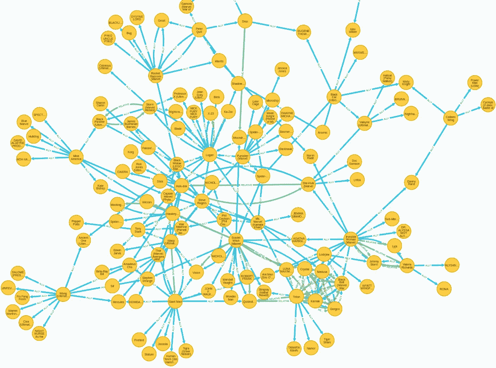

# 分析角色的状态

在我们分析的最后一部分，我们将检查角色的属性。我们有总共 470 个英雄的统计数据。这条信息是从漫威的网站上搜集来的。这里有一个例子，展示了漫威网站上单个角色的统计数据。

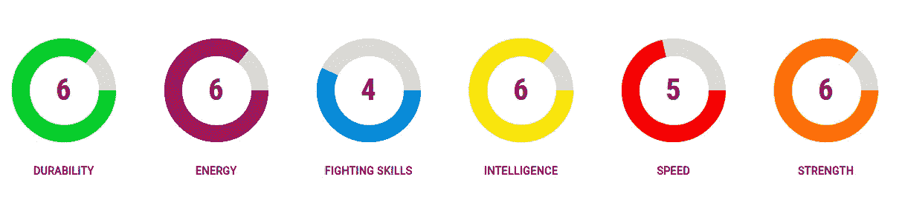

你能猜出它们属于谁吗？它们是托尼·斯塔克(钢铁侠)的数据。统计范围从 0 到 7，钢铁侠没有一个 7。可能不是最强的英雄，尽管他是最受欢迎的英雄之一。现在我们将探索平均属性最高的角色。每当我的 cypher 查询需要帮助时，我都会求助于 Neo4j Slack。幸运的是，Andrew Bowman 总是在优化和美化我们的 cypher 查询方面提供很好的建议。这次他给我看了`apoc.map.values`程序。它可用于获取单个节点的所有属性，而无需显式写入属性键。

```
MATCH (c:Character)-[:HAS_STATS]->(stats)
RETURN c.name as character, 
       apoc.coll.avg(apoc.map.values(stats, keys(stats))) as average_stats
ORDER BY average_stats DESC
LIMIT 10
```

结果

看起来很多角色的属性都已经达到极限了。我不确定这个数据收集过程是如何进行的，但我发现了一个名叫[松鼠女孩](https://www.marvel.com/characters/squirrel-girl-doreen-green)的迷人女主角，她可能会用一只手踢钢铁侠的屁股，同时用另一只手做酸奶面包。或者擦亮她的指甲，不确定她是什么类型的女孩。唯一确定的是她是个坏蛋。

## k-最近邻算法

k-最近邻是一种更标准的图形算法，之前已经在图形数据科学库中以[余弦](https://neo4j.com/docs/graph-data-science/current/alpha-algorithms/cosine/)、[欧几里德](https://neo4j.com/docs/graph-data-science/current/alpha-algorithms/euclidean/)和[皮尔森相似度](https://neo4j.com/docs/graph-data-science/current/alpha-algorithms/pearson/)算法的形式实现。这些是基本实现，其中算法比较网络中所有节点对的给定向量。因为比较所有节点对并不能很好地伸缩，所以向库中添加了 kNN 算法的另一个实现。它基于[通用相似性度量的高效 k-最近邻图构造](https://dl.acm.org/doi/abs/10.1145/1963405.1963487)文章。该算法不是比较每个节点对，而是基于节点的邻居很可能已经是最近的邻居的假设来选择可能的邻居。该算法相对于节点计数是准线性的，而不是二次的。该实现使用余弦相似性来比较两个向量。

首先，我们需要创建一个向量(数字数组),在英雄对之间进行比较。我们将使用角色的属性以及他们飞行的能力来填充向量。因为所有的统计在 0 到 7 之间有相同的范围，所以不需要标准化。我们只需要对飞行特征进行编码，使其跨度也在 0 到 7 之间。那些会飞的角色会有飞行特性七的值，那些不会飞的角色会有零的值。

```
MATCH (c:Character)-[:HAS_STATS]->(s)
WITH c, [s.durability, s.energy, s.fighting_skills, 
         s.intelligence, s.speed, s.strength,
         CASE WHEN c.flight = 'true' THEN 7 ELSE 0 END] as stats_vector
SET c.stats_vector = stats_vector
```

我们还将使用第二个标签标记拥有统计向量的角色。这样，我们可以很容易地在命名图的本地投影中用统计向量过滤英雄。

```
MATCH (c:Character)
WHERE exists (c.stats_vector)
SET c:CharacterStats
```

现在一切都准备好了，我们可以开始加载我们的命名图了。我们将把所有带有 **CharacterStats** 标签的节点和它们的 **stats_vector** 属性投影到一个命名图中。如果你需要快速复习或了解 GDS 图书馆是如何工作的，我建议你参加[的图算法入门课程](https://neo4j.com/graphacademy/online-training/intro-graph-algos-40/)。

```
CALL gds.graph.create('marvel', 'CharacterStats',
  '*', {nodeProperties:'stats_vector'})
```

现在，我们可以继续使用新的 kNN 算法来推断相似性网络。我们将使用算法的**变异**模式。 **mutate** 模式将结果存储回投影图，而不是 Neo4j 存储图。这样，我们可以使用 kNN 算法结果作为工作流中稍后的社区检测算法的输入。kNN 算法有一些我们可以用来微调结果的参数:

*   **topK** :每个节点要查找的邻居数量。返回 K 个最近邻。
*   **sampleRate** :限制每个节点比较次数的采样率。
*   **deltaThreshold** :确定何时提前停止的百分比值。如果发生的更新少于配置值，则算法停止。
*   **randomJoins** :在每一次迭代之间，基于随机选择进行了多少次连接新节点邻居的尝试。

我们将定义 **topK** 值为 15，**采样率**为 0.8，其他参数保留默认值。

```
CALL gds.beta.knn.mutate('marvel', {nodeWeightProperty:'stats_vector', sampleRate:0.8, topK:15, mutateProperty:'score', mutateRelationshipType:'SIMILAR'})
```

## 鲁汶模块化算法

相似性网络被推断并存储在命名图中。我们可以用 [Louvain 模块性](https://neo4j.com/docs/graph-data-science/current/algorithms/louvain/)算法来检查这个新的相似性网络的社区结构。由于关系的相似性分数作为它们的属性是可用的，我们将使用 Louvain 模块化算法的加权变体。使用**relationship weight property**参数，我们让算法知道在计算网络的社区结构时应该考虑关系的权重。这次我们将使用算法的 **write** 模式将结果存储回 Neo4j 存储图。

```
CALL gds.louvain.write('marvel',
  {relationshipTypes:['SIMILAR'],  
   relationshipWeightProperty:'score', 
   writeProperty:'louvain'});
```

我们可以使用下面的 cypher 查询来检查社区结构结果。

```
MATCH (c:Character)-[:HAS_STATS]->(stats)
RETURN c.louvain as community, count(*) as members, 
       avg(stats.fighting_skills) as fighting_skills,
       avg(stats.durability) as durability,
       avg(stats.energy) as energy,
       avg(stats.intelligence) as intelligence,
       avg(stats.speed) as speed,
       avg(stats.strength) as strength,
       avg(CASE WHEN c.flight = 'true' THEN 7.0 ELSE 0.0 END) as flight
```

结果

为每个统计数据添加标准偏差是有意义的，但是对于一篇博客文章来说这是不合适的。id 68 的社区拥有最强大的成员。大多数统计的平均值是 6.5，这意味着他们几乎完全被透支了。飞行的平均值为 2 表明大约 30% (2/7)的成员可以飞行。最大的社区有 106 名成员，他们的平均统计数据在 2 到 3 之间，这表明他们可能是能力较低的支持角色。能力较强的角色通常是主角。

我们还可以用 Neo4j Bloom 来可视化推断的相似性网络的社区结构。我们根据社区成员关系给节点着色。首先，我们必须用**GDS . graph . write relationship**过程将变异的关系存储回 Neo4j，以便用 Neo4j Bloom 可视化它们。

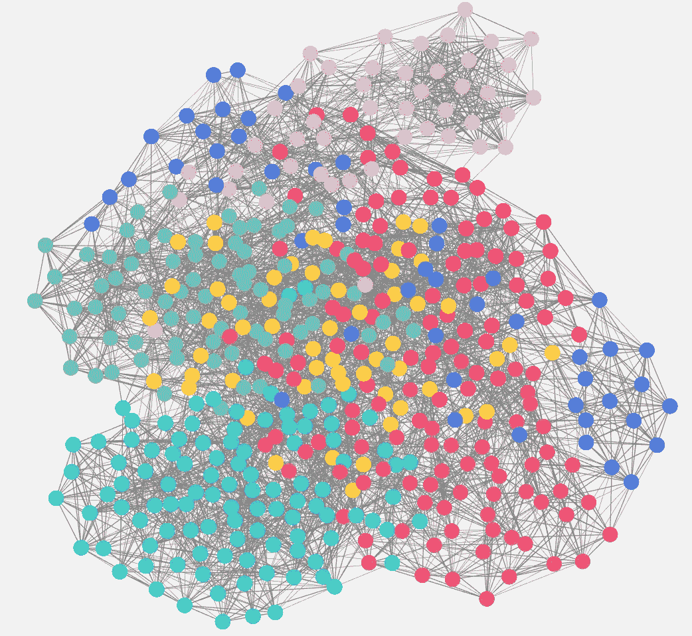

粉色社区包含了最强的英雄。我们可以观察到它们在右上方有自己的集群，也向中间延伸了一点。

## 标签传播算法

[标签传播](https://neo4j.com/docs/graph-data-science/current/algorithms/label-propagation/)算法也可以用来确定一个网络的社区结构。我们将它应用于推断的相似性网络，并将结果与 Louvain 模块性算法结果进行比较。

```
CALL gds.labelPropagation.write('marvel',
  {relationshipTypes:['SIMILAR'],
   relationshipWeightProperty:'score', 
   writeProperty:'labelPropagation'})
```

我们研究了标签传播算法的结果。

```
MATCH (c:Character)-[:HAS_STATS]->(stats)
RETURN c.labelPropagation as community, count(*) as members, 
       avg(stats.fighting_skills) as fighting_skills,
       avg(stats.durability) as durability,
       avg(stats.energy) as energy,
       avg(stats.intelligence) as intelligence,
       avg(stats.speed) as speed,
       avg(stats.strength) as strength,
       avg(CASE WHEN c.flight = 'true' THEN 7.0 ELSE 0.0 END) as flight
```

结果

我们可以注意到，标签传播算法找到的社区是鲁汶模块化算法的两倍。其中一些相对较小。例如，id 为 693 的社区只有三个成员，他们的平均统计值都是 1.0。他们是被称为 Maggott，死亡之鸟和 Slayback 的英雄。时髦的名字。最强大的社区有 137 个 id，只有 23 个成员。记住，鲁文模块化算法发现的最强大的社区有 46 个成员，平均统计值略低。

我们可以再次用 Neo4j Bloom 可视化标签传播社区结构的结果。

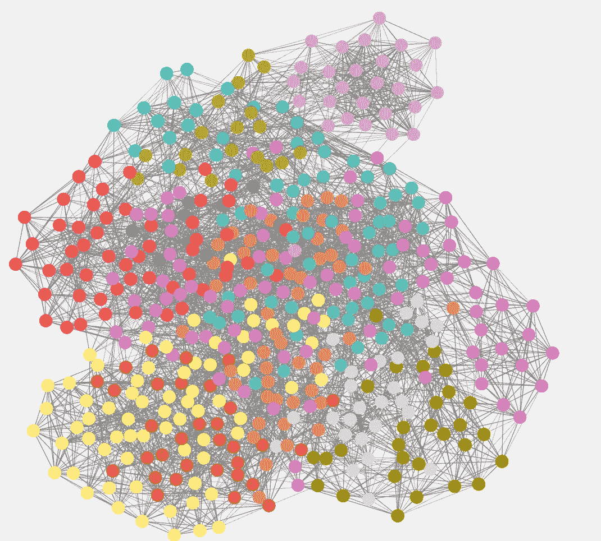

再说一遍，粉色社区的成员是最强大的。我们可以注意到，这一次右上角的集群根本没有延伸到中心。我们可以放大这个社区来观察它的成员。

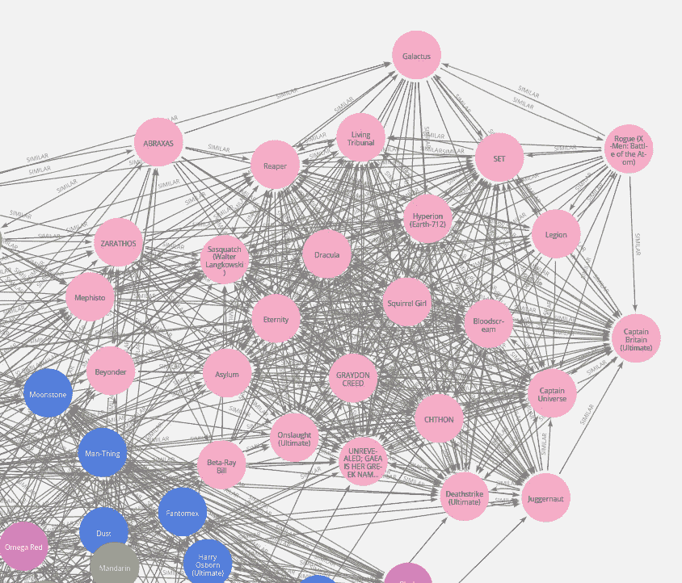

似乎所有的事情都在平衡中，因为松鼠女孩就在最强大的社区的中心。

# 结论

我希望您已经在 APOC 和 GDS 图书馆的帮助下学会了在 Neo4j 中执行网络分析的一些技巧。我们仍然可以用这个图表做很多事情，所以期待一个新的帖子。在那之前，[试用 Neo4j](https://neo4j.com/try-neo4j/) 并试用 GDS 库 1.4 版本的[预发布版。如果你需要帮助，我推荐你去看看](https://github.com/neo4j/graph-data-science/releases) [Neo4j 图形学院](https://neo4j.com/graphacademy/)。

和往常一样，代码可以在 [GitHub](https://github.com/tomasonjo/blogs/blob/master/Marvel_series/Exploratory%20graph%20analysis.ipynb) 上获得。

编辑:由于数据收集过程中的缺陷，我已经删除了关于人物的错误历史数据。