# Python 中的探索性文本分析

> 原文：<https://towardsdatascience.com/exploratory-text-analysis-in-python-8cf42b758d9e?source=collection_archive---------22----------------------->

## *建立情感分类器的一步*

为什么我们在建立模型之前要做探索性的数据分析？我会说“*为了更好地理解数据，以便我们以合适的方式预处理数据，并选择合适的建模技术”*。这种理解数据的必要性在处理文本数据时仍然适用。这篇文章是构建情感分类器的三篇系列文章中的第一篇。在这篇文章中，我们将看看一种对文本进行*探索性数据分析的方法，或者为了简洁起见，将*探索性文本分析*。*


照片由[安德鲁·尼尔](https://unsplash.com/@andrewtneel?utm_source=medium&utm_medium=referral)在 [Unsplash](https://unsplash.com?utm_source=medium&utm_medium=referral) 上拍摄

在我们深入研究之前，让我们先退一步，看看更大的图景。CRISP-DM 方法概述了成功的数据科学项目的流程。下图显示了数据科学项目的第 2-4 阶段。在**数据理解**阶段，探索性数据分析是关键任务之一。

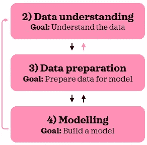

CRISP-DM 工艺流程摘录

在从事数据科学项目时，在不同阶段之间来回切换而不是线性前进并不罕见。这是因为想法和问题会在随后的阶段出现，你想回到一两个阶段去尝试这个想法或找到问题的答案。官方的 CRISP-DM 中没有粉色箭头，但是，我认为这些经常是必要的。事实上，为了探索性的文本分析，我们将在这篇文章中做一些数据准备。对于那些有兴趣了解 CRISP-DM 更多信息的人来说，[这个](https://www.datasciencecentral.com/profiles/blogs/crisp-dm-a-standard-methodology-to-ensure-a-good-outcome)是一个很好的简短介绍，[这个资源](https://www.sv-europe.com/crisp-dm-methodology/)提供了更详细的解释。

# 0.Python 设置🔧

这篇文章假设读者(👀是的，你！)可以访问并熟悉 Python，包括安装包、定义函数和其他基本任务。如果你是 Python 的新手，[这个](https://www.python.org/about/gettingstarted/)是一个很好的起点。

我在 Jupyter 笔记本里测试过 Python 3.7.1 的脚本。

让我们在开始之前确保您已经安装了以下库:
◼️ **数据操作/分析:** *numpy，pandas* ◼️ **数据分区:** *sklearn* ◼️ **文本预处理/分析:** nltk◼️ **可视化:** *matplotlib，seaborn*

一旦你安装了 *nltk* ，请确保你已经从 *nltk* 下载了*【punkt】**【停用词】*和*【wordnet】*，脚本如下:

```
import nltk
nltk.download('punkt') # for sent_tokenize
nltk.download('stopwords') 
nltk.download('wordnet') # for WordNetLemmatizer
```

如果你已经下载了，运行这个会通知你。

现在，我们准备导入所有的包:

```
# Setting random seed
seed = 123# Data manipulation/analysis
import numpy as np
import pandas as pd# Data partitioning
from sklearn.model_selection import train_test_split# Text preprocessing/analysis
import re
from nltk import word_tokenize, sent_tokenize, FreqDist
from nltk.util import ngrams
from nltk.corpus import stopwords
from nltk.stem import WordNetLemmatizer
from nltk.tokenize import RegexpTokenizer# Visualisation
import matplotlib.pyplot as plt
import seaborn as sns
sns.set(style="whitegrid", context='talk', 
        palette=['#D44D5C', '#43AA8B'])
```

*外卖或笔记将附带*🍀*探索时*。

# 1.数据📦

我们将使用 IMDB 电影评论数据集。您可以在这里下载数据集[，并将其保存在您的工作目录中。保存后，让我们将其导入 Python:](https://www.kaggle.com/lakshmi25npathi/imdb-dataset-of-50k-movie-reviews)

```
sample = pd.read_csv('IMDB Dataset.csv')
print(f"{sample.shape[0]} rows and {sample.shape[1]} columns")
sample.head()
```

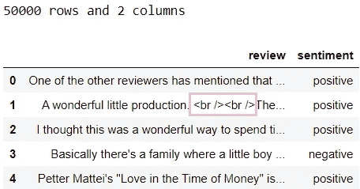

从查看数据的头部，我们可以立即看到第二条记录中有 html 标记。

🍀进一步检查 html 标签，看看它们有多普遍。

让我们来看看情绪之间的分歧:

```
sample['sentiment'].value_counts()
```

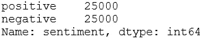

在样本数据中，情感是平均分配的。在开始探索性文本分析之前，我们先把数据分成两组:*训练*和*测试*。我们将留出 5000 箱进行测试:

```
# Split data into train & test
X_train, X_test, y_train, y_test = train_test_split(sample['review'], sample['sentiment'], test_size=5000, random_state=seed, 
                                                    stratify=sample['sentiment'])# Append sentiment back using indices
train = pd.concat([X_train, y_train], axis=1)
test = pd.concat([X_test, y_test], axis=1)# Check dimensions
print(f"Train: {train.shape[0]} rows and {train.shape[1]} columns")
print(f"{train['sentiment'].value_counts()}\n")print(f"Test: {test.shape[0]} rows and {test.shape[1]} columns")
print(test['sentiment'].value_counts())
```

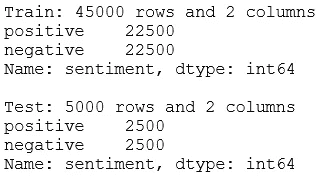

通过指定`stratify`参数，我们确保了情感在两组中平均分配。

在本帖中，我们将使用*训练*进行探索性文本分析。一旦我们探索了训练数据集，单独检查*测试*集的关键特征可能是有用的。理想情况下，这两组都应该代表潜在人群。让我们检查一下训练数据集的头部:

```
train.head()
```

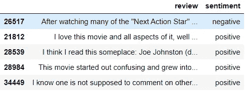

好了，我们都准备好去探索了！✨

# **2。探索性文本分析🔎**

引导探索性数据分析的一个方法就是写下你感兴趣的问题，用数据来回答。找到问题的答案通常会引出你可能想探究的其他问题。以下是我们可以回答的一些问题示例:

📋 **2.1。热身:** *一共有几根弦？
*最常见的字符串有哪些？
*最短的字符串是什么样子的？
*最长的字符串是什么样子的？

📋 **2.2。代币:**

> *💡* [令牌是一个字符序列。](https://www.nltk.org/book/ch01.html) [令牌通常被笼统地称为文字。](https://nlp.stanford.edu/IR-book/html/htmledition/tokenization-1.html)
> *💡* [记号化是将文档拆分成记号的过程，有时还会丢弃某些字符，如标点符号。](https://nlp.stanford.edu/IR-book/html/htmledition/tokenization-1.html)示例:标记化将“这部电影棒极了”变成 4 个标记:[“这部电影”、“电影”、“曾经是”、“棒极了”]

*有多少代币？
*有多少个唯一令牌？
*每个令牌的平均字符数是多少？

📋 **2.3。停字:**

> ***💡*** 停用词是对文本意义几乎没有价值的常用词。示例:和。

*最常见的停用词是什么？
*还有哪些词经常出现，可以添加到停用词中？

📋 **2.4。常见单词 n-grams:**

> ***💡*** [单词 n-grams 是文本数据中相邻 n 个单词的所有组合](https://stackoverflow.com/questions/18193253/what-exactly-is-an-n-gram)。例如:“这部电影棒极了”中的二元结构是[“这部电影”、“电影曾经是”、“曾经棒极了”]

*最常见的令牌是什么？最常见的二元模型是什么？最常见的三元模型是什么？最常见的四字格是什么？

📋 **2.5。文件:**

> ***💡*** 文档是文本记录。例如:每个电影评论都是一个文档。
> *💡*语料库是文档的集合。简单来说，文本数据就是一个语料库。示例:我们可以将训练数据称为训练语料库。

*每个文档的平均句子数量是多少？
*每个文档的平均令牌数是多少？
*每个文档的平均字符数是多少？
*每个文档的平均停用词数量是多少？
*答案如何因情绪而异？

现在，是时候找到这些问题的答案了！😃

## 📋 2.1.W **手臂抬起**

让我们将所有的评论合并成一个字符串，然后在空格处将其拆分成子字符串(以下简称为字符串)。这确保了对于这种预热探索，语料库被最小程度地改变(例如，保持标点不变):

```
# Prepare training corpus into one giant string
train_string = " ".join(X_train.values)
print(f"***** Extract of train_string ***** \n{train_string[:101]}", "\n")# Split train_corpus by white space
splits = train_string.split()  
print(f"***** Extract of splits ***** \n{splits[:18]}\n")
```

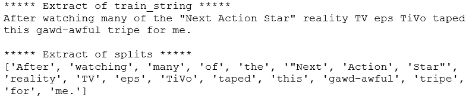

✏️ **2.1.1。有多少根弦？**

```
print(f"Number of strings: {len(splits)}")
print(f"Number of unique strings: {len(set(splits))}")
```

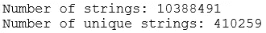

在训练语料库中有超过 1000 万个字符串，其中有大约 41 万个独特的字符串。这给了我们初步的大概数字。在我们正确标记后，我们将看到这些数字是如何寻找标记的。

✏️。最常见的字符串有哪些？

让我们为每个字符串准备频率分布来回答这个问题:

```
freq_splits = FreqDist(splits)
print(f"***** 10 most common strings ***** \n{freq_splits.most_common(10)}", "\n")
```

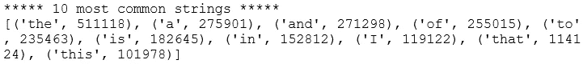

看到最常见的字符串是停用词并不奇怪。我们将在第 2.3 节*中进一步探讨停用词。停止言语*。

🍀*在查看普通令牌和 n 元语法之前，删除停用词。*

**✏️。最短的字符串是什么样子的？**

让我们将短字符串定义为长度小于 4 个字符的字符串，并检查它们的频率:

```
short = set(s for s in splits if len(s)<4)
short = [(s, freq_splits[s]) for s in short]
short.sort(key=lambda x:x[1], reverse=True)
short
```

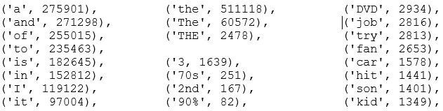

*摘录自* ***短*** *，未显示所有输出*

许多短字符串似乎是停用词，但也有数字和其他短词。

🍀*有不同形式的数字:3，2，70，90% —我们需要决定是放弃还是保留它们。*

🍀*有大小写变化:“the”、“The”、“The”-这些需要规范化。*

因为我们还没有标记化，一些字符串目前包含附加在单词上的标点符号。因此，在其他情况下，相同的单词被认为是不同的，如下例所示:

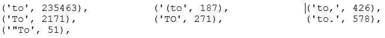

*摘自* ***短*** *，并非所有输出都显示*

🍀*舍弃标点符号将有助于进一步规范文字。*

✏️ 2.1.4。最长的字符串是什么样子的？

让我们将长字符串定义为 16+字符长，并重复这个过程。

```
long = set(s for s in splits if len(s)>15)
long = [(s, freq_splits[s]) for s in long]
long.sort(key=lambda x:x[1], reverse=True)
long
```

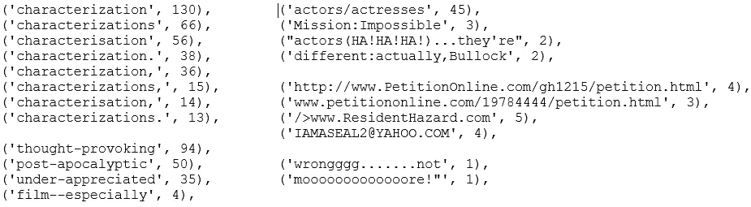

*摘录自* ***长*** *，并非所有输出都显示*

长弦的频率看起来比短弦低得多，这并不奇怪。长字符串看起来很有趣，有几个要点:

🍀同一个词有美国和英国的拼法:“charactering”和“charactering”。使用下面的脚本快速检查后，这个单词的美式拼写看起来更占优势。量化这两种拼写在整个训练语料库中的流行程度有点棘手。

```
print(f"characterisation: {sum([c for s, c in long if re.match(r'characterisation*', s.lower())])} strings")
print(f"characterization: {sum([c for s, c in long if re.match(r'characterization*', s.lower())])} strings")
```

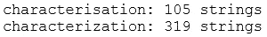

🍀*有带连字符的词:“发人深省”、“后启示录”、“不被欣赏”和“电影特别”(这个有双连字符)。如果我们在空格或标点符号上做记号，这些字符串将被分割成单独的单词。在大多数情况下，这将保留句子的要点。如果我们保留用连字符连接的单词，它们就不会像生僻字一样常见，因此会被删除。*

🍀*有文字结合其他标点符号(有些由于篇幅不够)* ***: '*** *演员/女演员'，《碟中谍:不可能'，《演员(哈！哈！哈！)…他们是“，‘不同:其实，布洛克’。在标记时，最好将这些情况分成单独的单词。因此，基于空格或标点符号的标记可能是一个好主意。*

🍀*有网址和邮箱:***'/>www。ResidentHazard.com '，****'****http://www.PetitionOnline.com/gh1215/petition.html', ' iamaseal 2 @ YAHOO。COM“”。但是，好像并不多。**

*🍀*有把同一个字重复两次以上的不法词语****:****“Booooring……不要，不要！),'.如果你知道这些拉长的单词的正确术语，我很想知道。在此之前，我们将把它们称为“非法词汇”。这些违法案件似乎很少出现。**

*还有其他有趣的发现，我们可以添加到这些，但这些是一个很好的开端。*

*理解我们刚刚探索的这些情况是否普遍到足以证明额外的预处理步骤(即更长的运行时间)是正确的，这一点很重要。进行实验以了解添加额外的预处理步骤是否会提高模型性能是很有用的。我们将在第三篇文章中做一些介绍。*

*✏️ 2.1.5。到目前为止出现的后续问题*

*我们已经回答了所有 4 个热身问题！在寻找答案的同时，我们收集了更多的问题。在我们跳到下一组预定义的问题之前，让我们快速跟进一些移动中出现的问题。*

*◼️**html 标签出现的频率如何？**
这个问题是我们在查看*第 1 节的样本数据头时出现的。数据*。当我们根据空白分割数据时，示例 html 标记:'< br / > < br / >'将被分割成三个字符串:'< br '，'/ > < br '和'/ >'。顺便说一下，[*<br>*标签](https://developer.mozilla.org/en-US/docs/Web/HTML/Element/br#:~:text=The%20HTML%20element%20produces,division%20of%20lines%20is%20significant.)似乎是用来换行的。让我们粗略估计一下 html 标签有多普遍。*

**所有跟进问题都是相似的，因为我们要评估特定类型字符串的出现频率。为了避免重复我们自己，我们来做一个函数。**

```
*def summarise(pattern, strings, freq):
    """Summarise strings matching a pattern."""
    # Find matches
    compiled_pattern = re.compile(pattern)
    matches = [s for s in strings if compiled_pattern.search(s)]

    # Print volume and proportion of matches
    print("{} strings, that is {:.2%} of total".format(len(matches), len(matches)/ len(strings)))

    # Create list of tuples containing matches and their frequency
    output = [(s, freq[s]) for s in set(matches)]
    output.sort(key=lambda x:x[1], reverse=True)

    return output# Find strings possibly containing html tag
summarise(r"/?>?w*<|/>", splits, freq_splits)*
```

*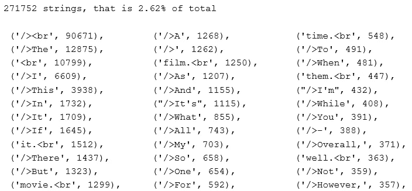*

*没有显示所有输出*

*如果我们滚动输出，除了 *< br >* 标签和少数 *< i >* 标签之外，没有多少 html 标签。*

*🍀*如果我们在分词时去掉标点符号，那么“/ > < br”和“< br”将变成“br ”,我们可以添加“br”来停止单词。**

***◼ ️How 经常出现的数字是多少？** 我们从 2.1.3 节的*中找到了一些数字的实例。短弦*。让我们通过下面的脚本来看看它们出现的频率:*

```
*summarise(r"\d", splits, freq_splits)*
```

*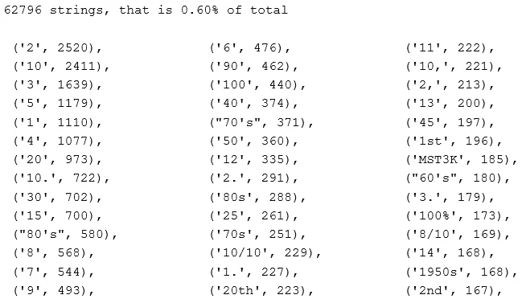*

*没有显示所有输出*

*包含数字的字符串很少出现。在电影评论的背景下，很难直观地理解数字是如何有用的。10/10 可能是积极情绪的标志，但我们能从 4、80 和 20 这样的数字中推断出什么呢？我们将在标记时丢弃数字。*

*根据项目的时间表，你可能没有足够的时间去尝试所有有趣的想法。在这种情况下，保留一份可以尝试的项目清单 ***是很方便的，你可以在有时间的时候尝试一下。我们将在该列表中添加以下任务:
1)保存数字并将其转换为文本
2)创建一个特征来指示评论是否包含数字****

***◼ ️How 常用的是连字符的单词吗？**
我们在*第 2.1.4 节*中检查长字符串时看到了连字符。让我们看看它们出现的频率:*

```
*summarise(r"\w+-+\w+", splits, freq_splits)*
```

*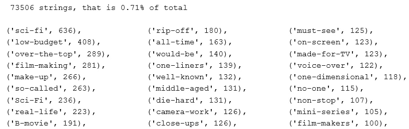*

*没有显示所有输出*

*大约不到 1%的字符串包含带连字符的单词。浏览用连字符连接的单词，将它们分开以保持数据简单更有意义。例如:我们应该将“camera-work”标记为 2 个标记:['camera '，' work']而不是 1 个标记:['camera-work']。我们可以在*列表中添加“保持连字符单词的原样”。**

***◼ ️How 常用的词是由其他标点符号组合而成的吗？** 很像上一个问题，我们在长串探索中看到了这些案例。让我们看看它们出现的频率:*

```
*summarise(r"\w+[_!&/)(<\|}{\[\]]\w+", splits, freq_splits)*
```

*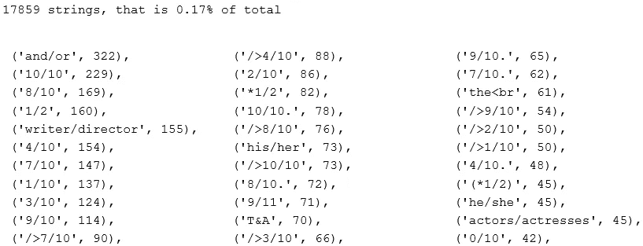*

*没有显示所有输出*

*不要太频繁，这些肯定是要分开的。*

***◼ ️How 频繁出现的都是绿林好汉的话吗？我们看到了像 NOOOOOOIIIISE！)，‘早先。让我们看看它们有多普遍:***

```
*def find_outlaw(word):
    """Find words that contain a same character 3+ times in a row."""
    is_outlaw = False
    for i, letter in enumerate(word):
        if i > 1:
            if word[i] == word[i-1] == word[i-2] and word[i].isalpha():
                is_outlaw = True
                break
    return is_outlawoutlaws = [s for s in splits if find_outlaw(s)]
print("{} strings, that is {:.2%} of total".format(len(outlaws), len(outlaws)/ len(splits)))
outlaw_freq = [(s, freq_splits[s]) for s in set(outlaws)]
outlaw_freq.sort(key=lambda x:x[1], reverse=True)
outlaw_freq*
```

*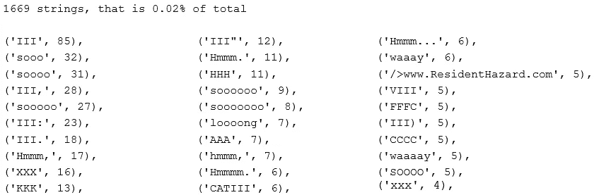*

*没有显示所有输出*

*这些不值得纠正，因为案例太少。*

*这是最后一个跟进问题！我们已经了解了一些数据。希望你感觉暖和了。💦你可能已经注意到，我们可以很容易地不断扩展我们的问题，不断探索？出于时间的考虑，我们将在这里停止这一部分，并尽量使接下来的部分尽可能简洁。否则，这篇文章会超过几个小时。💤*

## *📋 2.2.代币*

*让我们一口气回答这两个问题:*

*✏️2 . 2 . 1。有多少代币？
✏️ **2.2.2。有多少独特的代币？***

*我们必须先将数据符号化。回想一下之前的探索，似乎最好在标记时去掉标点和数字。记住这一点，让我们将文本标记为字母标记:*

```
*tokeniser = RegexpTokenizer("[A-Za-z]+")
tokens = tokeniser.tokenize(train_string)
print(tokens[:20], "\n")*
```

*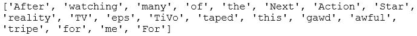*

*现在我们已经标记化了，我们可以回答前两个问题:*

```
*print(f"Number of tokens: {len(tokens)}")
print(f"Number of unique tokens: {len(set(tokens))}")*
```

*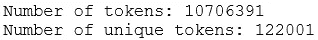*

*训练数据中有超过 1000 万个令牌，其中大约有 12.2 万个唯一令牌。目前，“手表”、“手表”和“观看”被视为不同的令牌。嗯，如果我们能把它们正常化为“手表”,并把它们算作一个唯一的令牌，那不是很好吗？如果我们进行标准化，唯一令牌的数量将会减少。让我们快速地做两件事:将所有的记号转换成小写，并对它们进行 lemmatise:*

```
*lemmatiser = WordNetLemmatizer()
tokens_norm = [lemmatiser.lemmatize(t.lower(), "v") for t in tokens]
print(f"Number of unique tokens: {len(set(tokens_norm))}")*
```

*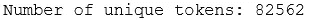*

*太好了，独特令牌的数量下降了约 30%。*

***📌练习:**如果你感兴趣并且有时间，不要像上面那样把两个步骤结合起来，试着分离出来，看看每个步骤中独特代币的数量是如何变化的。例如，您可以首先将记号转换成小写，并检查数字，然后使用 lemmatise 并再次检查数字。如果改变这两个操作的顺序，唯一令牌的最终数量是否不同于 82562？为什么会这样？*

*👂*嘶，我会在* [*下一篇*](/preprocessing-text-in-python-923828c4114f) *为模型预处理文本时，展示 lemmatise 的另一种方式。**

*✏️ **2.2.3。每个令牌的平均字符数是多少？***

*让我们找出平均令牌长度并检查其分布情况:*

```
*# Create list of token lengths for each token
token_length = [len(t) for t in tokens]# Average number of characters per token
print(f"Average number of characters per token: {round(np.mean(token_length),4)}")# Plot distribution
plt.figure(figsize=(12, 12))
sns.countplot(y=token_length)
plt.title("Counts of token length", size=20);*
```

*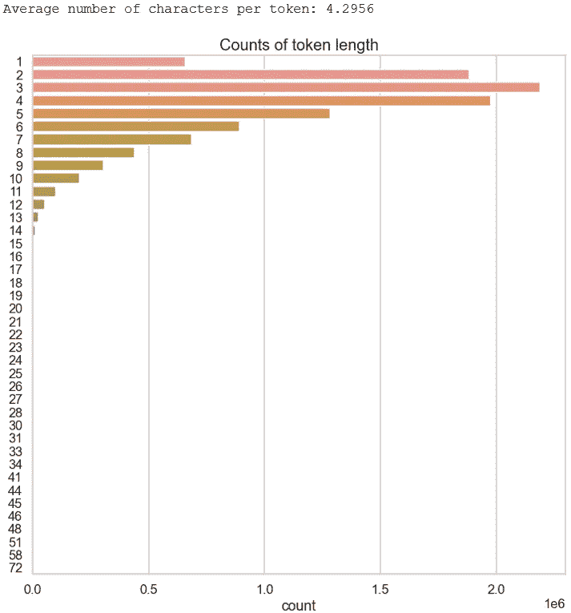*

*有几个令牌很长，但也很罕见。让我们来看看超过 10 个字符的确切数量:*

```
*pd.DataFrame(data=token_length, columns=['length']).query("length>10").value_counts()*
```

*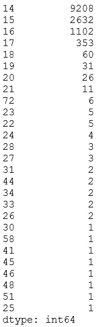*

*超过 17 个字符的长单词并不常见。让我们来看看其中的一些:*

```
*[t for t in tokens if len(t)>=20]*
```

*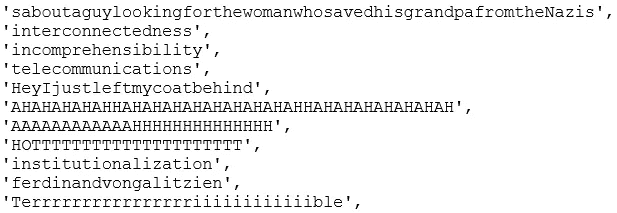*

*没有显示所有输出*

*有趣的是，有些是有效的长单词，而有些长是因为它们缺少空格或非法单词(即拉长)。*

*🍀*在预处理时，我们应该确保像这样非常罕见的记号被丢弃，这样它们就不会在将记号矢量化成矩阵时创建单独的列。**

## *📋 2.3.停止言语*

*✏️2 . 3 . 1。最常用的停用词是什么？*

*让我们首先检查所有停用词:*

```
*stop_words = stopwords.words("english")
print(f"There are {len(stop_words)} stopwords.\n")
print(stop_words)*
```

**

*在写这篇文章的时候，有 179 个停用词。停用词的清单将来还会增加。看起来我们可以扩展停用词来包含更多的停用词。事实上，我已经在 Github 上[提议](https://github.com/nltk/nltk/issues/2588)将下面的通用停用词添加到 *nltk* 的英文停用词列表中。我们还要确保在列表中添加一个自定义停用词“br”*:**

```
**stop_words.extend(["cannot", "could", "done", "let", "may" "mayn",  "might", "must", "need", "ought", "oughtn", "shall", "would", "br"])
print(f"There are {len(stop_words)} stopwords.\n")**
```

**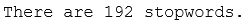**

**现在，让我们来看看最常见的停用词是什么:**

```
**freq_stopwords = [(sw, tokens_norm.count(sw)) for sw in stop_words]
freq_stopwords.sort(key=lambda x: x[1], reverse=True)
freq_stopwords[:10]**
```

**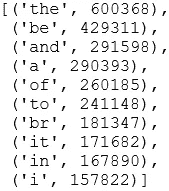**

**频率真的很高(咄，我的意思是它们是停用词，当然会频繁😈)，特别是对于‘be’和‘the’。找出停用词在标记中所占的比例不是很有趣吗？让我们快速检查一下:**

```
**n_stopwords = len([t for t in tokens_norm if t in stop_words])
print(f"{n_stopwords} tokens are stop words.")
print(f"That is {round(100*n_stopwords/len(tokens_norm),2)}%.")**
```

**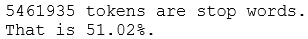**

**大约一半的标记是停用词。💭**

**✏️。还有哪些词经常出现，可以添加到停用词中？**

**我们很快会在查看常见令牌时回答这个问题。**

## **📋 2.4.常见 n 元语法**

**是时候找出常见的 n-gram 了。让我们一起回答这四个问题:**

**✏️**2 . 4 . 1–4。什么是最常见的令牌，二元，三元和四元？****

**首先，让我们删除停用词:**

```
**tokens_clean = [t for t in tokens_norm if t not in stop_words]
print(f"Number of tokens: {len(tokens_clean)}")**
```

**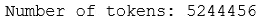**

**这是剩下的 49%的代币。现在，我们可以检查常见的记号(即，一元词)、二元词、三元词和四元词:**

```
**def preprocess_text(text):
    """Preprocess text into normalised tokens."""
    # Tokenise words into alphabetic tokens
    tokeniser = RegexpTokenizer(r'[A-Za-z]{2,}')
    tokens = tokeniser.tokenize(text)

    # Lowercase and lemmatise 
    lemmatiser = WordNetLemmatizer()
    lemmas = [lemmatiser.lemmatize(token.lower(), pos='v') for token in tokens]

    # Remove stopwords
    keywords= [lemma for lemma in lemmas if lemma not in stop_words]
    return keywordsdef get_frequent_ngram(corpus, ngram, n=20):
    """Find most common n n-grams tokens."""
    # Preprocess each document
    documents = [preprocess_text(document) for document in corpus]

    # Find ngrams per document
    n_grams = [list(ngrams(document, ngram)) for document in documents]

    # Find frequency of ngrams
    n_grams_flattened = [item for sublist in n_grams for item in sublist]
    freq_dist = FreqDist(n_grams_flattened)
    top_freq = freq_dist.most_common(n)
    return pd.DataFrame(top_freq, columns=["ngram", "count"])# Get frequent ngrams for all 4
for i in range(1,5):
    mapping = {1:"uni", 2:"bi", 3:"tri", 4:"four"}
    plt.figure(figsize=(12,10))
    sns.barplot(x="count", y="ngram", data=get_frequent_ngram(train['review'], i))
    plt.title(f"Most common {mapping[i]}grams");**
```

**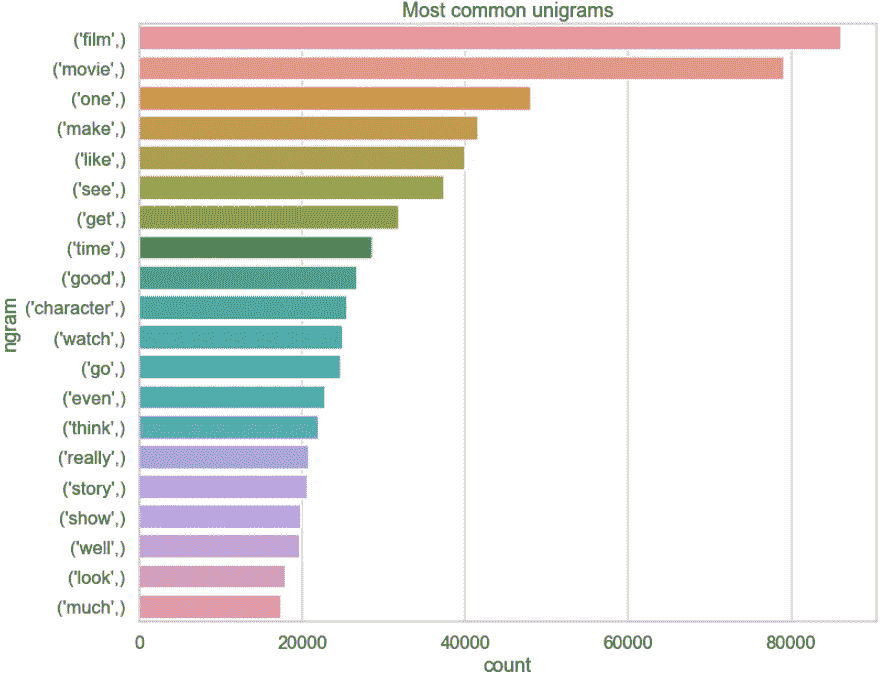****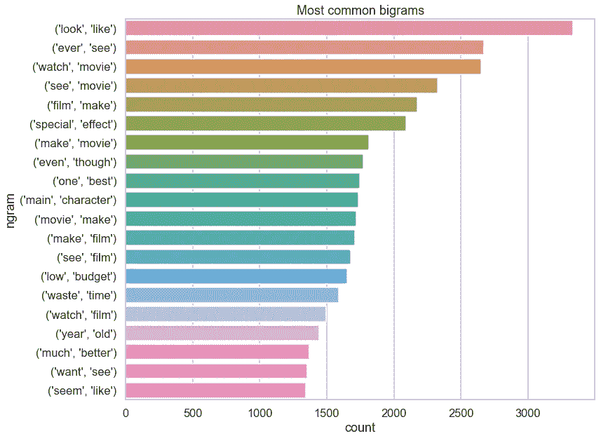****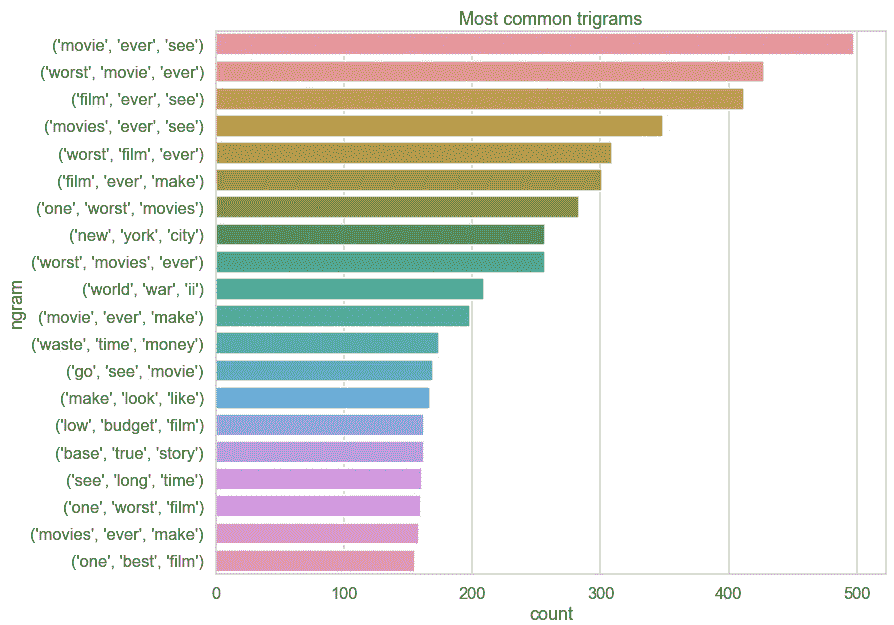****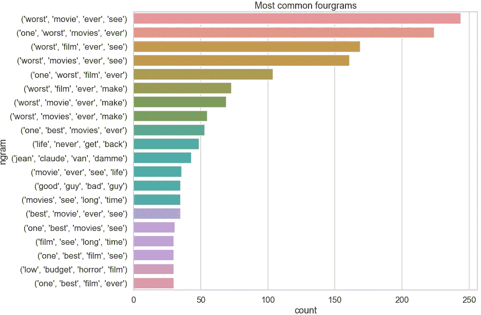**

**与其他常用词相比，单词“film”和“movie”看起来相当频繁。问题 2.3.2 的答案。就是潜在的加上‘电影’，和‘电影’来停止用词。有趣的是经常看到二元、三元和四元。随着 n 的增加，频率如预期的那样下降。二元模型可能是潜在有用的，但是三元模型和四元模型相对于标记频率来说不够频繁。**

## **📋 2.5.文档**

**让我们一起来回答这些问题:**

**✏️2 . 5 . 1。每个文档的平均句子数是多少？
**✏️ 2.5.2。每个文档的平均令牌数是多少？
✏️。每个文档的平均字符数是多少？
✏️。每个文档的平均停用词数量是多少？
✏️。这些问题的答案如何因情绪而异？****

**首先，我们必须准备数据:**

```
**# tokeniser = RegexpTokenizer("[A-Za-z]+")
train["n_sentences"] = train["review"].apply(sent_tokenize).apply(len)
train["tokens"] = train["review"].apply(tokeniser.tokenize)
train["n_tokens"] = train["tokens"].apply(len)
train["n_characters"] = train["review"].apply(len)
train["n_stopwords"] = train["tokens"].apply(lambda tokens: len([t for t in tokens if t in stop_words]))
train["p_stopwords"] = train["n_stopwords"]/train["n_tokens"]# Inspect head
columns = ['sentiment', 'n_sentences', 'n_tokens', 'n_characters', 'n_stopwords', 'p_stopwords']
train[columns].head()**
```

**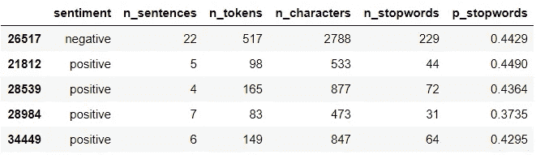**

**让我们检查感兴趣的变量的描述性统计数据:**

```
**train.describe()**
```

**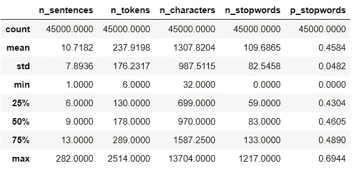**

**在这个表格中，我们有前四个问题的答案。现在，让我们看看它是否因情绪而不同。如果它们显著不同，我们可以使用变量作为模型的特征:**

```
**num_vars = train.select_dtypes(np.number).columns
train.groupby("sentiment")[num_vars].agg(["mean", "median"])**
```

**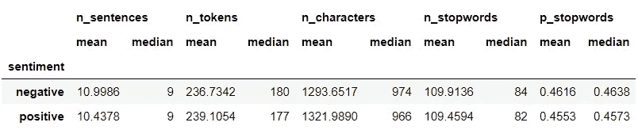**

**从集中趋势来看，情绪似乎没有实质性的不同。为了确保万无一失，我们来看看分布情况:**

```
**def plot_distribution(df, var, hue):
    """Plot overlayed histogram and density plot per sentiment."""
    fig, ax = plt.subplots(nrows=1, ncols=2, figsize=[16,4])

    # Histogram
    sns.histplot(data=df, x=var, hue=hue, bins=30, kde=False, ax=ax[0])
    ax[0].set_title(f"Histogram for {var}")

    # Density plot
    sns.kdeplot(data=df, x=var, hue=hue, shade=True, ax=ax[1])
    ax[1].set_title(f"Density plot for {var}");

# Plot for all numerical variables
for var in num_vars:
    plot_distribution(train, var, 'sentiment')**
```

**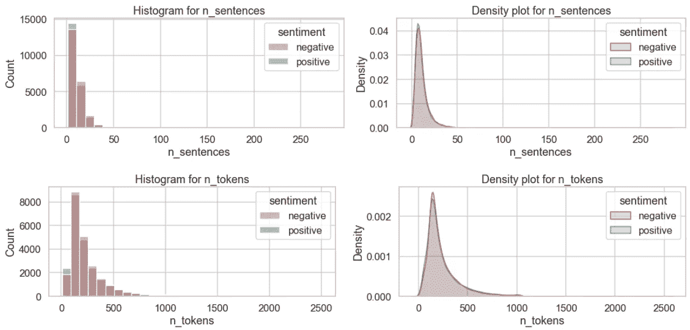****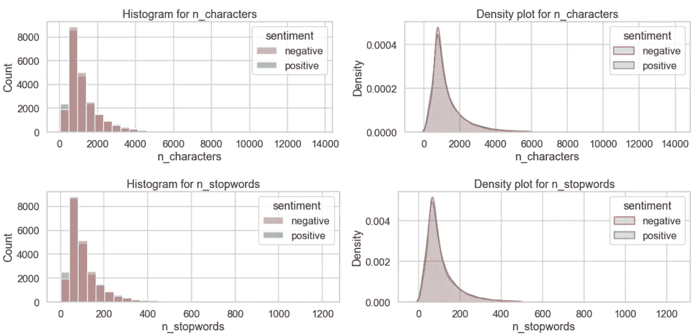****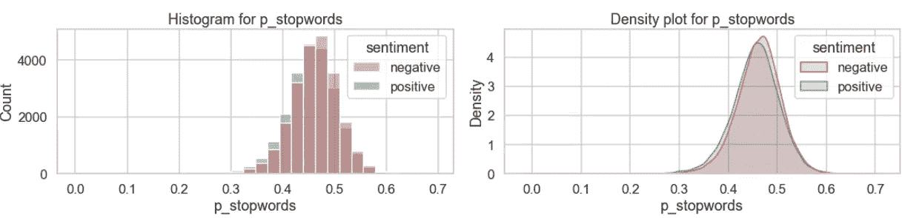**

**情感之间变量的分布似乎非常相似。它们不太可能作为有用的特性，但是我们总是可以尝试。也许我们可以把它添加到*一个值得尝试的项目列表中*？**

**在我们结束之前，让我们看看最后一件事——常用词是否因情感不同而不同。让我们为每种情绪准备数据:**

```
**pos_documents = [preprocess_text(document) for document in train.loc[train['sentiment']=='positive', 'review']]
pos_tokens = [item for sublist in pos_documents for item in sublist]
pos_freq = FreqDist(pos_tokens)
pos_common = [word for word, frequency in pos_freq.most_common(20)]
print(f"***** 20 frequent tokens in positive reviews: *****\n{pos_common}\n")neg_documents = [preprocess_text(document) for document in train.loc[train['sentiment']=='negative', 'review']]
neg_tokens = [item for sublist in neg_documents for item in sublist]
neg_freq = FreqDist(neg_tokens)
neg_common = [word for word, frequency in neg_freq.most_common(20)]
print(f"***** 20 frequent tokens in negative reviews: *****\n{neg_common}\n")common = set(neg_common).union(pos_common)
print(f"***** Their union: *****\n{common}\n")**
```

**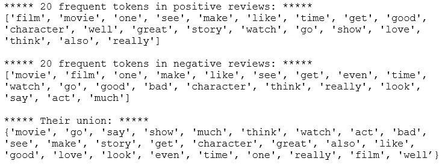**

**这两种情绪中最常见的三个符号是“电影”、“电影”和“一”。让我们看看它们的频率:**

```
**# Create a dataframe containing the common tokens and their frequency
common_freq = pd.DataFrame(index=common, columns=["neg", "pos"])
for token in common:
    common_freq.loc[token, "pos"] = pos_freq[token]
    common_freq.loc[token, "neg"] = neg_freq[token]
common_freq.sort_values(by="pos", inplace=True)# Add ranks and rank difference
common_freq['pos_rank'] = common_freq['pos'].rank()
common_freq['neg_rank'] = common_freq['neg'].rank()
common_freq['rank_diff'] = common_freq['neg_rank'] - common_freq['pos_rank']
common_freq.sort_values(by='rank_diff', inplace=True)
common_freq.head()**
```

**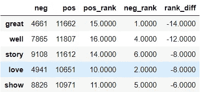**

**现在，是时候想象了:**

```
**fig, ax =plt.subplots(1, 2, figsize=(16, 10))
sns.barplot(x="pos", y=common_freq.index, data = common_freq, ax=ax[0])
sns.barplot(x="neg", y=common_freq.index, data = common_freq, ax=ax[1])
fig.suptitle('Top tokens and their frequency by sentiment');**
```

**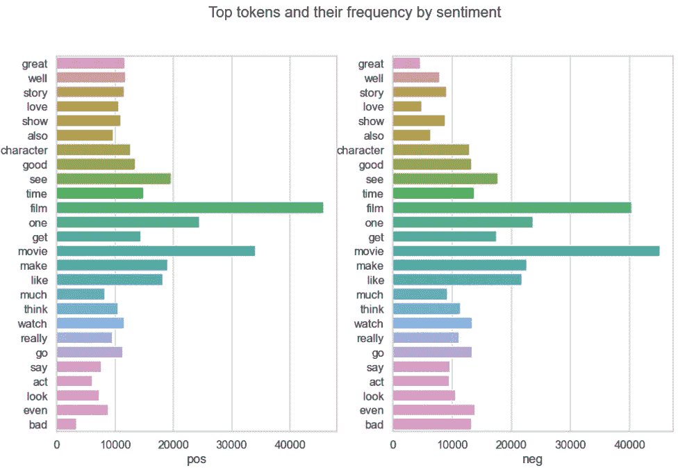**

**嗯，有趣的是，在正面评论中,“film”比“movie”出现得更频繁。在负面评论中，它被翻转了。也许它们不应该被添加到停用词中，尽管它们出现的频率很高。我们再来看一下图表，但是排除这两个常用词:**

```
**rest = common_freq.index.drop(['film', 'movie'])
fig, ax =plt.subplots(1, 2, figsize=(16, 10))
sns.barplot(x="pos", y=rest, data = common_freq.loc[rest], ax=ax[0])
sns.barplot(x="neg", y=rest, data = common_freq.loc[rest], ax=ax[1])
fig.suptitle('Top tokens and their frequency by sentiment');**
```

**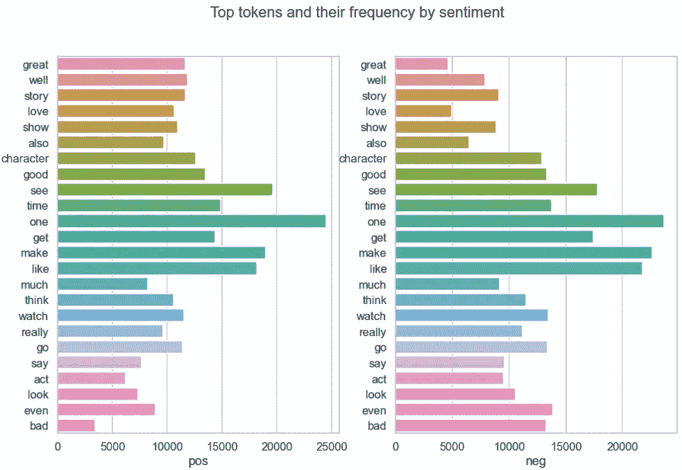**

**很直观地看到，单词“棒”、“好”和“爱”在正面评价中更频繁出现，而“甚至”和“不好”在负面评价中更频繁出现。**

**还有很多东西要探索，但是是时候总结了！🕛**

# **3.结束语💭**

**干得好，你走了这么远！😎让我们总结一下要点:
◼️在标记时删除标点和数字
◼️规范化文本(小写、字母等)
◼️用“br”和其他缺失的辅助动词丰富停用词
◼️删除罕见词**

**一个不错的尝试列表:
◼️将英式拼写转换为美式拼写(反之亦然)
◼️保留数字并将其转换为单词
◼️在标记时保留连字符
◼️包含二元模型
◼️添加数字特征，如句子、标记、字符和停用词的数量**

****

**图片由 [Andreas Chu](https://unsplash.com/@andreaschu?utm_source=medium&utm_medium=referral) 在 [Unsplash](https://unsplash.com?utm_source=medium&utm_medium=referral) 上拍摄**

***您想要访问更多这样的内容吗？媒体会员可以无限制地访问媒体上的任何文章。如果您使用* [*我的推荐链接*](https://zluvsand.medium.com/membership)*成为会员，您的一部分会费将直接用于支持我。***

**谢谢你看我的帖子。探索性数据分析是一项开放式的主观任务。您可能已经注意到，在探索和预处理时，我们不得不做出许多小的选择。我希望这篇文章能让你体会到如何构建分析，并展示一些你可以在这个过程中思考的问题。做了一些探索性分析后，我们离构建模型更近了一步。在下一篇文章中，我们将为模型准备数据。以下是该系列另外两篇帖子的链接:◼️ [用 Python 预处理文本](/preprocessing-text-in-python-923828c4114f)
◼️ [用 Python 进行情感分类](/sentiment-classification-in-python-da31833da01b)**

**以下是我的其他 NLP 相关帖子的链接:
◼️[Python 中的简单 word cloud](/simple-wordcloud-in-python-2ae54a9f58e5)
*(下面列出了一系列关于 NLP 介绍的帖子)*
◼️ [第一部分:Python 中的预处理文本](/introduction-to-nlp-part-1-preprocessing-text-in-python-8f007d44ca96)
◼️ [第二部分:词条满足和词干的区别](https://medium.com/@zluvsand/introduction-to-nlp-part-2-difference-between-lemmatisation-and-stemming-3789be1c55bc)
◼️ [第三部分:TF-IDF 解释](https://medium.com/@zluvsand/introduction-to-nlp-part-3-tf-idf-explained-cedb1fc1f7dc)
◼️ [第四部分:python 中的监督文本分类模型](https://medium.com/@zluvsand/introduction-to-nlp-part-4-supervised-text-classification-model-in-python-96e9709b4267)**

**再见🏃💨**