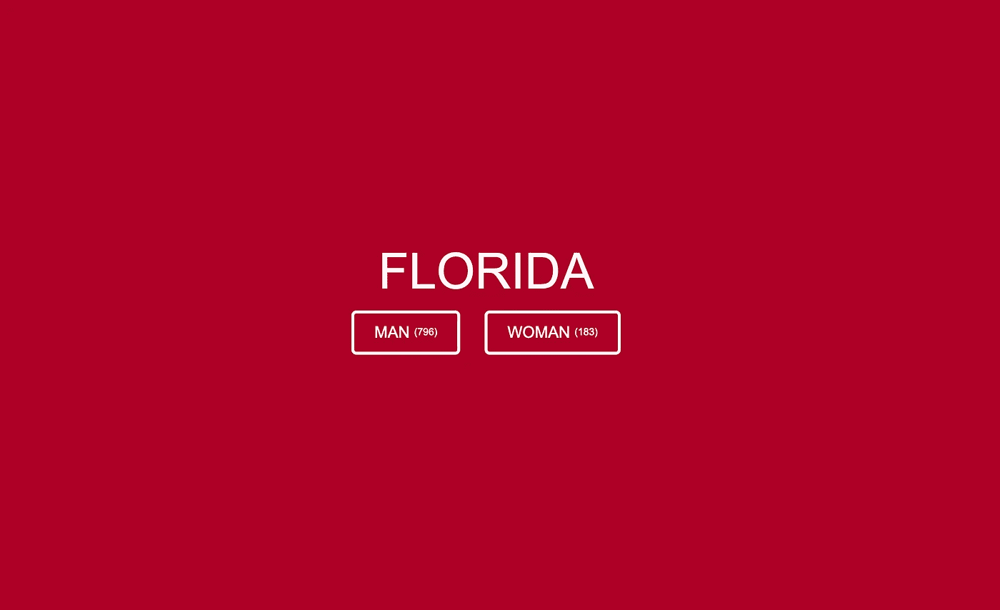
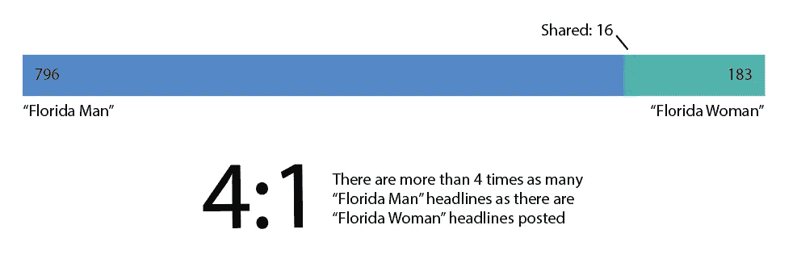
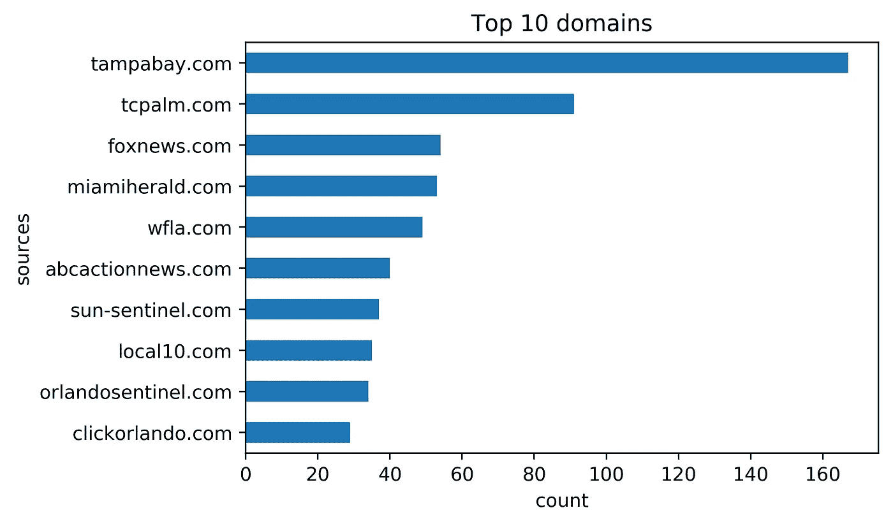
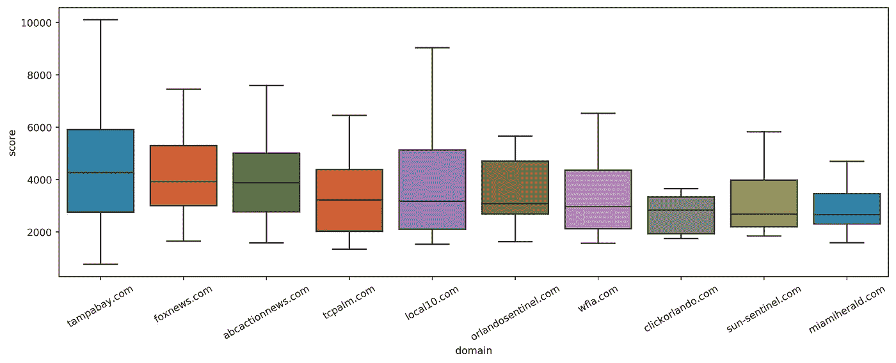
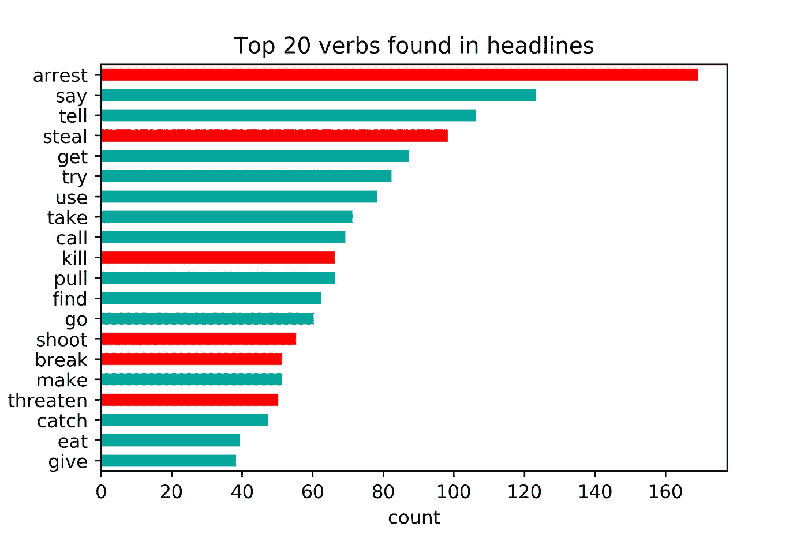
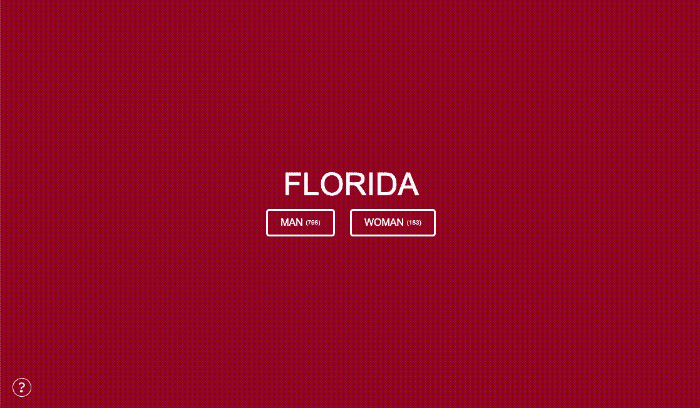

# 探索最受欢迎的“佛罗里达人”标题的数据库

> 原文：<https://towardsdatascience.com/explore-a-database-of-the-most-popular-florida-man-headlines-cec6f62c8360?source=collection_archive---------45----------------------->

## 这个网络应用程序使用了有史以来排名最高的佛罗里达人 subreddit 帖子的解析标题。

近十年来，“佛罗里达人”一直是互联网文化中的主流反英雄。像“佛罗里达人太胖进不了监狱”和“佛罗里达人偷恐龙骨头”这样的标题很容易成为迷因化的素材。2013 年初，“佛罗里达人”在 Twitter 上被封为圣人，有 [@_FloridaMan](https://twitter.com/_floridaman) ，在 Reddit 上被封为圣人，有 [r/FloridaMan subreddit](https://www.reddit.com/r/floridaman) 。经过七年的转发和投票，我们可以收集最受欢迎的标题，看看是什么让“佛罗里达人”标题成功。

下面是这些标题背后的数字的简要概述，[这里是一个网络应用的链接](http://www.kmcelwee.com/florida)，在那里你可以自己浏览文章。

快速提醒一下:**“佛罗里达人”的标题经常包含成人内容。**

# 数据分析

## 按性别

“佛罗里达男人”标题的数量是“佛罗里达女人”标题的四倍多，尽管考虑到数据来自“佛罗里达男人”子网站，这并不令人惊讶。

## 通过出版物

《坦帕湾时报》(以下显示为 tampabay.com)遥遥领先，是佛罗里达州男人材料的最大生产商，至少这些材料通常在网上排名很好，但在收集的数据中，他们的故事有一些得分最高和最低的网址。

在前 10 名中，福克斯新闻频道是唯一一家全国性的媒体([abcactionnews.com](https://www.abcactionnews.com/)是坦帕湾地区特有的)，他们主要在他们的“美国”办公桌下提交文章。

按出版物的 Reddit 评分(剔除异常值)

正如上面的方框图所示，redditors 对新闻机构的评价没有太大的差异。

## 按内容

佛罗里达州的“阳光法律”允许公众接触政府材料，包括逮捕记录。当看下面的动词分布时，这些定律对“佛罗里达人”现象的影响就很明显了。像“逮捕”、“偷窃”和“开枪”这样的动词很常见。

用红色突出显示的许多顶级动词显示了佛罗里达人的标题如何在很大程度上与警方记录中可能找到的项目相关。佛罗里达州的“阳光法律”允许公众查阅警方记录。

# WEB 应用程序

这里有一个链接指向我的标题浏览器。这个平台可以让你轻松地筛选数据库。您可以按字母顺序或频率排序。

# 方法学

## Reddit API

数据是用 Reddit 的 API 提取的。使用 Reddit 的`praw` Python 库相对简单，很容易收集 URL。以下几行代码是必需的:

完整的代码可以在[这个笔记本](https://github.com/kmcelwee/florida/blob/main/00_pull_data.ipynb)里找到。API 提供的每个页面对象包含 100 篇文章，不幸的是，reddit 只提供前 1000 篇 Reddit 提交的文章，所以我们的数据库无法扩展到整个 subreddit。(欢迎对如何获取更多数据提出建议！)

## 为什么是 Reddit？

与 Twitter 相比，Reddit 的数据更容易解析。Twitter 上主要的“佛罗里达人”包括图片和评论，而 Reddit 上的帖子通常只是一个带有标题的 URL。此外，“佛罗里达人”subreddit 有 64 万名粉丝，Twitter 账户有 41.2 万名粉丝，因此它们为一篇文章的受欢迎程度提供了类似的指标。

## 用 NLTK 解析标题

我使用 NLTK(自然语言工具包)解析标题，这是一个 python 库，可以解析句子并给出词性。为了使分析和 web 应用程序的动词标准化，我们还可以使用`WordNetLemmatizer`函数将所有动词转换为一种时态(例如，“give”、“give”、“giving”都将被压缩为“give”)。

下面的函数帮助我正确地整理了标题中的动词，尽管需要一些手工输入和清理。

## 清理数据

Reddit 特定的帖子被删除，一些帖子(如漫画或大头照)不利于网络应用的格式，并被删除。基本的清理和动词解析都记录在[这本笔记本](https://github.com/kmcelwee/florida/blob/main/01_recognize%20verbs.ipynb)里。虽然许多标题都经过了人工复查，但肯定仍然存在重复和错误。

## 数据和笔记本

如果您对查看脚本或数据感兴趣，可以在[此链接](https://github.com/kmcelwee/florida)获得，完整的清理数据集可在[此处](https://raw.githubusercontent.com/kmcelwee/florida/main/clean.json)获得。

*疑问？更正？联系我或者在* [*我的网站*](http://www.kmcelwee.com) *上查看更多项目。*