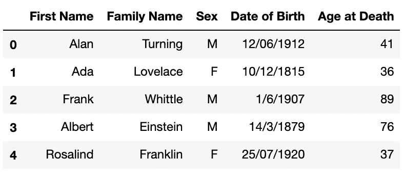
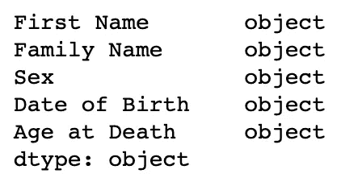
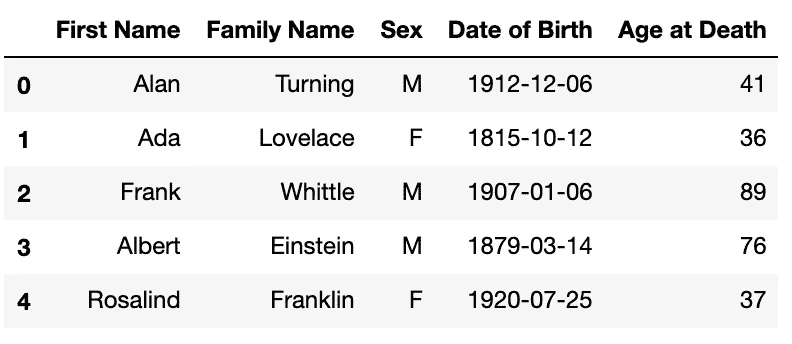
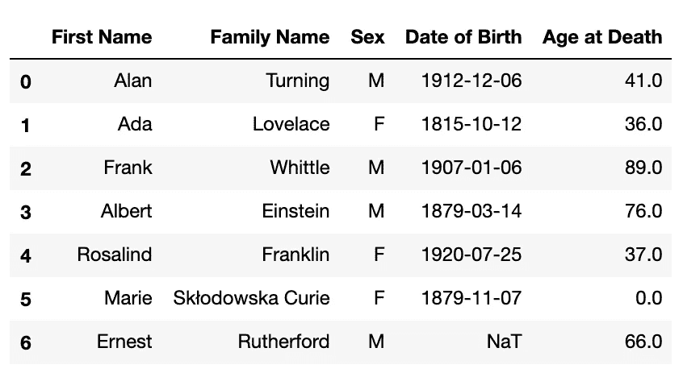
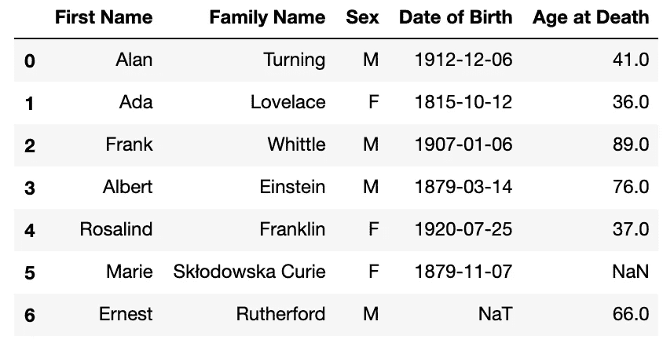
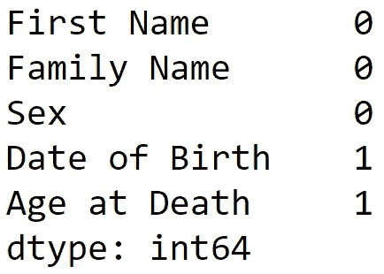
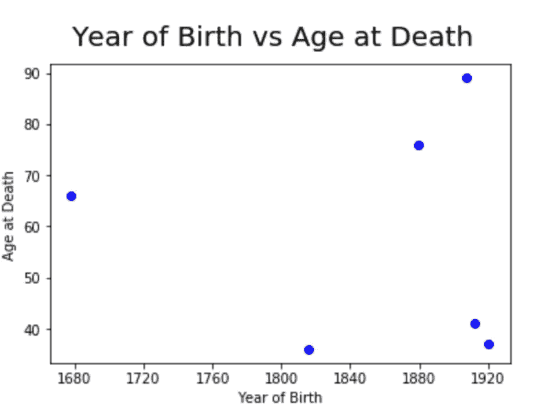

# 探索和清理:任何数据项目的第一步。

> 原文：<https://towardsdatascience.com/explore-and-clean-first-steps-of-any-data-project-976a1d80d7aa?source=collection_archive---------24----------------------->

## 在您开始使用“有趣”和“令人兴奋”的算法和方法之前，这里是在您的数据项目中取得成功的第一步。

人们很容易如此热衷于从数据中获得一些东西，以至于直接跳到编写预测算法或其他形式的机器学习/人工智能，以进行尝试。可能和大多数人一样，我也掉进了那个陷阱，对自己发育不良的进步感到失望。

在本文中，我想强调在开始“有趣”的东西之前了解您的数据的价值，并用一些具体的例子来说明如何使用一个简单的数据集来做到这一点。我是一个 Python 用户，所以我的代码示例会提到这一点，但是方法的理论将适用于跨语言。

## 浏览和清理您的数据

当您考虑您的数据时，在开始清理之前，探索您的数据，找出那里有什么以及哪些部分需要注意似乎是合乎逻辑的。毕竟，如果你不知道乱七八糟的是什么，你怎么能收拾干净呢？我*有点*同意这一点，但我认为这是一个迭代过程。对于格式错误的数据，您可能无法探索和找到您需要的信息。所以，我倾向于在探索和清理之间做一些来回。

我坚信“一张图胜过千言万语”这句话背后的含义，在数据世界中，这意味着将你拥有的数据可视化。在某些情况下，您可能无法可视化数据，因为它可能是错误的格式(您的数字是字符串类型而不是浮点数)，或者您的时间被收集并分布在 4 列(小时、分钟、秒、毫秒)，这对于数字数据尤其重要。

**出于这个原因，我喜欢探索我的数据，然后解决我看到的问题。**

在这一点上我认为值得考虑的问题是:

*干净的数据意味着什么？我相信什么是干净的数据在很大程度上取决于你手头的任务，包括你的数据项目的应用和你想用这些数据做什么。但是，一般来说，它需要符合逻辑:数字应该是数字，日期应该是日期等等。下面我会详细解释我的意思。*

将数据导入数据框后，我建议的第一件事就是检查您拥有的数据是否符合您的预期。为此，我使用`df.head`检查前五行(其中 df =您的数据帧)。



示例数据帧

在这里，您可以看到有 5 列，其中一些是单词或字符串，一个日期字段和一个整数。所有这些看起来和我对列名的期望差不多。

然而，我们看到的可能不是计算机看到的，所以检查当前的类型很重要:`df.dtypes`将为您完成这项工作。对于上述数据帧，我们得到以下输出:



显示数据帧中存在的类型的输出函数

正如您在这里看到的，输出告诉我不同的列名，以及其中包含的数据类型。这是单独打印数据帧所不能做到的。从表中，没有办法知道这些值是字符串、浮点数还是其他。这是很重要的信息，甚至对于最初创建简单的图来说也是如此——你不能用字符串创建散点图！—但是当您进一步深入时，您可能会使用需要数字数据而不是字符串的随机森林回归。

您可能想知道为什么所有的列都被分配了“对象”类型。这就是[文档](https://pandas.pydata.org/pandas-docs/stable/reference/api/pandas.DataFrame.dtypes.html)派上用场的地方。字符串被赋予对象类型，因此 Name 列和 Sex 列都是这样。然而，这不足以解释出生日期或死亡年龄栏。Pandas 还会将对象类型分配给包含混合数据的列，因此对于提到的两列，我们不知道其中的部分或全部数据是字符串还是其他数据。*出生日期列具有字符串或混合数据类型的暗示是日期没有以统一的方式显示。*

一般来说，如果我们在数据帧中看到人类认为是数字或日期的项目，那也是我们希望计算机看到的。在这里，我建议使用以下代码将出生日期列转换为日期，将死亡年龄列转换为整数(其中 pd 是 pandas 库):

```
df['Age at Death'] = df['Age at Death'].astype(int)
df['Date of Birth'] = pd.to_datetime(df['Date of Birth'])
```

当我再次展示数据帧时，它看起来像这样:



列重新格式化后的数据帧

所有列看起来都一样，除了出生日期列，该列已被重新格式化，因此日期是统一的。这可能不是你想要的格式，所以你可以看看[文档](https://pandas.pydata.org/pandas-docs/stable/reference/api/pandas.to_datetime.html)来了解更多关于改变的细节。

但是，当我们查看每列中的数据类型时，您会看到我们转换的两种类型如下所示:


重新格式化后数据帧中存在的类型

如果你有一个简单的数据集，探索可能看起来有点费力，但我仍然认为这是一个重要的经历；这不仅是因为当你拥有复杂的数据集时，它会帮你做好准备，还因为花时间去探索可以让你看到很多你在原始数据甚至表格中看不到的东西。

让我们再举一个例子:有时当你获取数据时，你可能会得到一个文件，里面有很多零，表示单元格中没有任何内容。从这个角度来看，只要你的团队有这样的理解，那就很好。然而，你的计算机无法理解:对计算机来说，零是一个数字，因此在单元格中存在某种东西。我们需要告诉计算机这个单元格是空的。让我们向我们一直使用的数据帧添加几行:



具有两个附加行的数据帧

在上面的示例中，我们可以看到数据帧中缺少欧内斯特·卢瑟福的出生日期，这一点在 NaT 或 Not a Time(时间的空值示例)中很明显。然而，如果不仔细看死亡年龄一栏，你可能会漏掉玛丽·斯科多瓦斯卡·居里的年龄为零。对于一个大的数据帧，这两个例子都可能会被遗漏，所以简明扼要地获得数据帧的数字方面的信息是很重要的，这样你就能看到，为此我使用了`df.describe():`


描述函数的输出

因为我们仅有的数字列是“死亡年龄”列，所以我们预计会在输出中看到一列，如果您有一个包含多个数字列的数据帧，每个数字列的显示方式都是相似的。我们可以清楚地看到最小值是零，我们可以用我们人类的智慧意识到这里有问题。在这种情况下，可能会出现这样的情况，无论您的数据来自何处，都用零替换该值，以表明没有我们的数据。然而，在 Python 中，我们需要将它显示为 NaN 或 null，所以单元格中实际上什么也没有。这里您可以使用`df.replace(0, np.NaN)`(其中 np 是 numpy 库)给出以下内容:



正如您所看到的，当您单独看数据帧时，数据表示的变化似乎很小，但是深入研究类型，您会看到很大的差异。

要检查数据帧中的空值，您也可以使用`df.isna().count()`，它给出以下输出:



每列中出现的 Na 值的数量

上述方法是一种快速而清晰的方法，可以确定数据帧中丢失了多少数据。同样，对于这个例子来说，这似乎有点多余，但是当您开始处理数百列和数千行时，您会喜欢这种方法(甚至可能在这之前！)

一般来说，当我有数字数据时，我喜欢在完成初始清理后绘制它。我这样做是我探索的一部分:我能看到一个明显的趋势吗？是否有可能扭曲我的数据的明显异常或错误？我发现它帮助我看到实际存在的东西，而不是我在数据帧的片段中看到的东西。

我喜欢更清楚地看到我的数据，例如如下所示:

```
fig, ax = plt.subplots()x = df['Date of Birth']
y = df['Age at Death']
plt.plot(x, y, 'bo')
fig.suptitle('Year of Birth vs Age at Death', fontsize=20)
xlabel = 'Year of Birth'
ylabel = 'Age at Death'
ax.set_xlabel(xlabel, fontsize=10)
ax.set_ylabel(ylabel, fontsize='medium')
```



图解可能的可视化选项

您可能会注意到，虽然数据帧中有七行数据，但图上只有六个数据点。玛丽·斯科多瓦斯卡·居里的数值没有标绘出来，因为她死时的年龄是 15 岁。这是一件好事，如果我们用零值标绘它并继续分析，它可能导致误导的结果。

然而，Python 有点困惑，因为它显示了大约 1680 年欧内斯特·卢瑟福的数据点。似乎是由于 NaT 的出现而不是他的出生日期，Python 选择了最早的可能日期并绘制了死亡年龄数据点。这是需要注意的事情！通过一点点进一步的操作，您可以确保它也被排除，方法是从数据帧中没有空值的行中选择要绘制的图形的 x 值和 y 值，只需添加少量的`df.dropna()`:

```
fig, ax = plt.subplots()df2 = df.dropna()
x = df2['Date of Birth']
y = df2['Age at Death']
plt.plot(x, y, 'bo')
fig.suptitle('Year of Birth vs Age at Death', fontsize=20)
xlabel = 'Year of Birth'
ylabel = 'Age at Death'
ax.set_xlabel(xlabel, fontsize=10)
ax.set_ylabel(ylabel, fontsize='medium')
```


从绘图中移除空值后绘制图表

如果我试图在清理之前绘制数据，Python 会因为不正确的数据类型而抛出一个错误。大多数绘图函数需要整数、浮点数或日期，除非它们是正确的类型，否则看不到我们看到的数字。如果没有人工检查和删除空值行的操作，我们会得到一个误导性的图形，尽管没有抛出任何错误。

**遗言**

我还可以对数字数据做更多的处理，如果我想把它变成整数格式的话，也许我想得到男性和女性的平均死亡年龄，这样我就可以比较了？我可能想将性别列改为二进制类型，因为这可以为分析提供更多的机会。

自然，随着数据集越来越复杂，可能性变得越来越令人兴奋。

这是我教给任何新程序员的一个过程，作为他们使用数据的第一步。我自己在我的博士学位中使用的每一个新的数据集上使用它，当我只是在新的数据集上玩的时候。当然，这些数据集比我在本文中展示的例子更复杂，但原理是相同的。