# 使用定制的交互式 web 应用程序探索任何数据:体育数据科学

> 原文：<https://towardsdatascience.com/explore-any-data-with-a-custom-interactive-web-app-data-science-with-sports-410644ac742?source=collection_archive---------14----------------------->

## 了解如何使用领先的数据可视化工具 Plotly 和 Streamlit(包括数据和代码)构建一个交互式、可重用的 web 应用程序来进行探索性数据分析

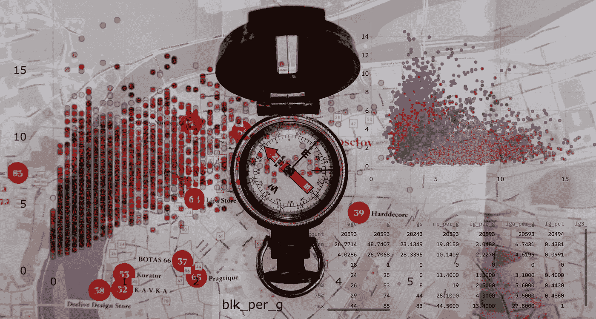

丹尼斯·简斯在 [Unsplash](https://unsplash.com/s/photos/navigate?utm_source=unsplash&utm_medium=referral&utm_content=creditCopyText) 拍摄的背景照片

大多数好的数据项目都是从分析师做一些事情来感受他们正在处理的数据开始的。

他们可能会拼凑一个 Jupyter 笔记本来查看数据摘要、前几行数据和 matplotlib 图表。有些人可能会把数据当作 Excel 表格来浏览，摆弄数据透视表。真正拥有数据的人可能更喜欢直接盯着原始数据表。

这些都不是理想的解决方案。其中一些解决方案可能只适合我们当中的受虐狂。那么一个人要做什么呢？

对我来说，我更喜欢建立一个数据探索的 web 应用程序。

有一些关于切片，分组，过滤的能力，最重要的是——*见*数据，这有助于我理解它，并帮助我制定问题和假设，我希望在回答。

它让我能够*直观地与数据*互动。

这些天来，我首选的工具包是 [Plotly](https://github.com/plotly/plotly.py) 和 [Streamlit](https://github.com/streamlit/streamlit) 。在过去的一段时间里，我已经写了足够多关于 Plotly 的东西——我认为它是 Python 最好的数据可视化包。但是 Streamlit 确实改变了我的工作方式。因为它非常简洁，当我修补时，几乎不需要额外的努力就可以将我在 python 脚本中的情节和评论转换成具有交互性的 web 应用程序。(仅供参考—我在这里写了 Dash 和 Streamlit 的[对比](/plotly-dash-vs-streamlit-which-is-the-best-library-for-building-data-dashboard-web-apps-97d7c98b938c?source=friends_link&sk=c1079b8583a9b1fad160100cedb80777)

> 我更喜欢构建一个用于数据探索的 web 应用程序

因此，在本文中，我想分享一个简单的例子，用这些工具构建一个数据探索应用程序。

现在，对于一个数据项目，我们需要数据，这里我将使用 NBA 的数据。学习编程可能是枯燥的，所以使用一些相关的东西，如体育数据，有助于我保持专注；希望对你也一样。

(如果你不关注 NBA 也没关系，因为重点是数据科学和编程！)

# 在开始之前

接下来，安装几个包— `plotly`、`streamlit`和`pandas`。用一个简单的`pip install [PACKAGE_NAME]`安装每一个(在您的虚拟环境中)。

这篇文章的代码在我的 [GitHub repo here](https://github.com/databyjp/learndata_nba) 上，所以你可以下载/复制/叉走你喜欢的内容。

这个脚本叫做`data_explorer_app.py`——所以你可以在 shell 中运行它:

```
streamlit run data_explorer_app.py
```

哦，这是我计划写的关于使用 NBA 数据的一系列数据科学/数据分析文章中的第一篇。所有的钱都会去回购，所以你要睁大眼睛！

如果您正在跟进，请使用以下内容导入密钥库:

```
import pandas as pd
import plotly.express as px
import streamlit as st
```

我们准备好出发了。

# 数据深潜

## 流线化

我们在这里使用 Streamlit，因为它旨在帮助我们快速构建数据应用程序。因此，我们要建立的是一个 Streamlit 应用程序，然后将在本地运行。(要了解更多信息，您可以点击这里查看我的 [Dash v Streamlit 文章](/plotly-dash-vs-streamlit-which-is-the-best-library-for-building-data-dashboard-web-apps-97d7c98b938c?source=friends_link&sk=c1079b8583a9b1fad160100cedb80777)。)

如果您从未使用过 Streamlit，这就是您构建基本应用程序所需的全部内容:

```
import streamlit as st
st.write("Hello, world!")
```

将其保存为`app.py`，然后用 shell 命令`streamlit run app.py`执行:

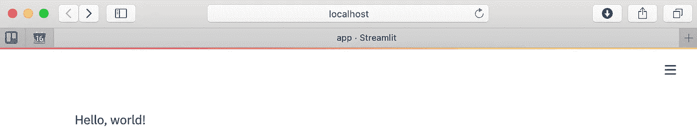

看，妈妈，这是一个网络应用程序！

你就有了一个正常运行的 web 应用程序！构建一个 streamlit 应用程序就是这么简单。然而，更令人惊讶的是，构建一个有用的应用程序并不难。

哦，顺便说一句，你不需要每次改变脚本时都停止并重启服务器。每当更新底层脚本文件时，您都会看到右上角弹出一个按钮，如下所示:

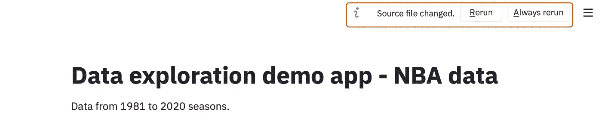

寻找此提示以刷新应用程序

只要保持脚本运行，并在每次想要查看最新版本时点击这里的重新运行。

准备好了吗？好了，我们走吧！

## 原始数据探索

我最初想做的是查看整个原始数据集。第一步，我们从 CSV 文件加载数据:

```
df = pd.read_csv("data/player_per_game.csv", index_col=0).reset_index(drop=True)
```

一旦加载了数据，只需输入`st.write(df)`就可以创建整个数据框架的动态交互式表格。

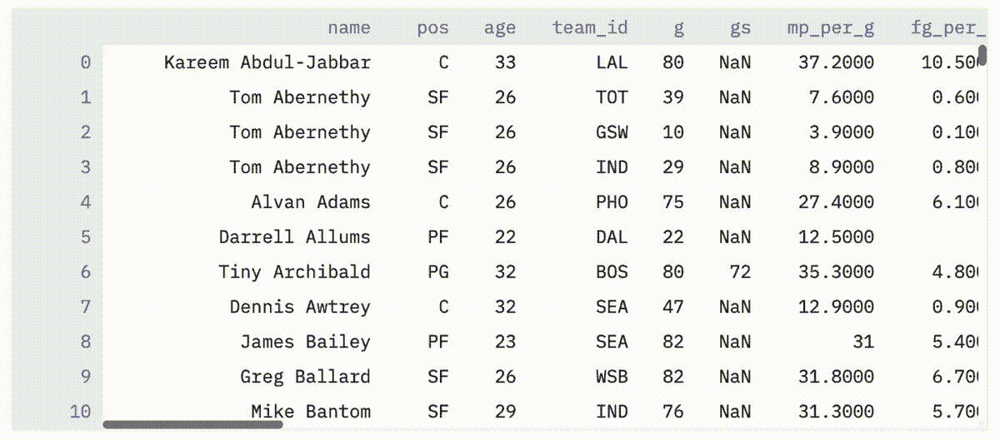

以交互式表格的形式浏览整个数据集

并且可以用`st.write(df.describe())`类似地绘制列的各种统计数据。

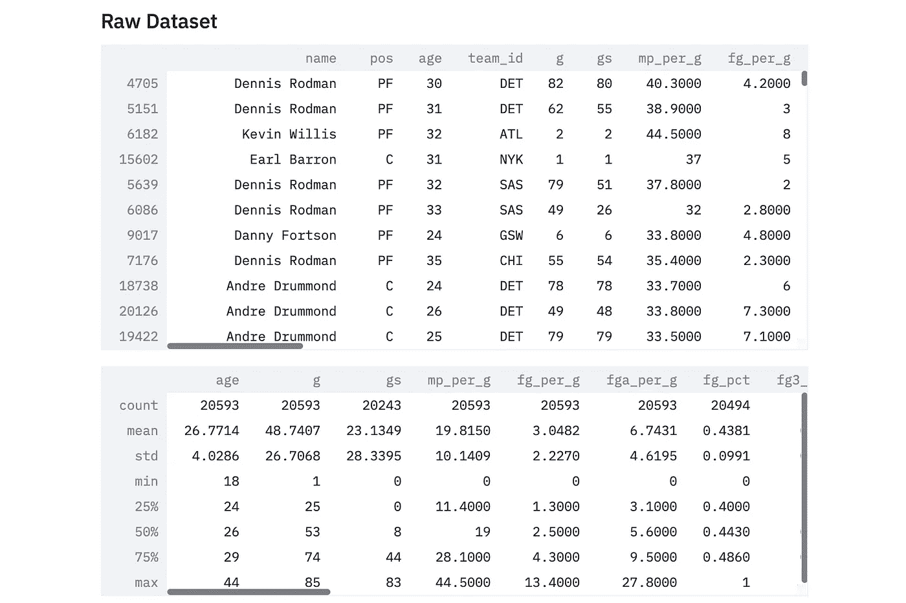

两行代码中的两个动态表

我知道你可以在 Jupyter 笔记本上绘制一个表格，但是区别在于交互性。首先，用 Streamlit 呈现的表可以按列排序。正如您稍后将看到的，您可以将过滤器和其他动态元素整合到笔记本电脑中，这是真正的力量所在。

现在我们准备开始添加一些图表到我们的应用程序。

## 分布可视化

单个变量的统计可视化非常有用，在某种程度上，我认为它是一个不可或缺的工具，不仅仅是查看原始数据。

我们将从一个变量的可视化数据开始分析，使用交互式直方图。直方图可以用 Plotly 来构造，如下所示:

```
hist_fig = px.histogram(df, x=hist_x, nbins=hist_bins)
```

传统上，我们必须手动调整`x`和`nbins`变量，看看会发生什么，或者从这些变量的各种排列中创建一个巨大的直方图墙。相反，让我们看看如何将它们作为输入来交互式地研究数据。

直方图将分析熊猫数据帧中一列的数据。让我们通过调用`st.selectbox()`模块将其呈现为下拉框。我们可以获取一个列的列表作为`df.columns`，另外我们提供了一个默认的选择，使用`df.columns.get_loc()`方法得到列号。综合起来，我们得到:

```
hist_x = st.selectbox("Histogram variable", options=df.columns, index=df.columns.get_loc("mp_per_g"))
```

然后，可以使用`st.slider()`模块调用滑块，让用户选择直方图中的条块数量。该模块可以定制一个最小/最大/默认和增量参数，如下所示。

```
hist_bins = st.slider(label="Histogram bins", min_value=5, max_value=50, value=25, step=1)
```

然后，可以将这些参数组合在一起，得出下图:

```
hist_fig = px.histogram(df, x=hist_x, nbins=hist_bins, title="Histogram of " + hist_x,
                        template="plotly_white")
st.write(hist_fig)
```

将它与一个小标题`st.header(“Histogram”)`放在一起，我们得到:

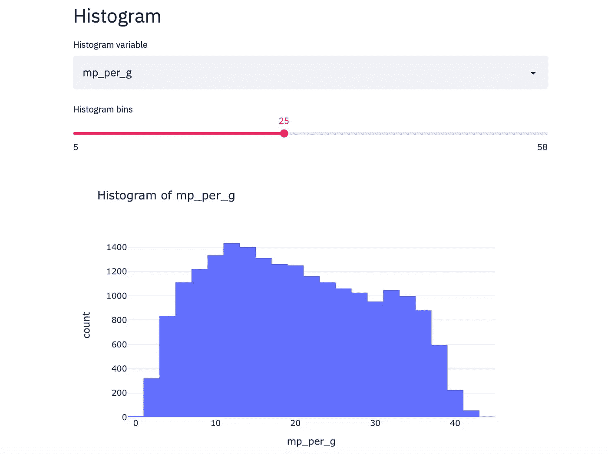

应用程序的直方图部分

我建议在这里花点时间研究一下这些数据。例如，看看不同的数据，比如场均篮板数:

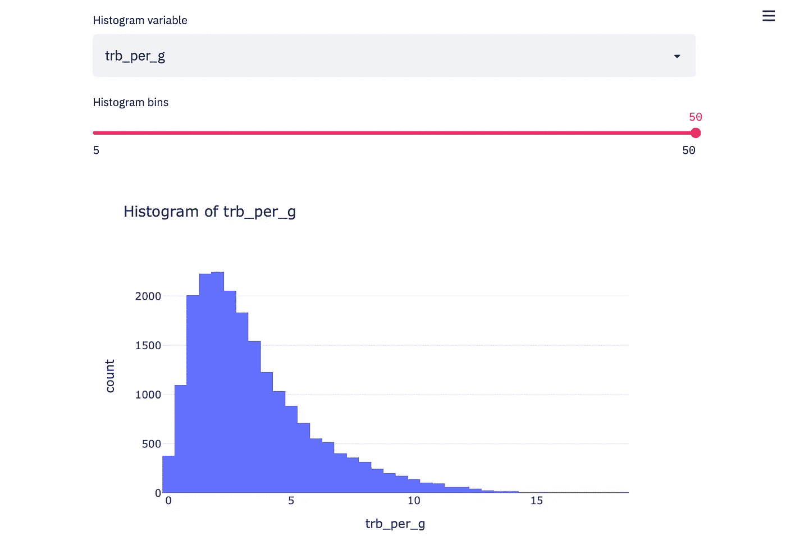

场均篮板直方图

或职位:


位置直方图

交互性使得对数据的更容易、动态、主动的探索成为可能。

您可能已经注意到，在最后这张图中，直方图类别没有任何合理的顺序。这是因为这是一个分类变量。因此，在没有提供顺序的情况下，Plotly(我认为)正在根据它第一次遇到每个类别的顺序绘制这些类别。因此，让我们对进行最后一次更改来解决这个问题。

因为 Plotly 允许一个`category_orders`参数，我们可以传递一个排序的位置顺序。但这与其他任何参数都无关。相反，我们可以做的是根据选择的输入值隔离列，并通过按字母顺序排序来传递它们，如下所示:

```
df[hist_x].sort_values().unique()
```

总之，我们得到:

```
hist_cats = df[hist_x].sort_values().values
hist_fig = px.histogram(df, x=hist_x, nbins=hist_bins, title="Histogram of " + hist_x,
                        template="plotly_white", category_orders={hist_x: hist_cats})
```

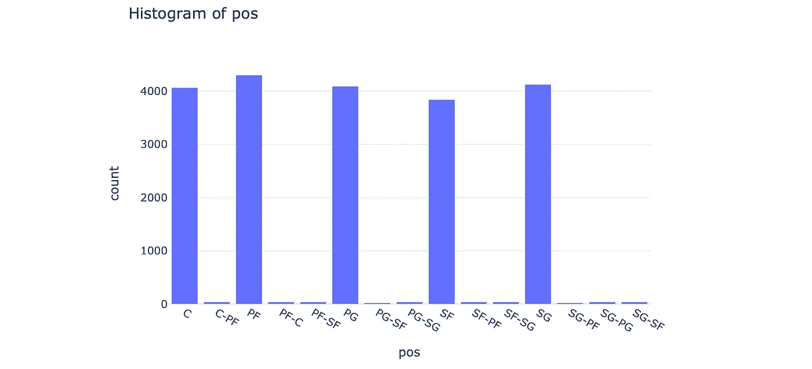

位置直方图—按字母顺序排序

这样，任何分类(或顺序)变量都将按顺序显示

现在我们可以更进一步，用箱线图对我们的数据进行分类。箱线图做的工作与直方图相似，因为它们显示分布，但它们真正最擅长的是显示这些分布如何根据另一个变量而变化。

因此，我们的应用程序的箱线图部分将包括两个下拉菜单，如下所示。

```
box_x = st.selectbox("Boxplot variable", options=df.columns, index=df.columns.get_loc("pts_per_g"))
box_cat = st.selectbox("Categorical variable", ["pos_simple", "age", "season"], 0)
```

只需将这两个输入传递给 Plotly 来构建一个图形:

```
box_fig = px.box(df, x=box_cat, y=box_x, title="Box plot of " + box_x, template="plotly_white", category_orders={"pos_simple": ["PG", "SG", "SF", "PF", "C"]})
st.write(box_fig)
```

然后…瞧！你有一个交互式方框图！

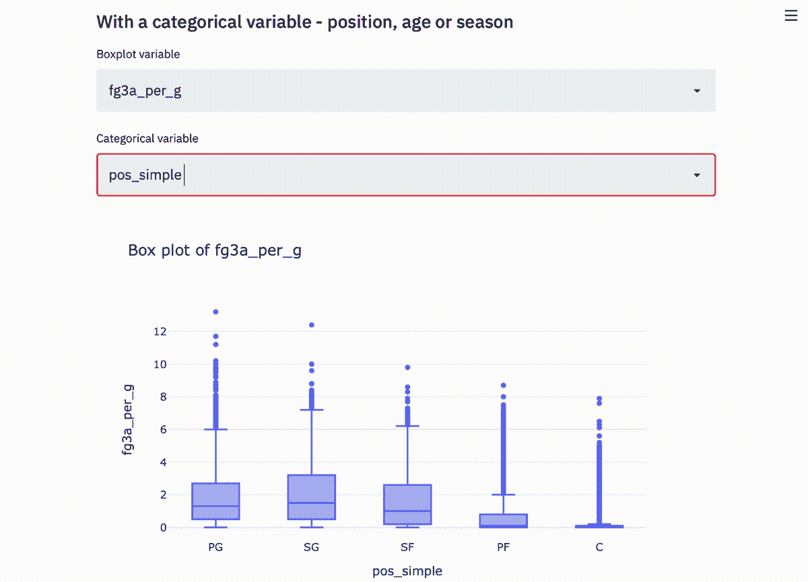

交互式箱线图

您会注意到，我手动为我的简化头寸栏传递了一个订单。原因是这个顺序是比较随意的，篮球特有的顺序(从 PG 到 C)，不是字母顺序。尽管我希望所有的东西都是参数化的，但有时你不得不求助于手工规范！

## 相关性和过滤器

数据可视化或探索性数据分析中的另一件大事是理解相关性。

例如，它可以方便地用于数据科学中的一些手动特征工程，并且它实际上可能会将您引向一个您可能从未考虑过的研究方向。

现在让我们只关注散点图中的三维空间。

不，不是在 x，y，z 方向。我不是怪物。下面我举了一个例子——你能理解这是怎么回事吗？

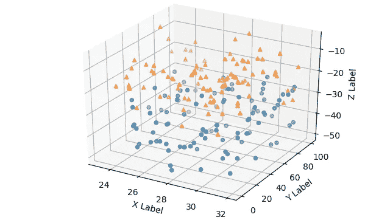

我不是三维散点图的忠实粉丝

我不要，谢谢。

颜色将是表示数据的第三维度。我将所有列都保留为前两列，并且只保留了有限的颜色选择——但是您真的可以做任何您想做的事情。

```
corr_x = st.selectbox("Correlation - X variable", options=df.columns, index=df.columns.get_loc("fg3a_per_g"))
corr_y = st.selectbox("Correlation - Y variable", options=df.columns, index=df.columns.get_loc("efg_pct"))
corr_col = st.radio("Correlation - color variable", options=["age", "season", "pos_simple"], index=1)
```

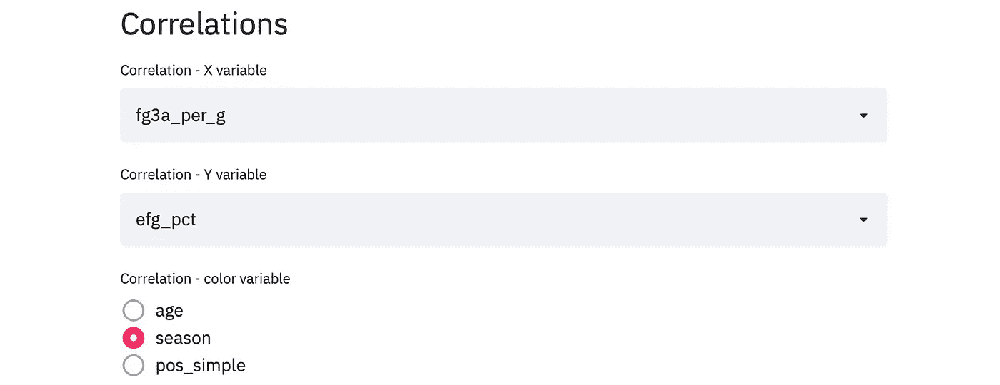

关联开！

并且该图表可以被构造如下:

```
fig = px.scatter(df, x=corr_x, y=corr_y, template="plotly_white", color=corr_col, hover_data=['name', 'pos', 'age', 'season'], color_continuous_scale=px.colors.sequential.OrRd)
```

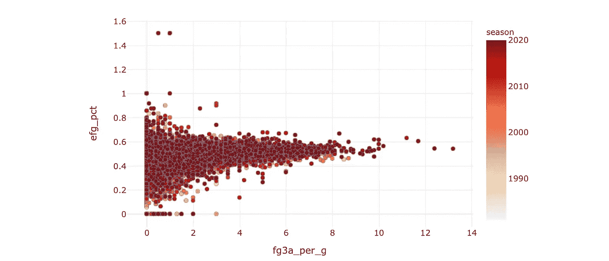

那么告诉我——它们有关联吗？

但是这个图表并不理想。首先是因为数据被异常值所支配。看到左上方孤独的点了吗？那些有效 FG%为 1.5 的乡亲们不是什么篮球之神，但这是极小样本量的副作用。

那么我们能做什么呢？让我们对数据进行过滤。

我将在这里放入两个交互部分，一个用于选择过滤器参数，另一个用于输入值。由于我不知道这里的参数是什么，我将简单地取一个空文本框，它将接受数字作为输入。

```
corr_filt = st.selectbox("Filter variable", options=df.columns, index=df.columns.get_loc("fg3a_per_g"))
min_filt = st.number_input("Minimum value", value=6, min_value=0)
```

使用这些值，我可以像这样过滤数据帧:

```
tmp_df = df[df[corr_filt] > min_filt]
```

然后将临时数据帧`tmp_df`而不是原始数据帧传入图中，我们得到:

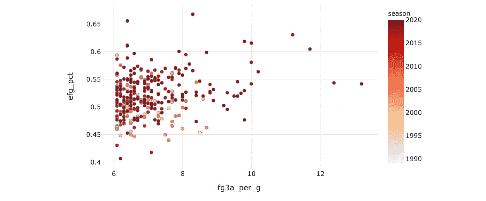

效率和射击次数之间的相关性(为高容量射手过滤)

该图表可用于查看各种统计数据之间的相关性。例如，看看伟大的 3 分射手通常也是伟大的罚球手:

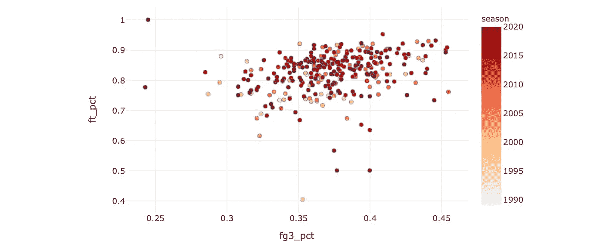

罚球准确性与三分球准确性

或者说，伟大的篮板手往往也是盖帽手。有趣的是，这项运动已经发生了变化，现代球员平均每场比赛都不会有很多盖帽。

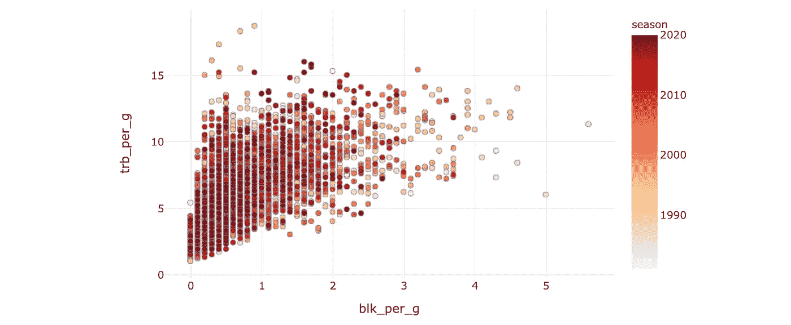

场均篮板 vs 场均盖帽

绘制篮板和助攻图，它们显示出某种逆相关性，并且根据位置很好地分层。

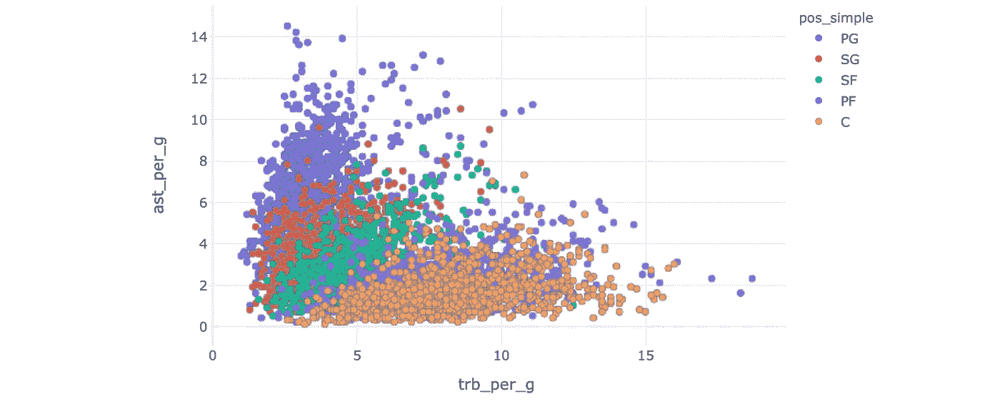

场均助攻 vs 场均篮板

我们已经可以从我们的应用程序中看到相当多的趋势和相关性。最后，让我们创建一些热图来查看各组数据列之间的总体相关性。

## 与热图的广义相关性

散点图对于查看单个数据点很有用，但有时只可视化数据集也很好，这样我们可以立即看到哪些列可能很相关、不相关或反向相关。

热图对于这项工作来说是完美的，因为它将所谓的关联矩阵可视化。

由于热图最擅长可视化输入类别集之间的相关性，所以让我们使用一个包含多个类别的输入。因此，`st.multiselect()`是这里选择的模块，而`df.corr()`是我们创建相关矩阵所需要的。

组合代码是:

```
hmap_params = st.multiselect("Select parameters to include on heatmap", options=list(df.columns), default=[p for p in df.columns if "fg" in p])
hmap_fig = px.imshow(df[hmap_params].corr())
st.write(hmap_fig)
```

我们得到了:

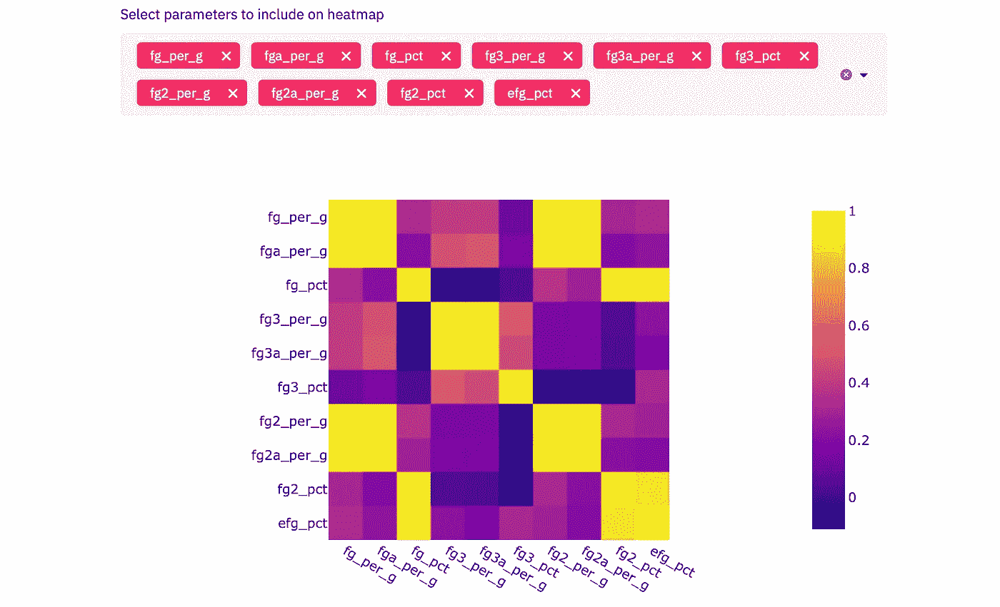

场均助攻 vs 场均篮板

这些列中哪些正相关，哪些不相关，一目了然。我还建议玩不同的色标/色板来获得额外的乐趣！

今天就到这里——我希望这很有趣。在我看来，在探索方面，很难有比这样的交互式应用更好的了，Plotly 和 Streamlit 的强大功能使得为我的目的构建这些定制应用变得如此容易。

请记住，我在这里提出的只是一些基本的建议，我相信您可以根据自己的目的和喜好构建更有用的东西。我期待看到他们所有人！

但是在你离开之前——如果你喜欢这个，在 [twitte](https://twitter.com/_jphwang) r 上打个招呼/关注，或者关注这里的更新。ICYMI:我也写了这些文章，你可能会觉得有用:

[](/these-data-science-portfolios-will-awe-and-inspire-you-mid-2020-edition-728e1021f60) [## 这些数据科学产品组合将让您惊叹不已并深受启发(2020 年中期版)

### 使用这些来改进您自己的数据科学产品组合，学习新技能或发现新的有趣项目。

towardsdatascience.com](/these-data-science-portfolios-will-awe-and-inspire-you-mid-2020-edition-728e1021f60) [](/plotly-dash-vs-streamlit-which-is-the-best-library-for-building-data-dashboard-web-apps-97d7c98b938c) [## Plotly Dash 与 Streamlit——哪个是构建数据仪表板 web 应用程序的最佳库？

### 用于共享数据科学/可视化项目的两个顶级 Python 数据仪表板库的比较——

towardsdatascience.com](/plotly-dash-vs-streamlit-which-is-the-best-library-for-building-data-dashboard-web-apps-97d7c98b938c) [](/build-a-web-data-dashboard-in-just-minutes-with-python-d722076aee2b) [## 使用 Python 在几分钟内构建一个 web 数据仪表板

### 通过将您的数据可视化转换为基于 web 的仪表板，以指数方式提高功能和可访问性…

towardsdatascience.com](/build-a-web-data-dashboard-in-just-minutes-with-python-d722076aee2b) 

回头见！保持安全:)