# 探索新冠肺炎信息技术

> 原文：<https://towardsdatascience.com/explore-covid-19-infodemic-2d1ceaae2306?source=collection_archive---------35----------------------->

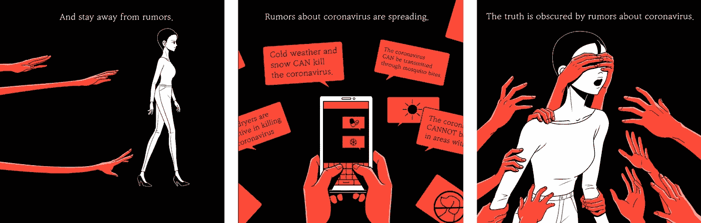

图片来源:Unsplash

## 自然语言处理，可视化

得知半数加拿大人被新冠肺炎阴谋论愚弄，令人心碎。

根据[世卫组织](https://www.who.int/emergencies/diseases/novel-coronavirus-2019)的说法，[新冠肺炎](https://www.who.int/emergencies/diseases/novel-coronavirus-2019)的相关信息和病毒本身一样危险。同样，阴谋论、神话和夸大的事实可能会产生超出公共卫生范畴的后果。

感谢像 [Lead Stories](https://leadstories.com/) 、 [Poynter](https://www.poynter.org/covid-19-poynter-resources/) 、[FactCheck.org](https://www.factcheck.org/a-guide-to-our-coronavirus-coverage/)、 [Snopes](https://www.snopes.com/) 、[euvsdisifo](https://euvsdisinfo.eu/)这样的项目，它们监视、识别并核实散布在世界各地的虚假信息。

为了探究新冠肺炎假新闻的内容，我使用了关于真假新闻的严格定义。具体来说，真正的新闻文章是那些被认为是真实的，并且来自可靠的新闻来源的文章。假新闻故事是已知是虚假的故事，来自众所周知的假新闻网站，故意试图传播错误信息。

牢记上述定义，我从各种新来源收集了超过 1100 篇关于新冠肺炎的新闻文章和社交网络帖子，然后给它们贴上标签。数据集可以在这里找到[。](https://raw.githubusercontent.com/susanli2016/NLP-with-Python/master/data/corona_fake.csv)

# 数据

流程 _ 数据. py

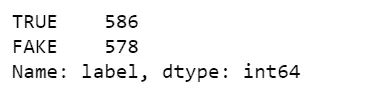

经过一番清理，可以看到我们有 586 篇真文，578 篇假文。

```
df.loc[df['label'] == 'TRUE'].source.value_counts()
```

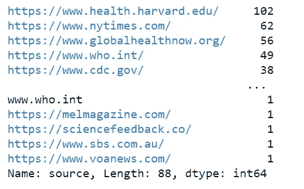

图 1

真实文章大部分收集自[哈佛健康出版社](https://www.health.harvard.edu/)、[、《纽约时报》](https://www.nytimes.com/)、[约翰霍普金斯大学彭博公共卫生学院](https://www.globalhealthnow.org/)、[世卫组织](https://www.who.int/emergencies/diseases/novel-coronavirus-2019)、[疾控中心](https://www.cdc.gov/coronavirus/2019-nCoV/index.html)等等。

```
df.loc[df['label'] == 'FAKE'].source.value_counts()
```

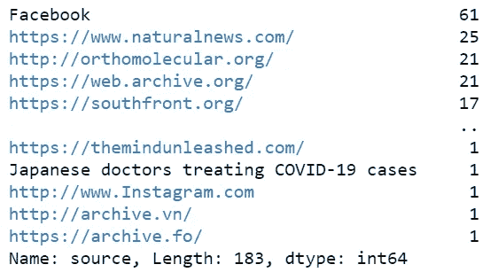

图 2

这些假药是从极右翼网站“自然新闻”和另类医学网站“orthomolecular.org”的脸书邮报上收集的。一些文章或帖子被从互联网或社交网络上删除，然而，它们能够进入互联网档案馆等。

使用下面的函数，我们将能够阅读任何给定的新闻文章，以便我们能够确定如何清理它们:

print_plot.py

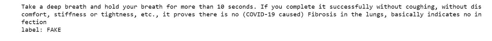

```
print_plot(1000)
```

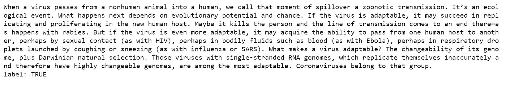

这些文章非常干净，我们可以去掉标点符号，改成小写。

```
df['text'] = df['text'].str.replace('[^\w\s]','')
df['text'] = df['text'].str.lower()
```

# 文章的长度

在接下来的步骤中，

*   获取每篇文章的情绪得分，极性位于[-1，1]的范围内，其中 1 表示积极情绪，-1 表示消极情绪。
*   获取每篇文章的长度(字数)。

polarity_length.py

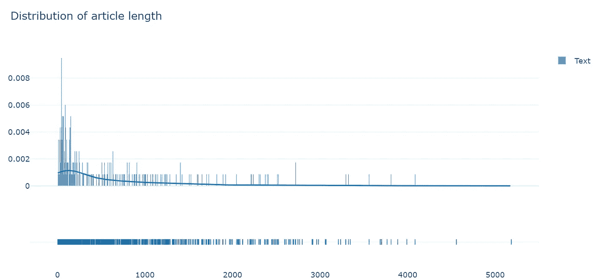

图 3

数据中的大部分文章包含不到 1000 个单词。尽管如此，很少有文章超过 4000 字。

当我们用标签来区分时，就文章的长度而言，真消息和假消息之间没有显著的区别。虽然大部分真的文章看起来比假的短一点，但是在数据上。

text_len_hist.py

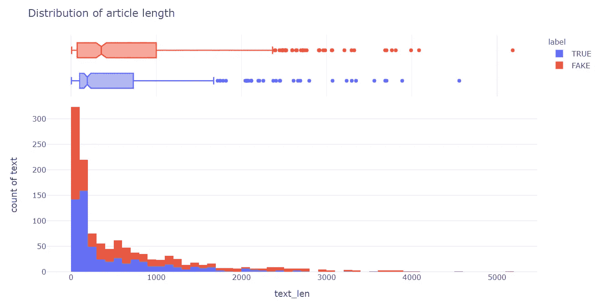

图 4

为了显示不同值的文本长度的概率密度，我们可以使用 violin plot:

text_len_violin.py

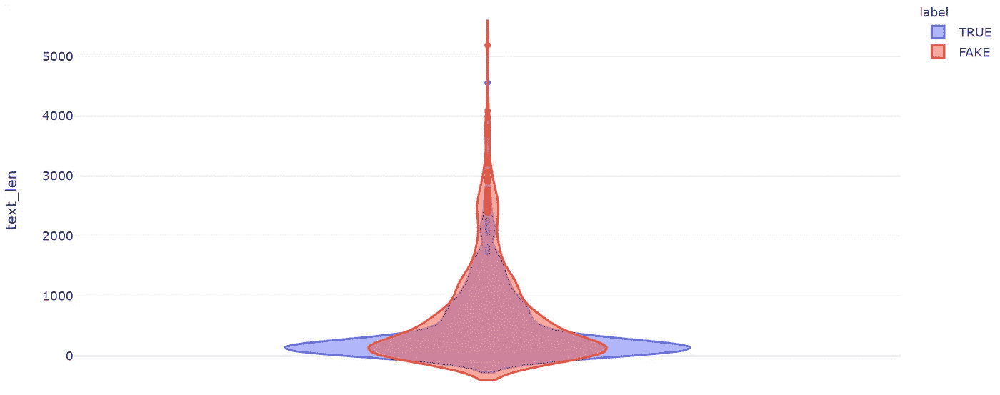

图 5

# 脸书对哈佛

平均而言，脸书的文章比哈佛的健康文章短得多:

facebook _ 哈佛 _textlen_hist.py

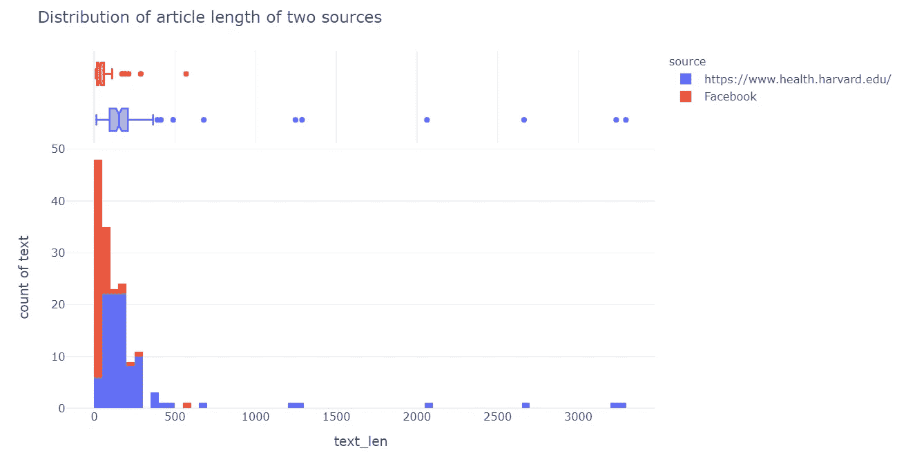

图 6

我们也可以用小提琴的情节来呈现:

facebook _ 哈佛 _textlen_violin.py

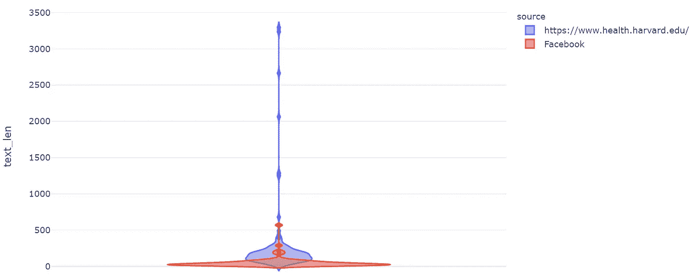

图 7

也许我们都很熟悉，脸书的假帖子在内容上往往更短。张贴它们的人试图通过启发而不是论据来说服读者。

# 情感极性

label_polarity.py

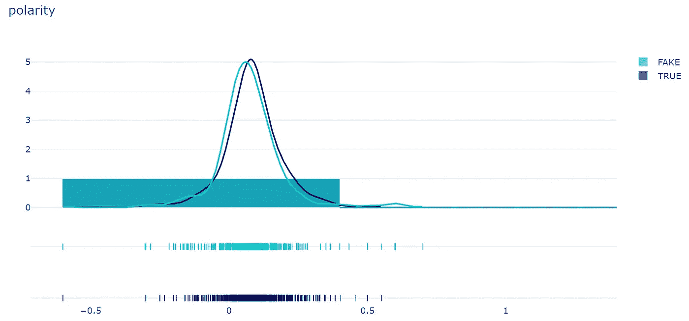

图 8

就情感而言，真消息和假消息之间没有明显的区别。这可以用下面的小提琴情节来证实:

极性 _violin.py

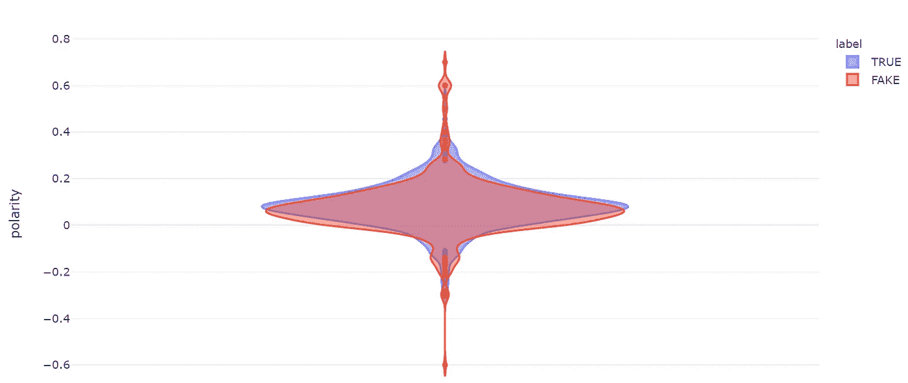

图 9

当我们比较这四个来源之间的情绪极性时，我们可以看到纽约时报和自然新闻的情绪分布比哈佛健康新闻和脸书的情绪分布窄得多。

极性 _ 源. py

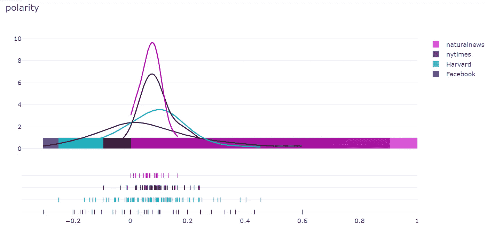

图 10

这意味着《纽约时报》的新闻文章和数据中的自然新闻听起来不那么情绪化。

这可以用下面的小提琴情节来证实:

来源 _violin.py

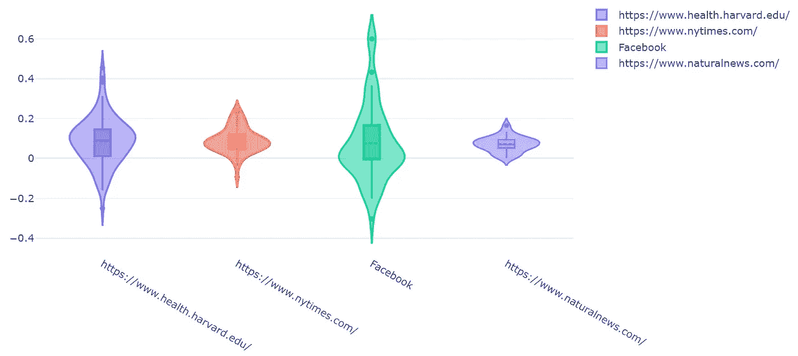

图 11

# 情绪 vs 文章长度 vs 真实性

我注意到我收集的新闻文章和帖子，既不是很强的正面，也不是很强的负面。大部分都在适度正的范围内，而且大部分长度不到 1000 字。

len_polarity.py

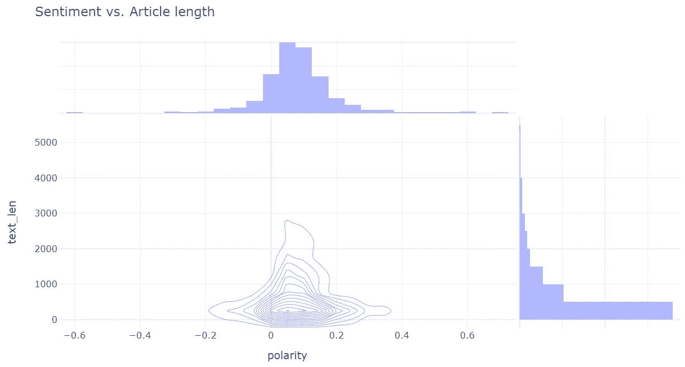

图 12

情绪和文章长度没有明显的关系。而且一般来说，一篇文章的情绪或篇幅并不能反映其真实性。假新闻和真新闻之间的区别可能是相当武断的。

polarity _ scatter.py

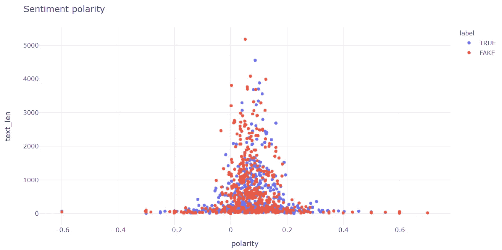

图 13

```
df.groupby(['source']).mean().sort_values('polarity', ascending=False)
```

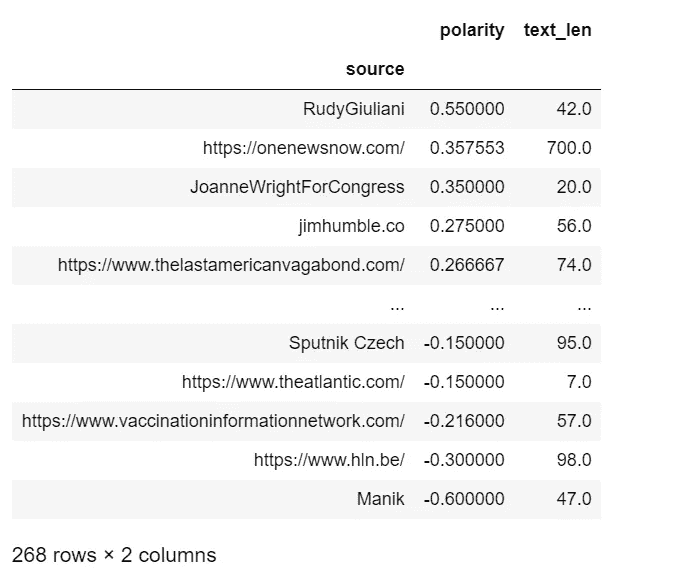

图 14

我注意到鲁迪·朱利安尼的帖子拥有最高的情感评分，很想知道它是关于什么的:

```
df.loc[df['source'] == 'RudyGiuliani']['text'][880]
```

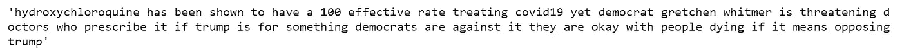

当然是关于[羟氯喹](https://en.wikipedia.org/wiki/Hydroxychloroquine)。

# 真假新闻文章的内容

现在，我们将了解我的数据中包含了哪些主题。

true_bigram.py

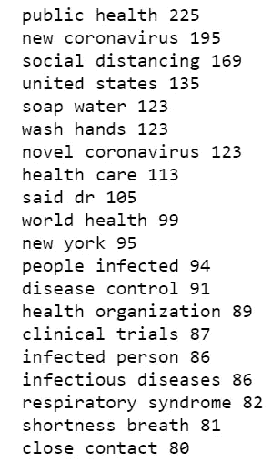

fake_bigram.py

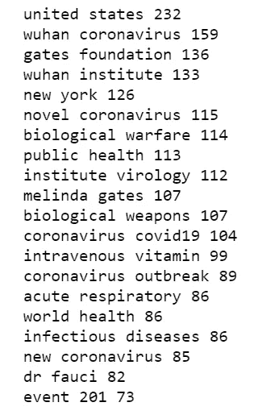

*   **促进治愈:**这包括使用高剂量静脉注射维生素 c
*   关于起源的猜测:这个主题包括声称冠状病毒是在用于生物武器的实验室中创造的，或者 5G 技术导致了疾病。
*   **关于有影响力的人的谣言:**比如冠状病毒是比尔盖茨和福奇博士代表制药公司策划的。
*   **利用人们的恐惧:**比如梅琳达·盖茨基金会和约翰·霍普金斯大学已经在三个月前通过 Event 201 预测到了冠状病毒。

从我们的数据来看，真假新闻内容的一个明显区别是，假新闻似乎更经常使用人名，这表明假新闻可能更私人化。

# naturalnews.com 对 orthomolecular.org

上述两个新闻来源都在宣扬阴谋论，然而，它们确实侧重于不同的主题。

自然 _bigram.py

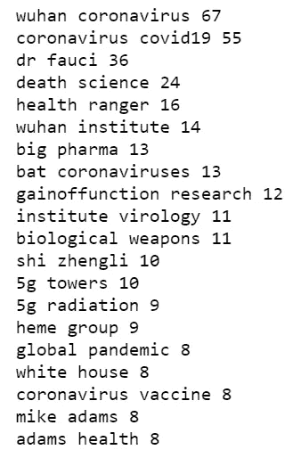

naturalnews.com 方面一直在传播虚假信息，比如冠状病毒是中国一家实验室设计的生物武器，以及/或者它被传播是为了掩盖与接触 5G 无线技术有关的所谓有害健康影响。

ortho_bigram.py

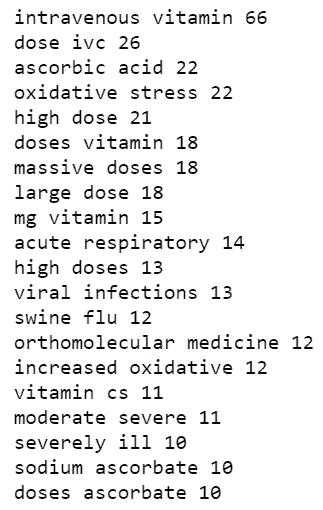

orthomolecular.org 一直在推广使用高剂量静脉注射维生素 C 作为治疗方法，但这是没有根据的。

你可以随意查看其他来源。

# 摘要

首先，我们不知道在收集数据时是否有任何选择偏差。第二，虽然我们可以说这些是用户参与度很高的新闻故事，但我们不能说这些故事产生了什么实际流量。尽管有这些限制，这个数据集提供了合理的事实标签，我们知道所有的故事都被广泛阅读和分享。

Jupyter 笔记本可以在 [Github](https://github.com/susanli2016/NLP-with-Python/blob/master/fake_news_COVID.ipynb) 上找到。很快再聊。