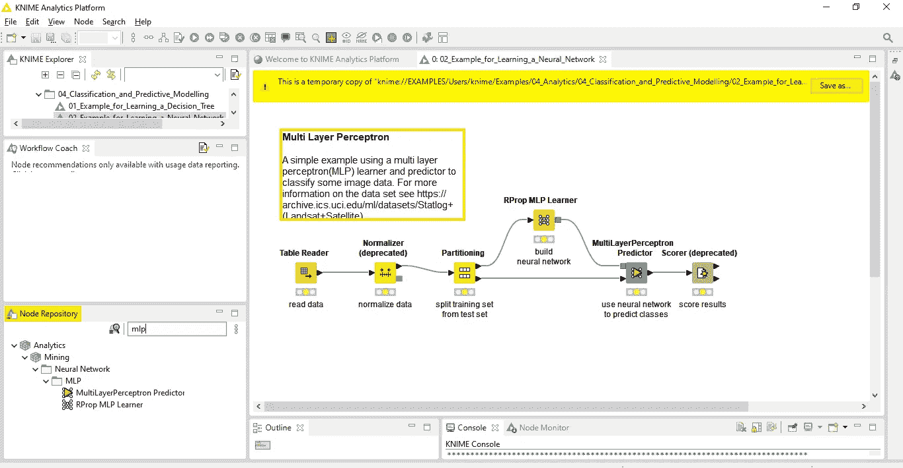
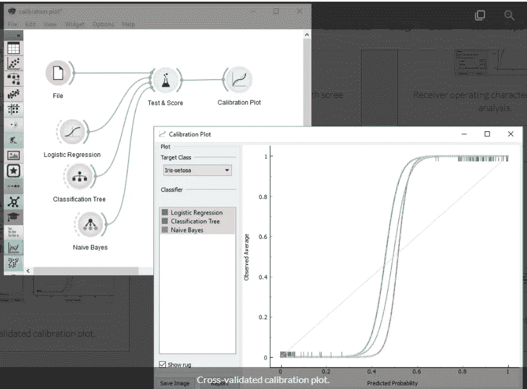
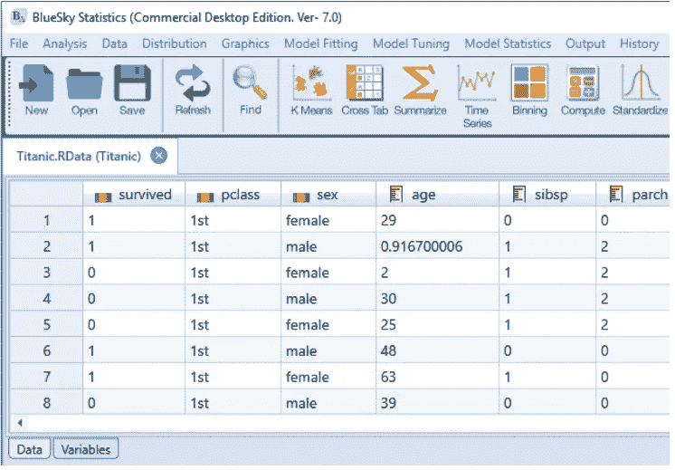

# 免费探索零编码技能的数据分析

> 原文：<https://towardsdatascience.com/explore-data-analytics-with-zero-coding-skills-for-free-f2c982d1e2d6?source=collection_archive---------58----------------------->

## 你所需要的就是在网上探索这些开源工具。

斯蒂芬·道森在 [Unsplash](https://unsplash.com/s/photos/graphs?utm_source=unsplash&utm_medium=referral&utm_content=creditCopyText) 上拍摄的照片

你最近是否经常听到新的行业术语——数据分析(*更早是 AI-ML)*？这听起来很复杂，但又足够简单吗？理解模型背后的逻辑却不知道如何编码？害怕在赶时髦之前花太多时间学习编码？

不要担心，有一些非常棒的工具可以免费提供给非编码人员，可以帮助他们立刻开发复杂的模型。这些工具完全免费供个人使用，非常简单和直观，可以帮助一个人练习，而不用学习如何编码。

我是一个业余的程序员，但也是一个机器学习的狂热爱好者。我可以编码，但我尽可能避免它*(感谢 Excel 中的录制宏选项)，*直到我无法避免它。

我正致力于开发一个预测道路交通的模型，当我开始寻找非编码资源并发现这些宝石时，我不得不尝试很多东西。我正在讨论我找到的最好的三个。同样，这些软件对个人用户开放源代码，但有商业用途的定价版本。

# 这些工具不能做什么

请注意，虽然这些工具消除了对编码的需求，但是您对模型、数据准备基础和统计的理解应该高于最低要求。原因是当您编码时，您确切地知道正在做什么以及如何做，而在大多数这些工具中，默认参数是预先加载的，并且有时代码对用户是不可见的。因此，如果用户没有进行彻底的 QA，模型错误很容易被忽略。

除此之外，这些工具不会告诉您使用哪种数据清理技术、构建哪种模型或比较哪种统计数据。相反，这些工具将让您轻松完成上述所有任务，并让您有更多时间思考和分析数据。

既然您已经阅读了所有警告，让我们直接开始吧。

# 1.Knime 分析

> 这是目前为止开源领域中最好的工具。

Knime 是一个非常直观的平台，可以在工作流环境中使用拖放节点来创建模型。它建立在 python 之上，拥有用于数据输入、数据清理、建模(回归、聚类、分类、神经网络等)、统计和常用表示的小部件。

它有一个桌面版本(*我喜欢它*)和一个服务器版本，供想要在网络上开发和部署这些模型工作流的人使用。在您的机器上安装 Knime 相当容易，使用它就更容易了。下面是一个神经网络模型的例子。

构建神经网络所需的每个动作都有节点。导入数据，对数据进行划分，将一部分数据提供给学习者、预测者(测试集)，然后是用于检查模型准确性的评分者。可以在使用连接器相互连接的节点中设置参数，并且可以按顺序执行参数。

学分—我桌面上的 Knime 工作区

# 2.柑橘

[Orange](https://orange.biolab.si/) 是一款开源的机器学习、数据可视化和分析工具。Orange 还处理以工作流模式排列的窗口小部件，并为特定任务(时间序列、生物信息学等)提供了一些专门的库。

Orange 的用户界面更加流畅，但是它的节点列表没有 Knime 详尽。它有许多可视化选项，可以产生像样的数据分析。它建立在 python 之上，可以帮助创建和评估回归、分类、神经网络、聚类、时间序列等模型。

演职员表— [桔子网站](https://orange.biolab.si/screenshots/)

# 3.蓝天统计

Bluesky 是一个基于 R 的工具，可用于数据建模和可视化。它是开源的，可用于桌面。它有一个丰富的图形用户界面，它可以帮助 R 新手缓解学习曲线，因为每个函数的 R 代码都是可见的。

BlueSky 缺乏工作流风格的架构和节点功能。相反，它在类似于 MS Office 功能区选项卡的选项卡下列出了一些功能。BlueSky 的美妙之处在于它是建立在 R 之上的，R 是一种非常强大的统计数据分析语言。它有命令编辑器，由于代码对用户是完全可见的，用户可以非常容易地根据自己的喜好修改代码。它确保 R 的普通用户可以节省大量使用这个应用程序的时间。

积分-蓝天统计用户手册

市场上有许多数据分析工具，但大多数都不是开源的。这给仍处于数据科学探索阶段的个人用户造成了困难。

这三个工具是我处理小型数据分析问题的最爱。它们可以为新手节省大量的时间，这些新手可能对学习编码的想法望而生畏。

该列表基于 2019 年末可用的工具。如果我发现更多类似的工具，我会更新这个。我希望这个故事对您开始数据分析之旅有所帮助！