# 通过动态的人物社交网络探索哈利·波特

> 原文：<https://towardsdatascience.com/explore-harry-potter-via-a-dynamic-social-network-of-characters-f5bed9a39f01?source=collection_archive---------15----------------------->

小说通常提供复杂的叙述，读者可能很难理解整本书的内容。因此，提出有助于获得更好理解的工具是一条有趣的道路，这是一条尚未探索的道路。事实上，尽管最近开发了像 GPT-3 这样的 NLP 算法，在各种各样的任务(翻译、问答、文本生成……)中表现出色，但真正理解这本书甚至是一个好的摘要仍然遥不可及。

然而，从小说中获得有益的洞见还有其他方法。在这篇文章中，我们转向一个处于自然语言处理(NLP)和网络科学(NS)十字路口的概念——*应用图论的一个新兴分支，它汇集了许多学科的传统，包括数学、社会学、经济学和计算机科学[3]。*更准确地说，我们从书的文本内容中创建了一个相关的**动态异质人物社交网络**，然后利用这个图表中的信息来提高人们对小说的理解。特别是，我们关注**五种不同的应用:人物的重要性、叙事结构变化、社区检测、总结和书籍比较。对他们的调查给了我们关于这本书的情节、作者的风格或人物的重要性、关系和角色的宝贵线索。**

我们将我们的分析应用于 J.K .罗琳的名著:“*《哈利波特与魔法石》*(HP1)——尽管这种分析绝对可以应用于任何一本书。

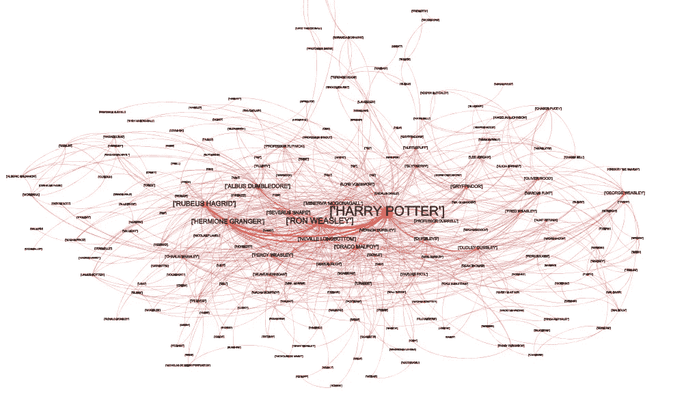

这时你可能还在疑惑“ ***但是* w *这是一个动态的异质人物社交网络*** *？”*回答你的问题，一个*人物网络*无非是一个*图*，意思是一组节点 V 和边 E，其中节点代表书中的人物，边代表他们之间的互动。虽然文献中的绝大多数方法都集中在静态方法上，根据定义，静态方法在时间上是固定的——整本书有一个图表，但我们遵循的是动态方法——一个不断随时间演变的图表，能够保留叙事的时间信息。为了创建这个动态方面，我们额外使图*异构*，也就是说，具有几个边类型和节点类型。换句话说，不是所有的节点都表示字符，也不是所有的边都表示它们之间的交互。但是我们稍后将回到这一点。

下面是对将要涵盖的内容的更准确的概述。

*   **文本处理**
    (1)从网上检索书籍并按章节拆分
    (2)提取出现在文本中的人物名称
    (3)将每个人物出现与对应的实体匹配
*   **图形创建**
    (1)构建完整的动态异构图形
    (2)从中导出多个感兴趣的图形(动态实体图形、静态实体图形……)
    (3)使用名为 *gephi* 的特殊软件进行可视化
*   **图形分析**—*with networkx*
    (1)人物重要性
    (2)叙事中的结构变化
    (3)社区检测
    (4)书籍的写作风格比较
    (5)通过图形的 k-core
    总结一本书(6)其他应用:关系预测、体裁/作者/风格分类……

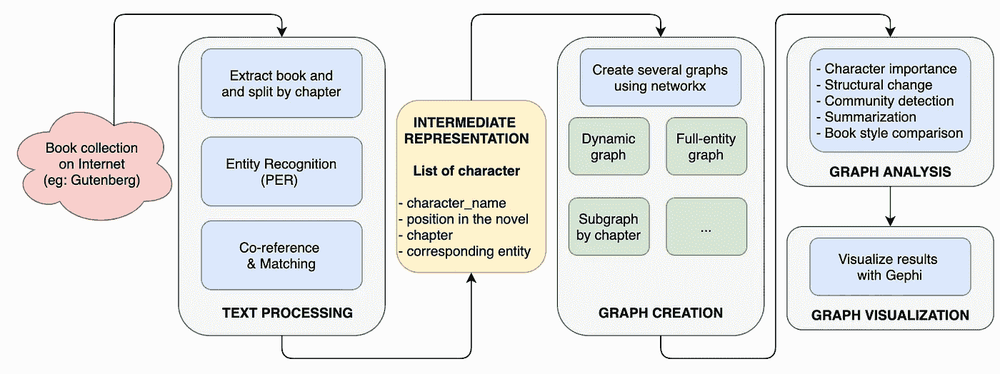

> *关于*预处理*和*图形创建*部分的更多细节，可以参考原* [*论文*](https://www.researchgate.net/publication/343962581_Novel_comprehension_via_a_dynamic_social_network_of_characters) *，其中代码可在*[*Github*](https://github.com/AlexDuvalinho/Dynamic-Graph-Networks)*上获得。但是如果*图形分析*部分是你唯一感兴趣的，你可以跳过它们。*

# 预处理

为了创建一种动态字符图，我们首先需要对原始文本进行一些**自然语言处理。**预处理模块的目的是**捕获书中所有角色的所有出现，在它们不同的形式下**；并存储以下信息:

> *character_name: [str]角色的名字(例如:'哈利')
> pos: [int]开始以来的令牌数(例如:30490)
> chapter: [int]章节的索引(例如:2)
> entity : [str]对应的实体(例如:'哈利波特')*

1.  我们从网上检索这本书。txt 格式，使用项目[古腾堡库](https://www.gutenberg.org/)并按章拆分。*为什么是*？因为章节是剧情演变的兴趣单元。
2.  我们在整本书中一章一章地运行 [**伯特 NER**](https://github.com/kamalkraj/BERT-NER)——预先训练好的谷歌伯特为实体识别任务进行了微调——来检测所有的字符出现。我们只保存‘PER’实体(人物)，我们将它们与它们在正文中的位置和相应的章节索引一起存储。
3.  我们将提到每个角色与一个独特的实体 (=主角)进行匹配。社交网络将实体联系起来，因此将所有的共同参照对象组合在一起是至关重要的一步。例如，关于哈利·波特，我们希望哈利、波特、波特先生、哈利·波特被链接到一个单一的实体。在这种情况下，哈利波特。我们遵循 M.Ardanuy 和 C.Sporleder 在[1]中为这个字符分辨任务开发的策略。这分 4 步完成:

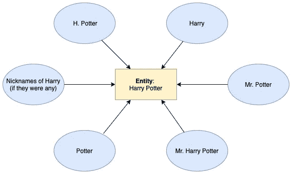

*   **人名解析:**使用 [*NameParser*](https://github.com/derek73/python-nameparser) 框架将人物姓名解析成通用结构。例如，哈利·波特先生将被解析为:{标题:先生，名字:哈利，姓氏:波特}
*   **性别分配**。如果可能的话，确定角色的类型。在这里，我们使用数据库，简单地从标题和名字对其进行评估。例如，如果标题为“先生”，则体裁为“男性”。
*   **匹配算法:**将每个出现映射到一个实体，将共同参照对象分组在一起。不需要深入研究细节，假设我们首先考虑显示标题、名和姓的所有事件——具有最完整形式的事件。如果现有的实体没有出现的名字，姓氏和最终的流派，我们创建一个新的。对于显示相同结构的所有提及，我们都这样处理，然后将重点放在只显示名字和姓氏的其余提及上。同样，我们重复相同的过程，如果名字和姓氏相同，将新的提及与现有的实体进行匹配。接下来是出现的标题和名字，标题和姓氏，最后是名字或姓氏。结果，由于实体哈利·波特在一开始就被构想出来(由哈利·波特先生)，所以哈利或波特先生直接与这个实体相关联。
*   **细化匹配流程:**考虑 NER 模型的昵称、首字母和小错误。事实上，在目前的框架中，哈利·波特和达迪是不同的实体，并没有像我们希望的那样映射到哈利·波特和达力·德思礼。我们通过仔细指定有针对性的规则来处理首字母和使用现有的昵称数据库来解决这个问题。

# 图形创建

## 主动态图

我们现在处理我们方法的一个关键点:*我们如何创建一个图表来保存关于叙事动态的时间信息？*我们选择使用上面存储的信息构建一个图表，并呈现以下结构。

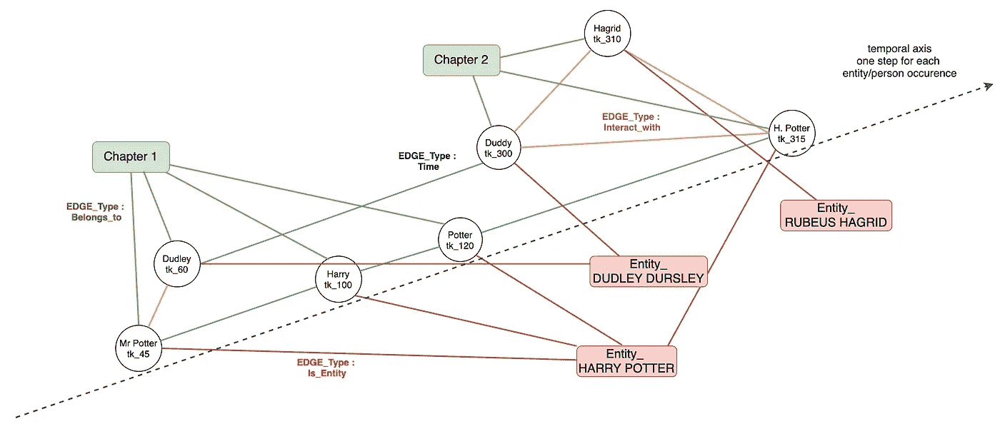

我们的完整图形由 **3 个节点类型**组成:

*   *出现节点*:元组(字符名称，出现位置)
*   *章节节点*:章节的索引
*   *实体节点*:表示实体的字符串

还有 **4 种不同的边缘类型**:

*   *归属边*:如果事件位于章节节点 idx 中，则将事件节点连接到章节节点。
*   *is-entity edge* :如果出现的字符名称已经匹配到对应的实体，则将出现节点连接到实体节点。
*   *interact-with edge* :连接两个发生节点，如果它们一起交互并且不连接到同一个实体节点。我们在对应于不同实体的两个出现节点之间创建一个交互边，如果它们在小说中的位置相距不超过 20 个令牌。这正是使用同现滑动窗口的想法，只是在我们的情况下，计算起来更简单。请注意，两个角色之间的边缘并不一定意味着他们是朋友——它只是意味着他们相互影响，谈论彼此，或者一起被提及。
*   *时间边缘*:在小说中，连接两个连接到同一实体的出现节点，如果不存在另一个出现节点连接到位于这两个出现节点之间的这个实体。

这个完整图的主要目的是我们在这个过程中不会丢失任何信息:事实上，我们只是将事件列表转换成一个更容易操作的图结构。

## [数]子图

对于某些应用，采用这种全动态图的一些修改版本是有用的。

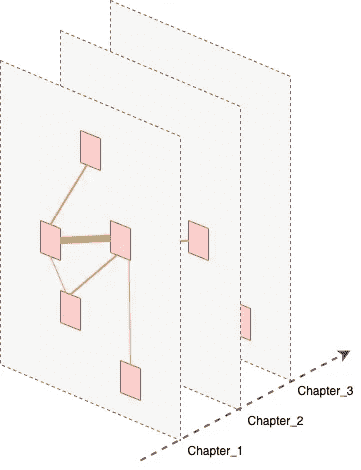

特别是*实体图*，对于书籍的一些全局分析非常有用。它是完整图的静态折叠版本，仅包含一种类型的节点:*实体-节点*和一种类型的边:*交互对象，*其中由两个实体之间的交互次数加权。按章剪切以嵌入时态信息通常很有趣。因此，我们将动态图折叠成实体图的*序列，每章一个。*

我们可以进一步扩展这个观点，生成一个*细粒度的动态实体交互图*，其中时间轴就是文本中迄今为止的标记数，也就是:“时间”在小说中从 0 到标记数。

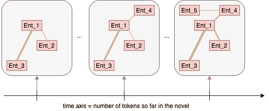

# 图形分析

## 字符重要性

分析的第一步，也可能是最具启发性的一步，是找出书中最重要的人物。为了做到这一点，我们为每一个节点计算了书籍实体图(静态或动态)中的中心性度量，代表人物在叙事中的重要性。

有几种度量方法，如度中心性、中间中心性或网页排名中心性。它们能够捕捉不同的重要性变量。事实上，一个人可以以多种方式发挥核心作用。她可能有良好的关系，位于中心，或处于独特的位置来帮助传播信息或影响他人。有关这些指标的更多信息，请参考[该资源](https://en.wikipedia.org/wiki/Centrality)。简而言之:

*   *程度中心性*:你有很多关系吗？
*   *加权度中心性*:你们有很多互动吗？
*   特征向量中心性:你和重要的人有很多联系吗？
*   PageRank Centrality :你和重要的人有很多互动吗？
*   *中间中心性*:你帮助连接网络的不同部分吗？

在这里，我们倾向于 Pagerank centrality，对于这个故事来说，它被 Google 用来对推荐给你的网页进行排序。我们得到了以下结果:

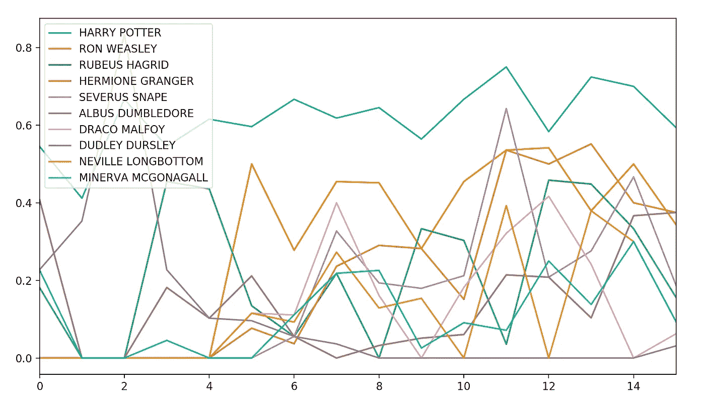

这本书的 10 个最有影响力的人物的 Pagerank 中心性的演变

**结果描述**:在计算完全静态实体图上最重要的 10 个字符后，我们遵循跨章节的中心性度量演化，意思是在动态实体图上。观察到的结果与我们对这本书的了解非常一致，我相信你会同意。显然，哈利一直是最核心的人物。它在网络中定位独特，似乎与每个人都有联系。尽管乍一看令人惊讶，伏地魔和奇洛教授被排除在前十名之外，但事实上仍然被认为是重要的(排名第 11 和第 13)。在第一本书中，哈利在霍格沃茨的日常生活占据了很大的篇幅，这是有道理的，因为在那里伏地魔并不经常被提及。更令人吃惊的是第五章中大多数角色的网页排名突然飙升，这与哈利到达霍格沃茨的时间相吻合。有些角色，比如罗恩，很快就变得非常重要，而另一些角色，比如赫敏，则逐渐变得重要起来。请注意，这段话也与达力·德思礼等一些有影响力的人物的消失相吻合。

*在下一小节*中，我们检查叙述中的这种结构变化是否被其他图形属性的演变所证实。这将使我们能够概括出一本书主要情节发展的能力。

# 结构变化

我们选择了几个**属性，静态的和动态的，可以帮助我们更好地理解剧情的发展。**我们解释其中的一些:

→ ***节点/边缘/现有人物的数量*** 给出了关于故事结构、书的类型和作者写作风格的宝贵线索。另一方面， ***消失/被引入的人物数量*** 给出了更多关于剧情发展的动态洞察。当主角哈利到达一个新的地方时，很容易被注意到。观察下面的*情节，互动和主角介绍的激增证实了前一部分的推断，因为它与哈利到达霍格沃茨相对应。将这张图表与其他书籍进行比较，可以让我们区分两种类型，两个作者…*

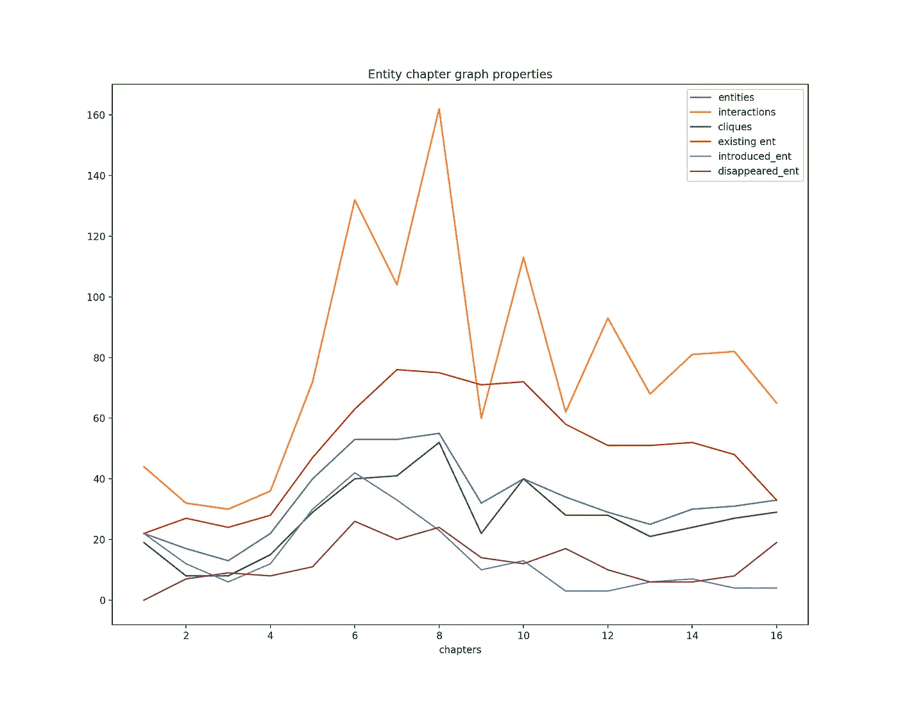

→ **在每一章中寻找最大集团的例子，可以看出哪些角色相互作用，以及全局情节是关于什么的。是关于杜德利一家、师生互动还是哈利-伏地魔-邓布利多？调查派系的余弦相似性也可能是有趣的，看看动作是否经常围绕相同的角色(如在惠普)，或者是否经常改变(如在 LOTR 的 GOT)。此外，我们可以查看最强的边，或者将集团与图 k-core 进行比较，以查看集团在章节中占据了多少空间。最后，使用我们的动态图，我们甚至可以在更小的范围内，在章节内进行这种分析。**

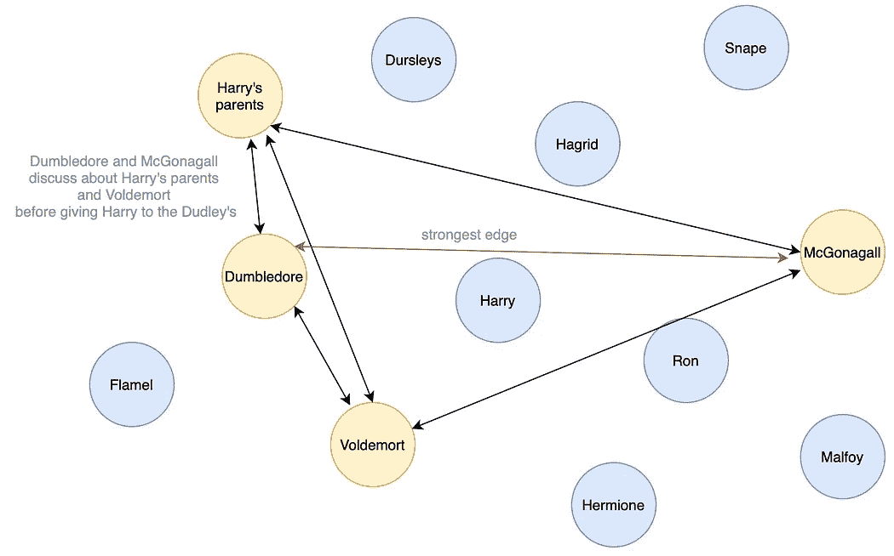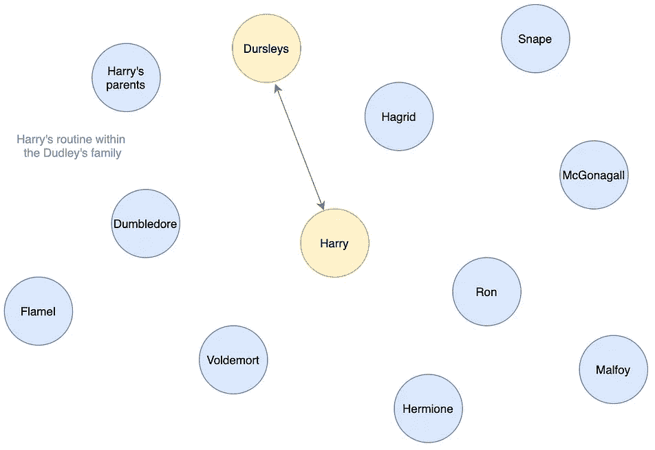

前两章的简化最大集团+主要优势

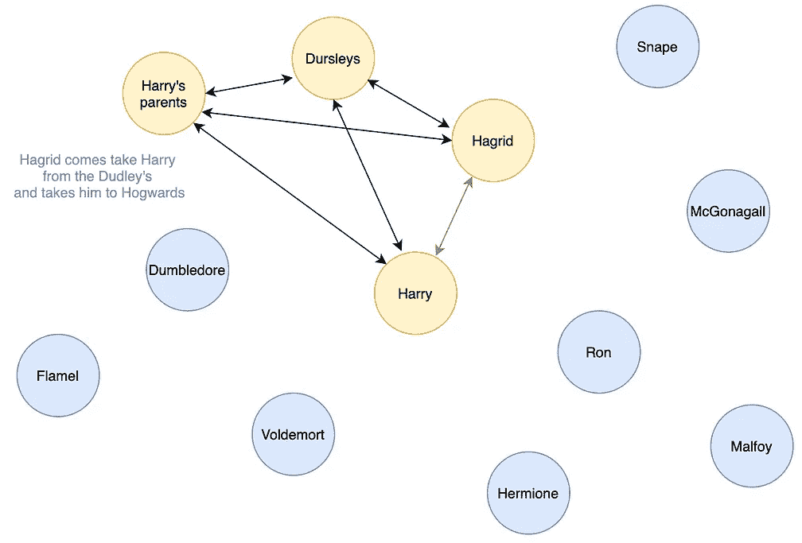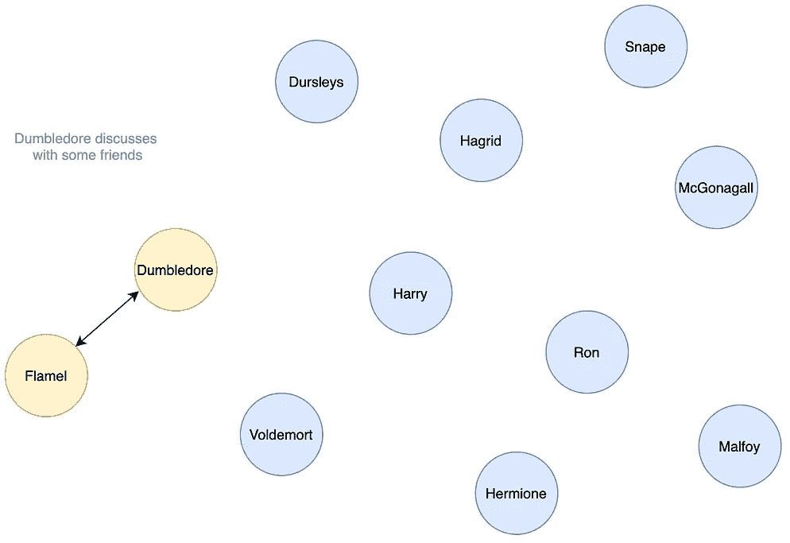

其他章节的最大派系+主要互动

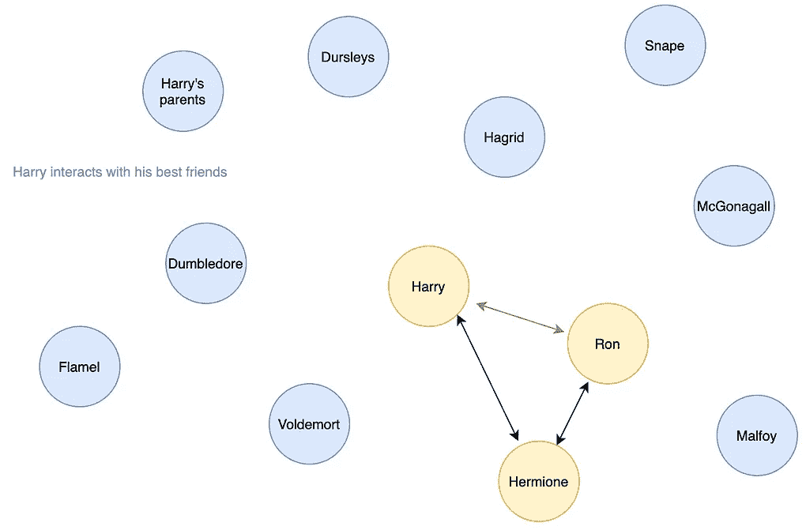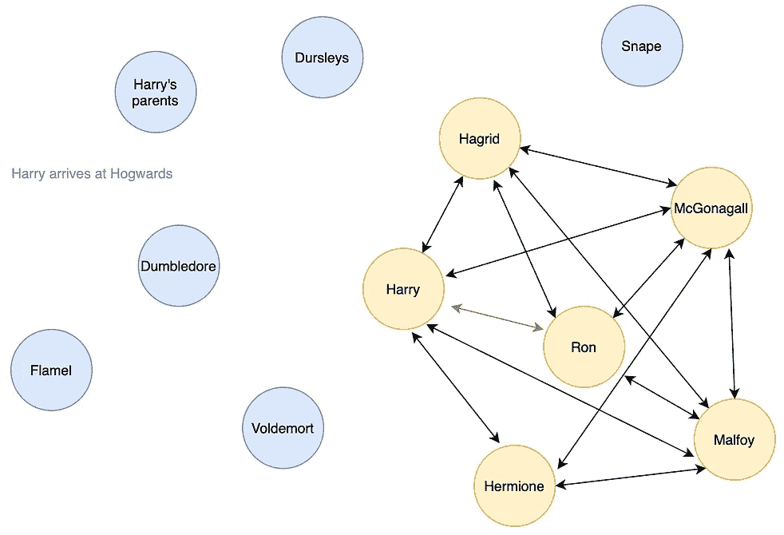

→ ***看每章重要人物的比例*** 或许可以帮助我们找到故事情节中哪些章节是重要的。对于哈利波特来说，这并不是最重要的特征，但是对于像《LOTR》或《GOT》这样的书来说，它会非常有帮助，因为许多故事情节同时发生。

→ ***主要人物和次要人物重要性的区别*** 给出了所写的书的类型信息，是一个主要人物的书还是几个主要人物的书。

> **作为旁注**，请记住，我们在这里使用的是手工制作的功能，而不是网络表征学习领域的最新方法。这些方法通常是图形神经网络家族的一部分，它们隐式地提取图形属性，因此具有自己学习特征的特殊性(使用图形结构和节点特征)。它们用于获得每个节点的向量表示，该向量表示稍后用于下游 ML 任务，例如节点分类或链路预测。日常生活中的例子多种多样:推荐电影，推荐朋友，预测分子的作用，使用存储为知识图的大数据库回答你的问题，预测病毒的传播…

# 社区检测

尽管 *HP1* 并不是这类应用最引人注目的例子，与 *GOT* 或 *LOTR* 相反，我们网络的复杂结构仍然反映了故事情节的交织。值得注意的是，我们观察到许多现实世界网络中的两个特征。首先，这个网络包含多个更密集的子网，由一个更稀疏的全球边缘网络连接在一起。其次，它是围绕着一部分极具影响力的人组织起来的，无论是在本地还是全球。

为了使用网络科学的分析工具来量化这些观察，我们继续进行静态实体图上的**社区检测**(或者如果需要的话，更多动态版本)。更准确地说，我们将[格文纽曼算法](https://en.wikipedia.org/wiki/Girvan–Newman_algorithm) 应用于通过删除交互太少的节点(在我们的例子中少于 5 个)而获得的完整实体图的子图。除了使图形更具可读性之外，它还排除了 BERT 发现的一些虚假实体，只保留了真实的实体。

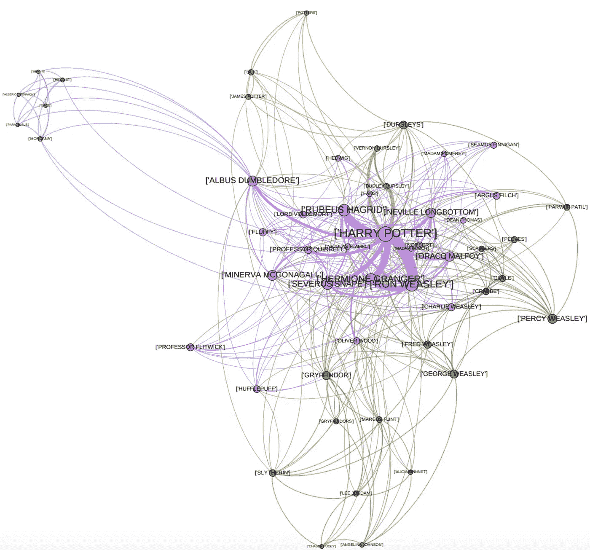

**描述:**在《哈利·波特》中，我们获得了四个不同的社区。一个涉及哈利的家庭，包括他的亲生父母和杜德利一家，以及他们的随行人员。第二个是由邓布利多的朋友组成的，这有点超出了本书的主要情节范围，在一章中提到了。第三部的成员与魁地奇有关:格里芬多的队伍、演讲者李·乔丹、斯莱特林和马库斯·弗林特…最后，*最后*一部包括了剧情的所有主要人物——当然有哈利/罗恩/赫敏，但也有伏地魔/奇洛/斯内普/邓布利多，还有哈利的老师和同学。

虽然很难评估这个社区有多好，而且其他几个不错的选项是一致的，但我相信这个算法做得相当好。

# 这本书的概要

我们现在想看看是否有可能**得到一个图表来总结人物**、**之间的主要互动，从而以这种方式提供一种对这本书的总结。**

我们的直觉需要使用静态实体图的 [k-core](https://www.johndcook.com/blog/2016/01/25/understanding-a-graph-by-peeling-away-nodes/) 作为这本书的摘要。为了评估这种方法的相关性，我们可以很容易地找到一个好的书籍摘要与之进行比较。其背后的想法是，我们希望完整图形的 k-core 分解类似于本书摘要的图形。

实际上，这两个图几乎具有相同的节点数、相同的连通性和相似的特征关系。涉及的实体仅略有不同，iou 分数**为 0.5 *(两组字符的交集/并集)*。主要的区别在于包含了德思礼和韦斯莱。因此，总之，我们从整本书的 k-core 中获得的图表可以成功地用作这本书的交互总结。**

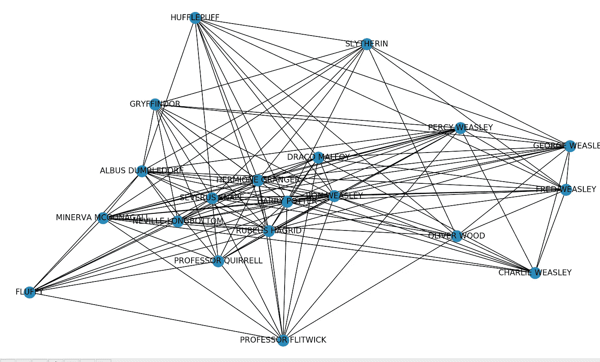

# 与其他书籍的比较

与《指环王》的比较。我们对比一下*哈利波特与魔法石*和*魔戒:魔戒相交*的文笔。更准确地说，我们对这两本书进行完全相同的分析，寻找它们之间的相似和不同之处。例如，尽管《LOTR》要长得多，但在两本书中存在的实体和交互的数量是相似的。然而，与哈利波特不同，LOTR 是围绕几个人物和几个情节展开的。

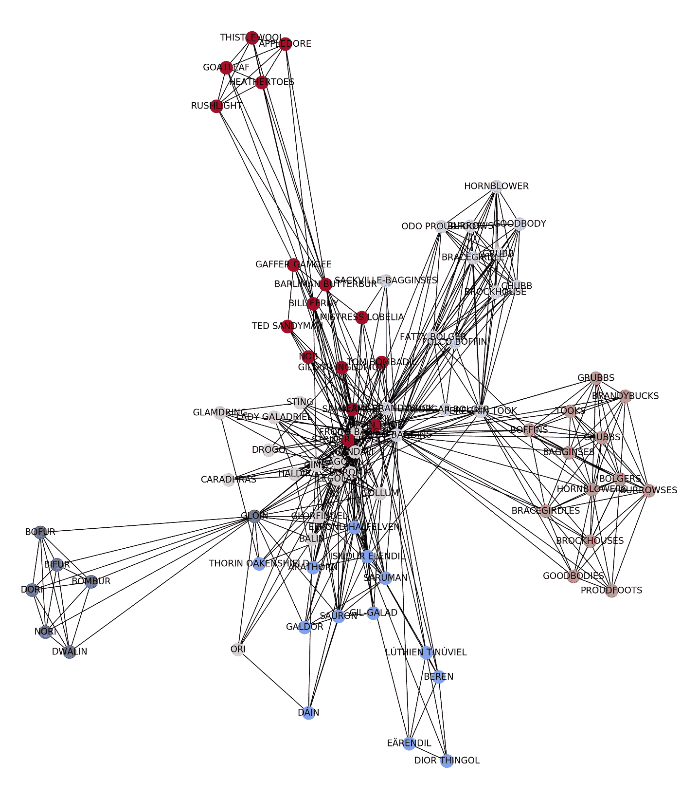

**更进一步**，我们可以计算全动态图的嵌入(就像网络表示学习领域中的图分类一样— [资源](/graph-embeddings-the-summary-cc6075aba007))并计算两个图的嵌入之间的距离。它可以让每个人看到哪些书非常相似。请注意，只有在处理了两本书以上的情况下(这里不是这种情况)，它才是相关的，以便对度量的数量级有一个概念。

# 结论

在这篇文章中，我们构建并分析了一个小说的社会角色网络的动态版本。我们首先处理这本书的文本内容——使用伯特·NER 提取所有出现的字符，并特别强调共同引用以获得尽可能准确的图表。然后，我们创建了一个动态异构图框架，将时间维度嵌入到我们的网络中，并专注于五个不同的任务:角色重要性、结构变化、社区检测、图总结和书籍比较。指导他们给了我们关于这本书的情节、作者的风格、与其他书的写作模式的不同、人物(重要性、关系、角色、主要互动等)的宝贵信息。).

我们的网络分析证实了一些预期，并为这本想象丰富的书《哈利·波特与魔法石》提供了新的见解。请注意，我们已经考虑了网络科学的一个奇特应用，以展示其诱人的能力。其他相关任务包括小说聚类、预测流派、作者甚至新角色互动。更一般地说，更严肃的应用比比皆是，网络科学有望在理解我们现代网络生活中发挥不可估量的作用。

# 参考

*[*基于结构的小说聚类*](https://www.aclweb.org/anthology/W14-0905/) *、Mariona Coll Ardanuy 和 Caroline Sporleder。2014.**

**【2】*[*用图形漫画讲述动态网络的故事*](https://doi.org/10.1145/2858036.2858387) *。本杰明·巴赫等人 2016。**

**【3】*[*权力网*](https://doi.org/10.4169/mathhorizons.23.4.18) *。安德鲁·贝弗里奇和洁珊。2016.**

**【4】*[*从文学小说中提取社交网络*](https://www.aclweb.org/anthology/P10-1015) *。David Elson 等人，2010 年。**

**【5】*[*虚构人物网络的提取与分析:一个综述。*](https://doi.org/10.1145/3344548) *文森特·拉巴图和泽维尔·博斯特。2019.**

**[*如何用网络讲故事:用《伊利亚特》探索图表的叙事启示。*](https://papers.ssrn.com/sol3/papers.cfm?abstract_id=3043857) *托马索·文图林等 2017。***