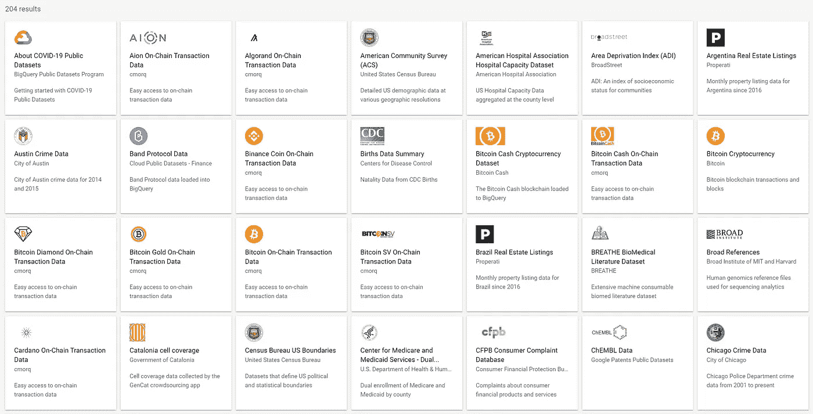
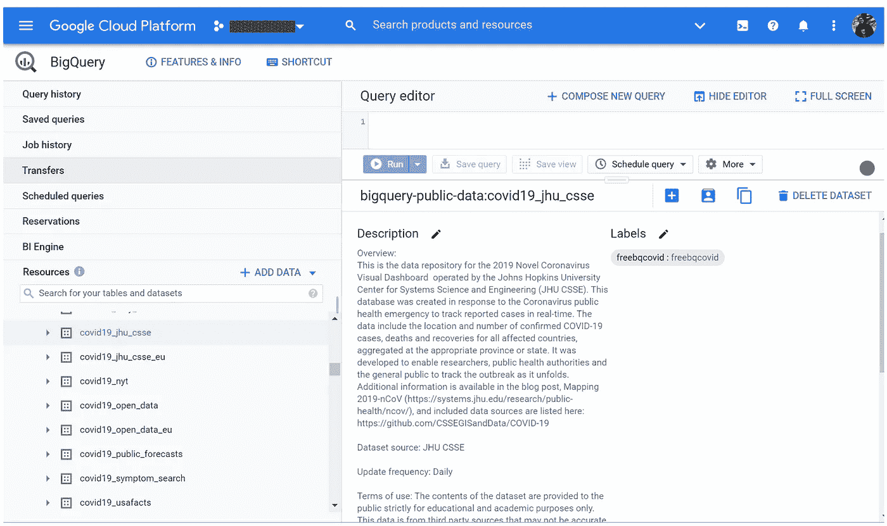
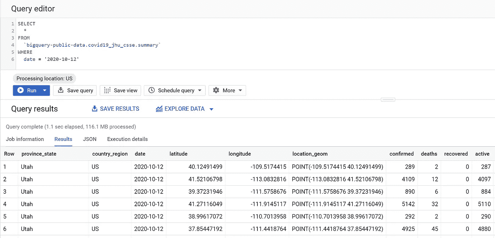
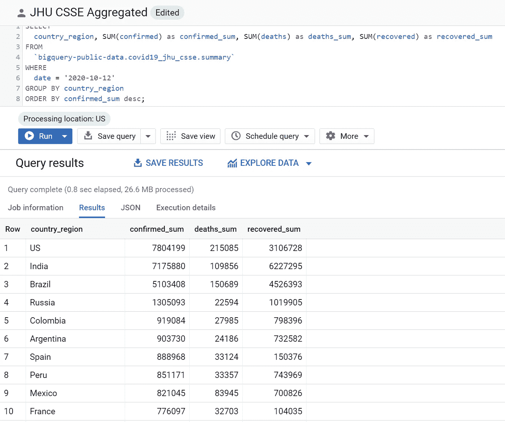
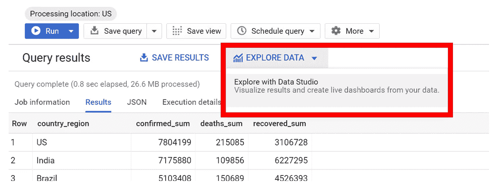
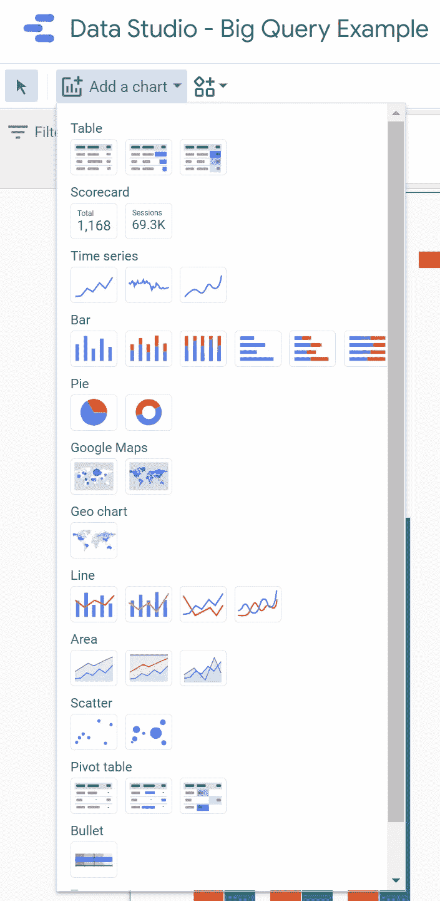
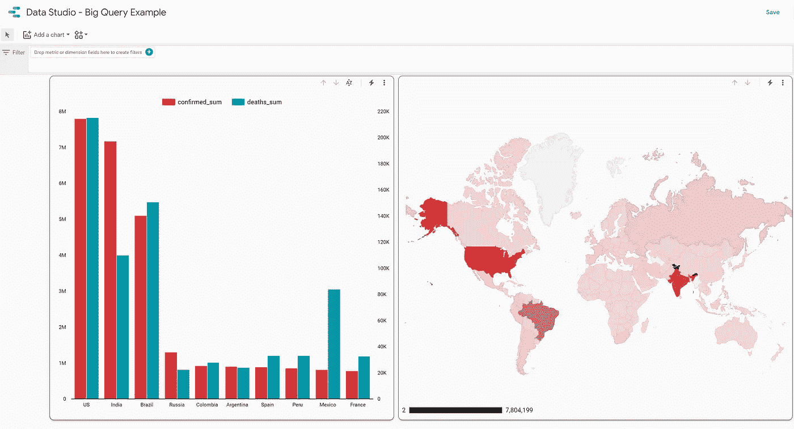
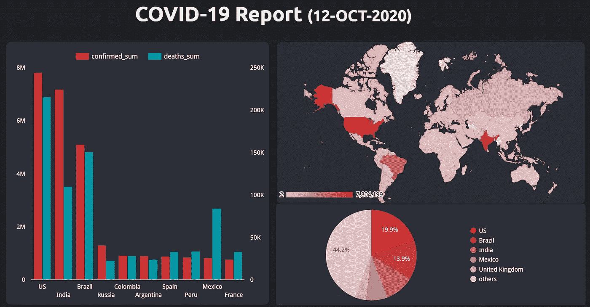
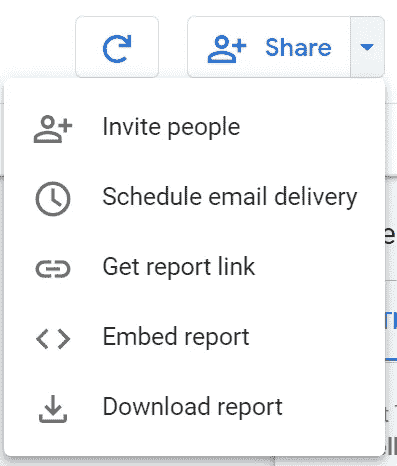

# 使用 Google BigQuery 和 DataStudio 探索公共数据集

> 原文：<https://towardsdatascience.com/explore-public-dataset-with-google-bigquery-and-datastudio-30f9279b8d42?source=collection_archive---------25----------------------->

## 数据科学基本指南

## 在您的 Web 浏览器中探索和报告海量数据集—以新冠肺炎数据集为例


卢克·切瑟在 [Unsplash](https://unsplash.com?utm_source=medium&utm_medium=referral) 上的照片

M 任何时候，作为数据科学家，我们都会在数据存储、导入、管理和清理过程中浪费大量时间。在这篇短文中，我将向您介绍如何使用谷歌云服务(BigQuery + DataStudio 免费计划)来探索开源数据集，并以谷歌云公共数据集计划中的新冠肺炎数据集为例。



**来自 Google Big Query** 的公共数据集样本(作者截图来自 [Google BigQuery](https://console.cloud.google.com/marketplace/browse?filter=solution-type:dataset&_ga=2.140859505.2950655.1602607821-457604929.1600630984&_gac=1.45886806.1602102310.CjwKCAjwzvX7BRAeEiwAsXExo_ZjYY7o4ZxLjOvmf60ZwZfZ5UResXswhfV2K1LXzzJNBCp5X7pfchoCVHMQAvD_BwE) )

## 好消息，免费了！

与谷歌云公共数据集计划中的所有数据一样，谷歌为该计划中数据集的存储付费。BigQuery 还提供对某些 COVID 相关数据集的免费查询，以支持对新冠肺炎的响应。对 COVID 数据集的查询将不计入 BigQuery 沙盒空闲层。与免费层一样，您每个月最多可以免费查询 1 TB，每个月最多可以查询 1TB，完全免费。[1]嗯，你可以探索的数据还真不少！

## 开始前你需要什么？

*   谷歌云[账户。(自由层就足够了)](https://cloud.google.com/)
*   一些标准的 SQL 知识——为了能够查询数据，你可以在网上找到一些教程，比如在[https://www.w3schools.com/sql/](https://www.w3schools.com/sql/)

是的，就是它——你可以走了！

# 我们开始吧

## 步骤 1:探索 Google Cloud BigQuery 中的公共数据

首先，只需前往你的谷歌云控制台，然后进入[谷歌大查询网络界面](https://console.cloud.google.com/bigquery)。然后，你会在 web 界面的左下窗口找到可用的大查询公共数据。您可以通过单击来检查每个数据集的元数据。

例如，下图显示了来自 JHU CSSE 的新冠肺炎数据集，该数据集由谷歌托管并每天更新。



**BigQuery Web 界面**(作者)

## 第二步:查询数据！

在选择了您想要的数据存储桶之后，您可以像在数据库系统中一样，使用标准的 SQL 语言简单地查询您需要的数据。

例如，让我们研究来自 CSSE JHU 的新冠肺炎数据集，其中的数据日期为“2020–10–12 ”,您可以使用以下 SQL 脚本来完成:

```
**SELECT
  *
FROM
  `bigquery-public-data.covid19_jhu_csse.summary` 
WHERE
  date = '2020-10-12'**
```

然后，单击 Run 按钮开始查询。



例如，使用 BigQuery 查询新冠肺炎(JHU-CSSE)数据集。(作者)

你可以做更复杂的查询；例如，确认、死亡和康复的新冠肺炎病例的汇总摘要；按国家级别分组；按确诊病例数排序；可以使用以下 SQL 脚本进行查询:

```
**SELECT
  country_region, SUM(confirmed) as confirmed_sum, SUM(deaths) as deaths_sum, SUM(recovered) as recovered_sum
FROM
  `bigquery-public-data.covid19_jhu_csse.summary` 
WHERE
  date = '2020-10-12'
GROUP BY country_region
ORDER BY confirmed_sum desc;**
```



**例如，使用 BigQuery 查询聚合的新冠肺炎(JHU-CSSE)数据集。**(作者)

## 步骤 3:使用 DataStudio 浏览数据

当您对查询结果满意后，您可以使用 Google 的 DataStudio 服务进行可视化和探索。您可以在 BigQuery web UI 的查询结果上找到这个选项。



**使用 Data Studio 探索数据。**(作者)

在 DataStudio 中，有一系列数据可视化工具，如图表、地图等；您可以用它来研究 BigQuery 中的查询数据。



**Data Studio 可视化工具。**(作者)

将数据微件添加到 Data Studio 后，它将自动显示查询的数据集中的数据。这些工具非常好用，可以灵活地调整颜色或主题(亮或暗)。



**data studio 中新冠肺炎数据的图表和地图可视化示例(浅色主题)。**(作者)



**data studio 中新冠肺炎数据的图表和地图可视化示例(深色主题)。**(作者)

此外，您可以很容易地邀请任何人在这个数据报告上进行协作。或者，获取一份 PDF 报告。或者甚至将嵌入式报告放到您网站上。



**共享数据工作室报告。**(作者)

# 结论:

本文以查询来自 JHU CSSE 的新冠肺炎数据集为例，展示了如何使用 Google Cloud BigQuery 来探索公共数据集。之后，它还展示了如何使用 Data Studio 以一种简单的方式从查询结果创建报告仪表板。我希望你喜欢这篇文章，并发现它对你的日常工作或项目有用。如果您有任何问题或意见，请随时给我留言。

关于我&查看我所有的博客内容:[链接](https://joets.medium.com/about-me-table-of-content-bc775e4f9dde)

安全**健康**和**健康**！💪

感谢您的阅读。📚

## 参考

[1] Chad W. Jennings，新冠肺炎公共数据集计划:让数据可自由访问以获得更好的公共结果(2020 年 10 月 13 日)，谷歌云数据分析