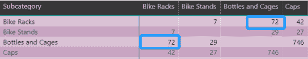
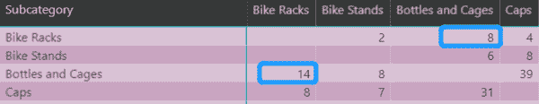
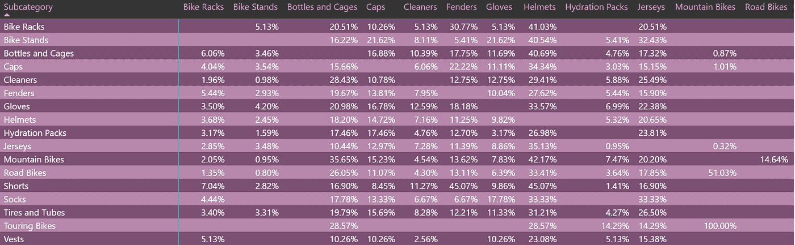
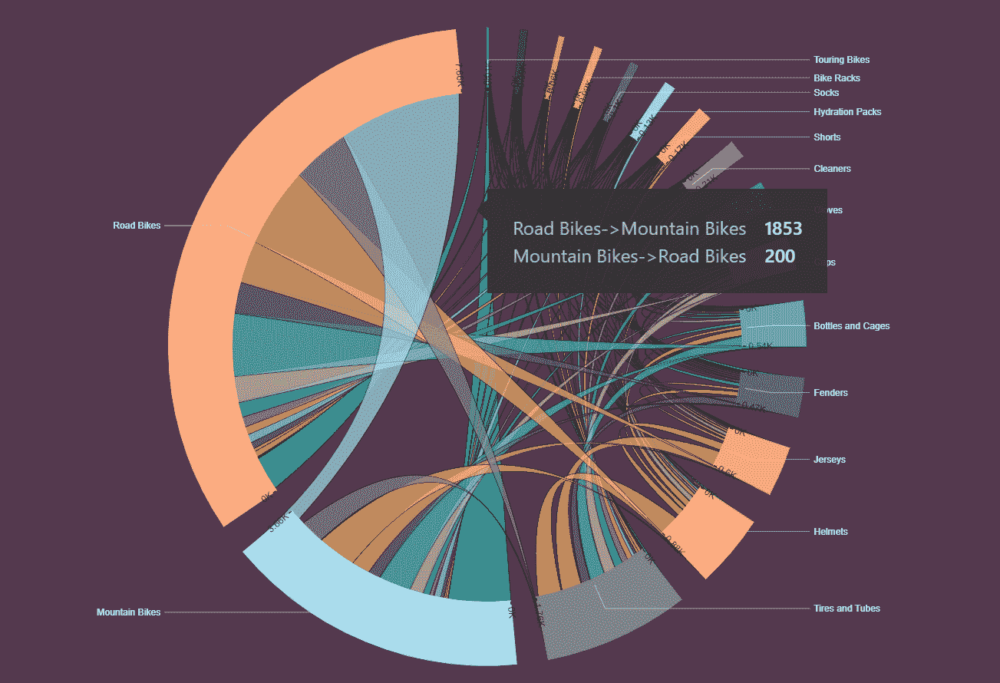

# 高级 DAX 教程:篮子分析 2.0

> 原文：<https://towardsdatascience.com/explore-the-potential-of-products-through-customers-purchase-behaviour-in-power-bi-basket-a1f77e8a2bf6?source=collection_archive---------21----------------------->

## 通过 Power BI 中的客户购买行为发掘产品的潜力

*本文旨在使用 DAX 分析 Power BI 中的客户购买行为，并洞察产品潜力。*

[*马尔科·鲁索*](https://www.sqlbi.com/author/marco-russo/) *和* [*阿尔贝托·法拉利*](https://www.sqlbi.com/author/alberto-ferrari/) *几年前曾发表过一篇名为《* [*购物篮分析*](https://www.daxpatterns.com/basket-analysis/) *》的博客，这篇有趣的文章详细描述了如何使用 DAX 来计算任何产品组合下的订单数和客户数等非常有用的指标。这篇文章可以看作是“购物篮分析”的扩展，它考虑了客户购买不同产品的时间顺序。*

# 与“篮子分析”相比

假设 A 和 B 代表两种不同的产品，那么“篮子分析”计算的是 P(AB)，而本文计算的是 P(A|B)和 P(B|A)，因为你可以比较下图所示的两个数字:



作者图片

上图是“购物篮分析”中“两种产品都有客户”的衡量标准，显示有 72 个客户同时有“瓶瓶罐罐”和“自行车架”的购买记录。但是，下图中显示的数据考虑了客户购买产品的时间顺序。你可以发现，先买自行车架，后买瓶子和笼子的顾客有 8 个，先买瓶子和笼子，后买自行车架的顾客有 14 个。(注:我们暂时忽略同时买 A 和 B 的情况)



作者图片

# 为什么这个分析有意义？

客户的订单记录反映了一些非常有用的事实，为产品之间的关联提供了方向。换句话说，“购物篮分析”在分析超市数据时非常有用，因为顾客往往在购物时选择多种产品，然后去收银台一起下单。在这种情况下，所有产品都被视为同时订单。但实际上，你无法追溯顾客在超市购物过程中选择不同商品的记录。但是如果是在其他场景，比如客户在电商平台或者官网上下单，如果你作为店长，你可能想知道 A 和 B 是最畅销的型号，哪一个能带来更多的回头客，哪一个更容易流失客户。所以我们需要知道每个产品的回购百分比。比如所有先购买产品 A 的客户，未来有多少人会再回来购买产品，进一步分析，在这些人中，购买的仍然是产品 A 还是其他产品？各占多大比例，这是一个值得研究的问题。

# 计算过程。

按照计算过程，我们将最终实现下图所示的计算结果(注:我使用的数据集与“篮子分析”相同):



作者图片

如前所述，它显示了哪些客户首先购买了产品 A 并有后续购买记录，其中有多少客户购买了产品 B 或产品 C 等。

因此，为了达到这个计算结果，这里有五个步骤:

1.首先，对销售表的所有订单进行分类，在客户的所有订单中，订单日期最早的一个或多个订单被分类为第一个订单，其余为“非第一个”:

```
IsFirstOrder = 
VAR
E_Date = 'Sales'[OrderDateKey]
VAR
CUST = 'Sales'[CustomerKey]
RETURN
IF(
    SUMX(
        FILTER('Sales',
        CUST = 'Sales'[CustomerKey]&&
        E_Date > 'Sales'[OrderDateKey]),
        COUNTROWS('Sales'))>0,FALSE,TRUE)
```

2.过滤销售中所有产品 A 的订单数据，然后进一步过滤哪些订单被标记为客户的第一个订单，我们在这个过滤后的表中提取客户列表，并在其中添加一个名为“ROWS”的虚拟列，如下面的代码所示—虚拟表“VT1”。

3.使用 Sales 作为主表，并使用 NATURALLEFTOUTERJOIN()与虚拟表“VT1”相关联，然后使用 filter()排除那些[ROWS]值不等于 1 的行，以便剩余的数据(VT2)是“VT1”返回的所有客户的所有订单。最后，对除“一阶”以外的所有订单进一步筛选数据，结果命名为“CustDistinctValue”:

```
CustDistinctValue = 
VAR
FIRSTORDERPROD = 
IF(HASONEVALUE('Product'[Subcategory]),
    VALUES('Product'[Subcategory]),0)
VAR
VT1 = 
SUMMARIZE(
    FILTER(Sales,
        AND(related('Product'[Subcategory]) = FIRSTORDERPROD,
            'Sales'[IsFirstOrder]=TRUE)),
        'Sales'[CustomerKey],
        "ROWS",
        DISTINCTCOUNT(Sales[CustomerKey]))
VAR
VT2 = 
FILTER(
    NATURALLEFTOUTERJOIN(ALL(Sales),VT1),
    [ROWS] = 1)
RETURN
CALCULATE(
    DISTINCTCOUNT('Sales'[CustomerKey]),
    FILTER(VT2,'Sales'[IsFirstOrder] = FALSE)
)
```

4.之后，我们需要确保这些数据可以被产品过滤(在这种情况下，我们只使用子类别)。这里和 Macro 的计算方法基本相同，使用产品表的副本(过滤产品)和主表建立非活动关系，然后创建一个度量，使其上下文忽略产品表的所有字段，接受来自其副本(过滤产品)的上下文。

```
CustPurchaseOthersSubcategoryAfter = 
VAR CustPurchaseOthersSubcategoryAfter = 
CALCULATE (
    'Sales'[CustDistinctValue],
    CALCULATETABLE (
        SUMMARIZE ( Sales, Sales[CustomerKey] ),
        'Sales'[IsFirstOrder] = FALSE,
        ALLSELECTED ('Product'),
        USERELATIONSHIP ( Sales[ProductCode],
             'Filter Product'[Filter ProductCode] )
    )
)
RETURN
IF(NOT([SameSubCategorySelection]),
    CustPurchaseOthersSubcategoryAfter)
```

注:“SameSubCategorySelection”用于排除选择相同子类别的数据。这个公式也使用宏的方法来完成:

```
SameSubCategorySelection = 
IF (
    HASONEVALUE ( 'Product'[Subcategory] )
        && HASONEVALUE ( 'Filter Product'[Filter Subcategory] ),
    IF (
        VALUES ( 'Product'[Subcategory])
            = VALUES ( 'Filter Product'[Filter Subcategory] ),
        TRUE
    )
)
```

5.现在，我们已经计算出购买产品 A 的客户中有多少人首先购买了其他产品，现在我们需要计算这些客户占首先购买产品 A 然后有购买记录的客户总数的比例。下面是计算这个比例的分母的代码。

```
AsFirstOrderCust = 
VAR
FIRSTORDERPROD = 
IF(
    HASONEVALUE('Product'[Subcategory]),
    VALUES('Product'[Subcategory]),0)
VAR
VT1 = 
SUMMARIZE(
    FILTER(Sales,
        AND(
            RELATED('Product'[Subcategory]) = FIRSTORDERPROD,
                'Sales'[IsFirstOrder]=TRUE)),
            'Sales'[CustomerKey]
)
return
CALCULATE(
    DISTINCTCOUNT('Sales'[CustomerKey]),
    VT1)-------------------------------------------------------------------------------
IsLastOrder = 
VAR
E_Date = 'Sales'[OrderDateKey]
VAR
CUST = 'Sales'[CustomerKey]
RETURN
IF(
    SUMX(
        FILTER('Sales',
        CUST = 'Sales'[CustomerKey]&&
        E_Date < 'Sales'[OrderDateKey]),
        COUNTROWS('Sales'))>0,"F","T")-------------------------------------------------------------------------------
AsFirstOrderCustRepurchase = 
CALCULATE(
    'Sales'[AsFirstOrderCust],
    'Sales'[IsLastOrder] = "F")
```

现在我们得到最终的结果:custpruchaseotherssubcategoryaafter %，这个度量的名字很长，因为它的逻辑很复杂，就像上面的计算过程一样。

```
CustPurchaseOthersSubCategoryAfter *% =* 
DIVIDE ( 'Sales'[CustPurchaseOthersSubcategoryAfter],
    'Sales'[AsFirstOrderCustRepurchase])
```

# 最后的结果。

最后，我们将成功地得到如下的最终结果，并选择使用一个名为“CHORD”的自定义视觉效果来可视化它。


作者图片



作者图片

正如你所看到的，首先购买公路车的顾客中，1853 人后来购买了山地车，而有趣的是，只有 200 名顾客在购买山地车后购买了公路车。

*非常感谢* [*格哈德*](https://blog.gbrueckl.at/about/) *之前的指点，这次我在文章中附上了 PBIX 文件，有兴趣的可以在这里*[](https://1drv.ms/u/s!AjpQa2fseaxaoDLeh4yBlBSaa-qx)**下载。**

**结束~**