# 用 R 探索你在 Google 上的活动:如何分析和可视化你的搜索历史

> 原文：<https://towardsdatascience.com/explore-your-activity-on-google-with-r-how-to-analyze-and-visualize-your-search-history-1fb74e5fb2b6?source=collection_archive---------21----------------------->

## 使用一份你的个人资料，找出你是如何使用这个世界上最流行的搜索引擎的，以及使用了多少。

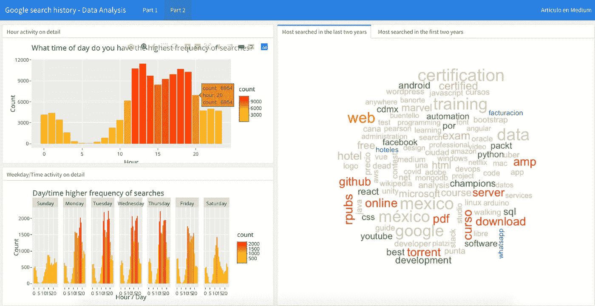

仪表板，以查看您的谷歌搜索活动历史。文末的链接。

你能想象一个没有世界上最流行的搜索引擎的世界吗？亲爱的读者，我敢打赌，如果你年龄在 18 至 25 岁之间，接触字典或百科全书对你来说不是日常生活的一部分，就像我们许多人在年轻时那样。

如今，任何人都可以点击鼠标找到答案、知识、信息(和错误信息)。这就是为什么我觉得能够看看我们的个人消费习惯是如何变化的很有趣，特别是如果你有很长的历史，因为你打开了谷歌的大门，找到了关于你的一切。

# 我在哪里可以获得我的数据的副本？

多亏了**谷歌外卖**，谷歌提供了一个工具来查阅你使用过的任何产品中存储的数据，你可以查阅你的搜索历史。你必须输入 https://takeout.google.com/settings/takeout[的网址](https://takeout.google.com/settings/takeout)才能登录你的个人账户。

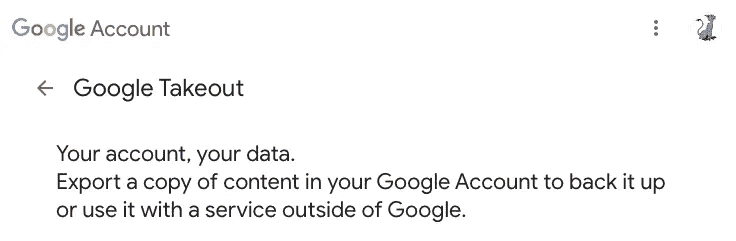

截图:谷歌外卖网站

您可以要求您的数据或副产品的完整副本，或者只选择单个产品的某些特征。对于我们来说，为了本文的目的，选择**“我的活动”**就足够了。

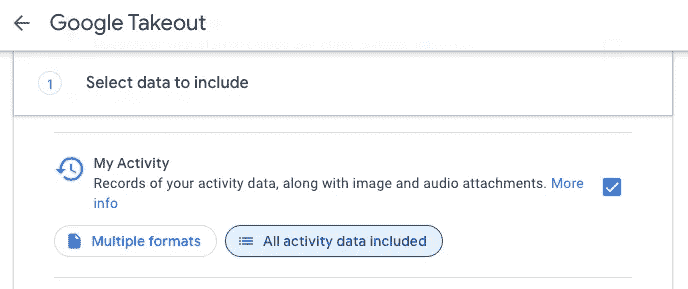

截图:我在谷歌外卖的活动选择

我还建议您确保取消选中它包含的其余选项，只保留**“Search”**选项，以减少它将生成的文件的重量和交付时间。

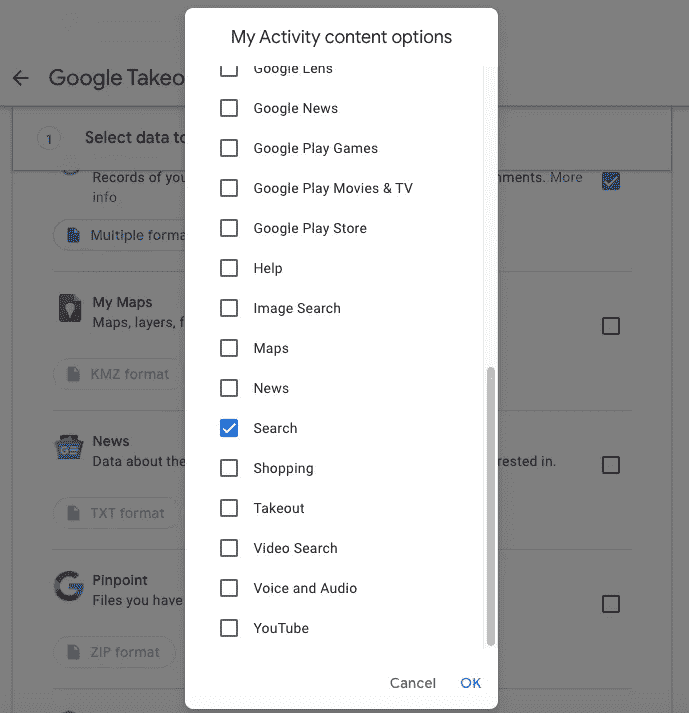

截图:搜索选择，在我在谷歌外卖的活动中

完成后，您必须选择**“导出一次”**并选择**。zip** 交付格式。

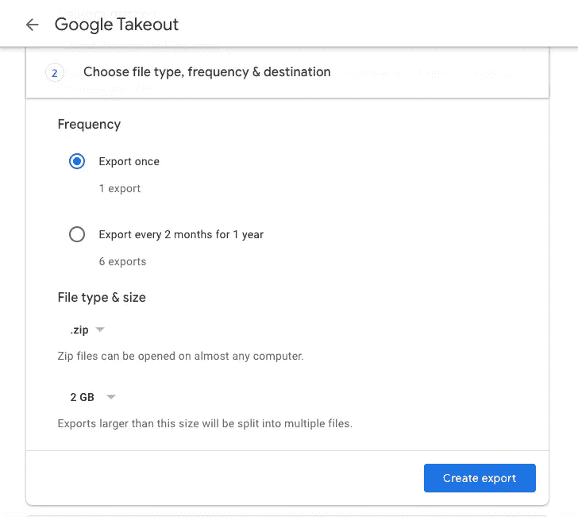

截图:生成。压缩谷歌外卖

瞧，现在你只需要耐心等待你选择的内容的副本生成。

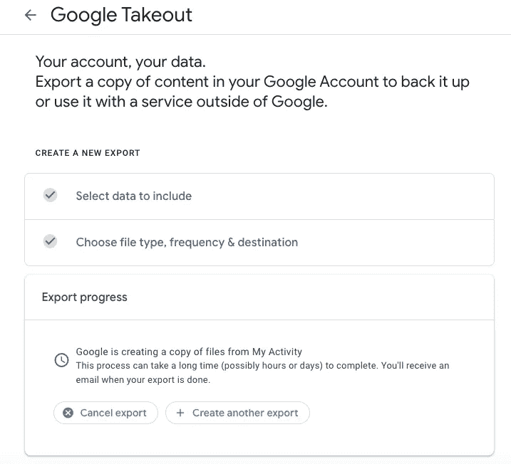

截图:确认谷歌外卖生成的文件

文件生成后，您将会收到一封通知电子邮件，邀请您下载该文件，出于安全原因，该文件的截止日期会在指定日期之前。

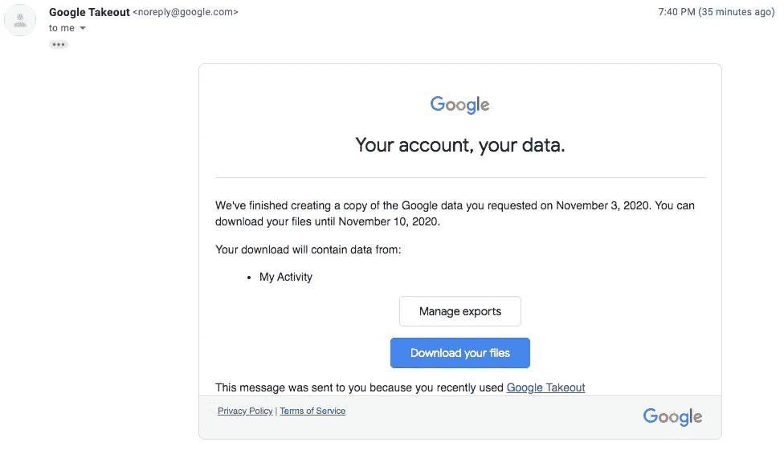

截图:谷歌外卖的数据下载通知邮件

当你打开。在您下载的 zip 文件中，您会发现一个名为**“my activity . html”**的文件。

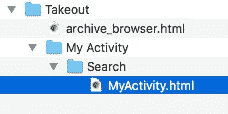

截图:解压后的文件夹结构。活力

这个 HTML 文件包含您在 Google 中搜索历史的完整数据，从您第一次使用搜索引擎开始，直到您使用 Google 外卖生成这个数据副本。

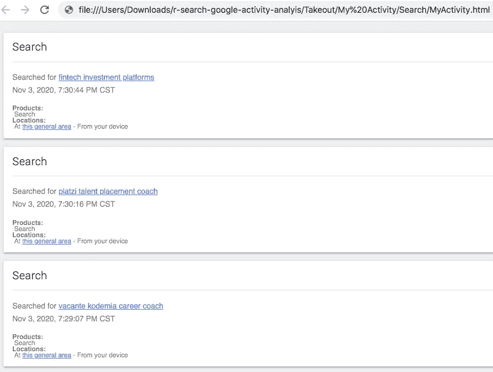

截图:谷歌搜索历史 HTML 文件

# 读取导出的数据

现在，您可以继续处理在新的 R 脚本中获得的信息。首先，您必须包含您将使用的所有软件包，并建立对您的搜索历史记录的读取，这些记录包含在“我的活动”文件夹中的“搜索”文件夹内的文件**“My Activity . html”**中。

```
# REQUIRED LIBRARIES
library(wordcloud)
library(lubridate)
library(rvest)
library(tm)
library(tidyverse)# READ DATA
fileHTML <- "Takeout/My Activity/Search/MyActivity.html"
mySearchFile <- read_html(fileHTML, encoding = "UTF-8")
```

您将提取您感兴趣的数据，并使用**“rvest”**包对 HTML 进行 web 清理。这样，使用正则表达式，您可以提取搜索的日期和时间、搜索的文本以及您在 Google 上进行的搜索类型，从而创建包含所有这些信息的数据框。

```
# SCRAPPING SEARCH DATE AND TIME
dateSearch <- mySearchFile %>% 
  html_nodes(xpath = '//div[[@class](http://twitter.com/class)="mdl-grid"]/div/div') %>% 
  str_extract(pattern = "(?<=<br>)(.*)(?<=PM|AM)") %>%
  mdy_hms()
dateSearch[1:5]# SCRAPING SEARCH TEXT
textSearch <- mySearchFile %>% 
  html_nodes(xpath = '//div[[@class](http://twitter.com/class)="mdl-grid"]/div/div') %>%
  str_extract(pattern = '(?<=<a)(.*)(?=</a>)') %>% 
  str_extract(pattern = '(?<=\">)(.*)')
textSearch[1:5]# SCRAPING SEARCH TYPE
searchType <- mySearchFile %>% 
  html_nodes(xpath = '//div[[@class](http://twitter.com/class)="mdl-grid"]/div/div') %>% 
  str_extract(pattern = "(?<=mdl-typography--body-1\">)(.*)(?=<a)") %>% 
  str_extract(pattern = "(\\w+)(?=\\s)")
searchType[1:5]# CREATE DATA FRAME USING SCRAPED DATA
searchedData <- tibble(timestamp = dateSearch,
                      date = as_date(dateSearch),
                      year = year(dateSearch),
                      month = month(dateSearch, label = TRUE),
                      day = weekdays(dateSearch),
                      hour = hour(dateSearch),
                      type = searchType,
                      search = textSearch)searchedData$day <- factor(searchedData$day, levels = c("Sunday", "Monday", "Tuesday", "Wednesday","Thursday", "Friday", "Saturday"))searchedData <- na.omit(searchedData)
head(searchedData)
```

因此，您将获得一个包含 8 个变量的新数据框。

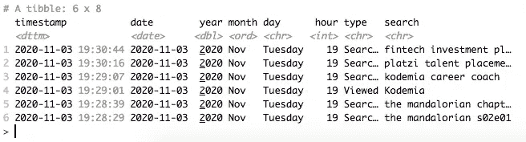

屏幕截图:从 HTML 创建的数据框的控制台预览

# 随着时间的推移，你在谷歌上搜索的频率发生了多大的变化？

这可能是你可以回答的第一个问题。根据获得的信息，您可以查看与您的历史年份相关的搜索次数。

```
# PLOT SEARCHED BY YEAR
searchByYear <- ggplot(searchedData, aes(year, fill=..count..)) +
  scale_fill_gradient(low = "yellow", high = "red")+
  geom_bar(width=0.7)+
  labs(x= "Year", y= "Count") + 
  ggtitle("How much your search frequency has changed over time", "Search activity by year")
searchByYear
ggplotly()
```

以我为例，我的历史从 2007 年延续到 2020 年的今天。也就是说，13 年的搜索量表示如下。与 2014 年之前的几年相比，有非常显著的增长，在 2014 年之前，我主要继续使用雅虎搜索引擎，而且在我看来，必须考虑到越来越快的互联网连接也促进了向谷歌进行越来越多查询的可能性。

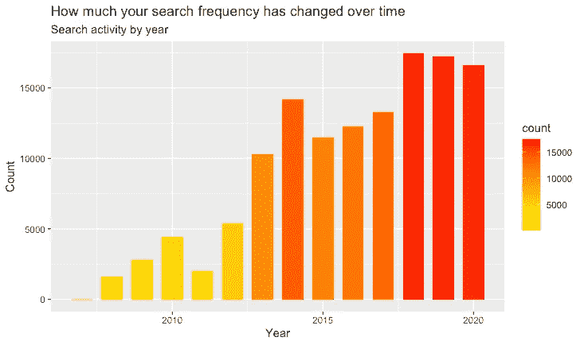

如何分析和可视化您的个人数据搜索历史——每年搜索次数的图表

# 随着时间的推移，你在谷歌上搜索的频率发生了多大的变化？(按月详细查看)

你可以对之前获得的结果进行更深入的挖掘，现在可视化你在谷歌上搜索的频率发生了多大的变化，按你的历史记录中的月份进行详细描述。

```
# PLOT SEARCH BY MONTH
searchByMonth <- searchedData[(searchedData$year > 2007 & searchedData$year< 2021), ]
ggplot(searchByMonth, aes(year, fill=..count..)) + 
  scale_fill_gradient(low = "yellow", high = "red")+
  geom_bar(aes(x = month, group = year)) +
  theme(axis.text.x = element_text(angle=90)) +
  facet_grid(.~year, scales="free") + 
  labs(x= "Year / Month", y= "Count") + 
  ggtitle("How much your search frequency has changed over time", "Month activity on detail")
```

亲爱的读者，我几乎可以肯定，像我一样，如果你仔细观察，很多事情都与搜索次数的增加有关，这些搜索是关于贵国疫情新冠肺炎迫使你更多地呆在家里的最糟糕的几个月，因此也与你的手机、平板电脑和可以上网的电脑等设备有关。例如，就我而言，我认为 2020 年的最高纪录与我居住的国家(墨西哥)的红灯(关闭所有非必要的设施和在家远程工作)重合并非巧合。

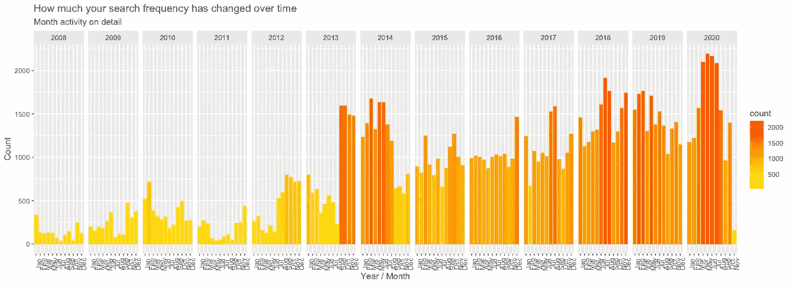

如何分析和可视化您的个人数据搜索历史——每年/每月搜索次数的图表

# 你一天中什么时候最常谷歌？

您也可以获得这些信息，因为您有使用流行的 Google 引擎进行搜索的准确时间的记录。

```
# PLOT SEARCH BY HOUR
searchByHour <- ggplot(searchedData, aes(hour, fill=..count..)) +
  scale_fill_gradient(low = "yellow", high = "red") +
  geom_bar() + 
  labs(x= "Hour", y= "Count") + 
  ggtitle("What time of day do you have the highest frequency of searches?", "Hour activity on detail")
searchByHour
```

结果你会得到下面的图，例如，在我的例子中，值得注意的是，我在 dawn 基本上不是谷歌用户。

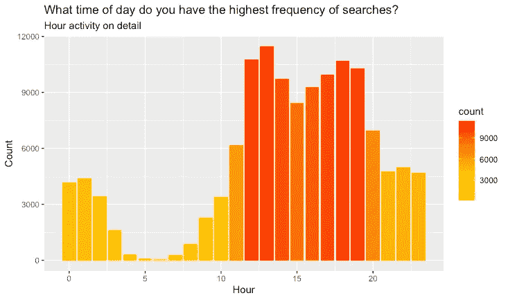

如何分析和可视化你的个人数据搜索历史——你最常搜索的时间图

# 一周中的哪一天你最常谷歌？

按照前面的示例，您还可以直观地看到一周中哪一天您执行的搜索次数最多。

```
# PLOT SEARCH BY WEEKDAY
seearchByWeekD <- ggplot(searchedData, aes(day, fill=..count..)) + 
  scale_fill_gradient(low = "yellow", high = "red") +
  geom_bar() +
  labs(x= "Day", y= "Count") + 
  ggtitle("What day of the week do you have the highest frequency of searches?", "Weekday activity on detail")
seearchByWeekD
```

可以预料，如果你像我一样，利用周末稍微远离上网，比如去看朋友，那么搜索量的下降将会非常明显。

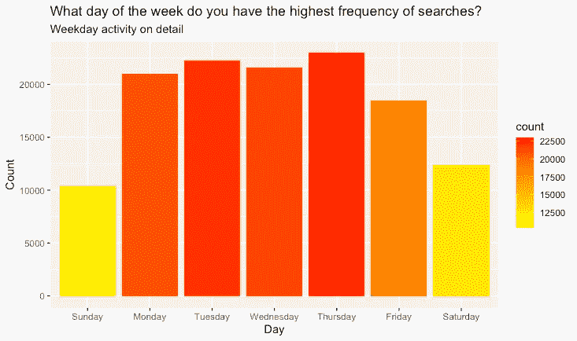

如何分析和可视化你的个人数据搜索历史——一周中你在谷歌上搜索最多的日子

# 一周中的某一天和你经常搜索的时间之间关系的数据可视化

在最后两个图中，您可以看到一周中您在 Google 中注册最多搜索的时间和日期，您可以创建一个新的图来详细查看这两者之间的关系。

```
# PLOT SEARCH BY WEEKDAY AND TIME 
searchWdayTime <- ggplot(searchedData) + 
  scale_fill_gradient(low = "yellow", high = "red")+
  geom_bar(aes(x = hour, group = day, fill=..count..) ) +
  labs(x= "Hour / Day", y= "Count") + 
  ggtitle("Relationship between day / time you have a higher frequency of searches", "Weekday/Time activity on detail") +
  facet_grid(.~day, scales = "free")
searchWdayTime
```

这样，你就会得到如下这样的情节。您还可以将数据与您已经使用的其他变量(如月和年)进行交叉。

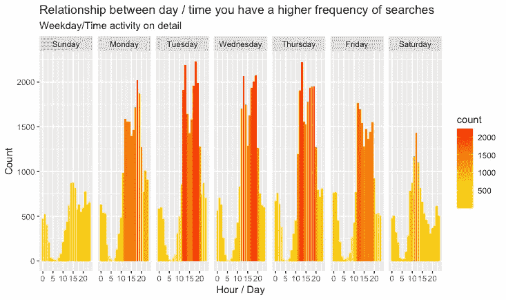

如何分析和可视化您的个人数据搜索历史——一周中的日期和时间之间的关系图，您通常在其中进行搜索

# 在过去的两年里，谷歌搜索次数最多的术语是什么？

这是另一个有趣的问题，你可以通过使用**“word cloud”**包查看数据来回答。首先，您必须提取术语，以便以后清理它们，从而能够创建一个文本语料库。你也应该删除不提供相关信息的词，如冠词和代词。

```
# CLEAN AND EXTRACT TEXT TO CREATE A TEXT CORPUS
lastTwoYears <- searchedData[(searchedData$year > 2007 & searchedData$year< 2010), ]search <- tolower(lastTwoYears$search)
search <- gsub('(http|https)\\S+\\s*|(#|@)\\S+\\s*|\\n|\\"', " ", search)
search <- gsub("(.*.)\\.com(.*.)\\S+\\s|[^[:alnum:]]", " ", search)
search <- trimws(search)textCorpus <-  Corpus(VectorSource(search))
textCorpus <- tm_map(textCorpus, content_transformer(removePunctuation))
textCorpus <- tm_map(textCorpus, content_transformer(removeNumbers))
stopwords <- c(stopwords("english"), "que", "com", "cómo", "como", "para", "con", "qué", "las", "los", "del", "can")
textCorpus <- tm_map(textCorpus, removeWords, stopwords)searchTDM <- TermDocumentMatrix(textCorpus)
searchMatrix <- as.matrix(searchTDM)
```

最后，您可以创建一个新的数据框，以便能够可视化最近两年在 Google 中搜索次数最多的术语。

```
# CREATE DATA FRAME WITH WORDS
arrange <- sort(rowSums(searchMatrix), decreasing = TRUE)
twNames <- names(arrange)
dataCloud <- data.frame(word = twNames, freq = arrange)wordcloud(dataCloud$word, dataCloud$freq, min.freq = 40, scale = c(2 , 0.5), max.words = 100, colors=brewer.pal(9, "Paired"))
```

然后你应该得到你搜索了至少 40 次或更多的词。这是我从 2018 年到 2020 年搜索次数最多的词条云。不要评价我搜索了这么多“洪流”请呵呵。

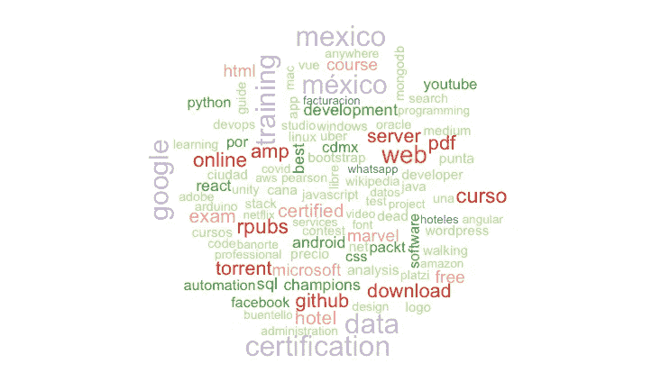

如何分析和可视化你的个人数据搜索历史——过去两年谷歌搜索次数最多的词

作为奖励，你可以重复这个练习，找出在你允许谷歌进入你的生活以了解你的一切的头两年里，搜索次数最多的术语是什么。你只需要修改 **lastTwoYears** 变量中包含的年份范围。以我为例，从 2008 年到 2010 年(这几年有很多 Flash 和论坛，在那里可以找到关于 web 开发的答案)，这是我的 wordcloud。显然，与之前生成的 wordcloud 相比，搜索量要低得多。

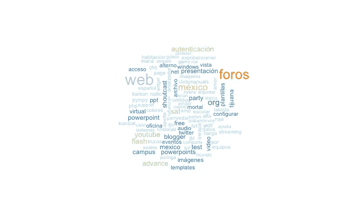

如何分析和可视化你的个人数据搜索历史——谷歌搜索历史前两年的最热门词汇

非常感谢您的善意阅读。和我的大多数文章一样，我在一个 **flexdashboard** 中分享了用 **plotly** 生成的情节，我把它们放在一起更美观一些:[https://rpubs . com/cosmoduende/Google-search-history-analysis](https://rpubs.com/cosmoduende/google-search-history-analysis)

在这里可以找到完整的代码:[https://github . com/cosmoduende/r-Google-search-history-analysis](https://github.com/cosmoduende/r-google-search-history-analysis)

感谢你坚持到最后，祝你分析非常愉快，可以把一切都付诸实践，对结果感到惊讶，和我一样开心！