# 用 R 探索你在网飞的活动:如何分析和可视化你的观看历史

> 原文：<https://towardsdatascience.com/explore-your-activity-on-netflix-with-r-how-to-analyze-and-visualize-your-viewing-history-e85792410706?source=collection_archive---------26----------------------->

## 你花多少时间看电视连续剧，以及更多

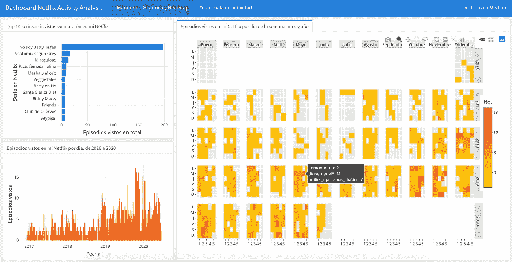

用于查看文章末尾网飞链接上的活动数据的仪表板

视频流媒体服务的到来彻底改变了娱乐业，我们的许多习惯也随之改变。无论你花几个小时还是几分钟看电影或电视剧，网飞已经成为现场的最爱。

像今天的许多应用程序一样，网飞允许用户自由查看他们的观看活动历史。对于本文，我们将使用我的历史来分析和可视化一些有趣的数据。

# 如何获取数据历史和准备

作为一名活跃的网飞用户，您必须输入网址[**【https://www.netflix.com/viewingactivity】**](https://www.netflix.com/viewingactivity)，在这里您将找到您最近在平台上看过的图书列表。

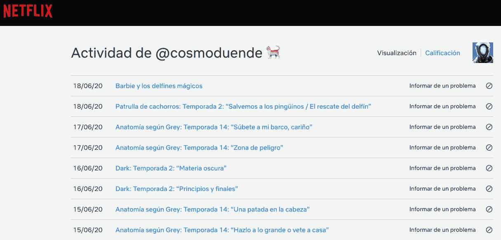

您在网飞的电视剧和电影观看活动

在页面的末尾，有一个链接写着**“下载全部”**，点击它将邀请你下载一个包含你的完整历史的 CSV 文件。默认情况下，下载的这个文件的名称是**“netflixviewingshistory . CSV”**，这是我们在 r 上工作所需要的。

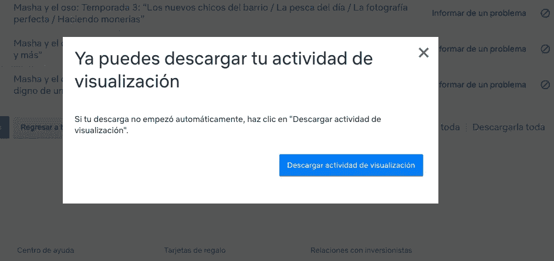

下载您在网飞观看活动的 CSV 文件

好了，创建一个新的 R 脚本，您可以导入我们将要使用的包和下载的 CSV 数据来开始分析它们，用一个更可读的日期格式。

```
# LIBRARIES
library(dplyr)
library(tidyr)
library(lubridate)
library(zoo)
library(ggplot2)# READING DATA FROM CSV DOWNLOADED FROM NETFLIX ACCOUNT
minetflix <- read.csv("NetflixViewingHistory.csv") 
str(minetflix)
minetflix$Date <- dmy(minetflix$Date)
```

如你所见，CSV 文件只有两列:日期(确切日期)和标题(你看过的电影或电视剧的插曲和季节的标题)。

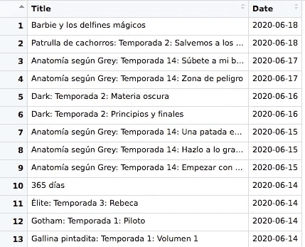

使用 R-导入的 CSV 文件进行网飞分析

# 狂看网飞，多少钱？

我们中的许多人沉迷于看一部或多部电视剧，突然你花了几个小时处于一种近乎催眠的状态，在这种状态下，其他的事情根本就不重要。没有定义“狂看”是多少小时或多少集，但我们都熟悉这个概念。做第一个分析，考虑到“狂看”是从 6 集到更多，我们来看看看的最多的电视剧有哪些。

让我们将标题列从数据中分离出来，利用网飞按电视剧标题、电视剧季节和电视剧集命名的格式中的常量。我们也来清理一下数据，把没有这个格式的东西(也就是电影)都去掉，专注电视剧。我们还需要确定每天观看的集的记录，属于单个电视连续剧。

```
# SEPARATE TITLE COLUMN IN TITLE OF TV SERIES, SEASON AND EPISODE TITLE
minetflix_serie <- minetflix %>%
  separate(col = Title, into = c("title", "temporada", "titulo_episodio"), sep = ': ')# REMOVE OCCURRENCES WHERE SEASON AND EPISODE ARE EMPTY (BECAUSE THEY ARE NOT TV SERIES)
minetflix_serie <- minetflix_serie[!is.na(minetflix_serie$temporada),]
minetflix_serie <- minetflix_serie[!is.na(minetflix_serie$titulo_episodio),]# REGISTRO DE NÚMERO DE EPISODIOS VISTOS POR DÍA, POR SERIE
maratones_minetflix <- minetflix_serie %>%
  count(title, Date)# LET'S CONSIDER "BINGE-WATCHING" 6 OR MORE EPISODES PER DAY AND SORT BY DATE
maratones_minetflix <- maratones_minetflix[maratones_minetflix$n >= 6,]
maratones_minetflix
maratones_minetflix <- maratones_minetflix[order(maratones_minetflix$Date),]
maratones_minetflix
```

在那些条件下，在我的例子中，我得到了 35 个观察值和 3 个变量。

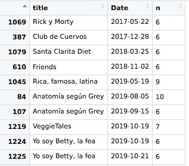

网飞分析 R——每天“狂看”最多的电视连续剧

# 想象网飞十大狂欢

现在，我们已经准备好观看收视率最高的 10 部电视连续剧，你已经为它们奉献了“疯狂观看”。我们将根据电视剧的标题对数据进行分组，并根据观看的剧集数量对数据进行排序。

```
# GROUPING DATA BY TV SERIES TITLE AND SORTING BY NUMBER OF EPISODES VIEWED
maratones_minetflix_todas <- maratones_minetflix %>% 
  group_by(title) %>% 
  summarise(n = sum(n)) %>%
  arrange(desc(n))# PLOTTING TOP 10 OF BINGE-WATCHING TV SERIES
maratones_minetflix_top <- maratones_minetflix_todas %>% 
  top_n(10) %>%
  ggplot(aes(x = reorder(title, n), y = n)) +
  geom_col(fill = "#0097d6") +
  coord_flip() +
  ggtitle("Top 10 de series más vistas en maratón en mi Netflix", "4 o más episodios por día") +
  labs(x = "Serie en Netflix", y = "Episodios vistos en total") +
  theme_minimal()
maratones_minetflix_top
```

然后我们将得到下面的图。请不要因为我花了那么多时间看《贝蒂，拉费》(这是一部受欢迎的哥伦比亚“肥皂剧”)而对我评头论足。

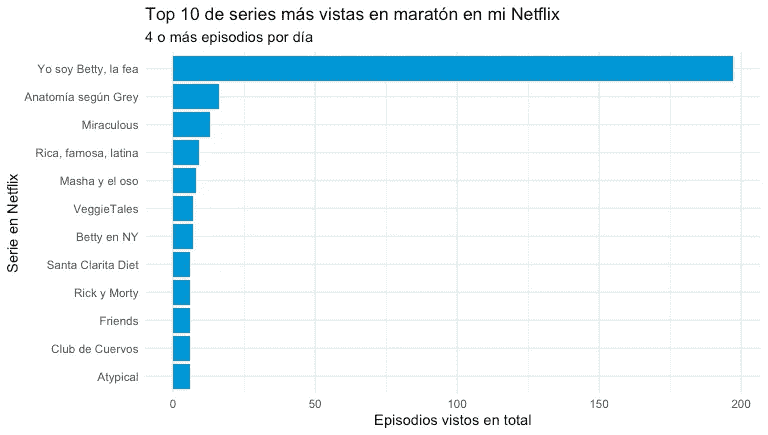

网飞分析与 R-10 大电视连续剧

# 你每天在电视剧上消耗多少网飞？

看看随着时间的推移，你的消费习惯发生了多大的变化，这将是一件有趣的事情。例如，最大峰值是否与新冠肺炎的锁定相匹配？或者也许它与你再次单身以来的所有时间相吻合？

您可以在您的活动历史中对每天的发作次数进行统计。

```
# EPISODES PER DAY
netflix_episodios_dia <- minetflix %>%
  count(Date) %>%
  arrange(desc(n))# PLOTTING EPISODES PER DAY
netflix_episodios_dia_plot <- ggplot(aes(x = Date, y = n, color = n), data = netflix_episodios_dia) +
  geom_col(color = c("#f16727")) +
  theme_minimal() +
  ggtitle("Episodios vistos en mi Netflix por día", "Historial de 2016 a 2020") +
  labs(x = "Fecha", y = "Episodios vistos") 
netflix_episodios_dia_plot
```

就我而言，在下面的图中，我的网飞账户中的消费一直在增加，这非常值得注意。

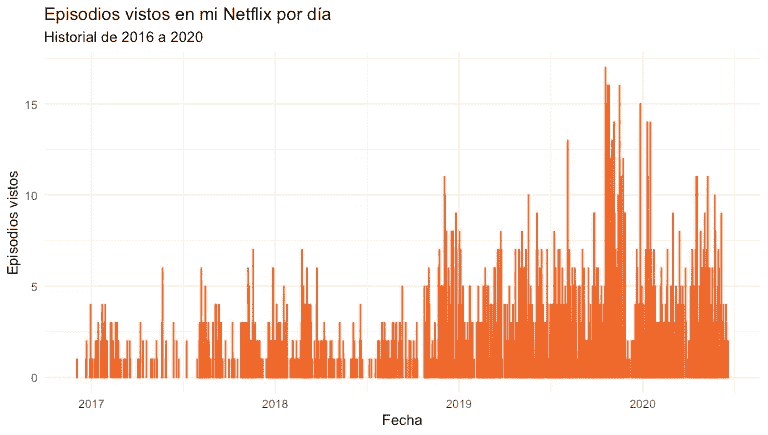

每天观看 R 集的网飞分析

# 每天，每月，每年观看电视剧集完整时间表

你可以更深入。让我们以另一种方式来看这个活动，用一个按天、周、月、年分布的热图，我们可以更好地指定每天消费或多或少电视剧集的时间。

```
# CALENDAR WITH NUMBER OF EPISODES SEEN PER DAY IN HEATMAP
netflix_episodios_dia <- netflix_episodios_dia[order(netflix_episodios_dia$Date),]
netflix_episodios_dia$diasemana <- wday(netflix_episodios_dia$Date)
netflix_episodios_dia$diasemanaF <- weekdays(netflix_episodios_dia$Date, abbreviate = T)
netflix_episodios_dia$mesF <- months(netflix_episodios_dia$Date, abbreviate = T)# YOU DON'T NEED TO RENAME NECESSARILY IN SPANISH DAYS OF THE WEEK AND MONTHS
netflix_episodios_dia$diasemanaF <-factor(netflix_episodios_dia$diasemana, levels = rev(1:7), labels = rev(c("Lun","Mar","Mier","Jue","Vier","Sáb","Dom")),ordered = TRUE)netflix_episodios_dia$mesF <- factor(month(netflix_episodios_dia$Date),levels = as.character(1:12), labels = c("Enero","Febrero","Marzo","Abril","Mayo","Junio","Julio","Agosto","Septiembre","Octubre","Noviembre","Diciembre"),ordered = TRUE)netflix_episodios_dia$añomes <- factor(as.yearmon(netflix_episodios_dia$Date)) 
netflix_episodios_dia$semana <- as.numeric(format(netflix_episodios_dia$Date,"%W"))
netflix_episodios_dia$semanames <- ceiling(day(netflix_episodios_dia$Date) / 7)netflix_episodios_dia_calendario <- ggplot(netflix_episodios_dia, aes(semanames, diasemanaF, fill = netflix_episodios_dia$n)) + 
  geom_tile(colour = "white") + 
  facet_grid(year(netflix_episodios_dia$Date) ~ mesF) + 
  scale_fill_gradient(low = "#FFD000", high = "#FF1919") + 
  ggtitle("Episodios vistos por día en mi Netflix", "Heatmap por día de la semana, mes y año") +
  labs(x = "Número de semana", y = "Día de la semana") +
  labs(fill = "No.Episodios")
netflix_episodios_dia_calendario
```

2017 年 6 月和 7 月发生了什么，在平台上的利益损失在情节上是可见的？和亚马逊 Prime Video 给我的试用月说服我有关吗？也许吧。

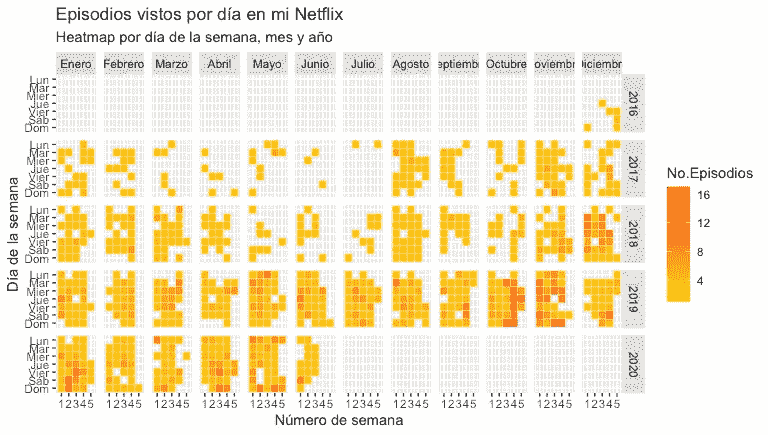

网飞分析-按日、月和年观看的 R 热图剧集

# 一周中的哪几天有更多关于网飞的电视连续剧？

我们还可以非常直观和详细地看到一周中的哪几天有或多或少的观看电视剧集的活动。

```
# FREQUENCY OF ACTIVITY IN MY NETFLIX ACCOUNT PER DAY
vista_dia <- netflix_episodios_dia %>%
  count(diasemanaF)
vista_diavista_dia_plot <- vista_dia %>% 
  ggplot(aes(diasemanaF, n)) +
  geom_col(fill = "#5b59d6") +
  coord_polar()  +
  theme_minimal() +
  theme(axis.title.x = element_blank(),
        axis.title.y = element_blank(),
        axis.text.y = element_blank(),
        axis.text.x = element_text(face = "bold"),
        plot.title = element_text(size = 16, face = "bold")) +
  ggtitle("Frecuencia de episodios vistos", "Actividad por día de la semana en mi Netflix")
vista_dia_plot
```

如图所示，有一个明显的趋势，那就是周一是花时间在网飞上的繁忙日子。这也会是你的案子吗？

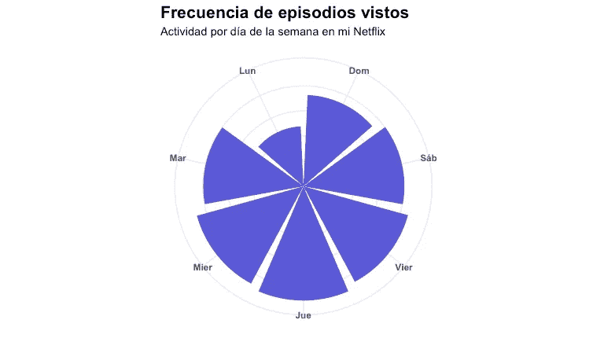

带 R 的网飞分析—按一周中的某一天进行活动

# 网飞哪几个月的电视连续剧最活跃？

像前面的例子一样，我们可以重复操作，但现在基于月份，这是我们选择给网飞宝贵时间的最喜欢的月份。

```
# FREQUENCY OF ACTIVITY IN MY NETFLIX ACCOUNT PER MONTH
vista_mes <- netflix_episodios_dia %>%
  count(mesF)
vista_mesvista_mes_plot <- vista_mes %>% 
  ggplot(aes(mesF, n)) +
  geom_col(fill = "#808000") +
  coord_polar()  +
  theme_minimal() +
  theme(axis.title.x = element_blank(),
        axis.title.y = element_blank(),
        axis.text.y = element_blank(),
        axis.text.x = element_text(face = "bold"),
        plot.title = element_text(size = 18, face = "bold")) +
  ggtitle("Frecuencia de episodios vistos", "Actividad por mes en mi Netflix") 
vista_mes_plot
```

你会得到如下图。在我和网飞的关系中，六月、七月和九月并不是最好的几个月。

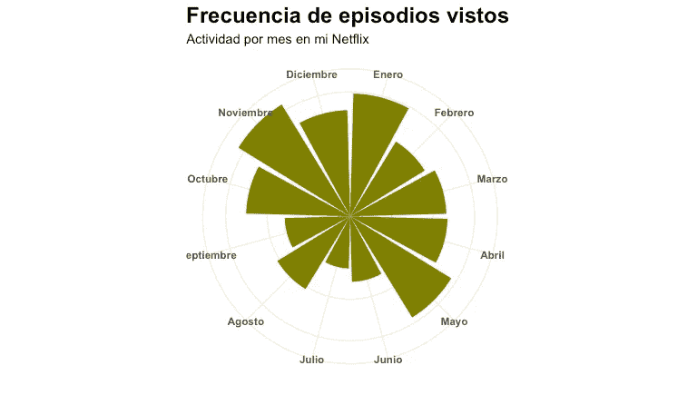

网飞分析与 R-每月活动

# 最后看一下你在网飞看电视剧的活动，按月份和年份

最后，让我们以与前两个示例相同的格式再次回顾一下您的活动，但现在是按每年的月份来划分的。

```
# FREQUENCY OF ACTIVITY IN MY NETFLIX ACCOUNT PER YEAR
vista_años <- netflix_episodios_dia %>%
  count(añomes)
vista_añosvista_años_plot <- vista_años %>% 
  ggplot(aes(añomes, n)) +
  geom_col(fill = "#1a954d") +
  coord_polar()  +
  theme_minimal() +
  theme(axis.title.x = element_blank(),
        axis.title.y = element_blank(),
        axis.text.y = element_blank(),
        axis.text.x = element_text(face = "bold"),
        plot.title = element_text(size = 18, face = "bold")) +
  ggtitle("Frecuencia de episodios vistos", "Actividad por mes del año en mi Netflix")
vista_años_plot
```

你可以在获得的图中看到，在我的情况下，2019 年 10 月和 11 月是网飞收集我的偏好和习惯数据的好时机。

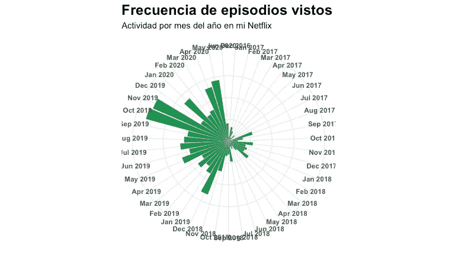

网飞分析与 R-按一年中的月份进行的活动

不得不说，我和女朋友共用账号。有时候平台做的推荐，并不完全是最适合我或者她，lol。

感谢您的友好阅读。你可以在我整理的 **flexdashboard** 中看到为这篇文章生成的图，用 **plotly** 稍微有点花哨:https://rpubs.com/cosmoduende/netflix-data-analysis-r

我也分享完整的代码，以防你对分析你在 https://github.com/cosmoduende/r-netflix-data-analysis 网飞的观看活动感到好奇

有一个快乐的分析，你可以练习它，甚至提高它，玩，用有趣的结果给自己惊喜。

这篇文章是根据我之前发表的西班牙语文章翻译成英语的，是应那些不会说西班牙语的人的要求，他们在小组和论坛上问我是否愿意用英语发表这篇文章。

谢谢你，再见。