# 用 R 探索你在 Youtube 上的活动:如何分析和可视化你的个人数据历史

> 原文：<https://towardsdatascience.com/explore-your-activity-on-youtube-with-r-how-to-analyze-and-visualize-your-personal-data-history-b171aca632bc?source=collection_archive---------18----------------------->

## 了解您如何使用您的个人数据副本使用 Youtube

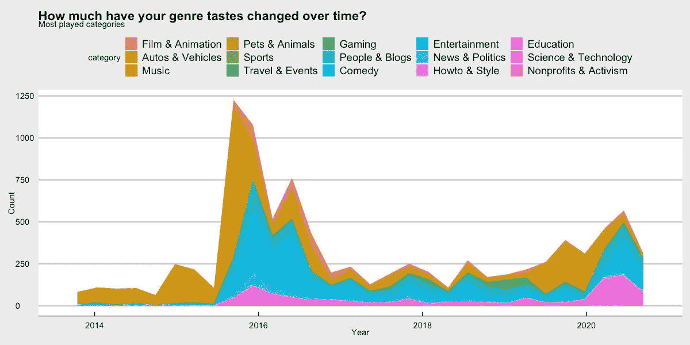

YouTube 上数据的分析和可视化-基于 YouTube 类别的绘图

让我们面对现实吧，亲爱的读者，我们经常访问并成为我们生活一部分的网站之一，无论是为了娱乐还是寻找答案，在那里我们可以花上几个小时，那就是 YouTube。就像我们花费大量时间在其他事情上一样，我很好奇我们的消费习惯到底发生了怎样的变化。有了谷歌外卖和 YouTube API，分析你的个人 YouTube 历史就很容易了。

# 如何获得我的数据的副本？

你可以通过**谷歌外卖**获得你在 YouTube 上的历史记录，这是谷歌提供的一个工具，可以查询你使用过的任何产品的历史记录和存储数据。你必须输入 https://takeout.google.com/settings/takeout 的网址[并用你的个人账户登录。](https://takeout.google.com/settings/takeout)


截图:谷歌外卖网站

在那里，你会发现有可能要求一个完整的副本，或副产品，甚至只选择产品的一些特征。我们目前只对 YouTube 感兴趣。即使您链接了多个帐户，您也可以通过点击右上角的个人资料图片在它们之间切换。如果您上传了视频，我建议您确保取消选中它将生成的文件的视频选项，这将减少其重量和交付时间。

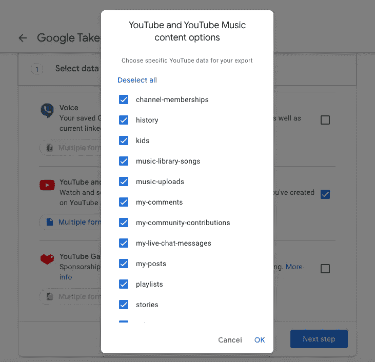

屏幕截图:生成 YouTube 帐户数据的副本

文件生成后，您将会收到一封通知电子邮件，您可以从这里下载该文件。出于安全考虑，该文件有一个截止日期，因此您必须在电子邮件中指明的日期之前完成。

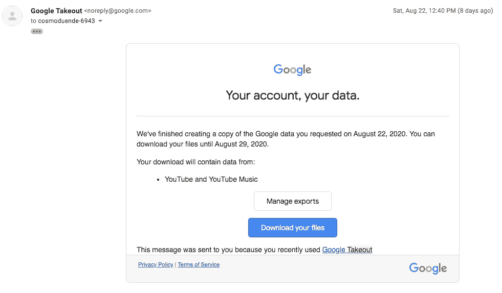

截图:谷歌外卖的数据复制下载通知邮件

当你下载这个文件时，你会得到一个. zip 文件，解压后会创建一个文件夹和文件的结构，这取决于你最初从 Google 外卖中请求了什么。

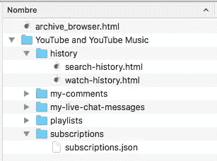

截图:解压后的文件夹结构。活力

目前，与您在 YouTube 上的搜索和观看历史相对应的生成文件仅导出为 HTML。可以使用**“rvest”**包解析生成的 HTML。是的，我知道，不要评价我，《el canaca》和《dios eolo》永远是经典(墨西哥的病毒模因)。

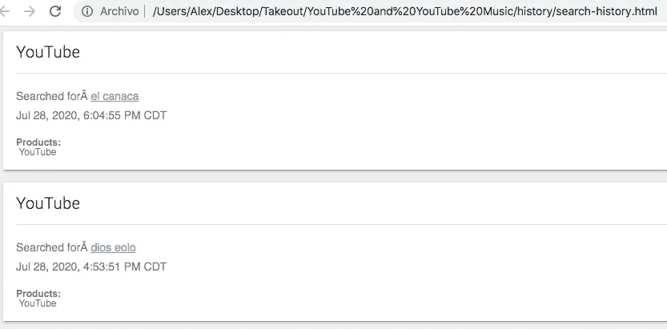

截图:YouTube 搜索历史

# 处理导出的数据

现在您可以继续创建一个 R 脚本了。首先，您必须包含所有必需的包并设置搜索历史读数，它包含在“history”文件夹中的**“search-history . html”**文件中。

```
# REQUIRED PACKAGES
library(stringr)
library(rvest) 
library(tidyverse) 
library(jsonlite) 
library(tidytext)
library(lubridate) 
library(wordcloud)
library(httr)
library(ggplot2)
library(wordcloud2)
library(RCurl)
library(curl)
library(pbapply)
library(ggthemes)# READ SEARCH HISTORY
youtubeSearchHistory <- read_html("Takeout/YouTube and YouTube Music/history/search-history.html")
```

要使用 **"rvest"** 解析 HTML 中的文本，您可以指定对应于特定部分的 CSS 类。比如说，**这条线。标题-单元格+。content-cell > a** 在内容中查找超链接，对应于您所做的搜索。

```
# SCRAPING SEARCH HISTORY
youtubeSearch <- youtubeSearchHistory %>%
  html_nodes(".header-cell + .content-cell > a") %>%
  html_text()
```

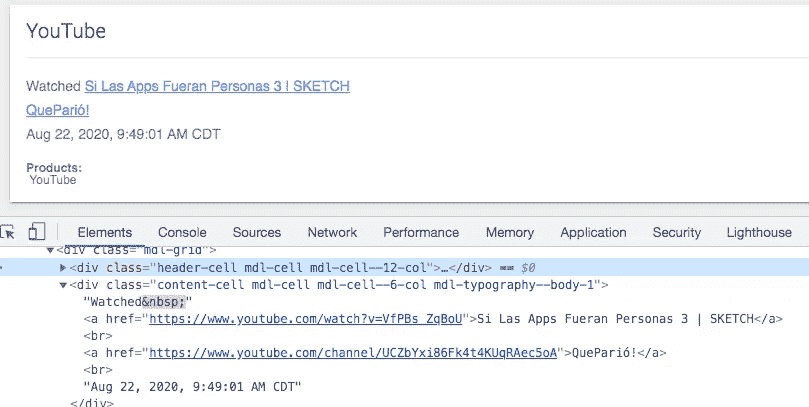

截图:YouTube 搜索历史 HTML 元素检查器

当然，您可以通过同样的方式获得您需要的信息，例如时间戳。

```
# SCRAPING TIMESTAMP
youtubeSearchContent <- youtubeSearchHistory %>%
  html_nodes(".header-cell + .content-cell")
youtubeSearchTimeStr <- str_match(youtubeSearchContent, "<br>(.*?)</div>")[,2]
youtubeSearchTime <- mdy_hms(youtubeSearchTimeStr)
```

现在您已经有了搜索和时间戳数据，您可以用它们创建一个数据框。

```
# CREATING DATA FRAME SEARCH + TIMESTAMP
youtubeSearchDataFrame <- data.frame(search = youtubeSearch, 
                                time = youtubeSearchTime,
                                stringsAsFactors = FALSE)
```

# 观看历史

您将在另一个名为**“watch-history . HTML”**的 HTML 中找到的观看历史也包含在“历史”文件夹中。首先，您必须读取文件，并像以前一样通过 web 抓取获取每个条目。你必须用正则表达式来分析信息。

```
# READ WATCH HISTORY 
watchHistory <- read_html("Takeout/YouTube and YouTube Music/history/watch-history.html")watchedVideoContent <-  watchHistory %>%
  html_nodes(".header-cell + .content-cell")# POSSIBLE TIME CHARACTERS
watchVideoTimes <- str_match(watchedVideoContent, 
                             "<br>([A-Z].*)</div>")[,2]# POSSIBLE ID VALUES 
watchedVideoIDs <- str_match(watchedVideoContent, 
                             "watch\\?v=([a-zA-Z0-9-_]*)")[,2]# VIDEO TITLE
watchedVideoTitles <- str_match(watchedVideoContent, 
                                "watch\\?v=[a-zA-Z0-9-_]*\">(.*?)</a>")[,2]
```

现在，您可以将所有内容放回数据框中。

```
# DATA FRAME WATCH HISTORY
watchedVideosDataFrame <- data.frame(id = watchedVideoIDs, 
                                     scrapedTitle = watchedVideoTitles, 
                                     scrapedTime = watchVideoTimes, 
                                     stringsAsFactors = FALSE)watchedVideosDataFrame$time <- mdy_hms(watchedVideosDataFrame$scrapedTime)
```

# 使用 YouTube API 获取更多视频数据

我几乎可以肯定你会说到这一点…好吧萨乌尔，这没什么大不了的，还有什么！当您与 YouTube API 集成以获取更多数据时，这变得更加有趣。你可以获得更多的信息，而不是仅仅看到标题和时间戳这样的基本数据。通过这种方式，您可以查看您的视频浏览量的受欢迎程度、描述、类别等。

如果这是你第一次获得使用 **YouTube API** 的凭证，请遵循 YouTube 官方文档提供给你的简单步骤:[https://developers.google.com/youtube/v3/getting-started](https://developers.google.com/youtube/v3/getting-started)。

一旦你建立了一个谷歌项目，你将需要生成一个 **API 键**并启用 **YouTube 数据 API v3** ，在侧边栏菜单中创建你的凭证。

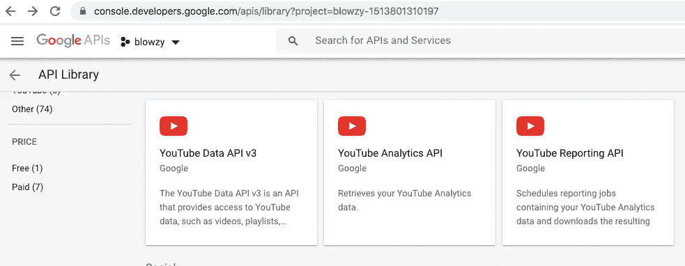

截图:Google API 控制台，设置 YouTube API

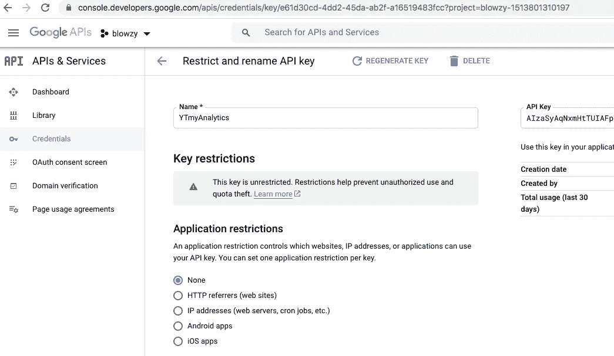

截图:Google API 控制台，生成一个新的 API 密钥

一旦完成，现在就可以通过将 API 键赋给一个新变量来使用它了。您还必须将到 youtube API 的连接赋给一个新变量。

```
# ESTABLISH API KEY AND CONNECTION
youtubeAPIKey <- "HERE_YOUR_API_KEY"
connectionURL <- '[https://www.googleapis.com/youtube/v3/videos'](https://www.googleapis.com/youtube/v3/videos')
```

你可以做一个测试，比如我从我的 YouTube 频道里取一个 ID 为“SG2pDkdu5kE”的视频，给你一个概述。

```
# TRYIING QUERY RESPONSE
videoID <- "SG2pDkdu5kE"
queryParams <- list()
queryResponse <- GET(connectionURL,
                     query = list(
                       key = youtubeAPIKey,
                       id = videoID,
                       fields = "items(id,snippet(channelId,title,categoryId))",
                       part = "snippet"
                     ))
parsedData <- content(queryResponse, "parsed")
str(parsedData)
```

你会发现两个重要的参数是**【字段】**和**【零件】**。您在查询时必须小心，因为您可能会超出请求配额，或者对请求的响应可能会变得非常慢。您可以在官方文档中找到关于这些参数的更多信息:[https://developers.google.com/youtube/v3/docs/videos](https://developers.google.com/youtube/v3/docs/videos)

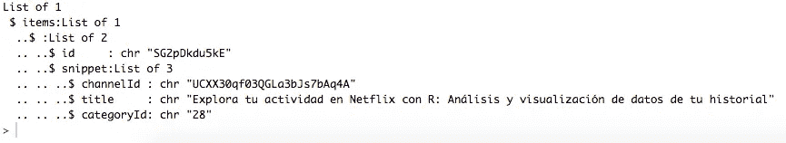

屏幕截图:测试查询响应

# 获取视频类别:准备请求

要获得更多像视频类别这样的元数据，您可以使用从文件中获得的视频 id，并向 YouTube 请求每个视频的更多信息。您将向 YouTube API 发出几千个请求，因此您必须为这些请求做额外的准备。

发出 web 请求最流行的库是**“httr”**(一次只支持一个请求)。还有**【卷毛】****【卷毛】**。为了确保尽可能快地获得数据，请尝试这三种方法，根据已建立的查询，速度可能会有所不同。

```
# REQUESTS OPTIONS
testConnection <- "[https://www.google.com/](https://www.google.com/)"
testCount <- 100# HTTR TEST
system.time(for(i in 1:testCount){ 
  result <- GET(testConnection)
})# RCURL Test
uris = rep(testConnection, testCount)
system.time(txt <-  getURIAsynchronous(uris))# CURL TEST
pool <- new_pool()
for(i in 1:testCount){curl_fetch_multi(testConnection)}
system.time(out <- multi_run(pool = pool))
```

至少在我的例子中，使用“curl”的速度要快得多，不像其他两个选项。

# 获取视频类别:格式化请求

您需要为每个请求创建一个连接字符串，并消除重复以减少请求的数量。您还需要一个函数来解析请求-响应数据。

```
# CREATE REQUEST AND REMOVE DUPLICATES
createRequest  <- function(id){
  paste0(connectionURL,
         "?key=",youtubeAPIKey,
         "&id=",id,
         "&fields=","items(id,snippet(channelId,title,description,categoryId))",
         "&part=","snippet")
}
uniqueWatchedVideoIDs <- unique(watchedVideosDataFrame$id)
requests <- pblapply(uniqueWatchedVideoIDs, createRequest )# PARSE OUT RESPONSE
getMetadataDataFrame <- function(response){
  rawchar <- rawToChar(response$content)
  parsedData <- fromJSON(rawchar)
  data.frame <- cbind(id = parsedData$items$id, parsedData$items$snippet)
  return(data.frame)
}
```

您可以配置请求成功或失败时要做的事情。

```
videoMetadataDataFrame <- data.frame(id = c(), 
                                       channelId = c(), 
                                       title = c(), 
                                       description = c(), 
                                       categoryId = c()
                                       )# SUCCESS
addToMetadataDataFrame <- function(response){
  .GlobalEnv$videoMetadataDataFrame <- rbind(.GlobalEnv$videoMetadataDataFrame,getMetadataDataFrame(response))
}# FAIL
failFunction <- function(request){
  print("fail")
}
```

一种方法是从内存中获取数据，并配置我们的多个请求，这种方法虽然较慢，但更可靠。

```
# GRAB REQUEST RESPONSE FROM MEMORY
fetchMetadataFromMemory <- function(request){
  return(getMetadataDataFrame(curl_fetch_memory(request)))
}system.time(out <- multi_run(pool = pool)) 
saveRDS(videoMetadataDataFrame, file = "videoMetadataDataframeAsync1.rds")length(requests)
nrow(videoMetadataDataFrame)listMetadata <- pblapply(requests, fetchMetadataFromMemory)
```

一旦完成，根据你的互联网连接速度和数据帧的大小，你可以准备一杯咖啡，一杯茶，或开一瓶啤酒，只要指标达到 100%就可以等待。

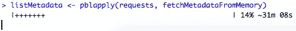

截图:列表元数据控制台预览

您还将使用 **"bind_rows"** 函数将列表组合成一个有序的数据帧。

```
# COMBINE LIST INTO A DATA FRAME
videoMetadataDataFrame <- bind_rows(listMetadata)
saveRDS(videoMetadataDataFrame, file = "videoMetadataDataFrame_memory.rds")
```

# 获取视频类别:格式化类别

每个类别都有一个唯一的 ID。您需要发出另一个请求来获取它们，并将数据添加到新的列中。

```
# CATEGORY ID REQUEST
categoryListURL <- "[https://www.googleapis.com/youtube/v3/videoCategories](https://www.googleapis.com/youtube/v3/videoCategories)"categoryResponse <- GET(url = categoryListURL,
                         query = list(
                           key = youtubeAPIKey,
                           regionCode = "us",
                           part = "snippet"
                         ))
parsedCategoryResponse <- content(categoryResponse, "parsed")categoryDataFrame <- data.frame(categoryId=c(), category=c())
for(item in parsedCategoryResponse$items){
  categoryDataFrame <<-rbind(categoryDataFrame, 
                             data.frame(categoryId = item$id, category=item$snippet$title))
}categoryDataFrame
videoMetadata <- merge(x = videoMetadataDataFrame, y = categoryDataFrame, by = "categoryId")
head(videoMetadata)
```

您可以将新的数据框与观看历史相结合，以获取视频元数据及其播放时间。

```
# COMBINE WITH WATCH HISTORY
watchedVideos <- merge(watchedVideosDataFrame , videoMetadata, by="id")
str(watchedVideos)
```

# 随着时间的推移，你对在 YouTube 上观看的内容的品味有所改变吗？

有了搜索历史、观看历史和类别元数据，你现在可以回答这个问题了。你可以看到你玩得最多的视频类别，以及这些类别是如何随着时间的推移而变化的。

```
# VISUALIZE VIDEO CATEGORIES WATCHED 
watchedVideos %>% 
  group_by(category) %>% 
  summarise(count = n()) %>% 
  arrange(desc(count))watchedVideos %>% 
  ggplot(aes(x = time, fill = category)) + 
  labs(x= "Year", y= "Count") + 
  ggtitle("How much have your genre tastes changed over time?", "Most played categories")+
  geom_area(stat = "bin") + 
  theme_economist_white()
```

例如，在我的例子中，肯定会有很多人喜欢的东西，比如音乐类的视频。当然，电影和动画类别的存在是有意义的，我通过许多渠道了解即将上映的电影、预告片和评论。


对 YouTube 上的数据进行分析和可视化——根据类别及其随时间变化的行为绘制图表

# 你一天中什么时候花最多时间在 YouTube 上看视频？

把你宝贵的时间贡献给 YouTube，看看你最活跃的时候会很有趣。您可以通过创建一个自定义函数来查看它，该函数允许您将它作为一个时钟来查看。

```
# VISUALIZE CLOCK WATCHES PER HOUR
clockPlot <- function (x, col = heat.colors(n), ...) {
  if( min(x)<0 ) x <- x - min(x)
  if( max(x)>1 ) x <- x/max(x)
  n <- length(x)
  if(is.null(names(x))) names(x) <- 0:(n-1)
  m <- 1.05
  plot(0, type = 'n', xlim = c(-m,m), ylim = c(-m,m), 
       axes = F, xlab = '', ylab = '', ...)
  fig <- pi/2 - 2*pi/200*0:200
  polygon( cos(fig), sin(fig) )
  f2 <- .02
  fig <- pi/2 - 2*pi/n*0:n
  segments( (1+f2)*cos(fig), (1+f2)*sin(fig), (1-f2)*cos(fig), (1-f2)*sin(fig) )
  segments( cos(fig), sin(fig),0, 0, col = 'light grey', lty = 3)
  f1 <- -2*pi/n*(0:50)/50
  for (i in 1:n) {
    fig <- pi/2 - 2*pi/n*(i-1)
    b <- pi/2 - 2*pi/n*i
    polygon( c(0, x[i]*cos(fig+f1), 0), c(0, x[i]*sin(fig+f1), 0), col=col[i] )
    f2 <- .1
    text((1+f2)*cos(fig), (1+f2)*sin(fig), names(x)[i])
  }
}clockDataFrame <- watchedVideos %>% 
  mutate(hour = hour(time)) %>% 
  group_by(hour) %>% 
  summarise(count = n()) %>% 
  arrange(hour)clockPlot(clockDataFrame$count, main = "What hours do you spend the most time watching YouTube?")
```

举起手来，这里有多少人像我一样，能够克服失眠有时在黎明时分花几个小时看 YouTube？在我的情况下，很明显，从凌晨 2 点到 3 点，我把我宝贵的时间都给了平台。

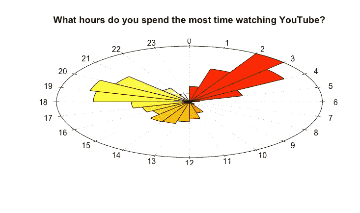

YouTube 上数据的分析和可视化——YouTube 上最活跃的时间图

# 有哪些视频是你反复看得最多的？

你可以获得的另一个有趣的信息是你反复播放次数最多的前 10 个视频。您可以用一个简单的表格来形象化这一点，用包**“kable extra”**并按照复制次数降序排列。

```
# TABLE MOST RE-WATCHED VIDEOS
w1 <- watchedVideos %>%
  mutate(year = year(time)) %>% 
  group_by(year, title) %>% 
  summarise(count = n()) %>% 
  arrange(year, desc(count)) %>% 
  top_n(5)mostReWatched <- knitr::kable(x = head(arrange(w1, desc(count)) %>%
                                      select(year, title, ,count), 10),
                                      col.names = c('Year', 'Video Title', 'Count'))
kable_styling(mostReWatched, "striped", position = "left", font_size = 12)
```

您将得到如下所示的表格。就我而言，我很好奇从 2016 年到 2019 年，一些视频没有出现在我的前 10 名中。我想原因是 Spotify 进入了我的生活，在此之前我主要使用 YouTube 来播放音乐。顺便说一下，是的，我是“Vicentico”和“Los Fabulosos Cadillacs”的粉丝(西班牙有史以来最具标志性的摇滚/ska 乐队的前歌手和乐队之一)。

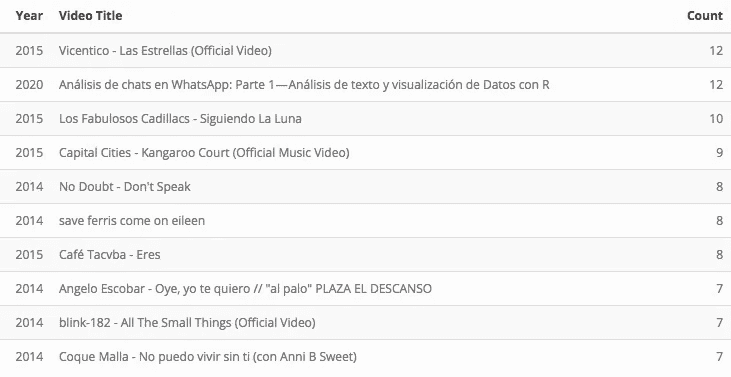

分析并可视化您在 YouTube 上的数据——反复观看的 10 大热门视频

# YouTube 上搜索次数最多的词语是什么？

你可以用**“word cloud”**软件包更好地想象这一点。当然，这取决于你的历史有多长。例如，你可以建立至少重复 25 次的单词。

```
# WORDCLOUD MOST SEARCHED WORDS
myWords <- youtubeSearchDataFrame %>%
  unnest_tokens(word, search) %>%
  anti_join(stop_words) %>%
  count(word, sort = TRUE)myWordcloud <- myWords %>%
  group_by(word) %>%
  summarize(count = sum(n)) %>%
  anti_join(stop_words)wordcloud(words = myWordcloud$word, freq = myWordcloud$count, min.freq = 25, 
          max.words = 100, random.order =FALSE, rot.per =.35,
          colors=brewer.pal(9, "Set1"))
```

结果你会得到一个如下的图，在那里你会发现与你的口味相吻合。如果你想知道，答案是肯定的，我相信 UFO 现象(西班牙语 OVNI)。

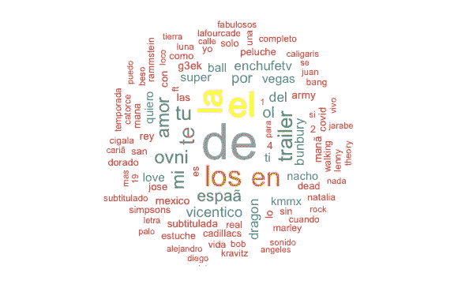

对你在 YouTube 上的数据进行分析和可视化——Wordcloud 搜索次数最多的词

# 在你看过的视频描述中，出现频率最高的术语是什么？

要回答这个问题，您可以像上一个示例一样进行操作，但是这次使用视频描述，利用我们的数据框中有这些信息这一事实。通过制作广告，很多视频在其描述中包含 URL，这是非常常见的，除了不能给我们相关信息的词，如文章、代词等，我们将过滤这些(或尽可能多的过滤)。这次我们将用**【单词云 2】**和至少重复 250 次以上的单词来做。

```
# WORDCLOUD MOST FREQUENT WORDS IN VIDEO DESCRIPTIONS
descriptionsWordcloud <- watchedVideos %>%
  unnest_tokens(word, description) %>%
  anti_join(stop_words) %>%
  count(word, sort = TRUE) %>%
  filter(! word %in% c("www.instagram.com", "gmail.com", "www.twitter.com", "youtu.be", "como", "instagram", "instagram.com", "tú", "watch", "aquí", "pero", "su", "http", "al","se","si","goo.gl","smarturl.it","facebook","video","más", "twitter", "te","lo","este","tu", "para", "por", "con", "es", "del", "las", "una", "mi", "de", "en", "la", "el", "los", "https", "bit.ly" , "â", "www.youtube.com")) %>%
  filter(n > 250)wordcloud2(descriptionsWordcloud)
```

正如你所看到的，正如你所料，许多词指的是订阅他们的频道或关注他们的社交网络

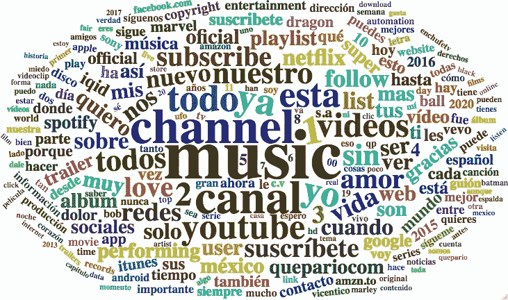

对你在 YouTube 上的数据进行分析和可视化——视频描述中最常见的词

感谢您的友好阅读。在这里可以找到完整的代码:[https://github . com/cosmoduende/r-YouTube-personal-history-analysis](https://github.com/cosmoduende/r-youtube-personal-history-analysis)

我感谢你走了这么远，我希望你有一个快乐的分析，你可以把它付诸实践，并像我一样对结果感到惊讶和有趣！