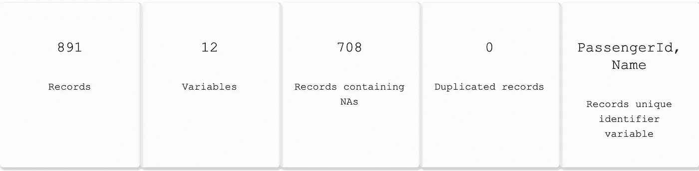
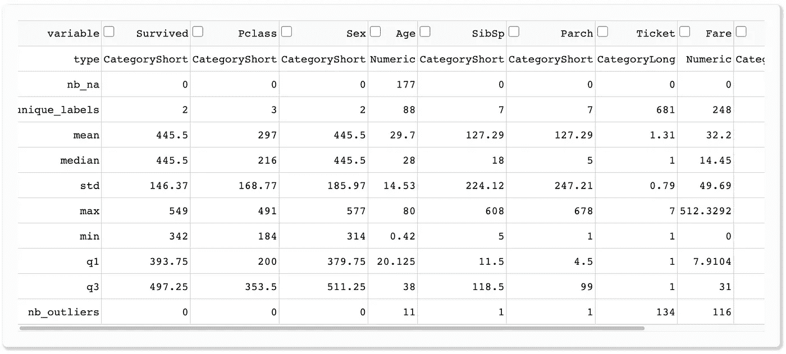
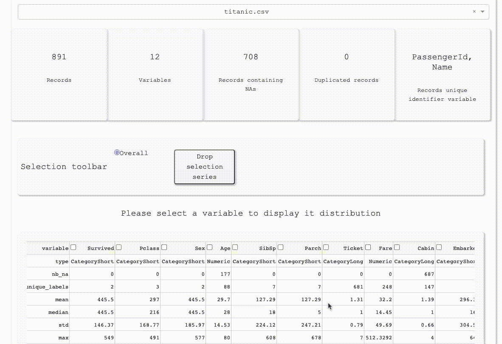
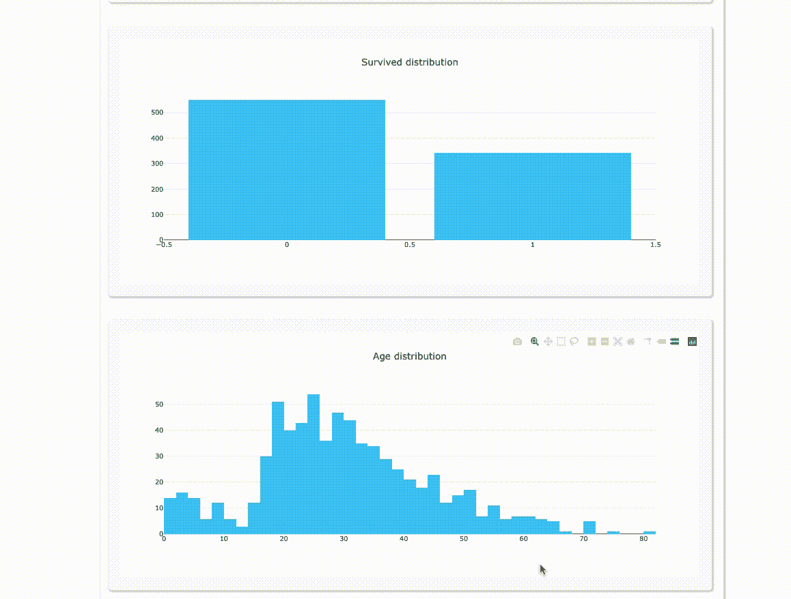
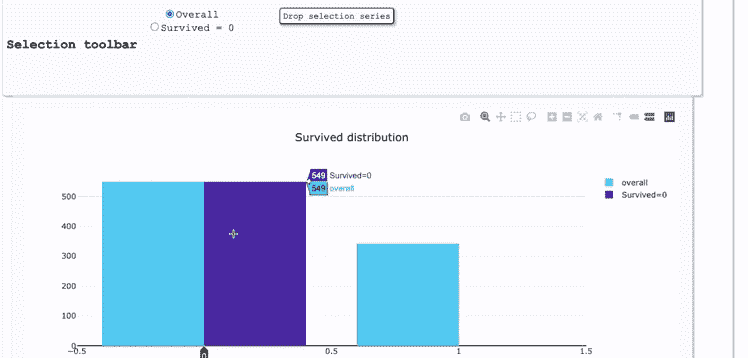
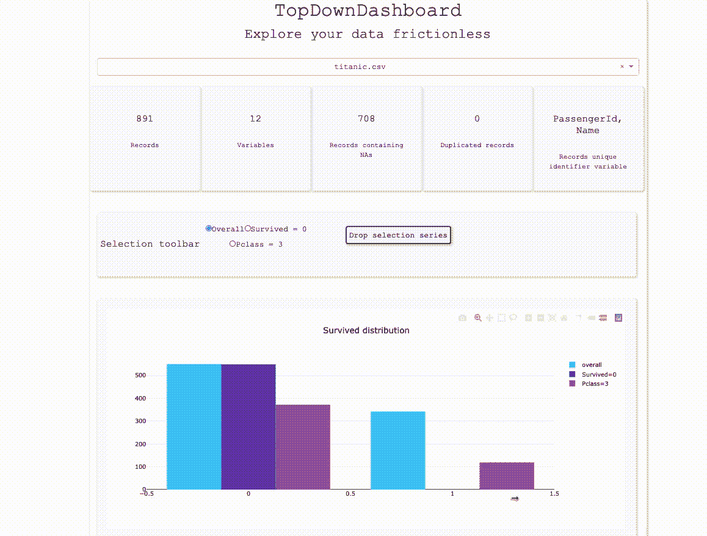

# 顺畅地探索您的数据

> 原文：<https://towardsdatascience.com/explore-your-data-frictionless-adddb3759bb?source=collection_archive---------60----------------------->

## 引入新的数据探索框架

照片由[阿克谢·纳纳瓦蒂](https://unsplash.com/@anphotos?utm_source=medium&utm_medium=referral)在 [Unsplash](https://unsplash.com?utm_source=medium&utm_medium=referral) 上拍摄

# 问题

作为一名数据科学家，我一直认为代码不是探索数据集的完美解决方案。

在我看来，数据探索应该是一个平稳的过程，而不是一波三折。

我不喜欢使用代码进行数据探索的另一点是项目之间的高度代码冗余。

如果你不是新手，很可能你已经开发了一个函数来识别和绘制数据集的每个变量。但是，您可能会发现这种方法不允许进行深入探索。您仍然需要调整您的代码以超越整个发行版。

几个月前，我厌倦了这个。

我决定编写 **Smoof** 代码，这是我第一次尝试创建一个无摩擦数据探索软件。

# 解决办法

> Smoof 不是所有解决方案的一站式解决方案，而是一个用于数据探索的生产力工具。

你可以试试 Smoof 的一些演示数据集[这里](http://leopoldavezac.pythonanywhere.com/)。你也可以通过下载[代码](https://github.com/leopoldavezac/smoof) (python)在你的机器上运行来测试它。

## 如何使用它

**导航至您的工作目录并选择一个 csv 文件**

**输出数据集关键信息**

**输出变量关键信息**

离群值的数量是用四分位法估计的。这当然不是识别异常值的最佳方法，但它是省时的。这里的目的是提供关于异常值的潜在存在的预先信息。

分类变量的所有描述性统计都是根据每个标签的计数计算的。

**可视化变量分布**

**交叉过滤**

**向下钻**

**降一降一过滤**

## 关于变量类型及其蕴涵的注记

在 Smoof 中，变量被识别为以下类型之一:

*   日期
*   数字的
*   类别短(少于 15 个唯一标签)
*   长类别(超过 15 个唯一标签)

为类别创建两个子类型的原因是，超过 15 个不同标签的条形图不容易分析。这就是为什么类别 Long 被表示为每个标签的值的分布。

## 电流限制

平滑处理高达 10 MB 的数据集，对于更大的数据集，它仍然运行，但加载和交叉过滤操作可能会变慢。

实际版本缺少一些关键功能，如 2D 和 3D 绘图以及空值探索。这些特性将在下一个版本中添加！

# 成为共同创造者

这是一个开源项目，我很高兴你能和我一起开发未来的版本。有兴趣请联系[我](https://www.linkedin.com/in/leopolddavezac/)。