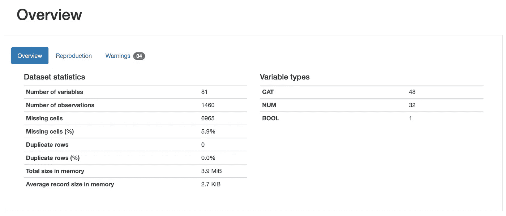
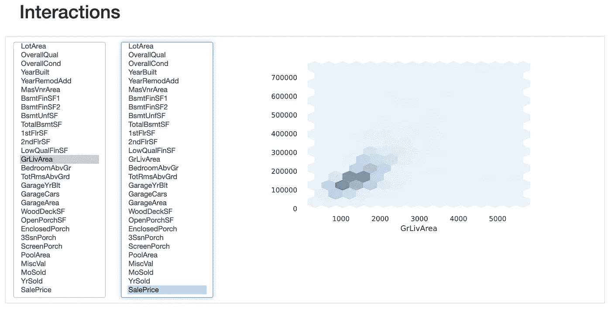
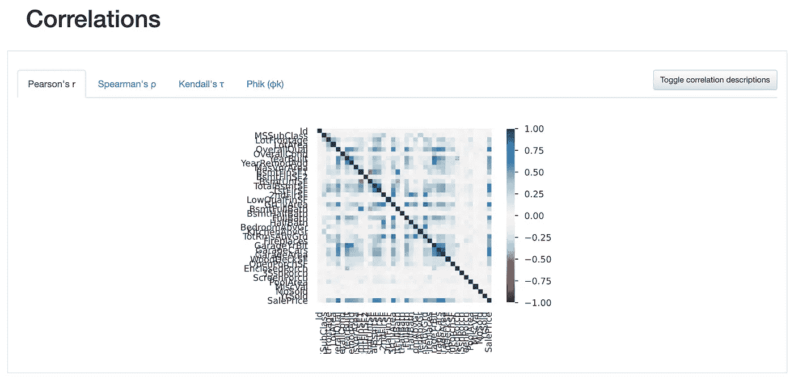
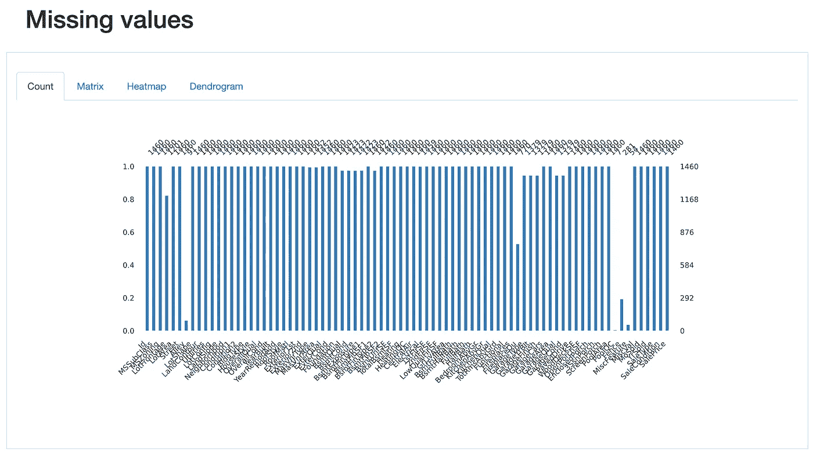
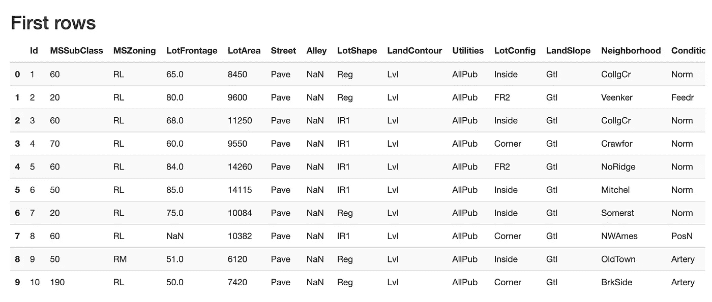

# 只需 3 次点击，即可在线浏览您的数据

> 原文：<https://towardsdatascience.com/explore-your-data-online-in-3-clicks-8fe356a36c3c?source=collection_archive---------60----------------------->

## 使用这款 Google Colab 笔记本，无需任何编程即可获得免费的数据探索性分析报告

[活动发起人](https://unsplash.com/@campaign_creators?utm_source=medium&utm_medium=referral)在 [Unsplash](https://unsplash.com?utm_source=medium&utm_medium=referral) 上的照片

毫无疑问，我们正处于数据时代，数据就是力量。事实上，许多人将[的数据称为新石油](https://www.wired.com/insights/2014/07/data-new-oil-digital-economy/)，这是有充分理由的:

*   分析正确的数据可以提供有用的见解，从而更好地理解和改进业务、流程和任务。
*   机器学习已经证明[数据可以打败更好的算法(这句名言出自谷歌研究总监。)](https://www.kdnuggets.com/2015/06/machine-learning-more-data-better-algorithms.html)
*   数据为你提供了事实，你可以根据这些事实在需要时评估和纠正事情(正如爱德华兹·戴明所说的“我们相信上帝，所有其他人都必须带来数据”)。)

然而，数据本身通常是不够的。您还需要分析和利用这些数据的技能，这通常涉及(至少)一些统计和编程知识。不幸的是，这些技能并不常见，在数据科学专业人员的需求和供应之间造成了巨大的差距。

# 轻松浏览您的数据

好消息是，近年来已经开发了许多工具来促进对数据分析和数据科学的访问。最新的一个是 [pandas-profiling](https://github.com/pandas-profiling/pandas-profiling) ，这个库使我们能够对文件中的数据进行快速而轻松的探索性分析。

> 在 Medium 上已经有很多关于这个主题的文章，所以我不会用更多关于熊猫的信息来打扰你。相反，我写这篇文章是希望让非程序员能够使用这个强大的库轻松地对他们的数据进行快速分析。

为此，我已经创建了一个 [Google Colab Notebook](https://colab.research.google.com/drive/1UV1tgLOFmZdz0H5S8NOUHJ8mxvtZhezp?usp=sharing) ，它已经整合了上传数据、创建 HTML 格式的探索性报告和下载报告所需的所有工具和代码，所有这些只需点击 3 次。

你需要做的就是使用谷歌 Chrome 访问[下面的链接](https://colab.research.google.com/drive/1UV1tgLOFmZdz0H5S8NOUHJ8mxvtZhezp?usp=sharing)(其他浏览器在谷歌 Colab 上上传和下载文件的表现不佳)，然后按下下图所示的左边的播放按钮(或者你也可以按 CTRL + ENTER。)这将运行您在那里看到的代码，它将提示您选择一个或多个包含您的数据的 CSV 文件。只需按下“选择文件”按钮，并选择您想要分析的文件。

 [## 探索分析

### 探索 csv 文件与熊猫-剖析

colab.research.google.com](https://colab.research.google.com/drive/1UV1tgLOFmZdz0H5S8NOUHJ8mxvtZhezp?usp=sharing) 

然后，等待您看到上传文件和生成报告的进度。请耐心等待，因为有时根据文件的大小，做这两件事可能需要一段时间。在此之后，您可以下载与您上传的数据同名的报告。

重要的是，你上传的**数据不会与任何人**共享，如[谷歌实验室常见问题](https://research.google.com/colaboratory/faq.html)所述。我还将代码输出设置为在每次运行后不保存，这样除了您之外没有人能看到您上传的文件的名称，此外，代码会在使用 pandas-profiling 处理每个上传的文件后立即删除它。为了您的安全，您可以查看笔记本中的所有代码，也可以随意重复使用。

附注:请注意，我已经用文件< 15MB, if your files are bigger, I recommend you to download the notebook and running it locally. For this, you will need [测试了这个来安装 Jupyter](https://jupyter.readthedocs.io/en/latest/install.html) 。

# 查看报告

我已经用 Google Colab 笔记本为 [Ames 住房数据集](http://jse.amstat.org/v19n3/decock.pdf)创建了一份报告，这是我从[房价卡格尔竞赛](https://www.kaggle.com/c/house-prices-advanced-regression-techniques/overview)下载的。该数据集包含爱荷华州埃姆斯地区出售的房屋信息，包括出售房屋的几个特征及其销售价格。这是从机器学习开始的最受欢迎的数据集之一，目标是能够根据其特征预测房屋销售价格。

该报告是一个 HTML 文件，您可以用您喜欢的任何浏览器打开它。它由不同的部分组成，您可以导航并与之交互:

*   **概述**:数据集统计数据的快速汇总，如变量数、观测值数、缺失单元格、变量类型分为 CAT (category)、NUM (numeric)和 BOOL。在这里，您还可以看到来自 pandas 的“警告”——包括缺失值、值为 0 的单元格以及其他一些可能构成报告完整性的情况。

我从[埃姆斯房产数据集](http://jse.amstat.org/v19n3/decock.pdf)中创建的一份报告的概述，该数据集是从[房价卡格尔竞赛](https://www.kaggle.com/c/house-prices-advanced-regression-techniques/overview)中下载的。

*   **变量**:数据中包含的每个变量(即列)的详细分析，包括不同值、零、缺失值和其他基本统计数据的数量。您也可以使用“切换细节”按钮(如下所示)查看每个变量的更多细节。

来自 [Ames Housing 数据集](http://jse.amstat.org/v19n3/decock.pdf)的变量 MSSubClass 的详细信息。

*   **相互作用**:在这一部分，我们可以看到两个变量是如何相互作用的。下面，我选择了 SalePrice 和 GrLivArea 这两个高度相关的变量(我是怎么知道这个的？只需等到下一节；) ).在这里，我们可以看到，地面居住面积越高，售价越高。您可以通过在左侧列表中选择任意一对变量来检查这一点。

来自 [Ames 住房数据集](http://jse.amstat.org/v19n3/decock.pdf)的变量 GrLivArea 和 SalePrice 之间的相互作用。

*   相关性:这是报告中最有趣的部分之一。我们可以看到 4 个不同的相关矩阵，每个矩阵都使用不同的相关类型:Pearson(最常用的，如下图所示)、Spearman、Kendall 和 Phik。根据相关值，每两个变量之间的相关性显示为具有不同颜色的正方形:高度着色的是高度相关的，而白色或几乎白色的正方形显示低相关性。如果我们有两个高度相关的变量 X 和 Y，我们可以用 X 来推断 Y，反之亦然。事实上，这让我们快速分析了每个变量对于建立机器学习模型的重要性。例如，在 Ames Housing 数据集中，我们希望在给定房屋特征(如地块面积、车库面积、楼层数、房屋建造年份等)的情况下预测其价格。在下图中，我们可以在矩阵的最后一行看到销售价格和所有这些特征之间的相关性，这表明每个特征对决定房屋价格的重要性。正如你所看到的，地段面积与房子的价格高度相关，这是我们从经验中知道的。但我们也可以看到，其他不太明显的特征与房价高度相关，如车库可以容纳的汽车数量和一楼的面积。

[艾姆斯住宅数据集](http://jse.amstat.org/v19n3/decock.pdf)的相关矩阵。我们看到了一个关于熊猫的小缺陷——描述:情节标签有点拥挤。

*   **缺失值**:这个部分向我们展示了一个图表，从中我们可以快速观察到每个特性有多少缺失值。它以一种有点令人困惑的方式显示出来:蓝色条越高，现值就越多。所以在下图中，我们可以看到 PoolQC(池条件)是一个有很多缺失值的特性，而 HeatingQC(加热条件)没有任何缺失值。

[埃姆斯住宅数据集](http://jse.amstat.org/v19n3/decock.pdf)的缺失值。与上面相同的小缺陷:图标签有点拥挤。

*   **Samples** :在这里您可以看到数据集的第一行和最后一行，以便更好地了解数据的样子。

来自 [Ames Housing 数据集](http://jse.amstat.org/v19n3/decock.pdf)的样本数据，请注意，此图中仅显示了前几列，但您可以在报告中水平滚动表格。

# 结论

在 [Unsplash](https://unsplash.com?utm_source=medium&utm_medium=referral) 上由[Duan Smetana](https://unsplash.com/@veverkolog?utm_source=medium&utm_medium=referral)拍摄的照片

Pandas-profiling 为我们提供了用几行代码就能生成几乎即时的数据报告的能力，使我们能够轻松地对其进行详细分析。通过使用我在这里展示的 Google Colab 笔记本，任何人都可以利用这个工具，无需编码，只需简单地点击三次。

尽管这个工具并不完美:

*   大文件需要很长时间来处理，甚至有时我们会得到许多错误。特别是，当使用 Google Colab 笔记本时，大文件可能需要很长时间才能上传并进行分析(在这种情况下，您可以下载笔记本并在本地运行；) ).
*   有一些小的装饰错误，比如上面显示的那些。
*   可能有必要进行更专门的分析，为此，我们需要自己实施分析。

然而，pandas-profiling 是将数据科学带给每个人的一大步，我相信它将继续改进，在不久的将来提供更好的报告。

感谢阅读，希望这篇文章对你有所帮助！