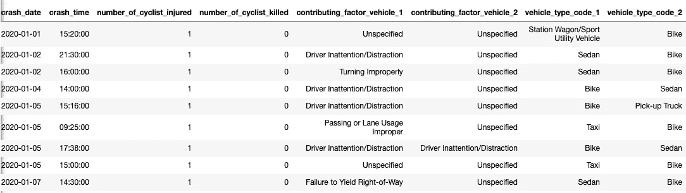
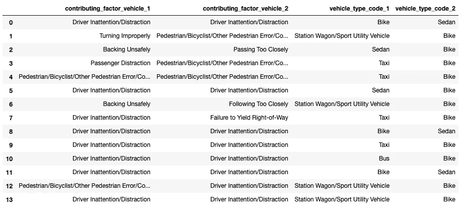

# 探索两个月的纽约自行车事故

> 原文：<https://towardsdatascience.com/exploring-2-months-of-bike-accidents-in-nyc-897d280951d5?source=collection_archive---------25----------------------->

## 数据分析

## 在纽约骑自行车可能很危险，因为咄咄逼人的驾驶和大量的汽车。但是我们很快就会看到，它们不是唯一的…

我骑花旗自行车已经一年了，把手放在自行车把上是我在纽约最喜欢的出行方式。我觉得在街上转来转去，享受这个城市令人惊叹的氛围是如此的方便和有趣。我感谢过多的自行车码头和安全的自行车道，让我有这些经历。

相反，在纽约骑自行车可能是危险的，因为咄咄逼人的驾驶和压倒性的汽车数量。在这篇博文中，我调查了 2020 年 1 月和 2 月曼哈顿自行车碰撞的纽约公共数据集。此外，我会更仔细地查看细节，以了解为什么会发生这些事故以及涉及哪些车辆。我们很快就会看到，可能不仅仅是车手和赛车有问题。

你可以在我的笔记本上阅读我的代码。

# 纽约机动车碰撞数据集

原始数据来源为 [NYC 公共安全机动车碰撞事故](https://data.cityofnewyork.us/Public-Safety/Motor-Vehicle-Collisions-Crashes/h9gi-nx95)。这些数据显示了事故的确切位置、发生的原因、涉及的车辆、受伤的骑车人数量、撞车的时间和日期。我过滤了 2020 年 1 月和 2 月在曼哈顿发生的事故，并使用 python 熊猫只保留了受伤或死亡的骑自行车者的行(在我的数据中，没有死亡，幸运的是！)数据帧包含 65 个事故。下面是前 5 行的截图，分为两部分。让我们看看数据显示了什么。



1.  *Vehicle_type_code_1* (事故第一方，即车辆 1)是指具体涉及的车辆。
2.  *促成因素 _ 车辆 _1* 是车辆 1 促成事故的原因。它包括转向不当、驾驶员注意力不集中/分心和倒车不安全等原因。
3.  *Vehicle_type_code_2* 和*contribution _ factor _ Vehicle _ 2*的意思与车辆 1 相同，但涉及第二方。

让我们分析我们的数据。

# 事故是由什么引起的？

该数据集以车辆 1(驾驶员或骑车人)作为事故的原因来组织，而偶尔车辆 2(另一个驾驶员或骑车人)也受到责备，例如两个驾驶员都分心了。

56/65 或 86%的事故是由车辆 1 驾驶员造成的，因为:

```
**Driver Inattention/Distraction                           19
Unspecified                                              11
Passing or Lane Usage Improper                            6**
**Passenger Distraction                                     4** Pedestrian/Bicyclist/Other Pedestrian Error/Confusion     3
Failure to Yield Right-of-Way                             3
Turning Improperly                                        2
Following Too Closely                                     2
Backing Unsafely                                          2
Passing Too Closely                                       1
Traffic Control Disregarded                               1
Unsafe Lane Changing                                      1
Driver Inexperience                                       1
```

首要原因是驾驶员注意力不集中(19/56 或 34%)，其次是“原因不明”。后面我们会稍微讲一下未指明的。其他原因包括超车、车道使用不当和乘客分心。

通读这些理由是很有意思的，让我更加意识到这些可能性，这样我骑自行车的时候会更加安全。由于 4/56 或 7%的事故是由分心的乘客造成的，我只能想象这是如何导致事故的。放音乐声音太大？和司机说太多话？乘客对摩托车手的愤怒？


埃里克·奥迪恩在 [Unsplash](https://unsplash.com?utm_source=medium&utm_medium=referral) 上的照片

# 不仅仅是司机

车辆 1 不仅包括司机，也包括骑自行车的人。1 类车辆中有 9/65 或 14%由骑车人构成，事故原因如下:

```
Driver Inattention/Distraction    6
Aggressive Driving/Road Rage      1
Passing Too Closely               1
Unspecified                       1
```

最主要的原因是骑车人注意力不集中/分心，占 67%。第二和第三个原因是好斗*骑自行车/暴怒和靠得太近。* **经验教训:注意，保持冷静的头脑，获得空间！**

至于骑车人的“未指明的”原因，该原因也是未指明的或缺少第二方车辆 2 的原因。我认为可能有很多原因，比如无法确定确切的原因。了解导致两个未知原因的情况会很有趣。

另一方面，这些是造成事故的一些原因*双方*:



大多数原因是两个司机都分心或没有注意。其他组合是汽车倒车不安全，而自行车太近，或者司机或骑车人的某种错误或计算失误导致事故。其他一些事故是由行人/骑自行车的人/其他行人的错误造成的。我想知道这可能是什么，但当我和一个朋友谈到这些事故时，她告诉了我一个个人故事。有一次她过马路发短信，没有注意到一个骑自行车的人朝她走来。骑自行车的人试图避开她，结果撞车了！


照片由 [Daria Nepriakhina](https://unsplash.com/@epicantus?utm_source=medium&utm_medium=referral) 在 [Unsplash](https://unsplash.com?utm_source=medium&utm_medium=referral) 拍摄

# 谁对事故负最大责任？

让我们看看整体事故中涉及哪些车辆。

```
Taxi                                   20
Station Wagon/Sport Utility Vehicle    16
Bike                                   14
Sedan                                  13
Pick-up Truck                           2
Box Truck                               2
Van                                     1
Armored Truck                           1
Bus                                     1
```

大约 30%的事故是由出租车引起的，24%是由旅行车或 SUV 引起的，20%的事故是由骑自行车的人引起的！让我们仔细看看出租车是如何造成最多事故的。

```
**Driver Inattention/Distraction                           6
Passing or Lane Usage Improper                           4** Unspecified                                              3
Following Too Closely                                    2
Passenger Distraction                                    2
Pedestrian/Bicyclist/Other Pedestrian Error/Confusion    2
Traffic Control Disregarded                              1
```

同样，司机注意力不集中和分心，以及不正确的车道通过。就我自己而言，我应该小心，不要假设车辆能看到我，并记住要小心超车。纽约的出租车司机因不打信号就插队和变道离其他车辆太近而臭名昭著。出租车司机或骑车人的一个错误举动可能会造成严重伤害！


[Dil](https://unsplash.com/@thevisualiza?utm_source=medium&utm_medium=referral) 在 [Unsplash](https://unsplash.com?utm_source=medium&utm_medium=referral) 上拍摄的照片

# 小心！

最后，我也有兴趣看看是否有任何自行车碰撞。在 65 起事故中，只有一起是一个骑自行车的人跟得太近。只有一名骑车人受伤。也许一个骑车人以为有足够的空间超过一个骑得慢的骑车人，但最终靠得太近，导致了撞车。我会保留我的空间。

# 后续步骤

我喜欢我们可以看着这些数据，用我们的想象力来看看事故是如何发生的。两个月的数据已经让我对今天纽约市的自行车安全有了一点了解。随着更多月份的分析，我们可以开始看到更多的趋势。我对这些事件的分析有助于我理解发生事故的原因。上面的原因只是一小部分原因，但它也帮助我知道当我骑自行车时还需要注意什么。在未来的帖子中，我将进一步深入这个数据集，并绘制出我在花旗自行车旅行中的撞车事故，以了解我与事故的接近程度。感谢阅读。

[来看看我的 jupyter 笔记本，看看我是如何用 Python 编写我的分析的](https://github.com/chrispfchung/nyc-bike-collision-analysis/blob/master/Biking%20Collision%20Analysis%20.ipynb)。