# 使用 NLP 探索 4.5 年的日志条目

> 原文：<https://towardsdatascience.com/exploring-4-5-years-of-journal-entries-with-nlp-589de6130c2d?source=collection_archive---------55----------------------->

诺德伍德在 [Unsplash](https://unsplash.com/) 上拍摄的照片

## 使用 Python 和 fast.ai 写作 4 年多的经验解读

# 介绍

自 2016 年 1 月 1 日起，我每天都在谷歌文档中记录当天的事件和我的想法。我开始写日记是因为我对自己的现状不满意，希望能够回顾过去看到进步。尽管有这个目的，这些日记还是变得很长很快，我从来没有机会以任何有意义的方式回顾它们。

随着我的日志接近五周年纪念日，我认为最终回顾一下会很有趣——不是通过阅读它，而是通过用我新学到的数据科学和自然语言处理(NLP)技能来分析它。

# 数据收集

幸运的是，我是一个习惯动物。在过去的 53 个月里，每篇日志看起来都完全一样——每月一篇谷歌文档，格式如下:

> **一月**
> 
> 1 月 1 日
> 此处录入
> 
> 1 月 2 日
> 此处*录入*

诸如此类。

创建我的语料库就像下载每一个谷歌文档作为文本文件一样简单，快速阅读它以寻找零散的段落中断，并使用几行代码(准确地说是 21 行)将其全部放入 pandas DataFrame。在数据帧中，我包括了年、月、日、日期(日期时间)和日志条目。

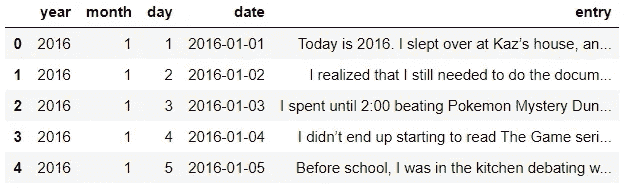

作者图片

然后，我使用正则表达式(re)模块清理数据，使用 scikit-learn 的 CountVectorizer 函数创建文档术语矩阵，并按年份对其进行分组，然后将其转置用于探索性数据分析。

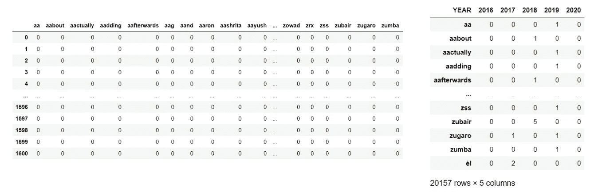

作者图片

# 探索性数据分析

为了更好地理解我的日记，我从三个角度来看它们:常用词、感悟和长度。

*   **常用词:**我使用词云来确定和可视化最常用的词，以收集重要的主题。
*   **情绪:**我用 TextBlob 库进行了一次情绪分析，看看我的极性是如何随时间变化的。
*   **长度:**我用熊猫分离出各种长度指标，并推断出为什么我在特定时间点写得多或少。

## 最常见的单词

首先，我想看看最常见的单词，我希望这些单词能让我了解每年对我来说最重要的事情。我删除了五年中至少三年前 30 个最常用的单词，因为它们可能对区分不是很有见地。

我喜欢尽可能直观地表示信息，所以我使用文档术语矩阵来创建每年的单词云。

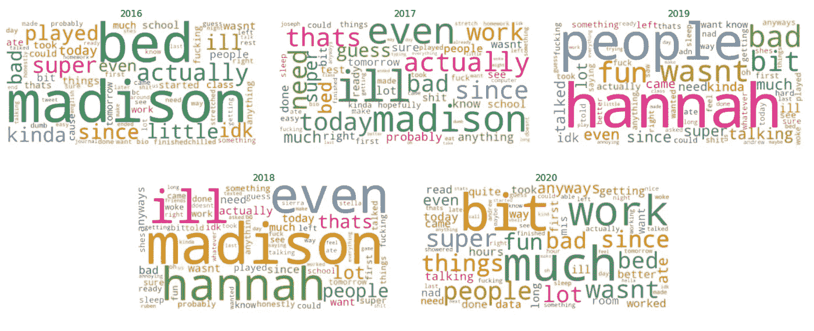

作者图片

我的观察:

*   **2016:** 我谈了很多我的另一半*、麦迪森** ，还有我的*床*(大概指的是我如何挣扎着从中走出来，或者因为背痛在里面待了多长时间)。其他让我印象深刻的词还有*课*、*英语*、*生物*、*作业*，指的是学校，*打*，指的是各种游戏和运动。
*   **2017:** *麦迪逊*依旧突出但不那么突出；类似的学校主题也存在，*工作*指的是我在 Sonic 开始工作，而*我将*重要性显著增加——我想我开始更多地谈论我将来要做什么。
*   **2018:** *Madison* 随着我们关系的结束而再次凸显，随着*人*变大，我开始更多地谈论其他人。我也和汉娜成了好朋友，后来还和她约会。
*   **2019:** *汉娜*变得很重要，其他*人* — 2019 包括我高三第二学期和大学第一学期，所以很有意义。今年的乐趣也增加了，这是另一个不足为奇的变化。
*   **2020:** *工作*指的是春季班增加的工作量——比如*MIS*——以及我在学期中的实习；*人*依然突出，*数据*和*阅读*指的是我在 2020 年捡来的爱好/兴趣(我正在用其中的一个写这篇文章)。

**匿名化名*

## 情感分析

接下来，我想看看我的写作有多积极/消极，是否符合我那些年的感受。TextBlob 使得对语料库进行情感分析变得非常容易，所以我分析了语料库，并按月/年查看了极性。

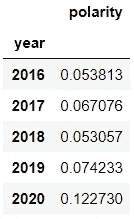

作者图片

年度结果令人惊讶:2020 年几乎是其他年份的两倍。我肯定会认为 2020 年是我最快乐的一年，但我没想到情绪分析会如此强烈地支持我的直觉。

这里我们看到极性随着时间的推移以每月和每年的频率显现出来:

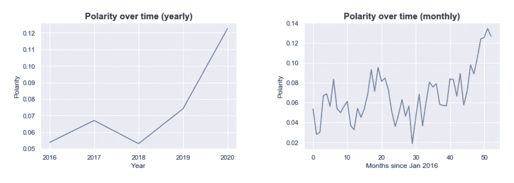

作者图片

## 长度分析

我想探究的最后一件事是长度:我写了多少，随着时间的推移，我的冗长是如何变化的？

为此，我创建了一个数据框架，其中包含关于日志条目长度的各种指标:

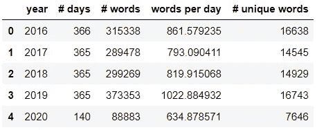

作者图片

我在 2019 年写得最多，在 2020 年写得最少，每天写得更多的年份词汇量更大。2020 年是迄今为止每日单词量最低的一年，这是有道理的(WPD)；这是我最快乐也最忙碌的一年。

看到我在 2020 年写得少了多少，不禁让人产生疑问:“快乐”(极性)和我的条目长度之间有联系吗？我用不同的方法绘制了每天平均字数与情绪的关系图，看看是否有什么规律。

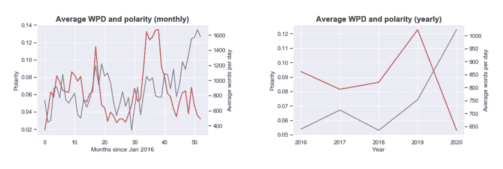

作者图片

随着时间的推移，每天绘制情绪和单词显示了一些关系；除了 2019 年的字数大幅上升和 2020 年的字数快速下降之外，每月的情节都很好。

年度图表给出了一个更全面的见解，如果不是相互冲突的话:除了 2018-2019 年，情绪和字数都有所上升，字数和情绪相互反映。当情绪上升时，字数下降，反之亦然。这符合我的直觉，如果我更快乐、更积极，我会写更少的日志，而是花更多的时间关注那些积极的事情。

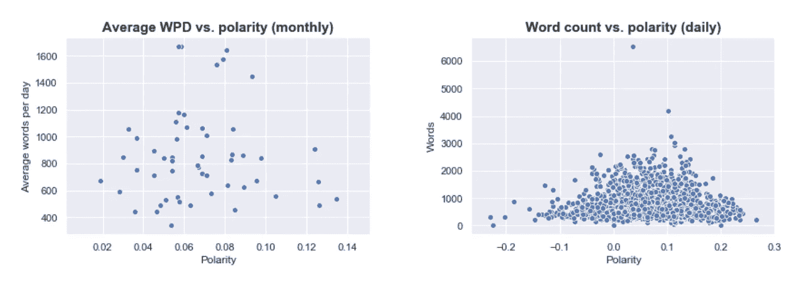

作者图片

去除时间成分，散点图变得不那么有意义；我看到的唯一趋势是，当绘制每日图表时，情绪非常高或非常低的条目没有高字数，而那些极性更中值(介于-0.5 和 0.15 之间)的条目有更高的字数。

这很有意思；如图所示，我不会期望在非常积极的日子里写很多，但在非常消极的日子里，我会期望写很多关于为什么这一天不好，为什么我感到沮丧/不安，等等。有可能 TextBlob 情绪分析并没有很好地将我的糟糕日子捕捉为低极性，而将我的积极日子捕捉为高极性。

# 深度学习

由于这是一个无监督的学习项目(没有标签的数据)，我的大部分见解来自探索性的数据分析。我尝试过主题建模，但结果无法理解。这是有意义的，因为主题建模最擅长识别高度不同的主题(如体育和政治)，而我的日志主要集中在谈论我的一天。

我的分类器计划也没有成功，因为我需要手动对所有 1601 日志条目进行分类——这不是对我时间的一个特别好的利用。

然而，我**能够使用深度学习来完成我最感兴趣的任务:文本生成！**

## 训练语言模型

我从一个语言模型开始，这个语言模型是在 Wikitext103 数据集上预先训练的，这个数据集是从维基百科中经过验证的文章中提取的超过 1 亿个标记的集合。

这样做让我可以利用迁移学习，这意味着我的模型从对英语的良好理解开始，而不是从零开始。然后，我对所有 1601 条日志条目进行了训练，经过四次微调后，准确率接近 33%。

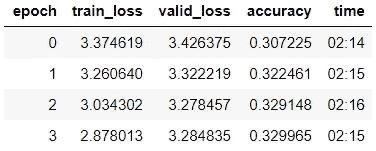

作者图片

我对它的表现感到惊讶。在语言模型的上下文中，*准确性*基本上指的是它能够根据之前的词汇正确预测下一个单词的频率。鉴于我的词汇表中有成千上万的单词，当时⅓的正确预测是相当不可思议的。我想我是一个可预测的作家。

## 文本生成

对于文本生成，我给了模型各种各样的起始单词/短语，类似于我经常用来开始我的日志的单词/短语，并在获得满意的结果之前测试了一些不同的长度:

200 字，起始文字:“好的”

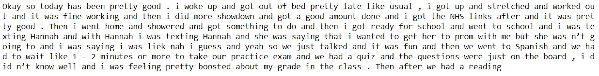

作者图片

这些条目波动很大是可以理解的，这里有一个不太容易理解的条目，其中有相同的参数:

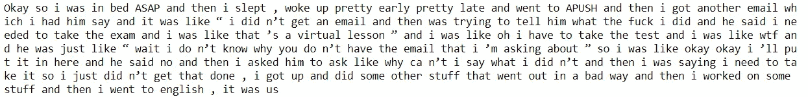

作者图片

这里是我让它谈论大学里的事情的最佳尝试——起始文本是“我的宿舍”。考虑到我只有一年的大学经历，而高中有四年，我对这个模型很少提到与大学相关的话题并不感到惊讶。

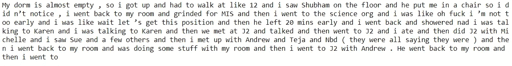

作者图片

肯定有很多重复和一些无意义的部分，但老实说，这听起来很像我写日记的方式。我对结果很满意。这种语言模式确实一针见血地描述了我大多数时候是如何开始写日记的:起床，谈论学校。

Fast.ai 的 learner.predict 方法当然不是最好的文本生成方法，但在这个项目的范围内，我无法使用另外两种文本预测方法 [*【光束搜索】*](https://docs.fast.ai/text.learner.html#LanguageLearner.beam_search) 或 [*nucleus predict*](https://arxiv.org/abs/1904.09751) 获得更好的结果。

## 语法上

我注意到的最后一件事是，生成的文本中有一些基本的语法错误，如缺少标点符号、笨拙的空格和大写错误。我本来可以安装大量的语法检查 API，但是我在学校使用 Grammarly，希望快速得到结果，所以我手动将生成的条目放入其中，不加区别地接受所有的修改建议。结果如下:

200 字，起始文字:“好的”

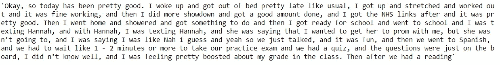

作者图片

200 字，起始文字:“我的宿舍”

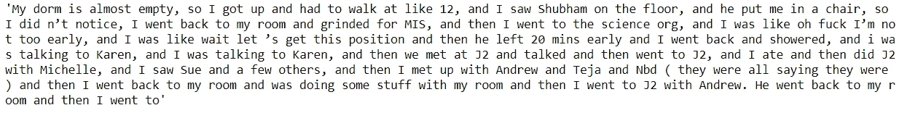

作者图片

# 结论

从事这个项目不仅令人怀念，而且是一次很好的学习经历和许多乐趣。我不知道接下来会发生什么，但我发现了大量有趣的结果，并从一个新的数据驱动的角度审视了我的个人经历。

用我在过去三个月里学到的技能来解决这个新奇的问题真的很令人兴奋，我想继续使用指导我完成这个项目的过程来获得有意义的见解。

这是我写的第一篇文章，也是我完成的最大的数据科学项目，所以肯定还有改进的空间。如果你有任何建议，请让我知道。