# 作为投资者探索零售数据集

> 原文：<https://towardsdatascience.com/exploring-a-retail-data-set-as-an-investor-1b08e5c7b255?source=collection_archive---------47----------------------->

## 基于美国人口普查年度零售贸易调查数据集，应用数据分析寻找相关见解

图片由 [Unsplash](/s/photos/retail?utm_source=unsplash&utm_medium=referral&utm_content=creditCopyText) 上的[克拉克街商业](https://unsplash.com/@mercantile?utm_source=unsplash&utm_medium=referral&utm_content=creditCopyText)拍摄

## 介绍

年度零售贸易调查涵盖了 50 个州和哥伦比亚特区的零售贸易企业。这项贸易调查显示了国家的销售额、销售税、费用、库存等等。

这里的挑战是只探索这些数据，并发现我们可以找到什么样的相关见解，以及一些答案，以向投资者展示哪个细分市场可能是最佳选择。

当然，这可能会产生新的疑问和疑虑，但以下问题将在一开始引导我们:

*   作为投资人进入哪个细分市场更感兴趣？成本和费用如何影响细分市场？
*   哪一个有更多的钱花在存货上？
*   库存如何影响商业利润？
*   预测下一年(2015 年)的销售额

## 数据

为了找出这些答案，将使用由[数据提供的美国人口普查年度零售贸易调查数据集。世界](https://data.world/uscensusbureau/annual-retail-trade-survey)。通过这个数据集，我们可以获得从 2004 年到 2014 年在美国收集的销售、销售税、库存、毛利、费用、采购和应收账款总额等信息。

## 假设

美国人口普查年度零售贸易调查数据集得出了按主要细分市场组织的数据，其中一些细分市场。经过数据清理过程后，2004 年至 2014 年间，选择简化并仅处理主要类别。这些段和各自的代码是:

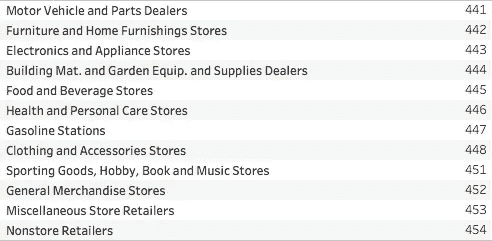

我们应该检查许多指标，以便尽可能准确地了解感兴趣的细分市场。然而，该数据集提供了一般信息，允许进行唯一的定量分析。这里的想法是从这个数据集中提取最相关的信息。

另一个重要的问题是，这个分析是一个研究案例，针对一个“假设的投资者”，他没有会计领域的知识，只是通过在该领域的一些研究。此处的目的是，即使数据有限，也要展示数据分析如何帮助识别相关信息，从而帮助做出决策。

说完了，我们开始吧！

克里斯蒂安·柯普克在 [Unsplash](/s/photos/cashier?utm_source=unsplash&utm_medium=referral&utm_content=creditCopyText) 上拍摄的照片

## 销售

当有人考虑在某个领域投资时，销售额可能是第一个想到的指标。我们可以说这是合乎逻辑的，毕竟销售越多，钱就越多。因此，我们需要扫一眼，挑选出销售额较高的细分市场。

实际上，事情没那么简单。很明显，如果你不卖，你就退出了市场，但我们需要记住，销售不同于盈利能力。销售是必不可少的，可以为我们带来有价值的数据，但除了销售，我们还需要检查许多其他重要的指标。无论如何，这是一个很好的起点。

总销售额增长| 2004 年至 2014 年

上图向我们展示了逐年的销售增长，从 2004 年到 2007 年，我们可以实现接近平均 5%的持续增长。由于大衰退，我们可以看到从 2008 年开始下降，到 2009 年下降到-7.68%。从 2010 年开始，美国零售业开始恢复性增长，平均增长 4.2%。根据这一初步分析，我们可以预计 2015 年的增长率约为 3.5%。

在下面的图表中，我们可以看到一个有趣的按细分市场划分的年度总销售额视图。**汽车和零部件经销商**的总销售额最高，历年达到 94.4 亿美元。如果我们与销售额第二高的地方**百货店**比较，会发现销售额几乎少了 31%,而与销售额最低的地方**体育用品、业余爱好、书籍和音乐商店**相比，差距达到 90%以上。

细分市场总销售额| 2004 年至 2014 年

下面的下一张图显示了各细分市场的同比增长，除了各细分市场的情况与之前一样之外，还可以了解哪些领域对大衰退带来的经济问题更加敏感。**汽车及零部件经销商**板块是第二大受影响的板块，2009 年 **-14.53%** ，仅次于**加油站**，同年**-22.28%**。

另一方面，受影响最小的部门是**百货商店**，其次是**食品和饮料商店**，分别为 **-1.03%** 和 **-0.14%** 。

**无店铺零售商**多年来的增长最为稳定和强劲，在 2014 年达到了 **8.48%** 。

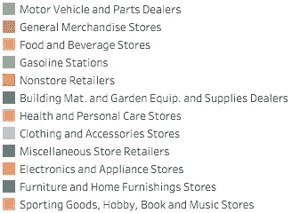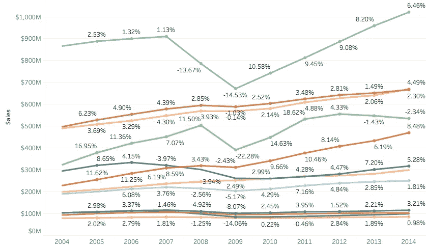

细分市场同比增长| 2004–2014 年

当我们按细分市场分析平均增长率时(如下所示)，**无店铺零售商**在分析期内的比率最高，**为 6.85%** 。

相比之下，**汽车及零部件经销商，这一历年来总销售额最高的行业，平均增长仅为**1.87%**。**

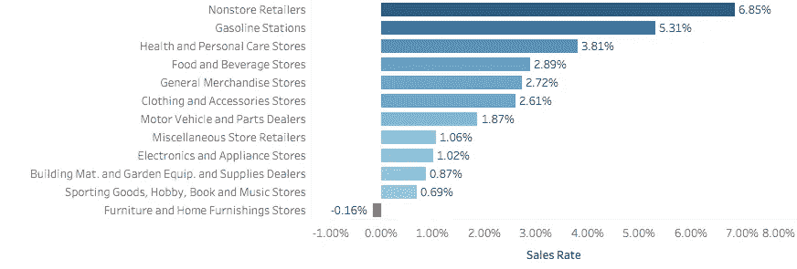

各细分市场的平均增长率| 2004–2014

从以前的数据分析到现在，我们可以得到一些结论。尽管是对经济危机最敏感的行业之一，**汽车和零部件经销商**的复苏最为强劲，从 2010 年开始计算，平均增长率为 **8.75%** 。

**非商店零售商**有类似的平均增长( **8.59%)** ，但如果我们考虑总销售额，**机动车和零部件经销商**销售额**为 94.4 亿美元。相比之下，非商店零售商的销售额略高于 37.4 亿美元，两者相差 57 亿美元。**

****

**照片由[斯科特·格雷厄姆](https://unsplash.com/@sctgrhm?utm_source=unsplash&utm_medium=referral&utm_content=creditCopyText)在 [Unsplash](/s/photos/chart?utm_source=unsplash&utm_medium=referral&utm_content=creditCopyText) 上拍摄**

## ****费用和成本****

**之前的分析向我们展示了**汽车和零部件经销商**似乎是最有前景的细分市场，但正如之前所说，销售利润各不相同。**

**从现在起，我们的任务将是寻找能够证实或否定这一先前结论的相关信息。基于我们的数据集信息，我们可以开始寻找支出、成本以及它们如何影响收入。**

**让我们从一些用来探索公司财务稳定性和整体健康状况的最重要的利润率开始:**毛利率**和**净利润率。****

**首先，我们将分析毛利率。这个指标表明公司在成本之外获得了多少利润。这个结果越高，公司就越能有效地从每一美元的成本中获取利润。我们可以通过公式计算**

***毛利率=(收入—销货成本)/收入 x 100***

**我们可以使用总销售额作为收入，但首先我们需要找出商品销售成本(COGS ),它指的是生产公司销售的商品的直接成本。成本越高，利润就越低。为此，将使用下面的公式**

***销货成本=期初库存+购货—期末库存***

**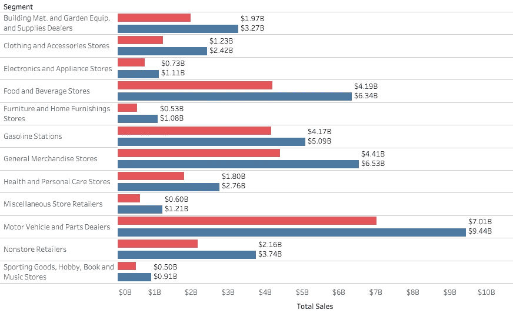**

**商品成本 x 总收入**

**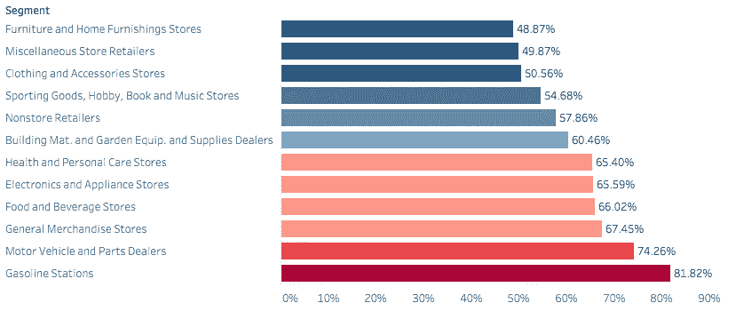**

**按部门划分的货物费率成本**

**上面的图表让我们大致了解了商品成本对零售利润的影响。总销售额较高(超过 50 亿美元)的细分市场也有较高的商品成本，在**机动车和零部件经销商**中超过 74 **%** ，在**加油站**中几乎达到 **82%** 。**

**另一方面，销售额较低的第二个区域，**家具和** **家居用品商店**的价值较低，含 Cogs 的费用不到 **49%** 。**

**现在，我们可以访问**毛利率**并发现每一美元的成本可以产生多少利润。**

**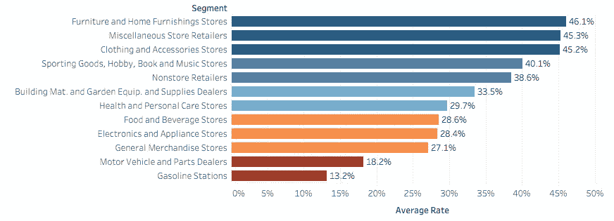**

**按部门划分的平均毛利**

**同样，我们可以看到一个与之前相似的标准。销售额较高的细分市场每一美元的成本回报都较低。**加油站**和**机动车和零部件经销商**处于基线，每一美元产生 **13** 和 **18** 美分的毛利。排在第一位的是**家具和** **家居用品店，**每一美元涉及 **46** 美分的费用。**

**毛利率提供了一个公司盈利能力的大致线索，但不是一个精确的衡量标准。为了有一个更准确的数字，我们需要找到**净利润率。为此，我们还需要将运营成本、税收、利息等其他费用纳入计算，以得出净收入，然后。****

***净利润率=净收入/收入***

**该数据集仅带来费用文件，因此，将假设额外成本被收集到该文件中，以供进一步计算。**

**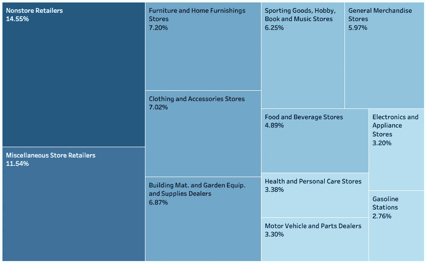**

**按部门划分的净利润率**

**上面的图表揭示了关于利润的更精确的数字。按照用于分析毛利率的相同标准，这些数字表达的是公司从销售退货中获得的每一美元中有多少是利润。**

****加油站、电子电器商店**和**机动车和零部件经销商**的数字较低，将利润转化为低于 **3.5%** 。换句话说，每卖出一美元，就有不到 0.035 美分的利润。**无店铺零售商**和**杂货铺零售商**的回报率最高，分别接近 **15%** 和 **12%** 。**

**下面我们对每个细分市场的**净利润率**和**销售额**进行了比较，结果显示，销售额最高的地区通常利润较低。**

**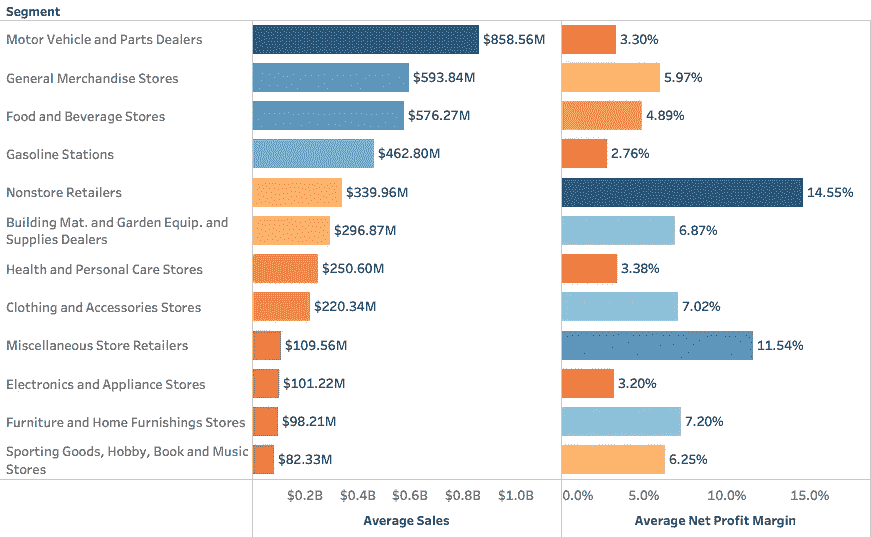**

**净利润率 x 销售额**

**更高的利润率是目标，因为这意味着公司从销售中获得更多。然而，来自领先位置细分市场的强劲销售并不一定转化为高利润率。我们需要找出这个百分比对应的金额。**

****汽车和零部件经销商**仅转化为利润 **3.30% —** 对应于平均销售额**2830 万美元**——而位于销售图表中间的**无店铺零售商**获得 **14.55%，**对应**4950 万美元。非商店零售商**胜出。**

**如果我们将机动车辆和零件经销商与净利润率第二高的杂货铺零售商**、**进行比较，我们的**、2830 万美元(3.30%)** 、1260 万美元、 **(11.54%)** 来自平均销售额。在这种情况下，**机动车和零部件经销商**转向最佳选择。**

**到目前为止，无店铺零售商似乎是最好的选择，尽管它不是销售额最高的部门，但却有着最好的净利润率。**

****

**图片来自 [Pixabay](https://pixabay.com/?utm_source=link-attribution&utm_medium=referral&utm_campaign=image&utm_content=408222) 的[延斯·p·拉克](https://pixabay.com/users/delphinmedia-348407/?utm_source=link-attribution&utm_medium=referral&utm_campaign=image&utm_content=408222)**

## ****库存****

**库存是零售业中必须调查的另一个具有重大影响的关键领域。这意味着这是公司创收和盈利的来源之一。简单来说，就是指可供销售的商品和用于制造供销售的产品的原材料。**

**基本上，长期保持较高库存量对公司来说是不利的，除了过时之外，还会带来储存和损耗成本。然而，小的库存也会带来一些问题，比如由于库存不足而导致的潜在销售损失。**

**也就是说，我们需要使用以下公式，通过存货周转率来衡量一家公司在特定时期内销售和置换存货的次数**

***库存周转率=销售额/平均库存***

**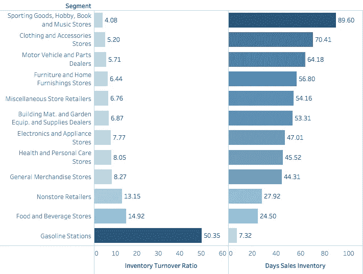**

**按部门划分的库存周转率**

**一些消息来源称，零售的理想库存周转率在 4 到 6 之间，但是正如我们在上面看到的，这些数字会根据业务领域的不同而有所不同。事实上，这些数字只是指导搜索最佳结果的参考。**

**从上图可以看出，**加油站**的库存周转率较高，销售库存天数较少，每年替换库存 **50.35 次**，抛售库存 **7.32 天**。在这种情况下，我们可以说高销售需求和有限的库存空间可能是原因。然而，很少会在加油站停下来，面对由于燃料短缺而关闭的加油站。**

**考虑到参考值(4 和 6)，我们可以说**体育用品、业余爱好、书籍和音乐商店**、**服装和配件商店**和**机动车辆和零件经销商**显示出最佳库存比率，正好在期望比率 4 和 6 之间。**

**最后，我们将分析**毛利润投资回报(GMROI)** ，这是一个零售指标，用于确定一家公司(在本例中，是一个细分市场)是否从购买的产品中获得了足够的毛利润。**

**由此，我们可以使用下面的公式计算出需要多少库存投资才能产生理想的毛利润。**

***GMROI =毛利/平均库存成本***

**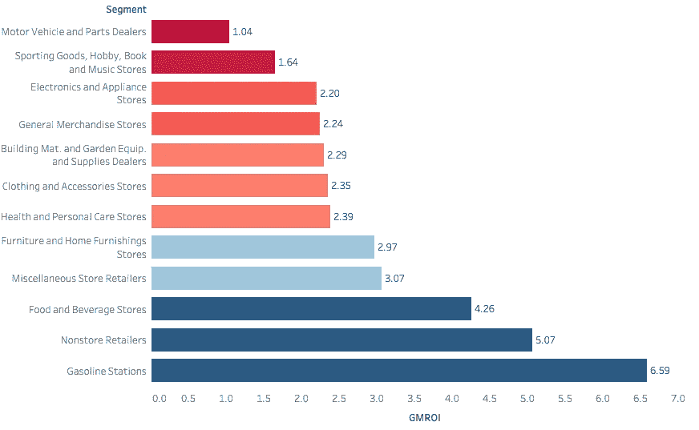**

**投资毛利率回报**

**上面的图表带来了有趣的数字。我们可以说，GMROI 越高，投资于库存的每一美元就能赚更多的钱。从**机动车辆和零件经销商**部门开始，显示最低的 GMROI 为 1.04，这意味着该部门的收入为 104%，仅略高于成本。**

**分析**加油站**，GMROI 结果为 6.59 的细分市场返回了 656%的收入，因此销售商品的价格高于其购买成本。无店铺零售商紧随其后，销售额为 5.07 英镑，收益为 507%。基于这些结果，**加油站**和**非商店零售商**对投资者来说似乎是不错的选择。**

****

**[Adeolu Eletu](https://unsplash.com/@adeolueletu?utm_source=unsplash&utm_medium=referral&utm_content=creditCopyText) 在 [Unsplash](/s/photos/chart?utm_source=unsplash&utm_medium=referral&utm_content=creditCopyText) 上拍摄的照片**

## ****结论****

**我们现在将总结一下到目前为止发现的关键见解。**

**- **由于大衰退(2008 年至 2009 年)，美国零售贸易**地区在 2004 年至 2014 年期间的年平均增长率约为 2.5%。在此之前，该部门的增长率接近 5%。自 2010 年开始复苏后，预计 2015 年该细分市场的增长率约为 3.5%。**

**- **汽车及零部件经销商**部门的总销售额较高，同期为 94.4 亿美元。比第二高的卖家多 31%左右的销量。**

**- **汽车及零部件经销商**深受危机影响，在危机最严重的时候下降了 14.53%，但也是复苏最强劲的，2010 年至 2014 年平均下降了 8.75%。**非商店零售商**也有类似的复苏(8.59%)，但与**汽车和零部件经销商相比，销售额减少了近 40%。****

****-家具和** **家居饰品店**的销售成本(COGS)最低，不到费用的 49%。**加油站**和**机动车和零部件经销商**的 COGS 最高，分别为 82%和 74%。**

**- **加油站、电子和家电商店以及汽车和零部件经销商**的净利润率较低，为 3.5%，每销售一美元利润仅获得 0.035 美分的回报。非商店零售商和**杂货铺零售商**显示了最好的数字，分别转换了近 15%和 12%。**

**- **无店铺零售商**的净利润率更高，即使销售额排名第五。该部分的回报率为 14.55%，相当于 4950 万美元。最高卖家**机动车及零部件经销商**，回报仅为 3.30%，回应为 2830 万美元。**

**-尽管拥有可观的库存周转率，**加油站**和**无店铺零售商**都拥有最好的**毛利率投资回报率(GMROI)**达到 6.59 和 5.07，这意味着其收入分别为成本的 659%和 507%。**

**基于本文收集的所有信息，我们可以得出结论，**无商店零售商**细分市场是投资者的最佳选择。尽管不是销量最高的细分市场，但它在受大衰退影响较小的细分市场中排名第四，仅下降了-2.43%，在复苏中排名第二，平均增长 8.59%。**

**无店铺零售商也有最好的净利润率，回报率为 14.55%，或者说每卖出一美元赚 0.15 美分。此外，它的 GMROI 排名第二，收入是成本的 507%。**

**希望你喜欢这篇文章！谢谢大家！**

***这里* 可以访问 [*用于分析的代码*](https://github.com/fmascolo/US_retail_article.git)**