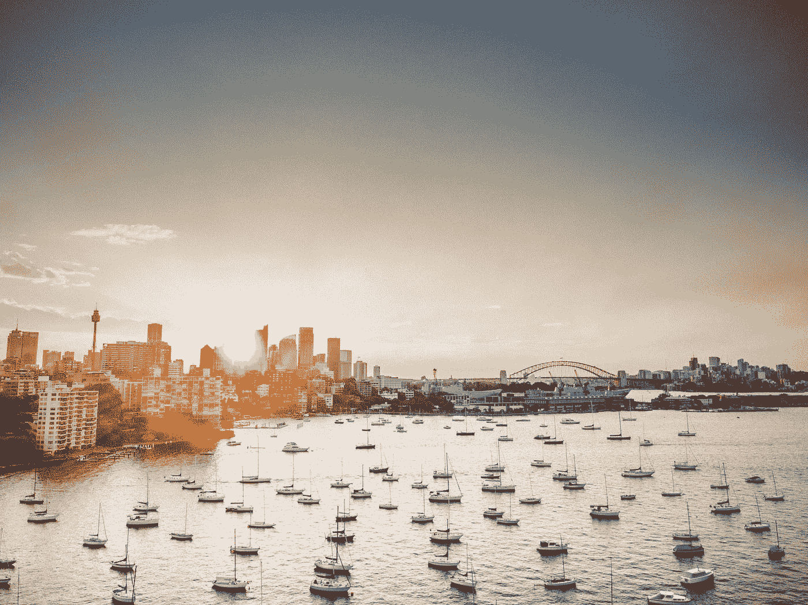
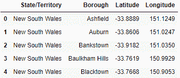
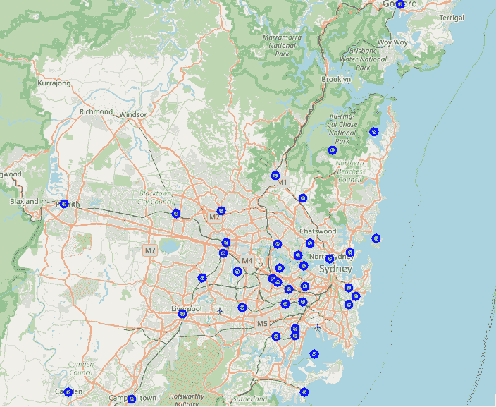
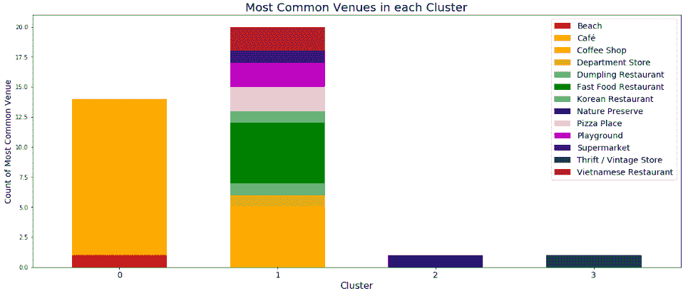
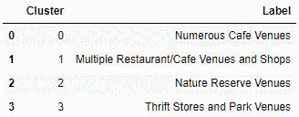
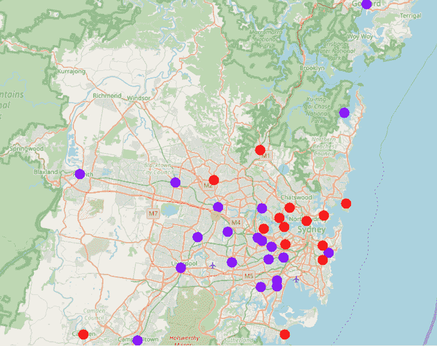

# 探索悉尼的区域和场所

> 原文：<https://towardsdatascience.com/exploring-areas-and-venues-of-sydney-nsw-australia-88c0cf4f3da2?source=collection_archive---------63----------------------->

## 使用 Foursquare API 和 K-means 对悉尼地区进行聚类。

乔希·威瑟斯在 [Unsplash](https://unsplash.com?utm_source=medium&utm_medium=referral) 上的照片

这篇文章对我的项目进行了概述。要查看用于完成分析的代码，请查看我的[笔记本](https://nbviewer.jupyter.org/github/ngoharry19/Coursera_Capstone/blob/master/Applied_Data_Science_Capstone.ipynb)。

# 1.介绍

新南威尔士州(NSW)是澳大利亚的主要州之一，拥有超过 810 万居民，是人口最多的州。新南威尔士州内有许多城镇，其首府悉尼是新南威尔士州近三分之二人口的家园。

该项目的目的是探索悉尼的不同地区，并根据每个区的顶级公共场所为新居民找到最佳位置。这篇文章将针对有意成为澳大利亚悉尼新南威尔士州居民的人，以及购房者、长期居留者和其他类似情况的人。其他有兴趣了解悉尼不同行政区的人也可以从中受益。

随着澳大利亚成为一个多元文化的国家，它的景观不断演变，看到不同的种族社区和场所的增加。将讨论悉尼区，以便利益相关者可以根据他们的兴趣选择最佳居住地点。

# 2.数据

将使用以下数据:

1.  [*二级行政区划，澳大利亚，2015*](https://geo.nyu.edu/catalog/stanford-fc944xn1421)

*   包含澳大利亚的二级行政和政治区划。这包括土著理事会、自治市、城市、政府和区理事会、市政当局、农村城市、郡和地区。导出的 JSON 文件中的相关信息包括州/地区、区/议会和每个分区的多个坐标。

2.[*four square API*](https://developer.foursquare.com/)

*   用于获取悉尼每个区的公共场所，如餐馆、商店和公园。

数据集(1)由 11 个州或地区和 1395 个行政区组成，随后被提取以仅获得与新南威尔士州相关的数据；这包括 199 个行政区。在探索新南威尔士州的数据时，没有快速的方法来查找悉尼地区新南威尔士州的行政区。相反，不在悉尼附近的行被手动删除，悉尼被指定为在悉尼的 80 公里半径内。

在发现每个位置的几何都是*多点*类型后，我使用了我的数据框的第一个坐标，后来发现它是不准确的。相反，我手动清理了数据框，删除了重复的行政区名称(如利物浦东、利物浦西)，因为它们与其他行政区重叠，并使用谷歌地图/搜索获得了每个分区的正确坐标。最终的数据框现在由指定的悉尼地区的 38 个行政区组成。

# 3.方法学

在检索了我们指定的悉尼地区的行政区以及每个行政区的经度和纬度之后，我们现在将使用 Foursquare API 进行探索性分析，以找到我们附近的场馆。然后，我们将使用 *K-means* 聚类来创建具有相似特征的邻域聚类。

首先，使用*地理库*和*树叶库*我们可以创建一个叠加了 38 个区的悉尼地图。

现在，我们使用 Foursquare API 从给定的坐标中发现附近的场地。我将半径定义为 1 公里，并提取了场馆的信息，如名称、类别和坐标。然后，我们可以将其合并到一个新的数据框中，其中包含社区和场馆信息。例如，在阿什菲尔德我们发现:

不幸的是，一些位置没有返回任何地点(Botany Bay，Warringah ),这可能是由于坐标的放置，因此它们被从分析中删除。总的来说，我们的行政区共有 143 个独特的类别和 890 个场馆。下图显示了返回的前 10 个场馆类别；然而，有些是不准确的，因为他们没有捕捉到至少 10 个不同的场馆。

在使用一个热点编码并对每个场馆类别的频率取平均值后，我们可以使用 *K-means* 聚类，这是一种无监督学习算法，用于根据特征相似性创建数据点的 *K* 聚类。观察肘方法和剪影评分，我们发现要使用的最佳聚类数是 *K = 4* 。

在运行 *K-means* 聚类之后，生成的聚类标签被添加到一个新的数据框中，该数据框是从我们的原始数据框及其对应的前 10 个场馆合并而来的。

想象一下每个集群中每个社区的第一个最常见的场地也是很棒的。这样，我们可以为我们的集群形成不同的标签。我创建了第一个最常见场馆的堆积条形图:

挺有意思的。通过分析条形图(以及排名前 10 的场馆)，我们可以归纳出每个集群，并将其标记如下:

受塞尔詹·耶尔德兹项目的启发，我为每个区添加了前 2 个场馆，这样我们可以在创建新地图后查看该地区的更多信息。

我们可以合并新列，形成包含所有信息的最终数据框。

# 4.结果和讨论

最后，我们最终创建了显示集群信息的地图。

总共 36 个邻域的 K-均值聚类的结果描绘了 2 个主要聚类和 2 个单邻域聚类。通过检查集群，我们发现:

*   集群 0(红色)-在这些位置可以找到大量的咖啡馆，其中有两个独特的位置(曼利和萨瑟兰郡，在这种情况下，克罗努拉)拥有海滩
*   第 1 组(紫色)——各种社交区域、购物商店和餐馆/咖啡馆
*   集群 2(青色)——被自然保护区包围(库-环-盖)
*   聚类 3(浅黄色)-由公园和旧货店组成(Holroyd)

通过包含更多的社区/议会区域，这些集群可以更加独特，具有更多的特征。每个邻域坐标周围 1 公里的半径可能不足以获取该区域的信息。例如，在第 2 组和第 3 组的地点周围只发现了两个场馆。这可以通过选择更好的坐标来改善，这样更多的场馆将被包围。增加圆圈的半径也将捕获更多关于该区域内其他场馆的信息。

建议想去悉尼新南威尔士州旅游或居住的人多研究一下附近地区，看看这些地区是否适合他们的生活方式或文化。红点(聚类 0)大多更接近悉尼的中央商务区，该地区的特点是咖啡馆场地。紫色圆点(聚类 1)远离悉尼中央商务区，该区域以其各种美食场所为特色。通过更仔细的观察，一些地区可以通过特定菜系的餐馆数量来识别。例如，我们的分析涵盖了 Leichhardt 的意大利餐厅(7 家)、Marrickville 的越南餐厅(8 家)和 Strathfield 的韩国餐厅(15 家)。

运行笔来访问地图的交互式版本

通过分析不同社区的顶级场所，这导致探索许多以美食和咖啡馆为特色的区域。仅基于这一因素选择居住区域不是最佳选择，但可以帮助特定人群寻找社交聚会和美食的不同区域。

# 5.结论

希望成为居民和其他利益相关者的人可以根据他们的兴趣选择悉尼新南威尔士州的最佳位置，如餐厅的菜肴、咖啡馆的数量或靠近海滩和公园。然而，不建议这样做，因为在寻找一个可以参观或居住的地方时，会有很多因素在起作用。顶级场所的聚类对于那些希望在菜肴与该地区其他餐馆有所不同的地区开设餐馆的人来说可能是有用的。在这个项目中进行的分析展示了每个集群的一些独特的场地。

总的来说，为新居民寻找最佳地点的最终决定将由个人自己做出。除了发现社区是如何通过场馆数量来表征的，他们还应该考虑其他因素，如交通、房价和不同必需品的获取。

感谢阅读！

这是我的 IBM 数据科学专业证书的顶点项目的一部分。您可以在这里找到该分析中使用的代码[。下一次，我想探索悉尼不同的美食，所以请保持警惕！](https://nbviewer.jupyter.org/github/ngoharry19/Coursera_Capstone/blob/master/Applied_Data_Science_Capstone.ipynb)

欢迎在 [LinkedIn](https://www.linkedin.com/in/harryngo19/) 上联系我，或者在 [Medium](https://medium.com/@harryngo) 上关注我。我刚刚开始在这个网站上发帖，我将期待发布更多关于数据科学、统计和我的经历的内容。