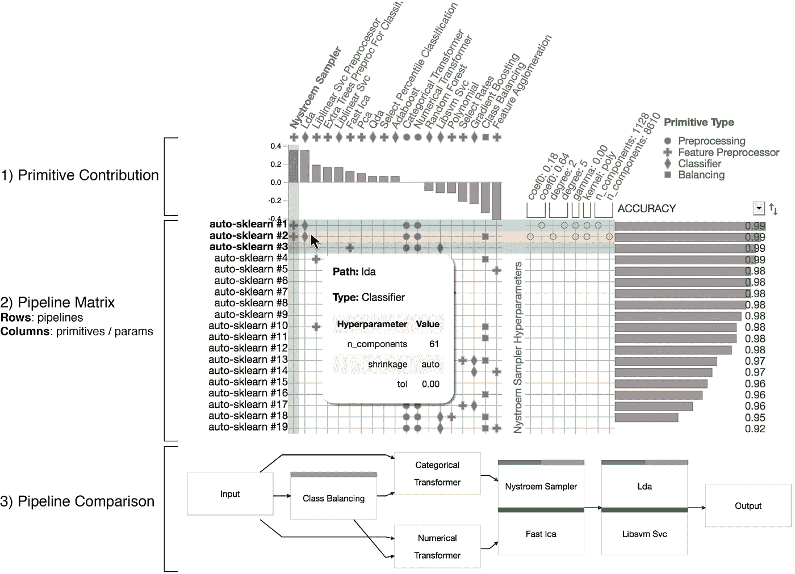
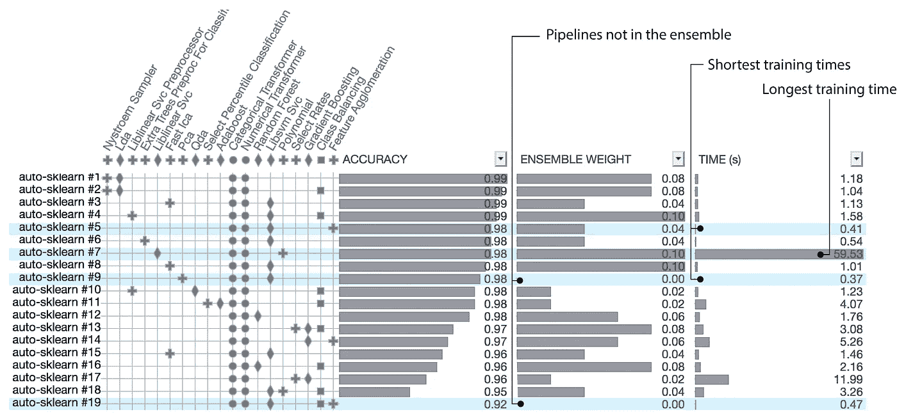
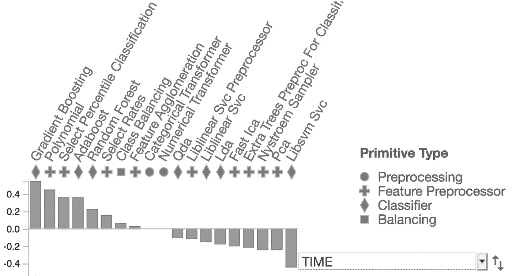

# 使用 PipelineProfiler 探索 Auto-Sklearn 模型

> 原文：<https://towardsdatascience.com/exploring-auto-sklearn-models-with-pipelineprofiler-5b2c54136044?source=collection_archive---------34----------------------->

## 如何打开 AutoML 的黑匣子


图片来源:[负空格](https://www.pexels.com/photo/coffee-writing-computer-blogging-34600/)

构建机器学习管道通常是一项困难、耗时且反复试验的任务。AutoML 通过自动选择计算步骤、调整超参数和训练解决机器学习问题的端到端模型，使这一过程变得更容易。Auto-Sklearn 是最流行的开源 AutoML 系统之一。给定一个数据集、一个问题类型(分类或回归)和一个度量分数，Auto-Sklearn 能够产生集成管道来优化所选的度量并产生良好的结果。

以*数字*数据集为例，我们希望在这里对数字图像进行分类。我们可以自动创建一个管道，用几行代码解决这个问题:

```
import sklearn.datasets
import autosklearn.classification
X, y = sklearn.datasets.load_digits(return_X_y=True)
automl = autosklearn.classification.AutoSklearnClassifier()
automl.fit(X, y, dataset_name='digits')
```

虽然这极大地方便了模型构建过程，但也使结果更加模糊:数据科学家不知道采取了什么步骤来产生管道，探索了搜索空间的什么部分，以及调整了什么超参数。

在这篇博文中，我们展示了如何使用 *PipelineProfiler* 来调试和探索 Auto-Sklearn 生成的模型。 *PipelineProfiler* 是一个新的库，旨在生成端到端机器学习管道的详细可视化。它与 Python 笔记本(Jupyter 和 Google Colab)集成在一起，可以在数据科学工作流中使用。

# 管道剖面仪工具

给定由 Auto-Sklearn 生成的训练模型，我们可以使用具有三行代码的 PipelineProfiler:

```
import PipelineProfiler
profiler_data = PipelineProfiler.import_autosklearn(automl)
PipelineProfiler.plot_pipeline_matrix(profiler_data)
```



图 1 PipelineProfiler 应用于 Digits 数据集。

图 1 显示了应用于 Digits 数据集的 *PipelineProfiler* 。该系统分为三个部分。1)原始贡献，显示原始使用与管道分数的相关性。2)流水线矩阵，呈现流水线、所使用的原语和超参数的概要。3)管道比较视图，突出显示所选管道之间的差异。

# 管道分析

图一。显示顶部两条管线使用 *Nystroem 采样器*、 *LDA* 和*变压器*，但是在*级平衡*和*采样器*超参数的使用上有所不同。原始贡献向我们展示了 *Nystroem 采样器*和 LDA 与高准确度分数相关。反之，*特征集聚*与低分相关。

管道比较视图显示了所选管道的节点链接表示(按住*键并点击*可以选择多条管道)。图一。显示了三大管道之间的差异。为每个选定的管线指定一种颜色，并用颜色对图形节点进行编码，以表示原始管线。

*PipelineProfiler* 还显示被评估管道的性能指标。在图 1 中。，我们会看到所有管道的准确度分数。但是，我们可以将此视图切换到其他管道指标。例如，Auto-Sklearn 生成的集合由所有评估的管道的加权平均值组成。我们可以切换度量分数来显示总体权重。我们还可以可视化每个管道的训练时间。图二。显示了可以显示的多个指标。我们从这个图像中移除了原始贡献视图，因为对于每个选择的度量，贡献都是不同的。



图 2 PipelineProfiler 可用于检查 Auto-Sklearn 提供的指标，例如准确度、总体重量和时间。

我们注意到管线#9 和#19 不属于系综，因为它们的权重被设置为零。此外，我们看到管道#7 训练时间最长，管道#9 和#5 训练时间最快。我们还注意到，流水线#1 具有最好的精度，但是不具有最高的总体权重。这表明 Auto-Sklearn 使用其他标准将权重分配给集合中的管道。

如果我们对哪些原语导致了长训练时间感兴趣，我们可以研究原语贡献视图:



图三。基于时间度量计算的原始贡献。梯度提升是与流水线训练时间最相关的原语。

这里，我们看到*梯度增强*和*多项式*是与高训练时间相关的两个原语，因此它们可能是罪魁祸首。直观地说，原始的*多项式*会导致更长的训练时间，因为它会从原始数据中生成大量的多项式特征。

# 最后的想法

这篇文章简要介绍了 *PipelineProfiler* ，这是一个 Python 库，可以用来研究 AutoML 模型。我们已经在 Jupyter Notebook 中看到了如何从 Auto-Sklearn 导入和可视化管道。

*PipelineProfiler* 是一款新工具，我们正在积极寻求关于我们应该支持哪些功能的反馈。如果您有任何问题或想要合作，请告诉我们！

# 安装和演示

该系统的现场演示可在 [Google Colab](https://colab.research.google.com/drive/1_2FRIkHNFGOiIJt-n_3zuh8vpSMLhwzx?usp=sharing) 上获得。

该代码是在 BSD 3 许可下开源的。github 库是:[https://github.com/VIDA-NYU/PipelineVis](https://github.com/VIDA-NYU/PipelineVis)

*PipelineProfiler* 可从 PyPI 库中获得。它可以通过以下命令安装:

```
pip install pipelineprofiler
```

欲了解更多信息，请参见[我们的论文](https://arxiv.org/abs/2005.00160)并观看我们的视频演示:

[1]福雷尔，马蒂亚斯[等.](https://automl.github.io/auto-sklearn)高效健壮的自动化机器学习[。](https://automl.github.io/auto-sklearn) *神经信息处理系统进展* 2015。[https://automl.github.io/auto-sklearn](https://automl.github.io/auto-sklearn)

[2] Ono，Jorge 等人，“PipelineProfiler:用于探测 AutoML 管道的可视化分析工具”。2020.[https://arxiv.org/abs/2005.00160](https://arxiv.org/abs/2005.00160)