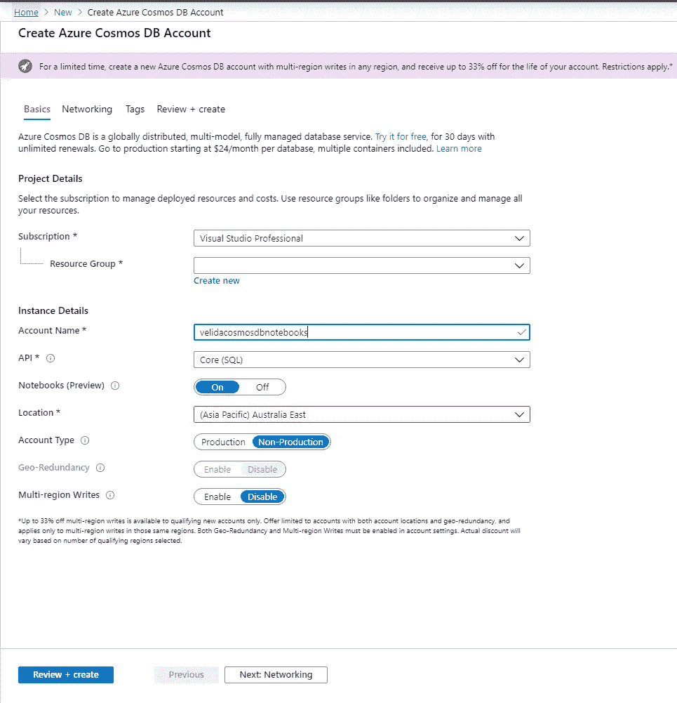
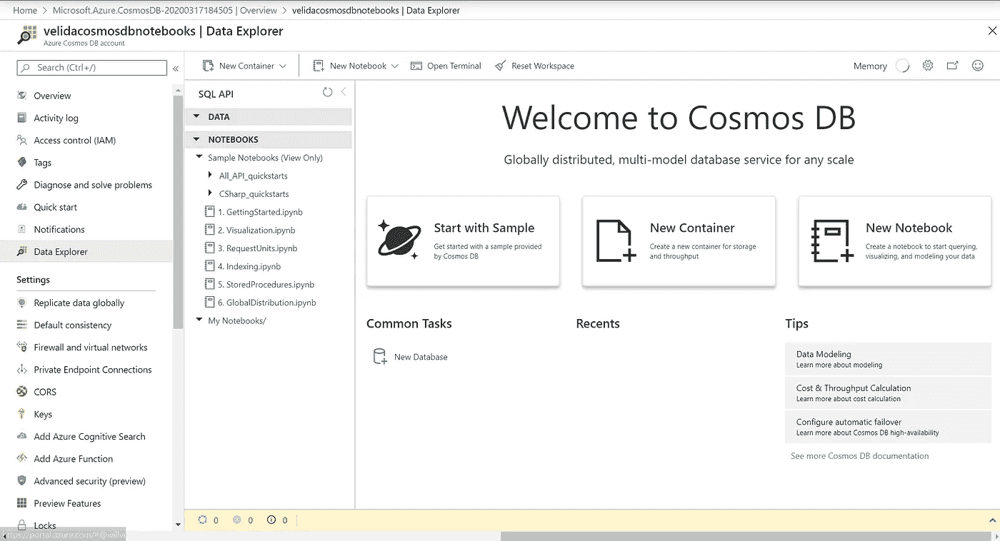
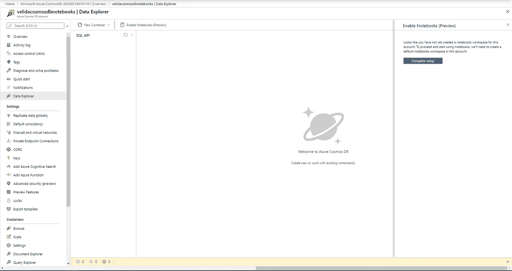
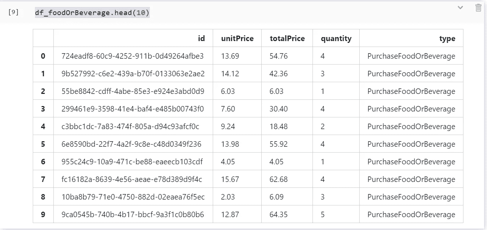
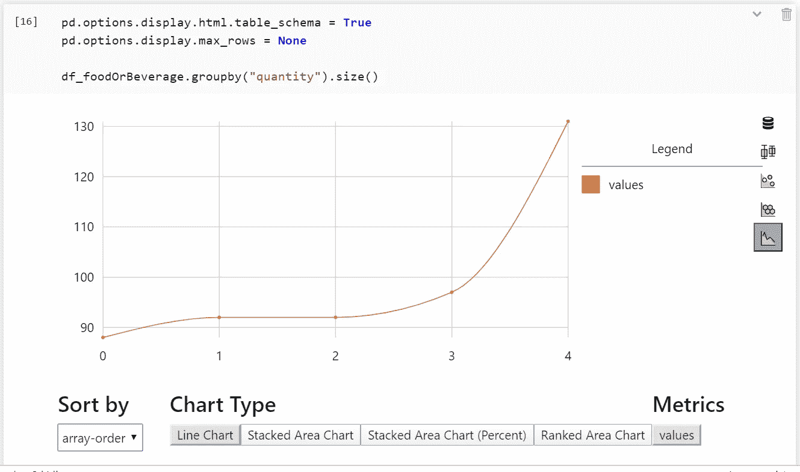

# 探索 Azure Cosmos DB 中的内置 Jupyter 笔记本

> 原文：<https://towardsdatascience.com/exploring-built-in-jupyter-notebooks-in-azure-cosmos-db-c9ffdb0273d5?source=collection_archive---------34----------------------->

## 快速介绍如何使用内置的 Jupyter 笔记本探索 Azure Cosmos DB 数据


[Azure Cosmos DB Logo 来源](https://devblogs.microsoft.com/cosmosdb/wp-content/uploads/sites/52/2019/10/FeaturedDefault.png)。 [Jupter 标志来源](https://www.google.com/url?sa=i&url=https%3A%2F%2Fcommons.wikimedia.org%2Fwiki%2FFile%3AJupyter_logo.svg&psig=AOvVaw2l-XIzfRaf1vDUblOzWmGX&ust=1584563383176000&source=images&cd=vfe&ved=0CAIQjRxqFwoTCKCaz96sougCFQAAAAAdAAAAABAD)

【2019 年 5 月，Cosmos DB 团队公布了在 Cosmos DB 账户内运行 Jupyter 笔记本的预览。该功能于 2019 年 9 月公开发布，适用于所有的 Cosmos DB API。有了这个功能，我们可以使用 Jupyter 笔记本来运行交互式查询，探索我们的数据和可视化我们的数据。我们甚至可以在 Cosmos DB 中的数据上建立机器学习模型！

**我能从中得到什么？**

在我们的 Cosmos DB 帐户中拥有 Jupyter 笔记本电脑会给我们带来很多好处。其中包括:

*   我们可以在我们的 Cosmos DB 数据上生成很酷的数据可视化。
*   在我们的笔记本中更轻松地共享代码。有没有尝试过在 GitHub 中分享 Jupyter 笔记本代码中的代码？这是可行的，但是通过在 Cosmos DB 中使用笔记本，它更具交互性，我们可以在 Azure 门户中显示结果。
*   我们的代码更具交互性，我们可以在笔记本中嵌入用户控件
*   我们可以在一个文档中组合不同类型的文档、文本、图像、动画等。
*   我们可以在笔记本上执行神奇的宇宙命令！稍后会详细介绍。

**听起来很酷，怎么才能得到这个功能？**

创建一个新的支持笔记本的 Azure Cosmos DB 帐户非常简单:

在 Azure 门户中，点击**创建资源**并选择 **Azure Cosmos DB。**在**创建 Azure Cosmos DB 帐户中，**确保您选择了**笔记本。**点击**审核+创建**，然后点击**创建。**



创建帐户后，您将在**数据浏览器**窗格中找到您的笔记本工作区。



但是我已经有一个 Cosmos DB 帐户了！要使用笔记本电脑，我必须销毁现有的笔记本吗？

一点也不！您可以通过执行以下操作来启用笔记本功能:

进入你的 Cosmos DB 账户的**数据浏览器**面板，选择**启用笔记本。**点击**完成设置**，您的账户将可以使用笔记本！



好了，我都准备好了！给我演示一下！

现在我们的 Cosmos DB 帐户中已经有了笔记本，让我们开始使用它吧！我已经在我的 Cosmos DB 帐户中创建了一个容器，并按照这个演示[使用数据填充它。(这个演示是由 Cosmos DB 工程团队提供的一系列演示，如果您想深入了解 Cosmos DB 的所有内容，我强烈推荐它！).](https://cosmosdb.github.io/labs/dotnet/labs/01-creating_partitioned_collection.html#populate-a-container-with-items-using-the-sdk)

我们可以在我们的 Jupyter 笔记本上安装新的软件包，就像其他笔记本一样。让我们通过输入以下命令来安装 Pandas:

```
import pandas as pd
```

点击运行，很快，我们就可以在笔记本上使用熊猫了。现在让我们使用这些宇宙命令中的一个来创建一个我们可以使用的熊猫数据框架。我有一个名为 **CustomCollection** 的集合，它是由 **/type** 划分的。我想创建一个 DataFrame 来处理我的所有类型为 **PurchaseFoodOrBeverage** 的项目。我们可以通过执行以下命令来做到这一点:

```
%%sql --database EntertainmentDatabase --container CustomCollection --output df_foodOrBeverage
SELECT c.id, c.unitPrice, c.totalPrice, c.quantity, c.type FROM c WHERE c.type = "PurchaseFoodOrBeverage"
```

在这个查询中，我只选择了我们的 POCO 属性。SELECT *还将包括 Cosmos DB 系统生成的属性，所以我现在将它们排除在外。我们现在可以通过执行以下命令来查看我们的数据帧:

```
df_foodOrBeverage.head(10)
```

我们现在应该看到以下结果:



让我们通过可视化来结束这个快速演示。键入以下命令:

```
pd.options.display.html.table_schema = True
pd.options.display.max_rows = Nonedf_foodOrBeverage.groupby("quantity").size()
```

这将产生一个 nteract 数据浏览器。这使我们能够过滤和可视化我们的数据框架。我们只需将 table_schema 设置为 True，将 max_rows 设置为我们想要的值，或者设置为 None 以显示所有结果。



我们可以用笔记本做很多事情，比如使用内置的 Python SDK for Cosmos DB，并将 JSON 文件上传到特定的 Cosmos DB 容器。查看[文档](https://docs.microsoft.com/en-us/azure/cosmos-db/use-notebook-features-and-commands#use-built-in-nteract-data-explorer)以了解我们可以在 Jupyter 笔记本上为 Cosmos DB 做的所有事情！

**结论**

希望你现在对在 Cosmos DB Jupyter 笔记本上可以做什么有了一个基本的概念。如果你有什么问题，欢迎在评论中提问！