# 使用 Python Scikit-learn-Iris 数据集探索分类器

> 原文：<https://towardsdatascience.com/exploring-classifiers-with-python-scikit-learn-iris-dataset-2bcb490d2e1b?source=collection_archive---------3----------------------->

## 如何在 Python 中构建第一个分类器的分步指南。


凯文·卡斯特尔在 [Unsplash](https://unsplash.com?utm_source=medium&utm_medium=referral) 上的照片

一瞬间，想象你不是花卉专家(如果你是专家，那对你有好处！).你能区分三种不同的鸢尾吗——刚毛鸢尾、杂色鸢尾和海滨鸢尾？

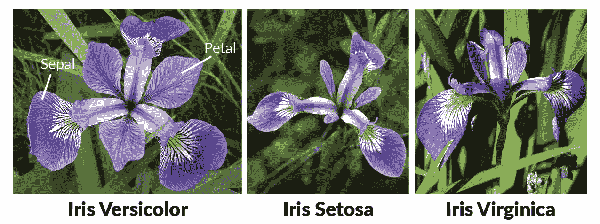

鸣谢:基尚·马拉德卡([链接](https://analyticsindiamag.com/start-building-first-machine-learning-project-famous-dataset/)

我知道我不能…

但是，如果我们有一个包含这些物种实例的数据集，并对它们的萼片和花瓣进行测量，会怎么样呢？

换句话说，我们能从这个数据集中学到什么来帮助我们区分这三个物种吗？

# 古玩目录

1.  [我们为什么选择这个数据集？](#c27c)
2.  我们试图回答什么问题？
3.  [我们能在这个数据集中找到什么？](#75d2)
4.  [我们正在构建哪些分类器？](#1599)
5.  [接下来我们能做什么？](#f4ab)

# 资料组

在这篇博文中，我将探索来自 UCI 机器学习知识库的虹膜数据集。摘自其[网站](https://archive.ics.uci.edu/ml/datasets/iris)，据说是“*也许是* ***模式识别文献*【1】中最知名的数据库** *。此外，创建了[机器学习大师](https://machinelearningmastery.com/)社区的杰森·布朗利(Jason Brownlee)称之为机器学习的“**Hello World**”[2]。*

我会把这个数据集推荐给任何一个初学数据科学并渴望构建他们的第一个 ML 模型的人。以下是该数据集的一些良好特征:

1.  150 个样本，4 个属性(相同单位，全是数字)
2.  均衡的类别分布(每个类别 50 个样本)
3.  没有丢失数据

正如您所看到的，这些特征有助于最大限度地减少您在数据准备过程中需要花费的时间，以便您可以专注于构建 ML 模型。并不是说准备阶段不重要。相反，这个过程非常重要，对于一些初学者来说，它可能太费时间了，以至于他们可能在进入模型开发阶段之前就不知所措了。

例如，来自 Kaggle 的流行数据集[House Prices:Advanced Regression Techniques](https://www.kaggle.com/c/house-prices-advanced-regression-techniques/overview)有大约 80 个特征，其中超过 20%包含某种程度的缺失数据。在这种情况下，您可能需要花一些时间来理解属性并输入缺失的值。

现在希望你的信心水平(没有统计双关语)相对较高。这里有一些关于数据争论的资源，你可以在处理更复杂的数据集和任务时通读一下:[降维](/dimensionality-reduction-for-machine-learning-80a46c2ebb7e)、[不平衡分类](https://machinelearningmastery.com/what-is-imbalanced-classification/)、[特征工程](https://machinelearningmastery.com/discover-feature-engineering-how-to-engineer-features-and-how-to-get-good-at-it/)和[插补](https://machinelearningmastery.com/handle-missing-data-python/)。

# 目标

探索该数据集后，我们希望能够回答两个问题，这两个问题在大多数分类问题中非常典型:

1.  **预测** —给定新的数据点，模型预测其类别(物种)的准确度如何？
2.  **推断** —哪个(些)预测器能有效地帮助预测？

# **简单说说分类**

分类是一种类型的 [**监督机器学习**](https://en.wikipedia.org/wiki/Supervised_learning) 问题，其中目标(响应)变量是分类的。给定包含已知标签的训练数据，分类器逼近从输入变量(X)到输出变量(Y)的映射函数(f)。有关分类的更多资料，请参见[统计学习介绍](http://faculty.marshall.usc.edu/gareth-james/ISL/)、[吴恩达的机器学习课程](https://www.coursera.org/learn/machine-learning#syllabus)(第 3 周)和 [Simplilearn 的分类教程](https://www.simplilearn.com/classification-machine-learning-tutorial)中的第 3 章。


[Florian Olivo](https://unsplash.com/@florianolv?utm_source=medium&utm_medium=referral) 在 [Unsplash](https://unsplash.com?utm_source=medium&utm_medium=referral) 上拍摄的照片

现在是时候写一些代码了！见我的 [Github 页面](https://github.com/terryz1/explore-iris)获取我的完整 Python 代码(写在 Jupyter 笔记本上)。

## **导入库并加载数据集**

首先需要导入一些库: *pandas* (加载数据集) *numpy* (矩阵操作) *matplotlib* 和 *seaborn* (可视化) *sklearn* (构建分类器)。确保在导入它们之前已经安装了它们(安装包指南[此处为](https://packaging.python.org/tutorials/installing-packages/))。

```
import pandas as pd
import numpy as np
import seaborn as sns
import matplotlib.pyplot as plt
from sklearn.model_selection import train_test_split
from pandas.plotting import parallel_coordinates
from sklearn.tree import DecisionTreeClassifier, plot_tree
from sklearn import metrics
from sklearn.naive_bayes import GaussianNB
from sklearn.discriminant_analysis import LinearDiscriminantAnalysis, QuadraticDiscriminantAnalysis
from sklearn.neighbors import KNeighborsClassifier
from sklearn.svm import SVC
from sklearn.linear_model import LogisticRegression
```

要加载数据集，我们可以使用 pandas 的 *read_csv* 函数(我的代码还包括通过 url 加载的选项)。

```
data = pd.read_csv('data.csv')
```

加载完数据后，我们可以通过 *head* 函数查看前几行:

```
data.head(5)
```

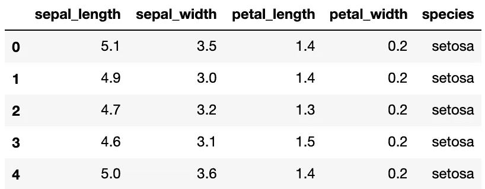

注意:所有四个测量单位都是厘米。

## 数字汇总

首先，让我们通过*描述:*来看看每个属性的数字摘要

```
data.describe()
```

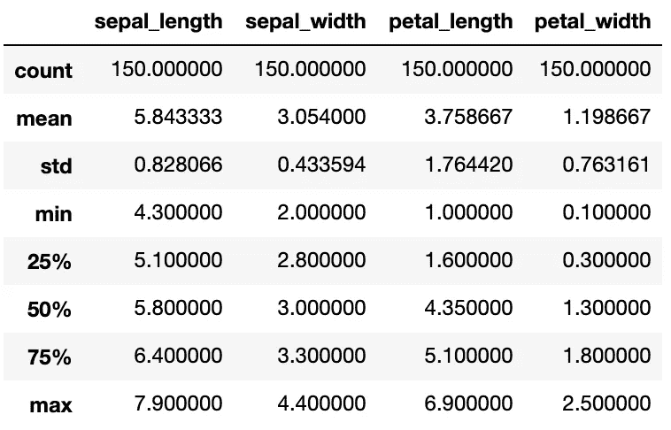

我们还可以使用 *groupby* 和 *size* 检查等级分布:

```
data.groupby('species').size()
```

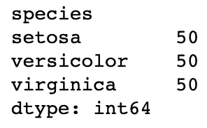

我们可以看到每个类都有相同数量的实例。

## 列车测试分离

现在，我们可以将数据集分为训练集和测试集。一般来说，我们还应该有一个**验证集**，用于评估每个分类器的性能，并微调模型参数，以便确定最佳模型。测试集主要用于报告目的。然而，由于这个数据集很小，我们可以通过使用测试集来服务于验证集的目的，从而简化这个过程。

此外，我使用分层的[拒绝](https://medium.com/@eijaz/holdout-vs-cross-validation-in-machine-learning-7637112d3f8f#:~:text=its%20own%20post.-,Hold%2Dout,model%20performs%20on%20unseen%20data.)方法来估计模型的准确性。另一种方法是做[交叉验证](https://medium.com/@eijaz/holdout-vs-cross-validation-in-machine-learning-7637112d3f8f#:~:text=its%20own%20post.-,Hold%2Dout,model%20performs%20on%20unseen%20data.)来减少偏差和方差。

```
train, test = train_test_split(data, test_size = 0.4, stratify = data[‘species’], random_state = 42)
```

注意:一般的经验法则是将数据集的 20–30%作为测试集。由于这个数据集很小，我选择了 40%来确保有足够的数据点来测试模型性能。

## 探索性数据分析

分割数据集后，我们可以继续研究训练数据。无论是 [*matplotlib*](https://matplotlib.org/) 还是 [*seaborn*](https://seaborn.pydata.org/) 都有很棒的绘图工具，我们可以用来进行可视化。

让我们首先通过每个特征的直方图创建一些单变量图:

```
n_bins = 10
fig, axs = plt.subplots(2, 2)
axs[0,0].hist(train['sepal_length'], bins = n_bins);
axs[0,0].set_title('Sepal Length');
axs[0,1].hist(train['sepal_width'], bins = n_bins);
axs[0,1].set_title('Sepal Width');
axs[1,0].hist(train['petal_length'], bins = n_bins);
axs[1,0].set_title('Petal Length');
axs[1,1].hist(train['petal_width'], bins = n_bins);
axs[1,1].set_title('Petal Width');# add some spacing between subplots
fig.tight_layout(pad=1.0);
```

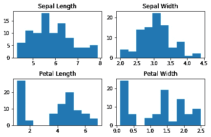

四个特征的直方图

请注意，对于花瓣长度和花瓣宽度，似乎有一组数据点的值比其他数据点的值小，这表明该数据中可能有不同的组。

接下来，让我们尝试一些并排的方框图:

```
fig, axs = plt.subplots(2, 2)
fn = ["sepal_length", "sepal_width", "petal_length", "petal_width"]
cn = ['setosa', 'versicolor', 'virginica']
sns.boxplot(x = 'species', y = 'sepal_length', data = train, order = cn, ax = axs[0,0]);
sns.boxplot(x = 'species', y = 'sepal_width', data = train, order = cn, ax = axs[0,1]);
sns.boxplot(x = 'species', y = 'petal_length', data = train, order = cn, ax = axs[1,0]);
sns.boxplot(x = 'species', y = 'petal_width', data = train,  order = cn, ax = axs[1,1]);
# add some spacing between subplots
fig.tight_layout(pad=1.0);
```

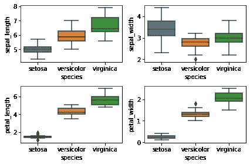

并排箱形图

底部的两个图表明我们之前看到的那组数据点是**setas。它们的花瓣尺寸比其他两种更小，也更不展开。比较其他两个物种，云芝的平均价值低于海滨锦鸡儿。**

Violin plot 是另一种类型的可视化，它结合了直方图和箱线图的优点:

```
sns.violinplot(x="species", y="petal_length", data=train, size=5, order = cn, palette = 'colorblind');
```

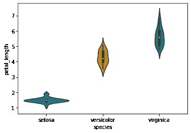

花瓣长度的小提琴图

现在，我们可以通过使用 seaborn 的 *pairplot* 函数来制作所有成对属性的散点图:

```
sns.pairplot(train, hue="species", height = 2, palette = 'colorblind');
```

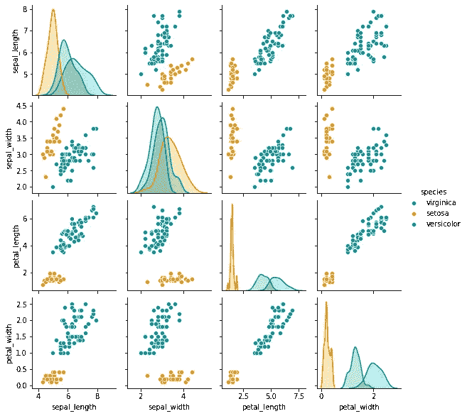

全配对属性散点图

注意，一些变量似乎是高度相关的，例如，花瓣长度和花瓣宽度。此外，花瓣的测量方法比萼片的测量方法更能区分不同的物种。

接下来，我们制作一个相关矩阵来定量考察变量之间的关系:

```
corrmat = train.corr()
sns.heatmap(corrmat, annot = True, square = True);
```

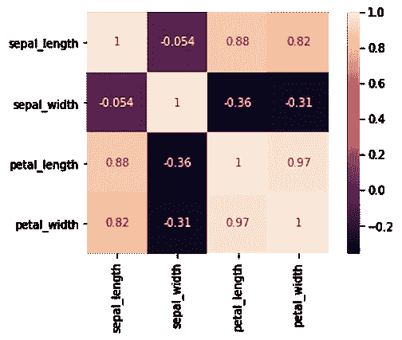

相关矩阵

主要的收获是花瓣测量值具有**高度正相关**，而萼片测量值不相关。注意花瓣特征与萼片长度也有相对较高的相关性，但与萼片宽度没有相关性。

另一个很酷的可视化工具是[平行坐标图](https://docs.tibco.com/pub/spotfire/6.5.0/doc/html/para/para_what_is_a_parallel_coordinate_plot.htm#:~:text=A%20parallel%20coordinate%20plot%20maps,a%20plot%20is%20substantially%20different.)，它将每个样本表示为一条线。

```
parallel_coordinates(train, "species", color = ['blue', 'red', 'green']);
```

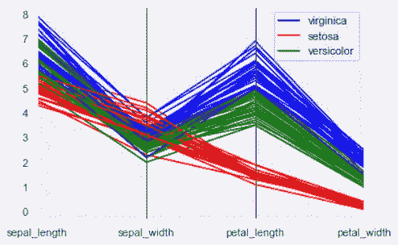

平行坐标图

正如我们之前看到的，花瓣测量比萼片测量更能区分物种。

# **构建分类器**

现在我们准备建立一些分类器(呜-呼！)

为了使我们的生活更容易，让我们先把类标签和特性分离出来:

```
X_train = train[['sepal_length','sepal_width','petal_length','petal_width']]
y_train = train.species
X_test = test[['sepal_length','sepal_width','petal_length','petal_width']]
y_test = test.species
```

**分类树**

我想到的第一个分类器是一个被称为分类树的区别性分类模型(在这里阅读更多)。原因是我们可以看到分类规则，并且很容易解释。

让我们使用 sklearn ( [文档](https://scikit-learn.org/stable/modules/generated/sklearn.tree.DecisionTreeClassifier.html))构建一个，最大深度为 3，我们可以在测试数据上检查它的准确性:

```
mod_dt = DecisionTreeClassifier(max_depth = 3, random_state = 1)
mod_dt.fit(X_train,y_train)
prediction=mod_dt.predict(X_test)
print(‘The accuracy of the Decision Tree is’,”{:.3f}”.format(metrics.accuracy_score(prediction,y_test)))--------------------------------------------------------------------
The accuracy of the Decision Tree is 0.983.
```

该决策树正确预测了 98.3%的测试数据。该模型的一个优点是，您可以通过其 *feature_importances_* 属性看到每个预测值的重要性:

```
mod_dt.feature_importances_--------------------------------------------------------------------
array([0\.        , 0\.        , 0.42430866, 0.57569134])
```

从输出和基于四个特征的索引，我们知道前两个特征(萼片测量)不重要，只有花瓣特征用于构建该树。

决策树的另一个好处是我们可以通过 *plot_tree* 可视化分类规则:

```
plt.figure(figsize = (10,8))
plot_tree(mod_dt, feature_names = fn, class_names = cn, filled = True);
```

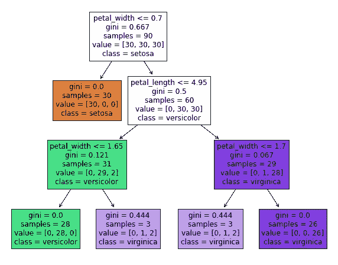

此树中的分类规则(对于每个拆分，左->是，右->否)

除了每个规则之外(例如，第一个标准是花瓣宽度≤ 0.7)，我们还可以看到在每个分割、指定类别等处的[基尼指数](http://www.learnbymarketing.com/481/decision-tree-flavors-gini-info-gain/#:~:text=Summary%3A%20The%20Gini%20Index%20is,partitions%20with%20many%20distinct%20values.)(杂质测量)。注意，除了底部的两个“浅紫色”方框外，所有的终端节点都是纯的。对于这两类情况，我们可以不那么自信。

为了演示对新数据点进行分类是多么容易，假设一个新实例的花瓣长度为 4.5 厘米，花瓣宽度为 1.5 厘米，那么我们可以根据规则预测它是杂色的。

由于只使用了花瓣特征，我们可以可视化决策边界并绘制 2D 的测试数据:

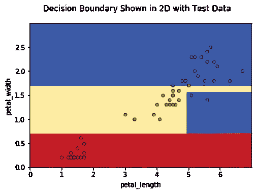

在 60 个数据点中，59 个数据点被正确分类。显示预测结果的另一种方式是通过[混淆矩阵](https://en.wikipedia.org/wiki/Confusion_matrix):

```
disp = metrics.plot_confusion_matrix(mod_dt, X_test, y_test,
                                 display_labels=cn,
                                 cmap=plt.cm.Blues,
                                 normalize=None)
disp.ax_.set_title('Decision Tree Confusion matrix, without normalization');
```

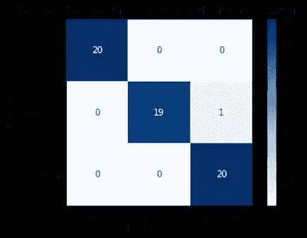

通过这个矩阵，我们看到有一个我们预测是弗吉尼亚的云芝。

一个缺点是建造一个单独的树是它的 [**不稳定**](/the-indecisive-decision-tree-story-of-an-emotional-algorithm-1-2-8611eea7e397) ，这可以通过[集合](https://en.wikipedia.org/wiki/Ensemble_learning)技术来改善，如随机森林，助推等。现在，让我们继续下一个模型。

**高斯朴素贝叶斯分类器**

最流行的分类模型之一是朴素贝叶斯。它包含单词“Naive ”,因为它有一个关键的假设**类-条件独立性**,这意味着给定类，每个特性的值被假设为独立于任何其他特性的值(在这里阅读更多)。

我们知道，显然不是这种情况，花瓣特征之间的高度相关性证明了这一点。让我们用这个模型来检验测试的准确性，看看这个假设是否可靠:

```
The accuracy of the Guassian Naive Bayes Classifier on test data is 0.933
```

如果我们只使用花瓣特征，结果会怎样:

```
The accuracy of the Guassian Naive Bayes Classifier with 2 predictors on test data is 0.950
```

有趣的是，仅使用两个特征会导致更正确的分类点，这表明在使用所有特征时可能会过度拟合。看来我们的朴素贝叶斯分类器做得不错。

**线性判别分析**

如果我们使用**多变量高斯分布**来计算类别条件密度，而不是采用单变量高斯分布的乘积(在朴素贝叶斯中使用)，那么我们将得到 LDA 模型(在此阅读更多[和](https://machinelearningmastery.com/linear-discriminant-analysis-for-machine-learning/))。LDA 的关键假设是类之间的协方差相等。我们可以使用所有特征并且仅使用花瓣特征来检查测试准确性:

```
The accuracy of the LDA Classifier on test data is 0.983
The accuracy of the LDA Classifier with two predictors on test data is 0.933
```

使用所有特征提高了我们的 LDA 模型的测试精度。

为了可视化 2D 的决策边界，我们可以使用只有花瓣的 LDA 模型，并绘制测试数据:

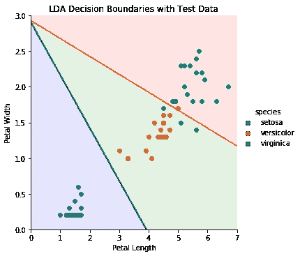

四个测试点被错误分类——三个 virginica 和一个 versicolor。

现在假设我们想用这个模型对新的数据点进行分类，我们可以在这个图上画出这个点，并根据它所属的彩色区域进行预测。

**二次判别分析(QDA)**

LDA 和 QDA 的区别在于，QDA 并不假设协方差在所有类中都是相等的，它被称为“二次的”,因为决策边界是二次函数。

```
The accuracy of the QDA Classifier is 0.983
The accuracy of the QDA Classifier with two predictors is 0.967
```

在所有特征的情况下，它与 LDA 具有相同的准确性，在仅使用花瓣时，它的性能略好。

同样，让我们为 QDA(只有花瓣的模型)绘制决策边界:

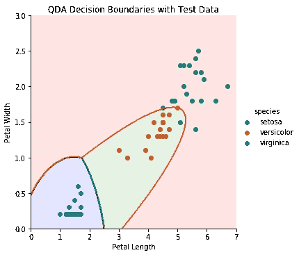

**K 个最近邻居(K-NN)**

现在，让我们稍微转换一下话题，看看一个名为 KNN 的非参数生成模型(点击阅读更多[)。这是一个流行的模型，因为它相对简单且易于实现。然而，当特征数量变大时，我们需要注意维度的](/machine-learning-basics-with-the-k-nearest-neighbors-algorithm-6a6e71d01761)[诅咒](/k-nearest-neighbors-and-the-curse-of-dimensionality-e39d10a6105d)。

让我们画出不同 K 选择的测试精度图:

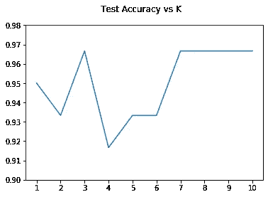

我们可以看到，当 K 为 3，或者介于 7 和 10 之间时，精度最高(约为 0.965)。与之前的模型相比，对新数据点进行分类不太直接，因为我们需要查看四维空间中它的 K 个最近邻居。

**其他型号**

我还探索了其他模型，如逻辑回归，支持向量机分类器等。详见我在 Github 上的代码。

请注意， **SVC(带线性内核)**实现了 100%的测试准确率！

我们现在应该很有信心，因为我们的大多数模型的准确率都超过了 95%。

# **接下来的步骤**

以下是对未来研究的一些想法:

1.  创建一个验证集并运行交叉验证，以获得准确的估计值，并比较它们之间的差值和平均准确度。
2.  找到包括其他鸢尾属物种及其萼片/花瓣测量值的其他数据源(如果可能，也包括其他属性)，并检查新的分类准确性。
3.  制作一个交互式网络应用程序，根据用户输入的测量值预测物种(查看我的简单网络演示，Heroku 部署[此处](https://dehao-iris-clf.herokuapp.com/)

# 摘要

让我们回顾一下。

我们研究了虹膜数据集，然后使用 *sklearn* 构建了一些流行的分类器。我们看到花瓣的测量比萼片的测量更有助于实例的分类。此外，大多数模型的测试准确率都达到了 95%以上。

我希望你喜欢这篇博文，并请分享你的任何想法:)

查看我关于探索 Yelp 数据集的另一篇文章:

[](/discover-your-next-favorite-restaurant-exploration-and-visualization-on-yelps-dataset-157d9799123c) [## 发现你下一个最喜欢的餐馆 Yelp 数据集上的探索和可视化

### 你用 Yelp 找好餐馆吗？这篇文章揭示了流行的 Yelp 数据集中的见解和模式。

towardsdatascience.com](/discover-your-next-favorite-restaurant-exploration-and-visualization-on-yelps-dataset-157d9799123c) 

# 参考

[1][https://archive.ics.uci.edu/ml/datasets/iris](https://archive.ics.uci.edu/ml/datasets/iris)
【2】[https://machinelingmastery . com/machine-learning-in-python-step-by-step/](https://machinelearningmastery.com/machine-learning-in-python-step-by-step/)