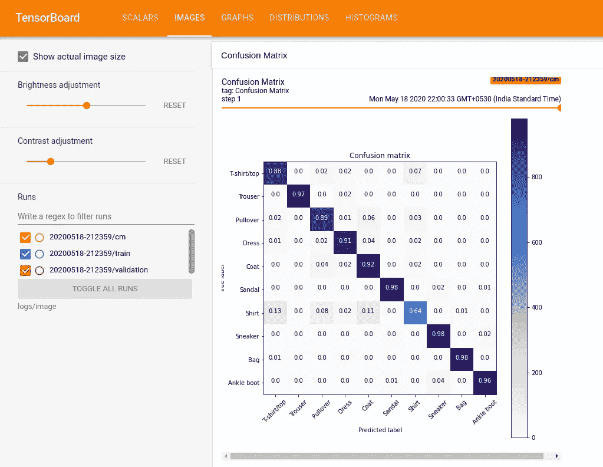
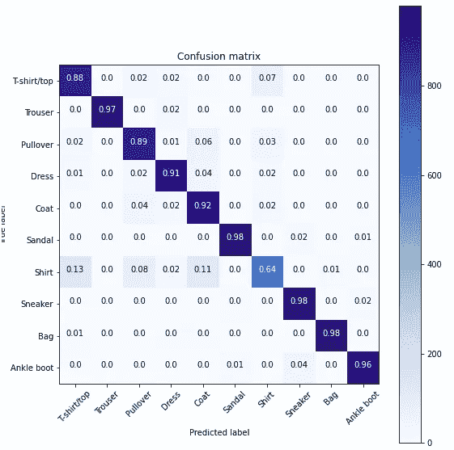

# 探索张量板上混淆矩阵的演化

> 原文：<https://towardsdatascience.com/exploring-confusion-matrix-evolution-on-tensorboard-e66b39f4ac12?source=collection_archive---------15----------------------->

## 训练卷积神经网络对来自数据集的图像进行分类，并使用 TensorBoard 来探索其混淆矩阵如何演变。



张量板上的混淆矩阵演化

Tensorboard 是在训练和验证神经网络时可视化许多指标的最佳工具。在大多数情况下，我们需要寻找更多的细节，比如模型如何处理验证数据。有时训练和验证损失和准确性是不够的，我们需要弄清楚验证数据的性能。一种方法是使用混淆矩阵来可视化。

# 混淆矩阵

在[机器学习](https://en.wikipedia.org/wiki/Machine_learning)领域，特别是[统计分类](https://en.wikipedia.org/wiki/Statistical_classification)问题中，**混淆矩阵**，也被称为误差矩阵，是一种特定的表格布局，允许算法性能的可视化，通常是[监督学习](https://en.wikipedia.org/wiki/Supervised_learning)算法(在[非监督学习](https://en.wikipedia.org/wiki/Unsupervised_learning)中，它通常被称为**匹配矩阵**)。[矩阵](https://en.wikipedia.org/wiki/Matrix_(mathematics))的每一行代表预测类中的实例，而每一列代表实际类中的实例(反之亦然)。该名称源于这样一个事实，即它可以很容易地看出系统是否混淆了两个类(即通常将一个类误标为另一个类)。

# 让我们建立一个混淆矩阵

我不会深入研究编码，我将只强调重要的代码部分，展示如何用 python 在 tensorboard 中设置和实现自定义回调。如果你想查看完整的代码，你可以查看我的知识库，我在这个故事的底部添加了一个链接。

我假设您已经构建并编译了一个 Keras 序列模型。

**定义绘制 cm 的函数**

```
def plot_confusion_matrix(cm, class_names):
    """
    Returns a matplotlib figure containing the plotted confusion matrix.

    Args:
       cm (array, shape = [n, n]): a confusion matrix of integer classes
       class_names (array, shape = [n]): String names of the integer classes
    """

    figure = plt.figure(figsize=(8, 8))
    plt.imshow(cm, interpolation='nearest', cmap=plt.cm.Blues)
    plt.title("Confusion matrix")
    plt.colorbar()
    tick_marks = np.arange(len(class_names))
    plt.xticks(tick_marks, class_names, rotation=45)
    plt.yticks(tick_marks, class_names)

    # Normalize the confusion matrix.
    cm = np.around(cm.astype('float') / cm.sum(axis=1)[:, np.newaxis], decimals=2)

    # Use white text if squares are dark; otherwise black.
    threshold = cm.max() / 2.

    for i, j in itertools.product(range(cm.shape[0]), range(cm.shape[1])):
        color = "white" if cm[i, j] > threshold else "black"
        plt.text(j, i, cm[i, j], horizontalalignment="center", color=color)

    plt.tight_layout()
    plt.ylabel('True label')
    plt.xlabel('Predicted label')
    return figure
```

# 设置 tensorboard 回调

我们现在准备训练 CNN，并在此过程中定期记录混淆矩阵。使用下面的代码，您将创建一个 [Keras TensorBoard 回调](https://www.tensorflow.org/api_docs/python/tf/keras/callbacks/TensorBoard)来记录基本指标。

```
logdir = "logs/image/" + datetime.now().strftime("%Y%m%d-%H%M%S")tensorboard_callback = keras.callbacks.TensorBoard(log_dir = logdir, histogram_freq = 1)file_writer_cm = tf.summary.create_file_writer(logdir + '/cm')
```

# 将 Matplotlib 图形转换为 PNG

遗憾的是，Matplotlib 文件格式不能作为图像记录，但 PNG 文件格式可以记录。因此，我们将创建一个 helper 函数，它接受一个 Matplotlib 图形，并将其转换为 PNG 格式，以便可以编写。

```
def plot_to_image(figure):
    """
    Converts the matplotlib plot specified by 'figure' to a PNG image and
    returns it. The supplied figure is closed and inaccessible after this call.
    """

    buf = io.BytesIO()

    # Use plt.savefig to save the plot to a PNG in memory.
    plt.savefig(buf, format='png')

    # Closing the figure prevents it from being displayed directly inside
    # the notebook.
    plt.close(figure)
    buf.seek(0)

    # Use tf.image.decode_png to convert the PNG buffer
    # to a TF image. Make sure you use 4 channels.
    image = tf.image.decode_png(buf.getvalue(), channels=4)

    # Use tf.expand_dims to add the batch dimension
    image = tf.expand_dims(image, 0)

    return image
```

# 计算混淆矩阵

我们将定义一个计算混淆矩阵的函数。

```
def log_confusion_matrix(epoch, logs):

    # Use the model to predict the values from the test_images.
    test_pred_raw = model.predict(test_images)

    test_pred = np.argmax(test_pred_raw, axis=1)

    # Calculate the confusion matrix using sklearn.metrics
    cm = sklearn.metrics.confusion_matrix(test_labels, test_pred)

    figure = plot_confusion_matrix(cm, class_names=class_names)
    cm_image = plot_to_image(figure)

    # Log the confusion matrix as an image summary.
    with file_writer_cm.as_default():
        tf.summary.image("Confusion Matrix", cm_image, step=epoch)
```

# 设置张量板以记录混淆矩阵

我们将在纪元结束时设置 tensorboard 回调来记录混淆矩阵

```
cm_callback = keras.callbacks.LambdaCallback(on_epoch_end=log_confusion_matrix)
```

# **开始冲浪板和训练**

我们需要将值指定为 model.fit 中回调参数的列表，以指定 Keras 在训练时使用我们的自定义回调函数。

```
# Start TensorBoard.
%tensorboard --logdir logs/image# Train the classifier.
model.fit(train_images,
          train_labels,
          epochs=5,
          verbose=0, # Suppress chatty output
          callbacks=[tensorboard_callback, cm_callback],
          validation_data=(test_images, test_labels))
```

默认情况下，tensorboard 服务器运行在端口 6006 上，如果您想要指定任何其他端口，您需要将该端口指定为 tensorboard 命令的参数。
Jupyter 用户只需在第一个单元格中键入`%load_ext tensorboard`并在导入库之前运行，这将在 Jupyter 笔记本中加载 tensorboard。

# 让我们看看我们的困惑矩阵



**想试试自己吗**

[](https://github.com/novasush/Tensorboard-with-Fashion-MNIST) [## novas ush/tensor board-时尚 MNIST

### 训练一个卷积神经网络来分类时尚 MNIST 数据集的图像，并使用 TensorBoard 来探索…

github.com](https://github.com/novasush/Tensorboard-with-Fashion-MNIST) 

参考我的 Github 回购链接。我在时尚 Mnist 数据集上训练了一个 CNN 分类器，并设置了一个混淆矩阵。以上输出来自我的 tensorboard 服务器。

# 额外资源

1.  [**深度潜入张量板:教程附实例**](https://neptune.ai/blog/tensorboard-tutorial)[https://neptune.ai/blog/tensorboard-tutorial](https://neptune.ai/blog/tensorboard-tutorial)