# 探索冠状病毒研究出版物

> 原文：<https://towardsdatascience.com/exploring-covid-19-research-publications-407f8c2aa842?source=collection_archive---------25----------------------->

## 执行探索性数据分析


[来源](https://unsplash.com/photos/bkc-m0iZ4Sk)

在冠状病毒爆发后，许多数据来源已向公众开放，以鼓励该领域的研究。最近，白宫和一群领先的研究人员公布了*新冠肺炎开放研究数据集(CORD-19)，*，该数据集可在 [Kaggle](https://www.kaggle.com/allen-institute-for-ai/CORD-19-research-challenge#all_sources_metadata_2020-03-13.csv) *上获得。*我们的目标是让全球研究界应用机器学习和自然语言处理的最新进展，以获得对传染病的深入了解。

与大多数文本挖掘工作一样，生成汇总统计数据并直观地表示文本信息的内容是探索性数据分析的一个非常重要的部分。

在本帖中，我们将对*新冠肺炎开放研究数据集(CORD-19)进行探索性数据分析。*我们将使用 python 库，如‘seaborn’，‘matplotlib’和 Pandas 来探索和可视化数据集中提供的分类和文本信息。我们将使用的特定文件名为“all _ sources _ metadata _ 2020–03–13 . CSV”。

我们开始吧！

# 读取数据

首先，让我们将数据读入 Pandas 数据框:

```
import pandas pd 
df = pd.read_csv(“all_sources_metadata_2020–03–13.csv”)
```

接下来，让我们打印前五行数据。让我们放松对显示的列数的限制(这里输出被抑制):

```
pd.set_option('display.max_columns', None)
print(df.head())
```

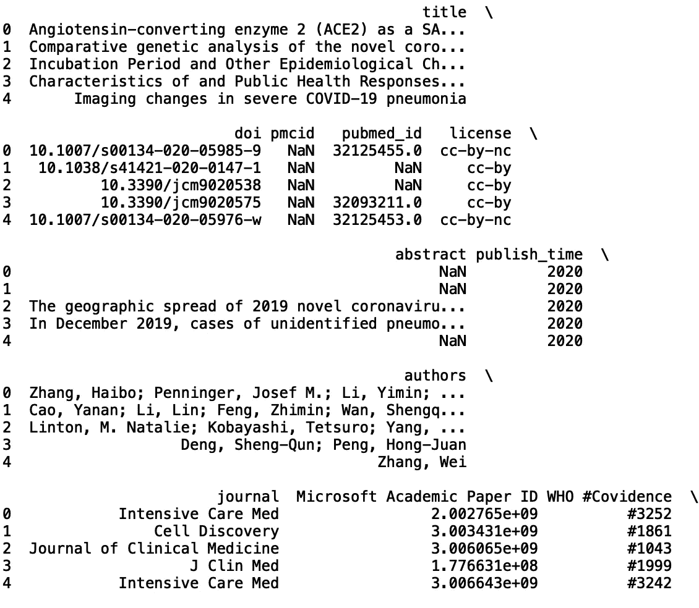

我们可以从很多地方开始分析。最简单的第一步是查看列的列表及其长度:

```
print("List of columns:")
print(list(df.columns))
print("Length of columns:", len(df.columns))
```

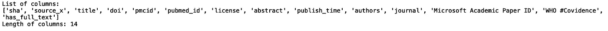

我们还可以查看数据集中的行数:

```
print("Number of rows: len(df))
```


接下来，我们可以查看所有出版物在期刊中的出现频率。我们可以使用 collections 模块中的 Counter 方法来实现这一点(这里输出也被抑制):

```
from collections import Counter
print(Counter(df['journal']))
```

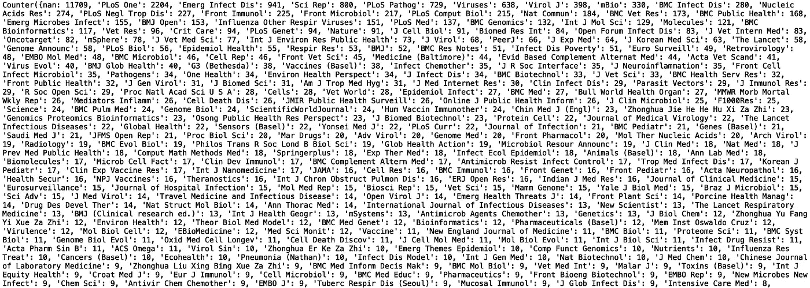

我们可以看到，这是相当期刊名称和频率的列表。我们可以通过删除缺失值(' nan ')并将输出限制为最常见的 10 个日志来缩小范围:

```
df['journal'].dropna(inplace = True)
print(Counter(df['journal']).most_common(10))
```

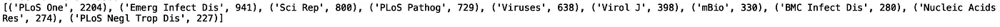

然后，我们可以使用“matplotlib”和“seaborn”来可视化最常见的期刊出版物。让我们对五种最常见的出版物也这样做:

```
import matplotlib.pyplot as plt
import seaborn as snssns.set()
bar_plot = dict(Counter(df['journal'].values).most_common(5))
plt.bar(*zip(*bar_plot.items()))
plt.show()
```

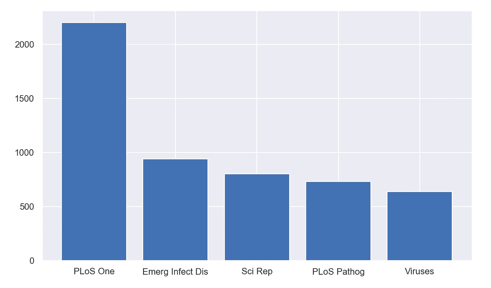

同样值得注意的是，如果我们看一下期刊的总数:

```
print(len(set(df['journal'])))
```

该数据集中有 1732 个日志。

出于好奇，我查找了这些期刊的影响因子。对于那些不知道的人来说，期刊影响因子是一个衡量期刊被引用频率的指标。越有声望或越难在期刊上发表的文章通常有更高的影响因子。最常见的五种期刊在 2019 年有以下影响因素:

1.  PLoS one: 2.8
2.  急诊传染病:7.4
3.  科学报告:4.1
4.  公共科学图书馆 Pathog: 6.2
5.  病毒:3.8

由于*新兴传染病* (Emerg Infect Dis)的影响因子最高，发表数量第二高，因此分析该期刊发表的论文的文本内容可能会很有意思。

另一个有趣的项目是找出每种期刊的影响因子，并用影响因子信息扩充现有数据。用这些信息扩充我们的数据将允许我们过滤和搜索高影响力的新冠肺炎研究出版物。为了找到具有最高影响因子和相对出版物数量的期刊，我们需要将 1732 种期刊映射到影响因子值。

现在，让我们假设*新兴传染病*是一个有大量与新冠肺炎相关的出版物的好杂志。加强了这个假设，，一个期刊排名网站，把*新兴传染病*排在他们传染病期刊名单的第八位，这是相当不错的。

# 过滤数据

接下来，让我们过滤我们的数据，仅包括来自*新发传染病*的数据，并打印数据帧长度以供验证:

```
df = df[df.journal == 'Emerg Infect Dis']
print(len(df))
```

我们看到数据帧长度为 941。

现在我们来看一些摘要。让我们先来看看前 5 篇摘要，以便对文中的内容有所了解:

```
print(list(df['abstract'].values)[0])
print('-'*170)
print(list(df['abstract'].values)[1])
print('-'*170)
print(list(df['abstract'].values)[2])
print('-'*170)
print(list(df['abstract'].values)[3])
print('-'*170)
print(list(df['abstract'].values)[4])
print('-'*170)
```

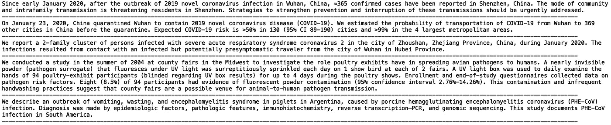

# 情感分析

接下来我们要看的是摘要的情感分数。也许我们可以给每个摘要分配情感分数，看看分数是否与积极的结果相关联。

为了获得情感分数，我们需要导入一个名为 textblob 的 python 包。textblob 的文档可以在这里找到[。要安装 textblob，请打开命令行并键入:](https://textblob.readthedocs.io/en/dev/)

```
pip install textblob
```

下次导入 textblob:

```
from textblob import TextBlob
```

我们将使用极性得分作为积极或消极情绪的衡量标准。极性得分是一个从-1 到+1 的浮点数。

例如，让我们考虑一下 1991 年关于癌症药物紫杉醇的出版物， [*紫杉醇:一种新的有效的抗癌药物*](https://europepmc.org/article/med/1687206) 。摘要中有一句肯定的情感句子:

> 临床试验表明，紫杉醇对治疗难治性卵巢癌、乳腺癌、恶性黑色素瘤和其他可能的实体瘤有效。

如果我们定义一个 textblob 对象并传入上面的句子，我们有:

```
abstract_sentence = "Clinical trials indicate that taxol is effective in the treatment of patients with refractory ovarian cancer, breast cancer, malignant melanoma and probably other solid tumors."sentiment_score = TextBlob(abstract_sentence).sentiment.polarity
print("Sentiment Polarity Score:", sentiment_score)
```

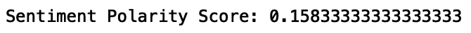

如果我们把句子中的有效改为无效:

> “临床试验表明，紫杉醇在治疗难治性卵巢癌、乳腺癌、恶性黑色素瘤以及其他可能的实体瘤患者时无效。”

并将其传递给我们的 textblob 对象:

```
abstract_sentence = "Clinical trials indicate that taxol is ineffective in the treatment of patients with refractory ovarian cancer, breast cancer, malignant melanoma and probably other solid tumors."sentiment_score = TextBlob(abstract_sentence).sentiment.polarity
print("Sentiment Polarity Score:", sentiment_score)
```


我们看到 textblob 能够捕捉科学陈述中的消极和积极情绪。让我们将此应用于新冠肺炎数据的摘要:

```
df['abstract'] = df['abstract'].astype(str)
df['sentiment'] = df['abstract'].apply(lambda abstract: TextBlob(abstract).sentiment.polarity)
```

让我们限制数据框中的列，使其包括“抽象”和“情感”,并打印前五行:

```
df = df[['abstract', 'sentiment']]
print(df.head())
```

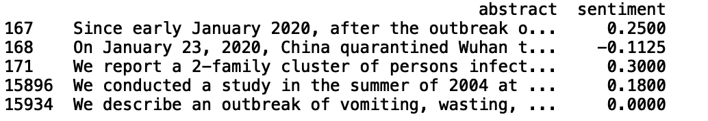

我们也可以计算积极和消极情绪的数量:

```
df_pos = df[df['sentiment'] > 0.0]
df_neg = df[df['sentiment'] < 0.0]
print("Number of Positive Results", len(df_pos))
print("Number of Negative Result", len(df_neg))
```

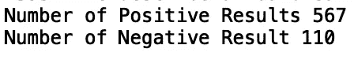

为了安全起见，让我们将积极情绪的极性阈值提高到> 0.5，并打印一些积极情绪摘要:

```
df_pos = df[df['sentiment'] > 0.5]
print(list(df_pos['abstract'].values)[0])
print('-'*170)
print(list(df_pos['abstract'].values)[1])
print('-'*170)
print(list(df_pos['abstract'].values)[2])
print('-'*170)
print(list(df_pos['abstract'].values)[3])
print('-'*170)
print(list(df_pos['abstract'].values)[4])
print('-'*170)
```

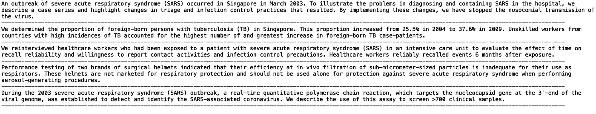

我们看到 textblob 在给摘要分配积极的分数方面做得很好。让我们对负面情绪摘要做同样的事情，我们将把负面情绪阈值降低到-0.1:

```
df_neg = df[df['sentiment'] < -0.1]
print(list(df_neg['abstract'].values)[0])
print('-'*170)
print(list(df_neg['abstract'].values)[1])
print('-'*170)
print(list(df_neg['abstract'].values)[2])
print('-'*170)
print(list(df_neg['abstract'].values)[3])
print('-'*170)
print(list(df_neg['abstract'].values)[4])
print('-'*170)
```

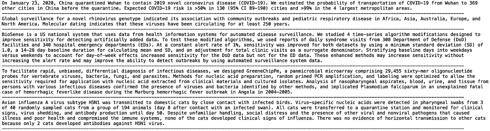

这些结果不太确定。理想情况下，我们希望带有负面情绪的摘要包含如下陈述:

> “没有证据表明会横向传染给其他猫，因为只有两只猫产生了抗 H5N1 病毒的抗体。”

将这种情感评分方法应用于所有期刊并比较期刊之间的消极和积极情感将是有趣的。

我就说到这里，但请放心地继续研究这些数据。可能值得研究其他文本分类方法，如 BERT，它可用于对报告负面和正面结果的期刊进行分类。

# 结论

总之，在本文中，我们对*新冠肺炎开放研究数据集(CORD-19)* 进行了简单的探索性分析。我们生成期刊数量的频率计数，可视化最常见的期刊，过滤我们的数据以将我们的分析限制在具有大量出版物的高影响力期刊，并对期刊摘要执行情感分析。我希望你觉得这篇文章有用/有趣。这篇文章中的代码可以在 [GitHub](https://github.com/spierre91/medium_code/blob/master/read_corona_abstracts.py) 上找到。感谢您的阅读！