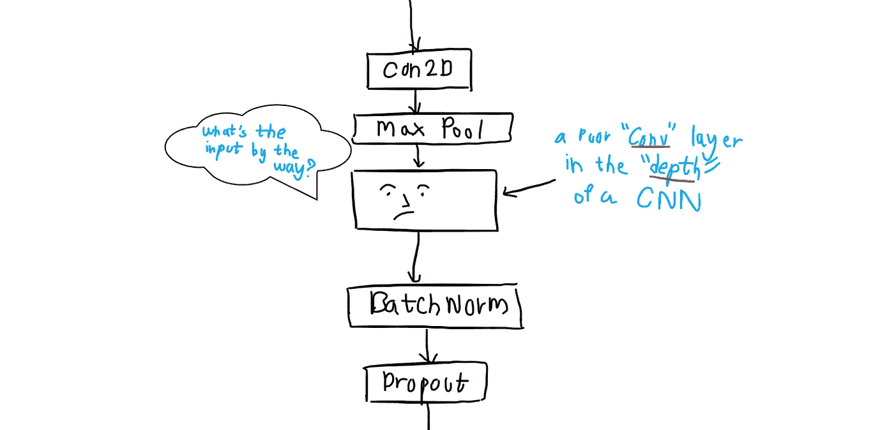

# 探索 DenseNets:从纸到 Keras

> 原文：<https://towardsdatascience.com/exploring-densenets-from-paper-to-keras-dcc01725488b?source=collection_archive---------17----------------------->

## 拆开 DenseNets 看看里面有什么“密”！

照片由[阿丽娜·格鲁布尼亚](https://unsplash.com/@alinnnaaaa?utm_source=medium&utm_medium=referral)在 [Unsplash](https://unsplash.com?utm_source=medium&utm_medium=referral) 上拍摄

[DenseNets](https://arxiv.org/abs/1608.06993) 广泛用于图像分类任务、分割、图像重建等。如果你是一个经验丰富的 TF 开发者，你可能会在`tf.keras.applications`模块中看到它们。什么是 DenseNets？它们里面真的有*密*的东西吗？来吧，让我们一起探索！

您可以在本笔记本中查看 TF 的实现，

 [## 谷歌联合实验室

### 编辑描述

colab.research.google.com](https://colab.research.google.com/drive/1v2p228o-_PRtecU0vYUXuGlG_VierqcP#scrollTo=wbkXMkrTgXiF&forceEdit=true&sandboxMode=true) 

# 致密网应该是致密的。对吗？

绝对的，DenseNets 是密集连接的卷积神经网络。我们将通过比较普通的 CNN(你会在大多数在线博客中看到)和密集块(DenseNet 的构建块)来理解这一点。).

矩形代表卷积层，红线表示连接或信息流。

常规 CNN(左)和密集区块(右)。

注意上面两个网络中的卷积层 3。在第一网络中，第三层接收来自前一层即第二层的信息。这似乎很正常。

看一看第二网络。这就是*密集块*的作用。第二网络中的第三卷积层接收来自所有先前层的信息。它接收 3 个输入，

*   红色箭头来自图像。这是第一层的输入。
*   另一个红色箭头来自前一层(第二层)。
*   来自第一层的黑色箭头。这是第一层的输出。

看，我们得到了所有先前层(第 1 层和第 2 层)的输出以及输入。这就是我们普通 CNN 和密块的区别。密集块中的每一层都与该块中的每一个后续层相连。一个*块*只是一组具有*密集连接*的层的别称。

除了密集块，我们还有所谓的*过渡*层。它们基本上对特征地图进行下采样。这些层执行 1 × 1 卷积和 2 × 2 平均合并。

# 每一层都从所有前面的层获得输入。听起来是不是很疯狂？

这个主意被证明是一个绝妙的诡计。在我们传统的 CNN 中，每一层只知道从前一层接收的特征地图。较差的卷积层对网络的输入一无所知。它只学习以前的输入。

另一方面，密集块中的每一层都从所有层接收输入或信息。简而言之，在全球范围内，整个网络都可以获得这些信息。这一点甚至在 [DenseNets](https://arxiv.org/abs/1608.06993) 的惊人论文中也有提及，

> “除了更好的参数效率，DenseNets 的一大优势是改善了整个网络的信息流和梯度，这使得它们易于训练。”

而且，

> “为了进一步改善各层之间的信息流，我们提出了一种不同的连接模式:我们引入了从任何一层到所有后续层的直接连接。”

我们也可能包括*瓶颈*层来提高计算效率。由于许多输入的串联，我们有大量的特征图，这可能会减慢训练。因此，我们对输入执行 1 × 1 卷积来解决这个问题。

解决上述问题的另一种方法是使用*压缩率*。它从区间 *( 0，1】*中选择，并决定过渡层将产生的特征图的数量。如果θ是*压缩因子*并且 *m* 是输入特征图的数量，则过渡层产生由下式给出的 *p* 特征图，

# 数学

我们确实可以用一些数学来理解稠密连通性的概念！别担心，这很容易理解。考虑一个输入图像 *x₀* 给我们的密集块。

*H* 是一个复合函数，由三个运算组成:*批量归一化→ ReLU →卷积*

> 我们将 H()定义为三个连续操作的复合函数:批量归一化(BN)，然后是校正线性单元(ReLU)和 3×3 卷积(Conv)。

第一层(x₁)的输出将由，

1.第一层的输出。

**一般对于常规 CNN(非 DenseNets)，**第*l*层的输出将由第*l-1*层的输入产生。

(1)的一般表达式。

对于一个 DenseNet ，正如我们之前讨论的，一个层从前面的层接收输入。它看起来会像，

方括号表示 x₀,x₁,…,xₗ₋₁的连接

这是 DenseBlock 的数学表达式。

# 在 TensorFlow 里看起来怎么样？(请用 Keras！)

我们都在急切地等待这个，对吗？我会坚持让你跟着 Colab 笔记本去看看 DenseNets 的实现。首先，我们实现前面讨论过的 *H* 函数。

然后是*过渡层*

现在，实现了密集块。我们将调用`H()`方法，将之前输出的`conv_outputs`和`inputs`连接起来。这将会循环发生，

我们现在将所有的密集块组装在一起，并用过渡层将它们连接起来，

最后，我们做了一个漂亮的`tf.keras.models.Model()`，

培训和评估包含在 [Colab 笔记本](https://colab.research.google.com/drive/1v2p228o-_PRtecU0vYUXuGlG_VierqcP#scrollTo=wbkXMkrTgXiF&forceEdit=true&sandboxMode=true)中。恭喜你，你已经从零开始实现了一个 DenseNet！

# 更多关于 ML 的资源和博客

# 就这样

DenseNets 的想法令人印象深刻。请确保您也阅读了 ResNets。浏览报纸，你会了解更多关于训练的细节。感谢阅读。