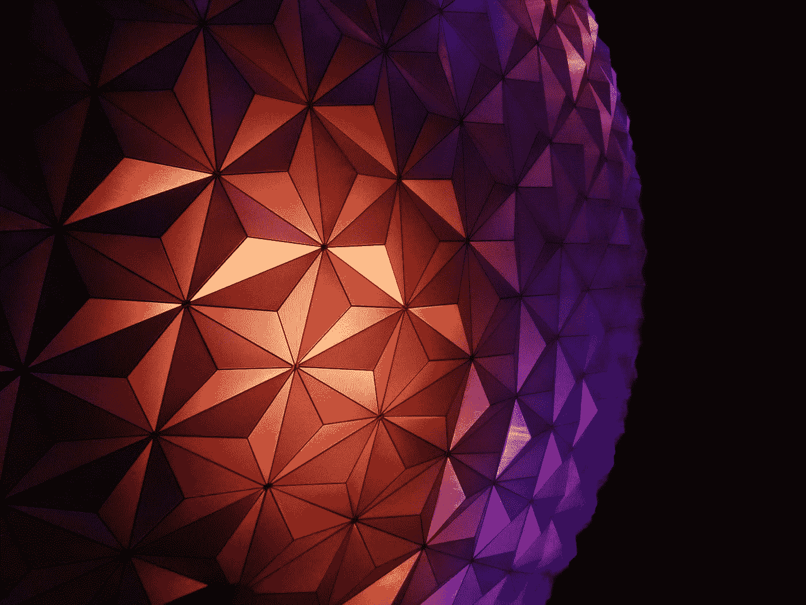

# 探索 Python 中的设计模式

> 原文：<https://towardsdatascience.com/exploring-design-patterns-in-python-be55fbcf8b34?source=collection_archive---------8----------------------->



乔治·帕甘三世在 [Unsplash](https://unsplash.com?utm_source=medium&utm_medium=referral) 上的照片

## 如何在您的编程体验中实现可重用模型

设计模式用于帮助程序员理解概念、教学、学习，以及构建其他伟大的工作理念和概念。所以，当你思考设计模式的时候，要想到解决问题。设计模式是帮助构建和解决简单到复杂问题的模型。许多程序员实际上已经在他们自己的代码中实现了它们，而没有意识到这一点。这是因为它是一个如此抽象的概念，以至于你甚至不用真正思考它是什么就可以使用它。通过了解什么是设计模式以及如何使用它们，你可以克服那些看起来势不可挡的障碍。你还可以带来另一个层次的意识，而不是意外地实现一个笨拙的设计模式，你可以有意识地实现一个伟大的设计模式。设计模式在软件社区中被越来越多地使用，了解它们是一大优势。重要的是你至少知道**面向对象编程**的基础。更具体地说，你知道**继承**和**多态性**。

设计模式通常被称为设计模板，因为它们提供了如何处理常见的重复出现的问题的模板。您可以使用现有的设计模式，甚至创建自己的模式。设计模式有许多种类，下面是一些流行的设计模式:

*   **创意**
*   **结构性**
*   **行为**

## 设计模式有一些独特的优点:

1.  它们适用于任何面向对象编程语言。
2.  它们是灵活的。不断变化、发展和更新。
3.  经常因为创造力而没有完成。

# 模式结构

## 模式名称

模式的简要描述。

## 问题还是意图

你试图解决的潜在问题是什么？

## 解决办法

指定模式适用的位置。定义模式的结构和行为。

## 参与者

模式中涉及的类和对象。

## 结果

使用该模式可能产生的影响。

# Python 设计模式的常见类型:

## 创造型的

工厂

抽象工厂

一个

建设者

原型

对象池

## 结构的

装饰者

代理人

转接器，适配器；改编者

复合材料

桥

外表

轻量级

## 行为的

观察者

访问者

迭代程序

战略

命令

调解人

纪念品

状态

责任链

# 用 Python 实现基本设计模式

**图案名称:工厂**

**图案类型:创意**

在 Python 中实现设计模式时，能够为正确的用途选择正确的模式是很重要的。了解您的设计模式类别将有助于这个决策过程。

**问题:**你不确定你需要什么类型的对象或者你将使用什么类。

因此，在这个假设的场景中，假设您拥有一家计算机商店，并且只销售一种类型的显示器。你已经在卖的显示器是小显示器。您现在想在库存中添加大型显示器进行销售。

**解决方案:**这种模式适合创建新对象。它在许多涉及接口或类实例化的编程问题领域也有广泛的适用性。这对于大规模扩展您的类实例化并保持代码快速、简单和有组织非常有用。

```
# First Class for Small Monitor
class SmallMonitor():
    def __init__(self, brand):
        self._brand = brand def details(self):
        details = "24in x 24in 1080p | $87.00"
        return details# Second Class for Large Monitor
class LargeMonitor():
    def __init__(self, brand):
        self._brand = brand def details(self):
        details = "32in x 32in 1080p | $115.00"
        return details# Basic Creative Design Pattern Implementation
def get_monitor(monitor = 'small_monitor'):
    """factory method"""
    monitors = dict(small_monitor = SmallMonitor("ASUS"),
                    large_monitor = LargeMonitor("HP"))
    ruturn monitors[monitor]small_monitor = get_monitor("small_monitor").details()
large_monitor = get_monitor("large_monitor").details()print(small_monitor)
print(large_monitor)[out]
24in x 24in 1080p | $87.00
32in x 32in 1080p | $115.00
```

**参与者:**参与者是`SmallMonitor()`和`LargeMonitor()`类。另外，`small_monitor`和`large_monitor`对象也将包含在内。

**结果:**当应用于大规模的类实例化时，该模式具有积极的结果，但有时可能会令人困惑，或者对于更简单的实例化来说没有必要。在某些情况下，它会限制可用的代码。这也是 Python 中不推荐的许多应用程序。

# 结论

设计模式支持社区之间以及个人之间一致的编码。它们有助于维护一个健康的编程生态系统，该系统对常见问题有众所周知的解决方案。使用设计模式有时会使事情变得更糟，应该使用逻辑、推理和适当的实现将其集成到您的编码方案中。有时你手头的问题有错误的设计模式，有时没有或创建自己的设计模式是最好的主意。不管怎样，设计模式的知识只会让你成为更好的程序员。在许多情况下，它们将显著提高您的代码和效率。我希望这能帮助任何想了解更多 Python 设计模式基础知识的人。谢谢大家，编码快乐！