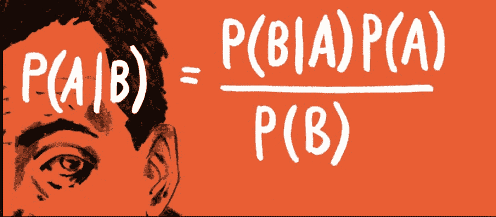
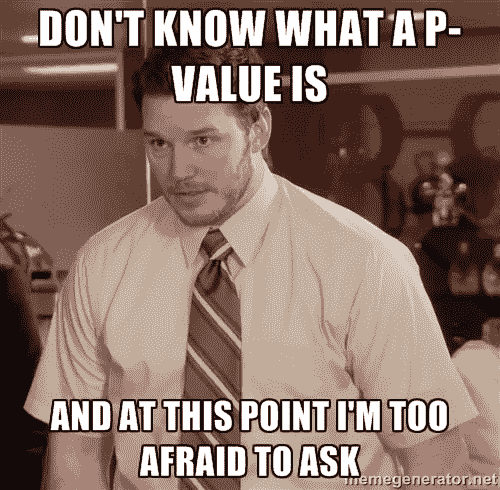
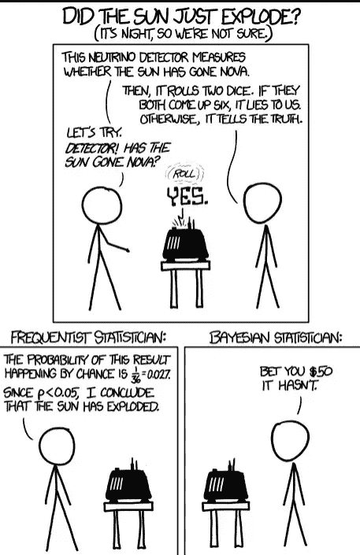
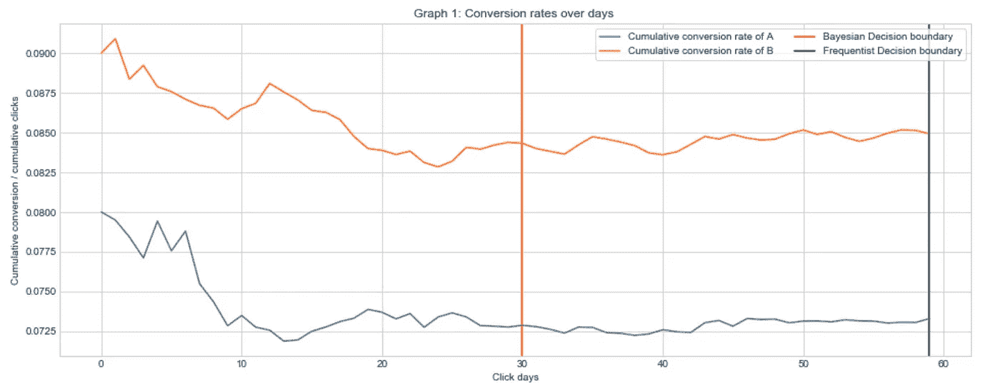
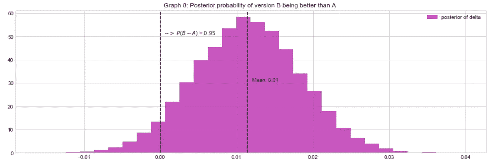
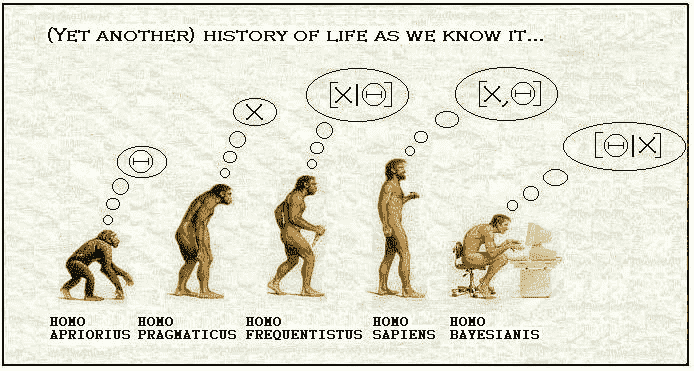

# 探索贝叶斯领域的实验

> 原文：<https://towardsdatascience.com/exploring-experimentation-in-bayesian-territory-8e2c40df77bd?source=collection_archive---------23----------------------->

## 通过贝叶斯方法将 A/B 实验提升一个档次

资料来源:datascientistinsights.com

这篇文章的目的是鼓励人们探索实验设计的贝叶斯框架。

# 这篇文章包括:

1.  什么是 A/B 测试，大多数人一般是怎么做的？
2.  贝叶斯框架相对于频率主义方法的优势
3.  这两种方法的根本区别在于
4.  接下来去哪里找？

你也可以在[这个 Jupyter 笔记本](https://nbviewer.jupyter.org/github/chaitanya539/A-B-testing-Experiment-Design/blob/master/Frequentist%20vs%20Bayesian%20A%20B%20testing.ipynb?flush_cache=true)里找到这个题目的详细版本和解释(带代码)。

# 1.什么是 A/B 测试，人们一般是怎么做的？

极限实验是开启公司成功之门的钥匙之一。我们试验得越多，学到的东西就越多，就越有可能发现顾客的真正需求。

A/B 测试(有时也称为分割测试)是指同时向不同部分的访问者显示同一网页的两种变体，并比较哪种变体能带来更多的转换。

资料来源:Optimizely.com

历史上，公司一直使用频率主义/经典方法来测试不同的假设(例如，从两个不同的网站中找出一个胜出的版本)。基于这种方法，正在做出建立成功的客户-公司关系的决策。

***那么大多数人/公司是怎么做的呢？***

设计实验的整个过程由多个步骤组成，如决定测试组和对照组(即哪个用户将看到页面的哪个变体)，希望实验运行的天数，以及最后测量结果。规划和测量阶段通常需要统计计算，如先验功效分析、效应大小和样本大小计算。最后，为了评估或测量结果，我们通常对比例进行 t 检验、卡方检验和 z 检验，以获得 p 值。这被称为频率主义/古典框架。

资料来源:reddit.com

上面我提到了相当多的统计关键词。如果您不知道这些术语，请不要担心。这些[我已经在这里](https://nbviewer.jupyter.org/github/chaitanya539/A-B-testing-Experiment-Design/blob/master/Frequentist%20vs%20Bayesian%20A%20B%20testing.ipynb?flush_cache=true#2)详细解释过了。

现在让我们来看看为什么我们应该谈论这个奇特的贝叶斯理论！

资料来源:xkcd.com

# 2.贝叶斯框架相对于频率主义方法的优势

实验/假设的成功也取决于决策者如何解释这些结果。实验者面临的常见挑战是统计结果的商业翻译，如*“由于 p 值小于 0.05，我们可以拒绝零假设。我们相信，如果零假设是真的，我们看到的证据不太可能在 95%的情况下出现。”*

**他们实际上想听到的是“变量 B 优于 A 的概率是 x%。”**

> 幸运的是，有一种方法可以降低实验成本，使我们做出决策的速度比平时快大约 50%,并且分析师可以大胆地大声说出下面的话:
> 
> “根据数据，从‘B’转换高于 A 的概率为 80%(举例)”。
> 
> 不仅如此，我们可以在贝叶斯框架中不断地测量我们的结果，提供更多的透明度，而不是固定的样本大小设计。

贝叶斯框架为我们提供了这种非凡的方式。我们可以使用贝叶斯估计和序贯贝叶斯因子方法来设计我们的实验和测量我们想要的结果。

以下是贝叶斯方法相对于频率主义方法的明显优势:

**一、达成决策所需的样本量约为频率主义方法的 50%(图 1) (** [**白皮书**](https://osf.io/w3s3s/download) **)**

**二。可解释性:简单直观地解释结果**

***观察结果的例子会是这样的——***

> 频率主义者:“当我们观察到显著的 p 值为 0.02 时，我们可以拒绝零假设。”
> 
> Bayesian:“有 95%的可能性‘A’版本比‘B’版本更好，转化率的预期提升是 1.2 个百分点。”

**三。我们可以对两个变量的转换率的实际概率进行评论**

**四。贝叶斯框架实现了一个连续的测量，相比之下，frequentist 的方法，窥视往往导致 p 值黑客攻击，这是一个有问题的做法**

# 3.这两种方法的根本区别在于

借助于一个例子，也许可以更好地理解基本的区别(本节假设一些关于[假设检验](https://machinelearningmastery.com/statistical-hypothesis-tests/)的先验知识)。

假设我们有两组，一组是治疗组，另一组是对照组。在频率主义者的方法中，我们从陈述我们的零假设开始。

**零假设:**经过某种处理后两组表现相似(假设这里考虑的度量是均值)；即治疗组的平均值等于对照组的平均值。

这个假设固定了μ1 — μ2 =0 的信念(参数)。修正这个无效假设，我们继续看数据如何以 p 值的形式证明这个信念。

在贝叶斯方法中，我们说我们的信念有一定的不确定性，我们试图找到我们信念/参数的概率分布。所以，在贝叶斯的世界里，我们试图估计这个信念的概率分布(参数；即μ1 — μ2 ),在合并了来自我们先前的信念的信息(我们认为参数可能是什么，如果我们对先前的信念没有意见也没关系！)和观测数据。简单来说，我们不看单点估计，我们看假设的概率分布，给定数据。这叫做后验概率。

> p 值和后验概率之间的根本区别在于，p 值是关于被观察数据的概率的陈述(假设我们的零假设为真)，而后验概率是关于特定参数的置信程度(概率分布)的陈述。

# 4.接下来去哪里找？

我阅读了大量的博客和白皮书来理解贝叶斯方法。当我开始的时候，我对贝叶斯推理的看法是一种“神奇的修正”。我需要一个代码，在那里我可以输入数据，并可以得到类似“A 比 B 好的概率是 x%”的输出。一旦我完成了阅读和研究，我就把我所有的理解浓缩在一个笔记本里

> [**组织应该从频繁的 A/B 测试方法转向贝叶斯框架**](https://nbviewer.jupyter.org/github/chaitanya539/A-B-testing-Experiment-Design/blob/master/Frequentist%20vs%20Bayesian%20A%20B%20testing.ipynb?flush_cache=true#0)

但是在我能够使用、理解和应用这个神奇的修复方法之前，我遇到了一些令人痛苦的术语，如**知情和不知情的先验、后验、可能性、边际可能性、贝叶斯因子、共轭先验、马尔可夫链蒙特卡罗模拟、假阳性率(当零假设实际上为真时拒绝它)和假阴性率(当零假设实际上为假时未能拒绝它)。**

来源:布拉尼·韦达科维奇的博客

有了[这本 Jupyter 笔记本](https://nbviewer.jupyter.org/github/chaitanya539/A-B-testing-Experiment-Design/blob/master/Frequentist%20vs%20Bayesian%20A%20B%20testing.ipynb?flush_cache=true)，我希望能让任何想要理解贝叶斯框架及其与频率主义方法的比较的人变得更容易。

非常感谢建设性的反馈！