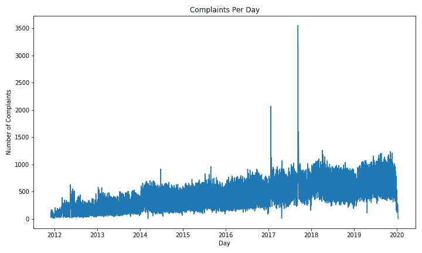
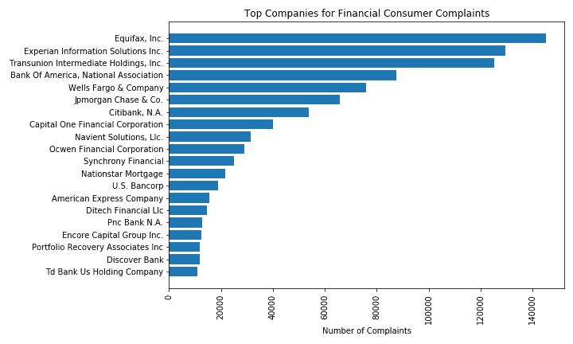

# 用 Spark 探索金融消费者投诉

> 原文：<https://towardsdatascience.com/exploring-financial-consumer-complaints-with-spark-48a253f9c830?source=collection_archive---------29----------------------->

## PySpark 数据框架入门

在仔细阅读“美国政府公开数据的所在地”Data.gov 时，我偶然发现了美国联邦金融服务消费者投诉数据库。我想到了一些初步的问题，包括:这要追溯到多久以前？这是最新的吗？人们会提出多少投诉？哪些公司产生的投诉最多？

为了回答这些问题，我决定求助于 Spark。


当你有资格向消费者金融保护局投诉时，你可能需要的宁静形象。[米尔科维](https://unsplash.com/@milkovi?utm_source=unsplash&utm_medium=referral&utm_content=creditCopyText)在 [Unsplash](https://unsplash.com/wallpapers?utm_source=unsplash&utm_medium=referral&utm_content=creditCopyText) 上的照片

# 如何在你的电脑上设置 Spark

互联网上有很多博客/帖子/地方可以找到在你的电脑上安装 Spark 的方法(见[莫塔达·梅希亚尔的帖子](https://mortada.net/3-easy-steps-to-set-up-pyspark.html))。Spark 曾经以在你的电脑上启动和运行是一个挑战而闻名，但我在 1.6 GHz 英特尔酷睿 i5 和 8 GB 内存上使用运行 macOS Mojave 的 MacBook Air 时并没有太多的挣扎。对于不同的设置或以前版本的 Spark，这可能更具挑战性。


在这个阶段，你可能也需要一点额外的平静。照片由 [A. Shuau (Obofili)](https://unsplash.com/@obofili?utm_source=unsplash&utm_medium=referral&utm_content=creditCopyText) 在 [Unsplash](https://unsplash.com/wallpapers?utm_source=unsplash&utm_medium=referral&utm_content=creditCopyText) 上拍摄

# 开始使用 Spark 之前需要了解的一些事情

*   关于为什么你可能想使用它的一点点(无耻地塞给我的[文章](/the-what-why-and-when-of-apache-spark-6c27abc19527#b4a0)，或者 [HackerNoon](https://hackernoon.com/high-level-overview-of-apache-spark-c225a0a162e9) 的， [Toptal](https://www.toptal.com/spark/introduction-to-apache-spark) 的)
*   使用 Spark 时,“你可以编写代码来描述你希望如何处理数据，而不是你希望如何执行，然后 Spark 代表你‘做正确的事情’来尽可能高效地运行它”(3)
*   Spark 使用“懒惰评估”，在你询问答案之前什么都不做。然后，它仍然只进行获得答案所需的计算，从而最小化工作量。你应该避免强迫它在不必要的中间步骤进行评估。

现在，我们已经准备好使用 SQL/pandas 风格的工作来研究一些真实的数据。今天，我们将调查金融服务消费者投诉数据库。我从 Data.gov[这里](https://catalog.data.gov/dataset/consumer-complaint-database)下载的。坦白地说，我很难使用 Spark 的 CSV 加载器正确加载 CSV，所以我使用 pandas 将 CSV 转换为 parquet 文件。我很喜欢你有任何提示来解决我的问题，其中一些文本列被切成两半(可能在逗号？)，导致表的行数和列数大约是原来的两倍。

注意:您需要安装 pyarrow 或 fastparquet 才能运行。下面镶木地板。

```
import pandas as pdpd_df = pd.read_csv('../data/Consumer_Complaints.csv')
pd_df.columns = [col.lower().replace(' ', '_') for col in 
                 pd_df.columns]
pd_df.to_parquet('../data/consumer_complaints.parquet')
```

在决定进行切换后，Spark 中 parquet 文件的加载速度比 CSV 文件快得多，这给我留下了深刻的印象。唯一的不便是，似乎 Spark 和/或 Parquet 文件不能很好地处理带空格的列名。在转换到拼花文件之前，我选择在 pandas 中删除它们。总的来说，还有另一个理由来为你的数据库/仓库/湖泊起一个合理的、没有空格的名字。


现在你知道该怎么做了:根据你所处的环境，你可能有很多机会利用照片来恢复宁静。[梁朝伟](https://unsplash.com/@lleung1?utm_source=unsplash&utm_medium=referral&utm_content=creditCopyText)在 [Unsplash](https://unsplash.com/wallpapers?utm_source=unsplash&utm_medium=referral&utm_content=creditCopyText) 上拍照

# 让火花在您的环境中运行

如果您使用的是基本的 Spark 特性和方法，那么您应该从初始化 SparkContext 开始，通过连接到特定的执行环境来设置 Spark 应用程序。如果我想在本地机器的所有内核上运行，我会使用:

```
import pysparksc = pyspark.SparkContext('local[*]')
```

您可以随时使用`sc.stop()`停止 SparkContext。

对于我们的 DataFrame 工作，我们将让 SparkSession 为我们初始化 SparkContext:

```
import pysparkspark = pyspark.sql.SparkSession \
     .builder \
     .master('local[*]') \
     .appName('Python Spark Consumer Complaints example') \
     .getOrCreate()
```

在这里，我们使用 SparkSession 构建器来“获取或创建”(如果尚不存在，则创建)一个 SparkSession，它具有指定的执行环境(我的本地计算机上的所有内核),并命名该应用程序以便在[在线用户界面](https://spark.apache.org/docs/latest/monitoring.html)上进行识别。

作为检查，我运行了`spark.sparkContext.defaultParallelism`来确保 Spark 使用了预期数量的内核。

# 将数据导入数据框架

```
df = spark.read.load('../data/consumer_complaints.parquet',
     inferSchema='true', header='true')
```

仅此而已。我做了一个快速的`df.count()`来确认这次 Spark 读取了正确的行数。

# 使用 PySpark 数据框架

现在我们有了数据框，让我们继续使用它来回答一些问题:

## 我们在看什么时间框架？

这里我们需要转换成日期时间类型。我“选择”(像 SQL 一样)接收的日期转换成日期格式的日期类型，并给它一个别名。然后我按日期排序，取 1。Take 产生的结果与 limit 相同，但我不确定 Spark 各版本的性能差异。Take(n)是一个基本的 spark 经典，返回前 n 个结果，而 limit()对于面向 SQL 的人来说更直观。

```
from pyspark.sql.functions import to_datefirst_date = df.select(to_date(df.date_received,
                              'MM/dd/yyyy').alias('date')) \
     .orderBy('date').take(1)
first_date Out: [Row(date=datetime.date(2011, 12, 1))]last_date = df.select(to_date(df.date_received, 
                             'MM/dd/yyyy').alias('date')) \
     .orderBy('date', ascending=False).take(1)
last_date Out: [Row(date=datetime.date(2020, 1, 12))]
```

通过几行代码，我们看到数据集的时间跨度从 2011 年 12 月 1 日到 2020 年 1 月 12 日。

## 我们总共有多少投诉？每天？

对于投诉总数，快速`df.count()`返回约 150 万。

为了获得每天的投诉，我们将使用上面的 datetime 对象:

```
days = last_date[0]['date']-first_date[0]['date']
days Out: datetime.timedelta(days=2964)
```

每天平均投诉数量:

```
df.count()/days.days Out: 497.49257759784075
```

我通过将 PySpark 数据帧转换成熊猫数据帧并使用`matplotlib`来可视化每天的抱怨:

```
dates = df.select(to_date(df.date_received, 
                  'MM/dd/yyyy').alias('date'))
complaints_per_day_pd =dates.groupBy('date').count() \
      .sort('date').toPandas()
```



我注意到了这些峰值，并决定进行调查。你可以像在`pandas`中使用`.loc`一样使用 filter(有时与 where 和 when 结合使用)。

```
daily_complaint_counts = dates.groupBy('date').count()
daily_complaint_counts.filter(
     daily_complaint_counts['count'] > 1500) \
     .orderBy('date').show()
```

返回的格式为 SQL 样式:

```
+— — — — — + — — -+
| date|count|
+ — — — — — + — — -+
|2017–01–19| 2070|
|2017–01–20| 1633|
|2017–09–08| 3553|
|2017–09–09| 2709|
|2017–09–13| 1600|
+ — — — — — + — — -+
```

2017 年 9 月是 Equifax 安全漏洞。我不确定 2017 年 1 月发生了什么，除了特朗普总统 20 日的就职典礼。

## 哪些公司被投诉最多？

这里我想再次使用`matplotlib`可视化结果，所以我将结果转换成熊猫。

```
company_counts = df.groupBy('company').count()
company_counts_for_graph = company_counts.filter(
     company_counts['count'] >1000) \
     .sort('count', ascending=False).toPandas()
```

然后我使用`matplotlib`来可视化结果:



对于信用报告机构来说并不可爱…但是我们看到 Spark 的这个模块用相当 SQL-y 的代码很快就得到答案。如果您知道如何在 SQL 或 pandas 中实现，PySpark 的方式可能是相似的，或者至少在 PySpark 中可能有相似的方式。像往常一样，有许多方法可以得到相同的结果。

## 一些最后的问题

投诉是怎么接到的？主要是通过网络。

```
df.groupBy('submitted_via').count().sort('count', 
     ascending=False).show()Out:
+ — — — — — — -+ — — — -+
| submitted_via| count|
+ — — — — — — -+ — — — -+
|          Web|1106079|
|     Referral| 187007|
|        Phone|  88292|
|  Postal mail|  72485|
|          Fax|  20297|
|        Email|    408|
+ — — — — — — -+ — — — -+
```

回应是否及时？通常情况下。

```
df.groupBy('timely_response?').count().sort('count', 
     ascending=False).show()Out:
+ — — — — — — — — + — — — -+
| timely_response?|  count|
+ — — — — — — — — + — — — -+
|              Yes|1439485|
|               No|  35083|
+ — — — — — — — — + — — — -+
```

他们有争议吗？有时候。这取决于 null 在这一列中的含义。

```
df.groupBy('timely_response?').count().sort('count', 
     ascending=False).show()Out:
+ — — — — — — — — — + — — — +
|consumer_disputed?| count|
+ — — — — — — — — — + — — — +
|              null|706088|
|                No|620102|
|               Yes|148378|
+ — — — — — — — — — + — — — +
```

这篇文章的最后一个提示:你可以用`*SparkSession*.stop()`关闭你的 SparkSession。

我希望这有助于您开始使用 Spark 查看数据！你可以在这里找到回购[。](https://github.com/allisonhonold/spark-blog)

# 了解 Spark 工作原理的其他资源

1.  [https://mapr . com/blog/datasets-data frames-and-spark-SQL-for-processing-of-tabular-data/](https://mapr.com/blog/datasets-dataframes-and-spark-sql-for-processing-of-tabular-data/)
2.  https://mapr.com/blog/how-spark-runs-your-applications/
3.  [https://mapr.com/blog/5 分钟-指南-理解-意义-apache-spark/](https://mapr.com/blog/5-minute-guide-understanding-significance-apache-spark/)
4.  [https://realpython.com/pyspark-intro/](https://realpython.com/pyspark-intro/)