# 使用 Covid19、Foursquare 和 Zomato APIs 探索印度德里的食品商店

> 原文：<https://towardsdatascience.com/exploring-food-outlets-in-delhi-india-using-covid19-foursquare-and-zomato-apis-d6010ebb7416?source=collection_archive---------64----------------------->

## IBM 数据科学顶点项目


由[王德·古普塔](https://unsplash.com/@dewang?utm_source=medium&utm_medium=referral)在 [Unsplash](https://unsplash.com?utm_source=medium&utm_medium=referral) 上拍摄的照片

作为 Coursera 上[应用数据科学顶点](https://www.coursera.org/learn/applied-data-science-capstone)项目的一部分，我必须使用 FourSquare API 来获取位置数据，并使用任何其他必要的数据来创建一个有洞察力的数据科学项目。在这篇文章中，我将讨论我用来探索和识别印度德里的食品商店的方法。

> [链接到我的 Github 项目](https://github.com/aastha12/Coursera_Capstone/blob/master/Exploring%20food%20outlets%20in%20Delhi,%20India%20using%20APIs.ipynb)

# 介绍

世界正面临来自新冠肺炎疫情的前所未有的威胁。毫无疑问，这个疫情影响了我们的生活方式，但也彻底改变了消费者的行为。

我们看到网上订购食品、衣服、日常家居用品、杂货等的数量激增。最近这段时间。

消费者行为的这种变化也意味着，现在消费者不仅会关注那些以合理价格提供优质食品的食品商店，还会关注食品商店的卫生等级和所在区域，以确保安全和卫生不会受到影响。

此外，保持消费者对食品安全性和可用性的信任和信心也变得至关重要。

在这篇文章中，我将帮助消费者找到那些不仅价格合理，而且安全的食物店。

# 目标

这个项目的目的是根据以下几点对印度德里的食品商店进行分类:

1.  平均值。价格
2.  评级
3.  位置
4.  该区的冠状病毒病例
5.  在线交付服务

# 数据

我将合并来自 3 个 API 的数据:

1.  **Covid19 API** —获取德里不同地区所有确诊的冠状病毒病例
2.  **FourSquare API**—使用我们从 Covid19 API 收到的地区的位置坐标，并将其作为输入传递给 four square API，以检索德里每个地区 4 公里半径内的 100 个地点。
3.  **Zomato API** —我将把从 FourSquare API 检索到的地点和位置坐标作为输入传递给 Zomato API，以获得关于餐馆的信息，如评级、平均价格。价格，评论数，是否有线上发货等。

我还将使用网络抓取来提取餐厅的卫生评级。

在合并了上述数据源之后，我绘制了从 FourSquare API 接收的数据和从 Zomato API 接收的数据，以帮助我们更好地将其可视化。

在德里地图上绘制正方形数据:

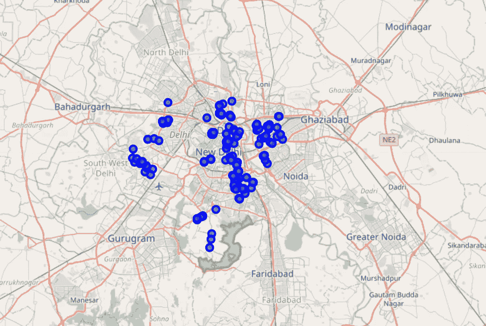

四方数据

在德里地图上绘制 Zomato 数据:

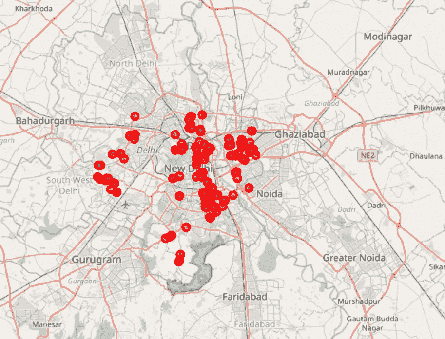

佐马托数据

从视觉上看，大多数位置似乎是匹配的，但是我们必须小心组合来自不同数据集的数据。

为了合并这两个数据集，我将检查来自 Zomato API 和 FourSquare API 的每个相应地点的纬度和经度值是否匹配，因为我们使用了该地点的坐标作为 Zomato API 的输入，以获得有关该地点的更多信息。因此，我将纬度和经度值四舍五入到小数点后 4 位。然后，我将计算相应的纬度和经度值之间的差异，并查看差异是否小于 0.0005，这在理想情况下意味着两个位置是相同的。这是我对这个项目的一个假设。

此外，一些场馆的名称根本不匹配。例如，从 Foursquare API 检索到的地点名称是 KFC，但是当我们将它传递给 Zomato API 时，它返回了“Al Kuresh ”,这显然是错误的。我们需要把这些从桌子上拿走。

清理完数据后，我们只剩下 67 行，现在可以开始处理数据了。

# 方法学

我们将执行 EDA 和聚类的食品出口的基础上评级，平均。价格、位置、卫生等级和冠状病毒病例数。

## 第 1 部分:探索性数据分析

## 等级

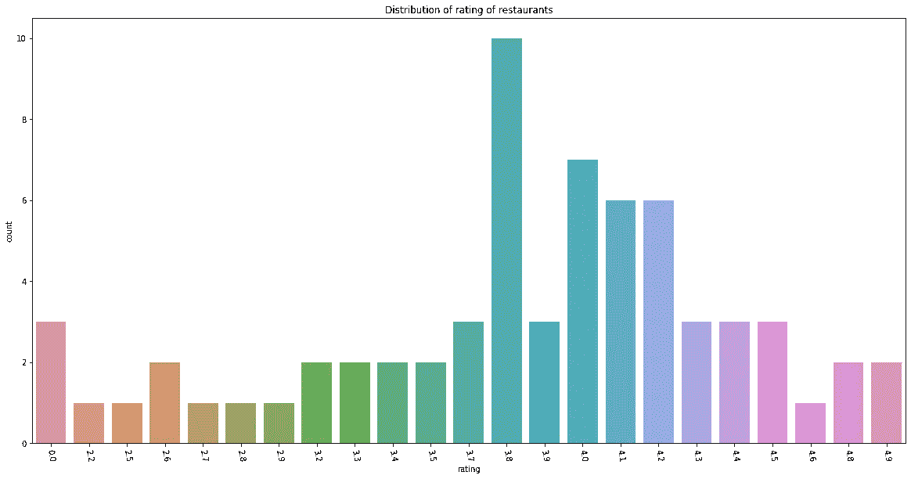

*餐厅评分分布*

从上面的剧情可以看出，大部分餐厅的评分都是 3.8 和 4。

## 价格

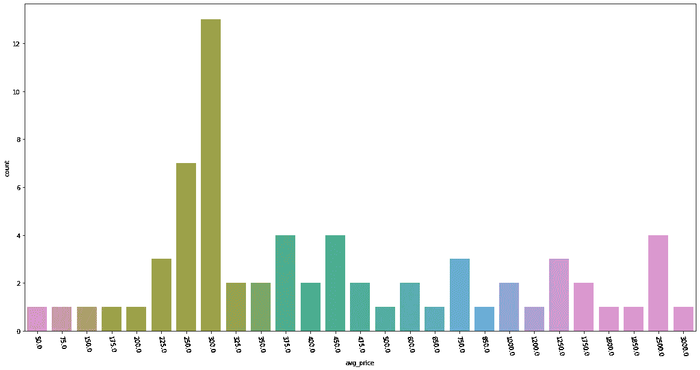

*价格分布*

接下来，让我们探索一下德里餐馆的平均价格，这对初来德里并想了解餐馆平均价格的人来说很有用。原来德里的大部分餐厅均价 300 卢比。

## 卫生等级

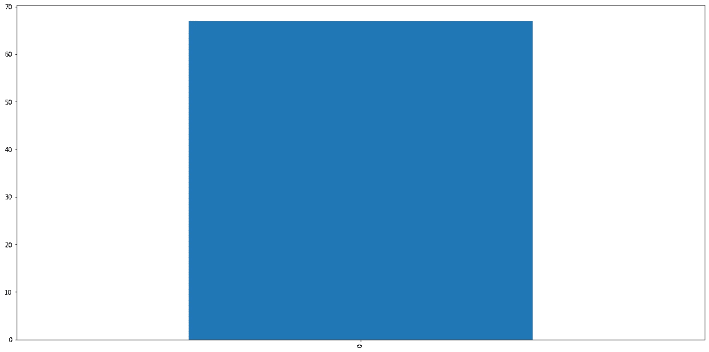

卫生等级分布

让我们了解一下餐馆的卫生等级。考虑到冠状病毒的爆发意味着餐馆必须遵守严格的卫生政策，这是一个重要因素。有趣的是，德里所有的餐馆卫生等级都是 0，这意味着这些餐馆的卫生习惯没有得到评定。Zomato 应努力确保所有餐厅都有卫生评级，尤其是有了疫情之后。

**网上发货**

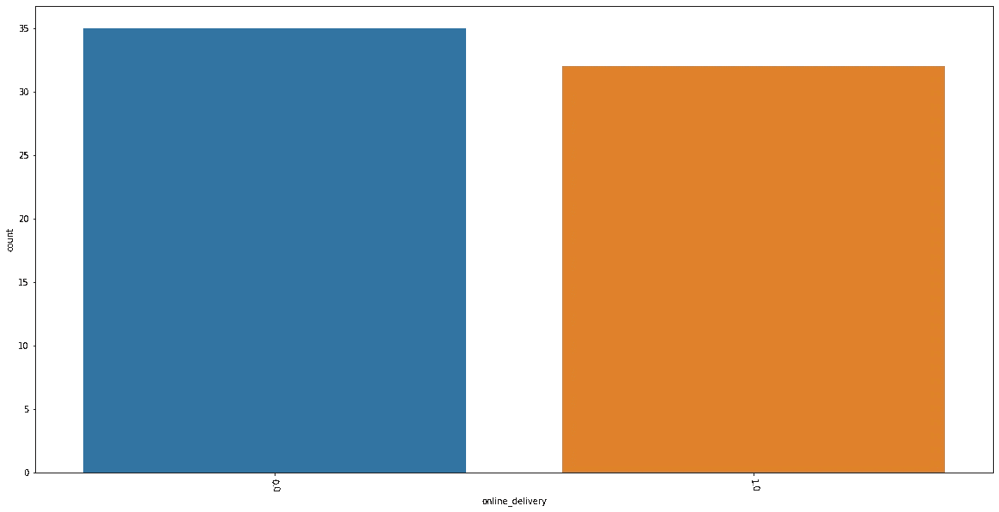

在线交付的分布

从上面的图中，我们可以看到在线交付功能几乎是平均分布的。其中一半没有网上送货，另一半有。在这个疫情期间，如果餐馆在加强必要的卫生政策的同时，强调网上送货，利润会高得多。

**价格区间**

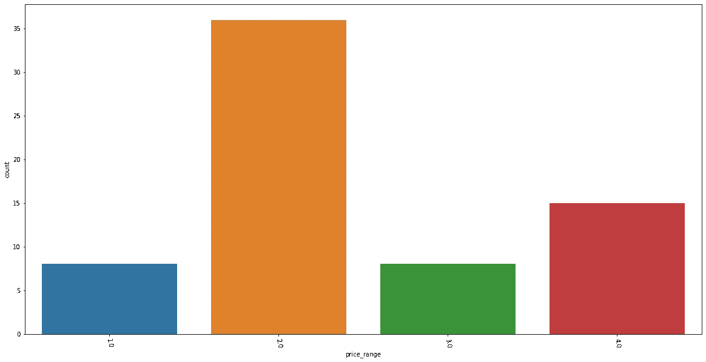

价格范围的分布

Zomato 还提供了每家餐厅“价格区间”的详细信息。此功能的范围从 1 到 4，其中 1 表示方便，4 表示昂贵的餐馆。大多数餐厅更倾向于方便消费者，这对消费者来说是一个加分点。

**地区与价格**

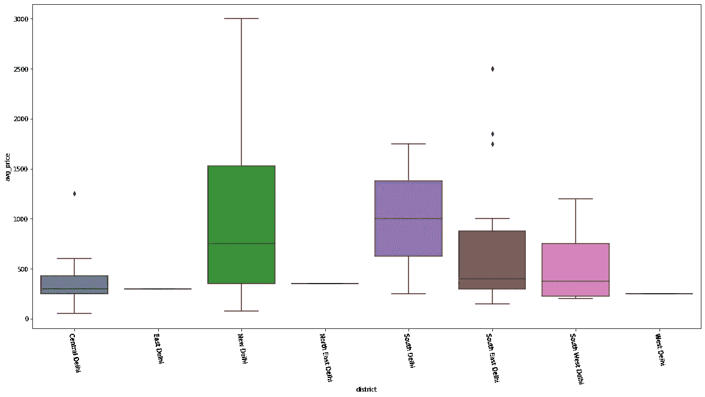

地区与价格

高端餐厅位于新德里和南德里区。我们在德里东南部和德里中部也有一些价格较高的餐厅，尽管这些地区的平均价格较低，这使得这些餐厅成为异类。

**地区 vs 评级**

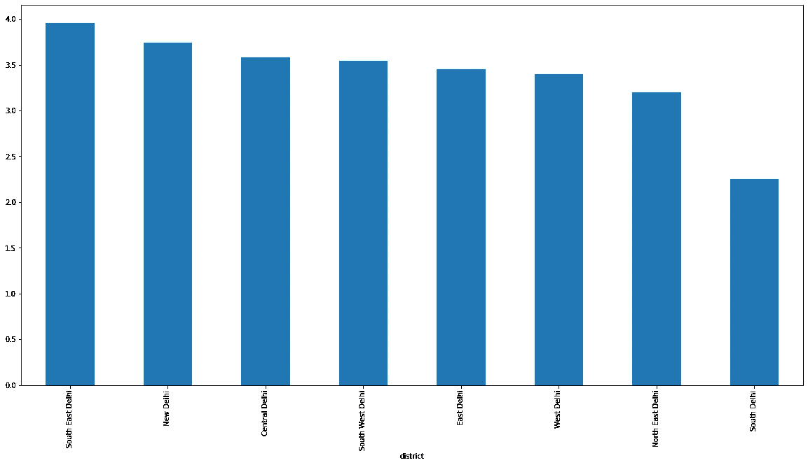

地区与评级

德里东南部和新德里是餐馆平均得分较高的地区。而南德里的餐馆平均得分最低。评级。

**评级 vs 价格**

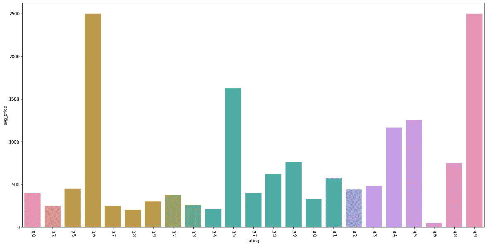

评级与价格

评分 2.6 的餐厅，均价 2500 真的很高！这些餐馆需要重新考虑他们的价格范围，因为他们的评级不是很好。经过进一步分析，发现位于新德里和德里东南部的“电气室”是 2.6 级和 2500 卢比的插座，他们可能应该重新考虑他们的价格点。

另一个有趣的观察是，评分为 4.8 的餐馆比评分为 4.5 的餐馆有更低的价格点。

**地区 vs 美食**

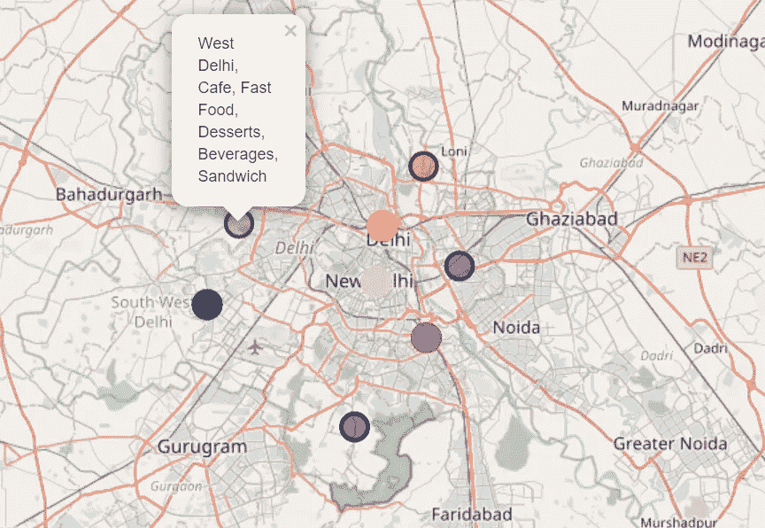

地区 vs 美食

让我们试着去了解德里每个地区的大多数餐馆都提供什么样的菜肴。

从上面的地图，我们可以看到:

1.  在德里东北部，大多数餐馆提供“北印度、快餐、穆格莱”菜肴。
2.  在德里市中心，大多数餐馆都提供“咖啡馆和甜点”美食。
3.  在东德里，大多数餐馆提供“南印度、北印度和中国”菜肴。
4.  在新德里，大多数餐馆供应“欧洲和大陆”菜肴。
5.  在德里东南部，大多数餐馆都供应“北印度，穆格莱”菜肴。
6.  在南德里，大多数餐馆都供应“意大利沙拉”菜肴。
7.  在西南德里，大多数餐馆都供应“街头食品，米泰”美食。
8.  在西德里，大多数餐馆提供“咖啡馆、快餐、甜点、饮料、三明治”美食。

## 第 2 部分:集群

我们将首先使用“肘方法”来确定集群的最佳数量。

## **肘法**

对于每个 k 值，我们将初始化 k 均值，并使用惯性属性来确定样本到最近的聚类中心的平方距离之和。

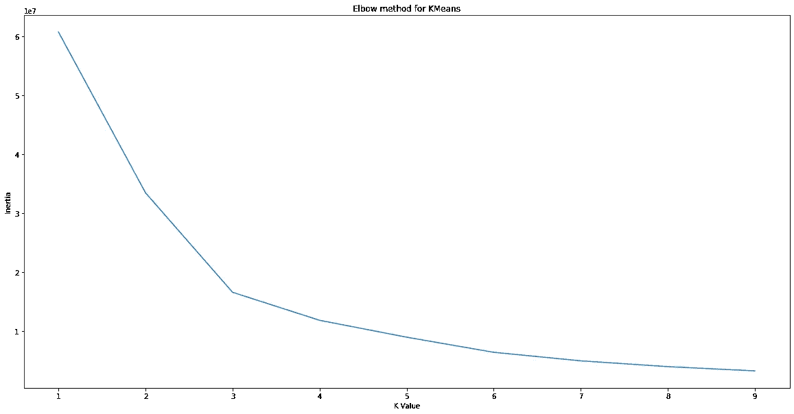

## **使用最优‘k’进行聚类**

最佳的“K”值是 3，我们将使用它进行 K 均值聚类。

```
kmeans=KMeans(n_clusters=3).fit(df_clustering)
kmeans.predict(df_clustering)
final_venues.insert(0,'cluster_label',kmeans.labels_)
final_venues.head()
```

## 在德里地图上绘制聚类

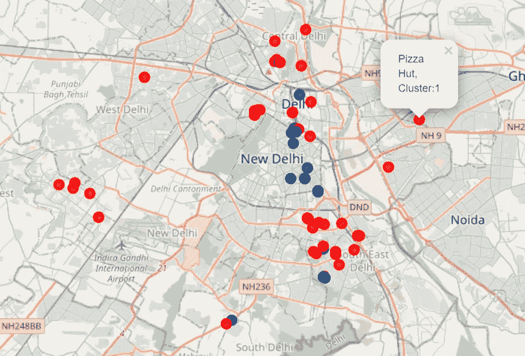

集群 0 中的场馆有:

*   均价 631.82 卢比
*   平均值。评分 4.34
*   平均值。冠状病毒病例 98.91
*   平均值。复习计数 1736.36
*   网上交货的差价为 0.36

第一组的场馆有:

*   平均价格 400.53 卢比
*   平均值。评分 3.50
*   平均值。冠状病毒个案 119.23
*   平均值。审查总数为 292.68
*   网上交货的差价为 0.60

第 2 组的场馆有:

*   均价 2238.89 卢比
*   平均值。评分 3.91
*   平均值。冠状病毒病例 82.00
*   平均值。审核计数为 560.44
*   网上交货差价为 0.00

# 结果和讨论

从我们的分析中，我们注意到大多数餐厅的平均评分为 **3.8** 。我们还注意到平均。大多数餐馆的价格是 250-300 卢比，并不贵。

Zomato 的“价格区间”功能也能给我们提供有价值的见解。这个特征的范围从 1 到 4(1 是口袋友好到 4 是昂贵)，结果大多数餐馆更倾向于**口袋友好**。

关于餐馆的“卫生等级”有一个有趣而又令人担忧的观察。所有餐馆的卫生等级都是 0，这意味着这些餐馆没有被评为卫生等级。 **Zomato 应努力确保所有餐厅都有卫生评级**，尤其是有了这个疫情，因为它将帮助消费者确保他们的安全和卫生不受损害。

另一个有趣的观察结果是，在线交付功能在餐厅中几乎平均分布，即一半的餐厅没有在线交付，而另一半有。在这次疫情期间，更多地强调网上送货对餐馆来说是有益的。

在根据餐馆的评级分析价格时，我们注意到评级为 3.5 的餐馆的平均得分为 3.5。价格为 1500 卢比的餐馆和评分为 4.9 的餐馆的平均得分为 1。价格 2500 卢比。

不过**评分 2.6 的餐厅也有均价 2500** 挺高的！经过进一步分析，发现这是由于“Lodhi 酒店电气室”的 2 个插座造成的这些分店分别位于新德里和德里东南部。鉴于他们的评级如此之低，他们可能应该重新考虑他们的价格点。

我们还分析了德里每个区的大多数餐馆提供的美食，这将有助于消费者确定当他们渴望某种特定的美食时应该去哪个区。

现在来看餐馆的聚类，我们能够从我们的数据集中导出 3 个聚类。

位于第一个集群(即**集群 0** 的餐厅价格合理，评级最高，评论数最高，冠状病毒病例较少，因此理想情况下，人们可以在采取适当安全预防措施的情况下访问这些食品商店。有趣的是，第 0 组的大多数商店都位于德里市中心或新德里区。

**集群 1** 中的商店价格最低，评级体面，评论数最低，大多数餐馆提供在线送货，但与其他集群相比，该集群的冠状病毒病例数也最高。在准备和运送食物时，这个集群中的食物出口必须格外小心。如果你确实从这里订餐，我建议你采取额外的预防措施，非常小心。

最后，位于最后一个集群，即**集群 2** 的门店具有最高的价格点、良好的评级和评论数，没有在线交付，但冠状病毒病例最少。如果你是一个不介意花钱购买质量不错的食物，同时又注重安全的人，你可以试试这些餐馆。

# 结论

这个项目的目的是探索德里不同的食品商店，牢记卫生和冠状病毒病例。这个项目的局限性之一是我只能从 Zomato API 中检索大约 170 家餐馆的数据。另一个主要限制是，我已经将该区冠状病毒病例的数量分配给该区目前的每个食品商店。然而，德里的每个区都很大，需要细分到社区才能获得更准确的表示，但德里没有社区级别的冠状病毒病例。

在合并了来自不同 API 的数据之后，我执行了 EDA 来揭示一些有趣的观察结果，并且还基于 rating，avg 对数据集执行了 K 均值聚类。价格、位置、店铺所在地区的冠状病毒病例、是否提供在线配送以及该食品店铺的总评论。

聚类分析显示，新德里的大多数餐馆和德里中部的一些餐馆可以安全点餐，而且提供最优质的食物，而德里东南部的餐馆也可以安全点餐，但价格更高。根据游客对等级、价格和其他要求的选择，他/她可以在这三个集群中的不同食品商店中进行选择。