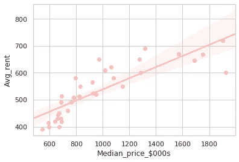

# 探索大悉尼郊区

> 原文：<https://towardsdatascience.com/exploring-greater-sydney-suburbs-f2bf1562988e?source=collection_archive---------21----------------------->

## 使用 Python Matplotlib、Seaborn、geopandas 和 k-means 聚类

这是我的 IBM 数据科学专业证书的顶点项目的一部分。请继续阅读并跟随源代码的链接，并放心使用。

基思·朱摄于 [Unsplash](https://unsplash.com?utm_source=medium&utm_medium=referral)

当我六年前搬到澳大利亚时，肾上腺素和兴奋情绪稍微平静下来后，我面临的第一个挑战是住在哪里！我选择居住地的经历与许多第一代移民没有什么不同。降落在奥兹，在一个朋友家过夜，然后决定在附近找点东西。

现在，我的职业是会计，所以我看到数字会很兴奋。出于这个原因，我决定在数据科学领域提升自己的技能。我选择从 IBM Professional Certificate 开始，对此我将在另一篇博客中详细讨论，但是现在，让我们直接跳到完成认证所需的顶点项目。你猜对了，我选择应用一些新获得的数据技能来探索当地政府区域(LGA)或大悉尼地区的社区，并可能决定在哪个区域居住。

详细演示和源代码的链接在这里:

[https://github . com/timun 01/IBM-Capstone-Project/blob/master/Week _ 4/](https://github.com/Timun01/IBM-Capstone-Project/blob/master/Week_4/)

现在来体验一下我完成这个项目所经历的过程。

# 数据…当然

与任何数据科学项目一样，最大的挑战是获得一样东西…数据！我花了几个小时浏览了许多网站，最终下载了一些合适的数据，如下所示:

*   2019 年 9 月季度 LGA/街区的住房租赁数据(来源:www.facs.gov.au)
*   2019 年 6 月季度 LGA/街区住宅销售数据(来源:www.facs.gov.au)
*   悉尼地区的形状文件(绘制地理地图，并获得邻近地区的坐标)
*   基于 2016 年人口普查的人口数据(来源:http://stat.data.abs.gov.au/)
*   2019 年 9 月至今 LGA/邻近地区的犯罪数据(来源:https://www.bocsar.nsw.gov.au)

请记住，所有这些数据都是不同的格式，LGA 边界不断变化，因此较新的数据比旧的数据具有不同的 LGA。这导致了一些数据丢失。考虑到这种分析纯粹是出于教育目的，所以我们可以接受它。

在我们继续之前有一个警告。考虑到上述因素和每个人的个人情况，此分析仅用于顶点项目和学术目的，因此不得用于任何其他目的。

# 方法学

好的。你可能注意到了，我的分析更倾向于租房，假设新移民会租房而不是马上买房。在清理和组合了大量不同的数据后，我使用了方框图、柱状图、散点图和热图的组合来比较不同的街区。

接下来，我使用 Choropleth 和 Folium Open street 地图进行地理空间分析。最后，我使用 Foursquare API 来探索场地，并应用 k-mean 聚类算法来创建共享相似设施的社区组。这将有助于我们通过收集对该地区的一些了解来决定搬到一个新的国家。

# 结果

接下来是大量数据可视化的部分。

## 情节

第一个图是使用 Seaborn 的盒图函数绘制的。这为我们提供了每种住宅类型的最低、第一四分位数、中间值、第三四分位数和最高租金的 5 点范围。例如，我们可以看到房屋租金从 400 美元 pw 到 1400 美元 pw 以上不等。叠加在上面的散点图显示了该范围内出租的房产数量。例如，在房屋方面，我们可以看到大部分房产的租金都在最低租金和中等租金之间。对于联排别墅，如果需要，我们可以进一步评估一些异常值，但现在就到此为止。

对于下面的图，我使用 Matplotlib 来说明每个 LGA 的平均租金(实际上是租金中位数的平均值)以及一些可用的物业的简单视图。悉尼作为一个大都市，平均拥有的住宅数量最多。650 美元。整体平均约为 530 美元。

接下来是一组散点图(使用 Seaborn 的 lmplot 函数),显示了每个街区的卧室数量的详细租金分布。再以悉尼为例，我们可以看到 4 居室的房子都是> $1100pw 不到 2500 的房产。另一方面，一居室很丰富，价格在 600 美元以下。这是像悉尼这样的中央商业区所能预料到的。

让我们用一张热图来显示所有郊区按住宅类型划分的租金成本分布。这告诉我们，例如，就个人住宅类型而言，莫斯曼是最昂贵的街区，其次是 Woollahra 等等。

现在是销售分析。下面的柱状图为我们提供了 2019 年 Q2 各街区的摩天大楼中值价格分布。这涵盖了所有物业类型的中值价格。实际上，价格会因型号和大小而异，这不在我们现阶段的考虑范围内。

2019 年 Q2 期间每个街区的销售价格中位数

基于以上所述，正如人们所料，我们可以在下面的散点图(相关系数为 0.84)中看到，平均租金和邻近地区的中值价格之间存在很强的相关性。

## 地图

该部分包括销售和人口数据的地理空间分布。我首先将 geojson 文件转换为 shape 文件，然后使用 geopandas 的 Choropleth 映射函数来映射这些 shape 文件。老实说，我花了一段时间才明白过来(太棒了！！！我最终绘制它的时刻)。

接下来，我根据 2019 年 9 月至今的犯罪事件下载数据，创建了一个气泡图，以可视化每个街区的犯罪相对规模。这些数据被绘制在 Folium Open street 地图的顶部。

每个街区的犯罪数据

这就结束了我们的数据可视化部分。现在让我们转到机器学习算法部分。

# k 均值聚类

在这里，如前所述，我使用 Foursquare API 探索附近的所有场所(咖啡馆、健身房、酒吧、公园等),然后基于这些场所创建数据框。

在生成的数据帧上，应用了一种流行的无监督机器学习算法，称为 k 均值聚类。这将数据分为 4 个不同的组:

集群的图例

第一集群:主要以咖啡馆、海滩和公园为公共场所。

**集群 2:** 这里有大量的餐馆、咖啡馆和购物中心。

**集群 3:** 以咖啡馆、公园、餐馆和汉堡店为主

**集群 4:** 更接近集群 1，以咖啡馆、酒吧和公园为主。

总的来说，正如我们之前所讨论的，对于一个人来说，搬迁到一个全新的国家并不是一个容易的决定。然而，生活在科技时代也有它的好处！我们通过互联网获得大量信息，然后使用数据分析工具，我们可以根据个人偏好做出合理的决定。

这就结束了我的第一个数据科学作业，这是我从头开始做的。它帮助我在这个过程中学到了很多，我期待着在这个领域进一步提高我的技能。

请随时评论源代码或情节，以便我进一步微调。