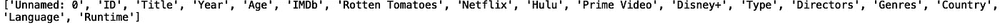
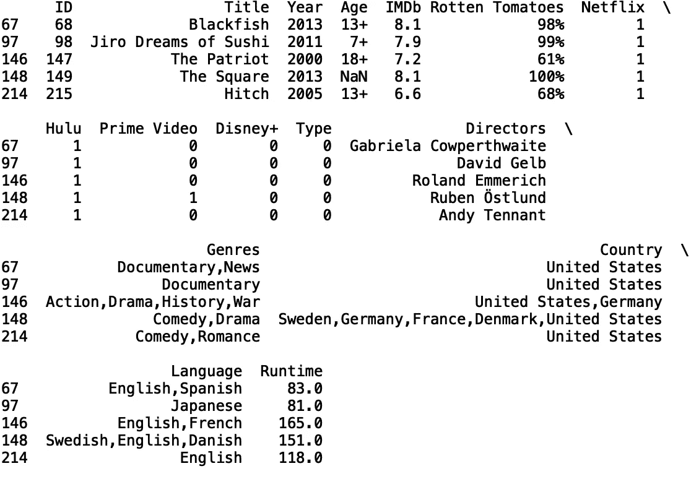
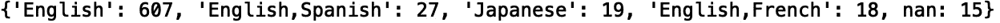
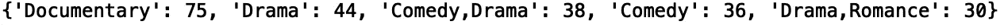
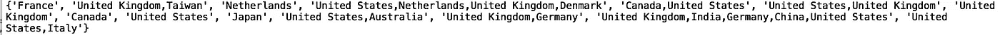
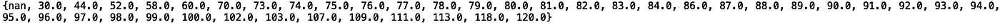
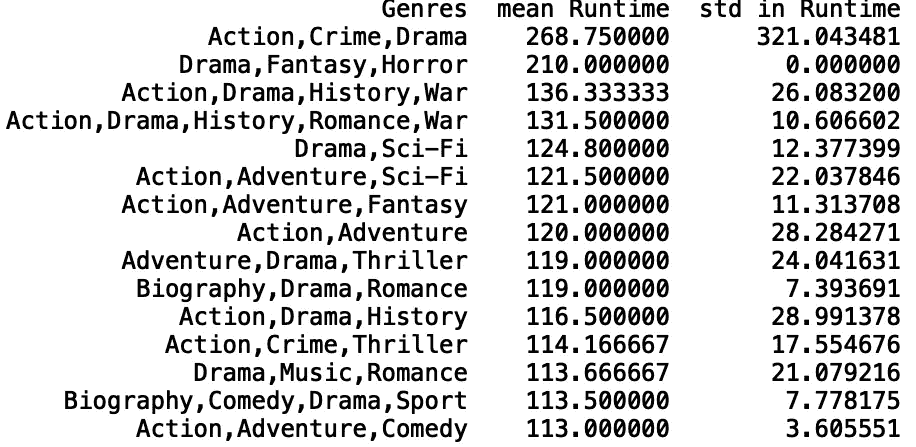
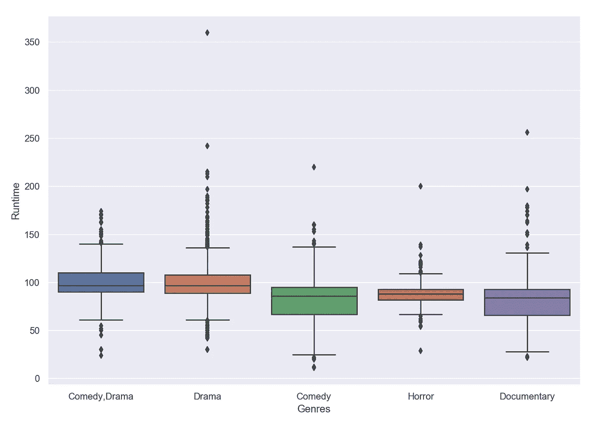
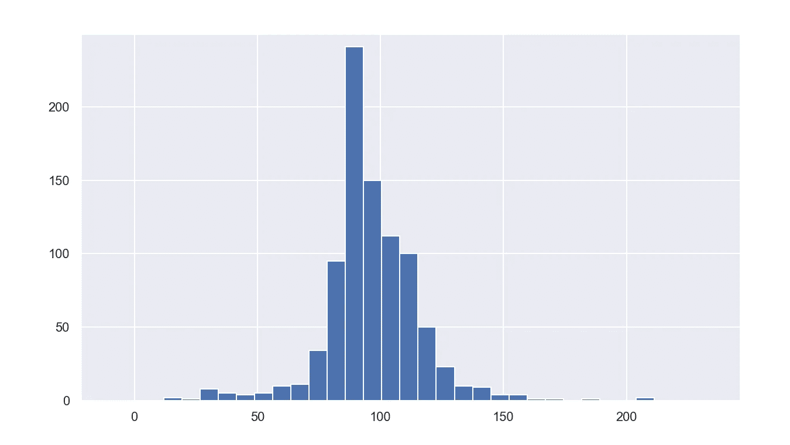

# 用 Python 探索 Hulu 数据

> 原文：<https://towardsdatascience.com/exploring-hulu-data-in-python-1eb6fa90a886?source=collection_archive---------69----------------------->

## Hulu 数据的探索性数据分析


[来源](https://www.pexels.com/photo/app-entertainment-ipad-mockup-265685/)

网飞、Prime Video、Hulu 和 Disney Plus 上的*电影数据集包含从 reelgood.com 收集的信息，其中包含上述平台上可供流媒体播放的电影列表。在本帖中，我们将对网飞的*电影、Prime Video、Hulu 和 Disney Plus* 数据集中的 Hulu 数据进行基本的探索性数据分析。数据可以在[这里](https://www.kaggle.com/ruchi798/movies-on-netflix-prime-video-hulu-and-disney)找到。*

我们开始吧！

首先，让我们将数据读入熊猫数据框:

```
import pandas as pd 
df = pd.read_csv("MoviesOnStreamingPlatforms_updated.csv")
```

接下来，我们将打印该数据中可用的列:

```
print(df.columns)
```



我们不需要“Unamed: 0”列，所以我们可以用“del”关键字删除它:

```
del d['Unnamed: 0’]
```

现在，让我们使用“head()”方法打印前五行数据:

```
print(df.head())
```


如果我们看一下网飞、Hulu、Prime Video 和 Disney Plus 栏，我们会发现它们包含 1 和 0。1 对应于该电影可在相应平台上流式传输，而 0 对应于该电影在所述平台上不可用。

我们想专门研究 Hulu 数据，所以让我们过滤数据框，使“Hulu”列中的值等于 1:

```
df_hulu = df[df['Hulu'] == 1]
```

让我们打印原始数据框和过滤后的数据框的长度:

```
print("Total Length: ", len(df))
print("Hulu Length: ", len(df_hulu)))
```


让我们打印新数据框的前五行:

```
print(df_hulu.head())
```



我们的数据包含几个分类列。让我们定义一个将数据框、列名和限制作为输入的函数。当被调用时，它打印分类值的字典以及它们出现的频率:

```
def return_counter(data_frame, column_name, limit):
   from collections import Counter    print(dict(Counter(data_frame[column_name].values).most_common(limit)))
```

让我们将函数应用于“语言”列，并将结果限制为五个最常见的值:

```
return_counter(df_hulu, 'Language', 5)
```



如我们所见，Hulu 数据中有 607 个英语、27 个英语/西班牙语、19 个日语、18 个英语/法语和 15 个缺失的语言值。

让我们将此方法应用于“流派”列:

```
return_counter(df_hulu, 'Genres', 5)
```



现在，让我们来看看最常见的电影类型“纪录片”:

```
df_d1 = df_hulu[df_hulu['Genres'] =='Documentary']
print(set(df_d1['title']))
```


我们也可以看看这些国家:

```
print(set(df_d1['Country']))
```



接下来，让我们看看电影运行时间值的集合:

```
print(set(df_d1['Runtime']))
```



我们看到运行时间值的范围从 30 分钟到 120 分钟。接下来，从数字列(如“Runtime ”)中生成汇总统计数据会很有用。让我们定义一个采用数据框、分类列和数字列的函数。每个类别的数字列的平均值和标准偏差存储在数据框中，并且数据框根据平均值以降序排序。如果您想要快速查看特定类别对于特定数字列是否具有更高或更低的平均值和/或标准偏差值，这将非常有用。

```
def return_statistics(data_frame, categorical_column, numerical_column):
    mean = []
    std = []
    field = []
    for i in set(list(data_frame[categorical_column].values)):
        new_data = data_frame[data_frame[categorical_column] == i]
        field.append(i)
        mean.append(new_data[numerical_column].mean())
        std.append(new_data[numerical_column].std())
    df = pd.DataFrame({'{}'.format(categorical_column): field, 'mean {}'.format(numerical_column): mean, 'std in {}'.format(numerical_column): std})
    df.sort_values('mean {}'.format(numerical_column), inplace = True, ascending = False)
    df.dropna(inplace = True)
    return df
```

让我们用分类列“流派”和数字列“运行时”来调用我们的函数:

```
stats = return_statistics(df_hulu, 'Genres', 'Runtime')
print(stats.head(15))
```



接下来，我们将使用箱线图来显示基于最小值、最大值、中值、第一个四分位数和第三个四分位数的数值分布。如果您对它们不熟悉，可以看看文章[了解 Boxplots](/understanding-boxplots-5e2df7bcbd51) 。

与汇总统计函数类似，此函数采用数据框、分类列和数值列，并根据限制显示最常见类别的箱线图:

```
def get_boxplot_of_categories(data_frame, categorical_column, numerical_column, limit):
    import seaborn as sns
    from collections import Counter
    keys = []
    for i in dict(Counter(df[categorical_column].values).most_common(limit)):
        keys.append(i)
    print(keys)
    df_new = df[df[categorical_column].isin(keys)]
    sns.set()
    sns.boxplot(x = df_new[categorical_column], y =      df_new[numerical_column])
```

让我们在 5 个最常见的“流派”类别中为“运行时”生成箱线图:

```
get_boxplot_of_categories(df_hulu, 'Genres', 'Runtime', 5)
```



最后，让我们定义一个函数，它将数据框和数字列作为输入，并显示一个直方图:

```
def get_histogram(data_frame, numerical_column):
    df_new = data_frame
    df_new[numerical_column].hist(bins=100)
```

让我们用数据框调用函数，并从“运行时”生成一个直方图:

```
get_histogram(df_hulu, 'Runtime')
```



我就讲到这里，但是请随意处理数据并自己编码。

## 结论

概括地说，我们回顾了几种分析网飞*电影、Prime Video、Hulu 和 Disney Plus* 数据集*中 Hulu 数据的方法。*这包括定义用于生成汇总统计数据的函数，如平均值、标准差和分类值的计数。我们还定义了用箱线图和直方图可视化数据的函数。我希望这篇文章有趣。这篇文章的代码可以在 [GitHub](https://github.com/spierre91/medium_code/blob/master/exploratory_data_analysis/eda_hulu.py) 上找到。感谢您的阅读！