# 在边缘探索 AI！

> 原文：<https://towardsdatascience.com/exploring-ia-at-the-edge-b30a550456db?source=collection_archive---------13----------------------->

## 树莓平台上基于 Tensorflow Lite 的图像识别、目标检测和姿态估计

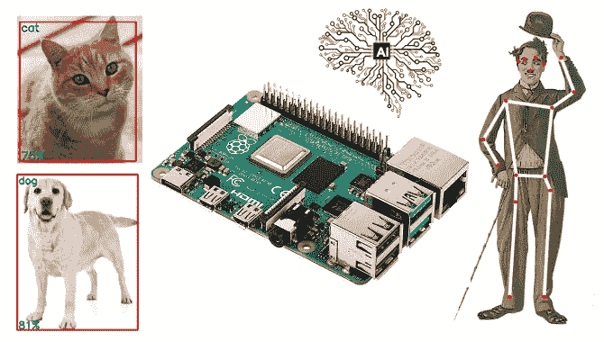

图片来源:作者创作

# 介绍

**什么是*边缘*(或者*雾*C*计算*？**

> Gartner 将边缘计算定义为:“分布式计算拓扑的一部分，其中信息处理位于靠近边缘的位置，即事物和人生产或消费信息的位置。”

换句话说，边缘计算将计算(和一些数据存储)带到离生成或消费数据的设备更近的地方(尤其是实时)，而不是依赖于遥远的基于云的中央系统。使用这种方法，数据不会遇到延迟问题，从而降低了传输和处理的成本。在某种程度上，这是一种“回到最近的过去”，所有的计算工作都在本地的桌面上完成，而不是在云中。

边缘计算是由于连接到互联网的物联网设备的指数增长而发展起来的，这些设备要么从云中接收信息，要么将数据传送回云中。许多物联网(IoT)设备在运行过程中会产生大量数据。

边缘计算为物联网应用提供了新的可能性，特别是对于那些依赖机器学习(ML)来完成诸如对象和姿态检测、图像(和人脸)识别、语言处理和避障等任务的应用。图像数据是物联网的绝佳补充，但也是重要的资源消耗者(如电力、内存和处理)。图像处理“在边缘”，运行经典 AI/ML 模型，是一个巨大的飞跃！

## **tensor flow Lite——机器学习(ML)在边缘！！**

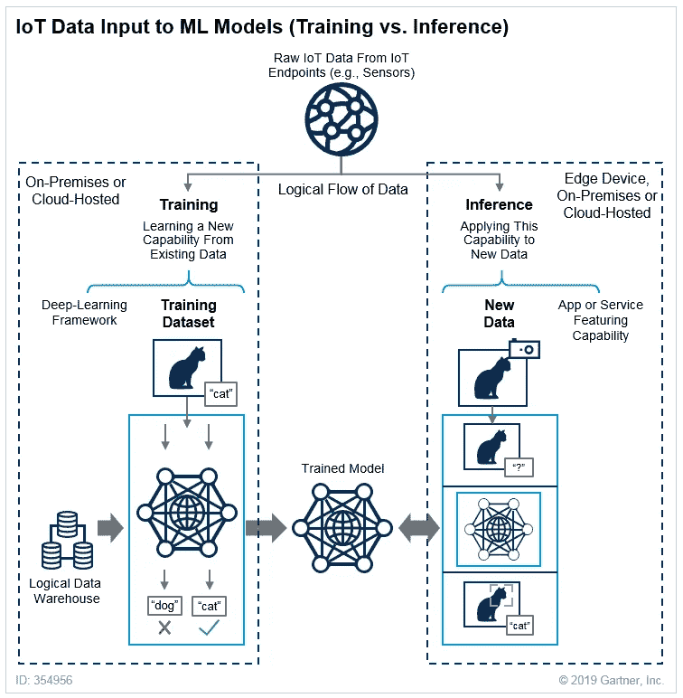

图片来源:[机器学习训练对比推理](https://blogs.gartner.com/paul-debeasi/2019/02/14/training-versus-inference/) — Gartner

**机器学习**可以分为两个独立的过程:训练和推理，正如 [Gartner 博客](https://blogs.gartner.com/paul-debeasi/2019/02/14/training-versus-inference/)中所解释的:

*   **训练:**训练是指创建机器学习算法的过程。训练涉及使用深度学习框架(例如 TensorFlow)和训练数据集(见上图左侧)。物联网数据提供了一个训练数据源，数据科学家和工程师可以使用它来训练各种情况下的机器学习模型，从故障检测到消费者智能。
*   **推理:**推理是指使用经过训练的机器学习算法进行预测的过程。物联网数据可以用作经过训练的机器学习模型的输入，实现预测，这些预测可以指导设备上、边缘网关上或物联网系统中其他地方的决策逻辑(见上图右侧)。

[**TensorFlow Lite**](https://www.tensorflow.org/lite) 是一个开源的深度学习框架，支持**在设备上的机器学习推理**，具有低延迟和小二进制大小。它旨在使在网络“边缘”的设备上执行机器学习变得容易，而不是从服务器来回发送数据。

在设备上执行机器学习有助于改善:

*   *延迟:*没有到服务器的往返
*   *隐私:*没有数据需要离开设备
*   *连接:*不需要互联网连接
*   *功耗:*网络连接非常耗电

TensorFlow Lite (TFLite)由两个主要组件组成:

*   **TFLite 转换器**，它将 TensorFlow 模型转换成高效的形式供解释器使用，并可以引入优化来提高二进制大小和性能。
*   TFLite 解释器在许多不同的硬件类型上运行，包括手机、嵌入式 Linux 设备和微控制器。

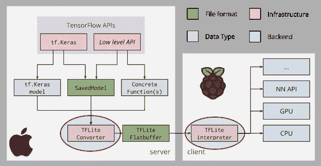

图片来源:TensorFlow Lite —在边缘设备部署模型

总之，一个经过训练和保存的 TensorFlow 模型(如 *model.h5* )可以使用 TFLite FlatBuffer(如 *model.tflite* )中的 **TFLite Converter** 进行转换，该转换器将由 Edge 设备内部的 **TF Lite 解释器**使用(作为一个 Raspberry Pi)，以对新数据进行推理。

例如，我在我的 Mac(上图中的“服务器”)中从头训练了一个简单的 CNN 图像分类模型。最终模型有 225，610 个参数要训练，使用 CIFAR10 数据集作为输入:60，000 个图像(形状:32，32，3)。经过训练的模型( *cifar10_model.h5* )的大小为 2.7Mb。使用 TFLite 转换器，在 Raspberry Pi 上使用的模型( *model_cifar10.tflite* )的大小变为 905Kb(约为原始大小的 1/3)。用两个模型进行推断(h5 在 Mac 和。RPi 处的 tflite)留下相同的结果。两款笔记本都可以在 [GitHub](https://github.com/Mjrovai/TFLite_IA_at_the_Edge) 找到。

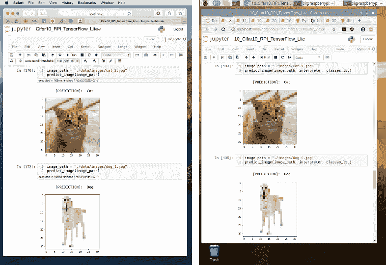

图片来源:作者笔记本

# Raspberry Pi — TFLite 安装

也可以在 Raspberry Pi 从头开始训练模型，为此，需要完整的 TensorFlow 包。但是一旦我们要做的只是**推理**部分，我们将只安装 TensorFlow Lite 解释器。

> 仅解释器包的大小是整个 TensorFlow 包的一小部分，并且包括使用 TensorFlow Lite 运行推理所需的最少代码。它只包含用于执行`.tflite`模型的`[tf.lite.Interpreter](https://www.tensorflow.org/api_docs/python/tf/lite/Interpreter)` Python 类。

让我们在 Raspberry Pi 打开终端，安装您的特定系统配置所需的 [Python wheel](https://pythonwheels.com/) 。选项可以在这个链接上找到: [Python 快速入门](https://www.tensorflow.org/lite/guide/python)。例如，在我的例子中，我运行的是 Linux arm 32(Raspbian Buster—Python 3.7)，所以命令行是:

```
$ sudo pip3 install [https://dl.google.com/coral/python/tflite_runtime-2.1.0.post1-cp37-cp37m-linux_armv7l.whl](https://dl.google.com/coral/python/tflite_runtime-2.1.0.post1-cp37-cp37m-linux_armv7l.whl)
```

如果您想仔细检查 Raspberry Pi 中的操作系统版本，请运行以下命令:

```
$ uname -
```

如下图所示，如果你得到… *arm7l…* ，操作系统是 32 位 Linux。

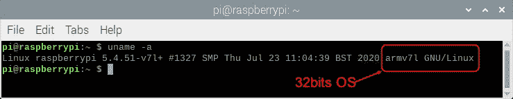

安装 Python wheel 是让 TFLite 解释器在 Raspberry Pi 中工作的唯一要求。可以在终端调用 TFLite 解释器来仔细检查安装是否正常，如下所示。如果没有错误出现，我们是好的。

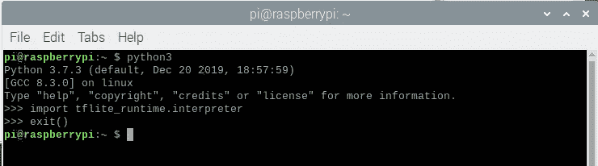

# 图像分类

## 介绍

应用于计算机视觉(CV)的人工智能的更经典的任务之一是图像分类。从 2012 年开始，当一个名为 [AlexNet](https://en.wikipedia.org/wiki/AlexNet) 的[卷积神经网络](https://en.wikipedia.org/wiki/Convolutional_neural_network) (CNN)(为了纪念其领先的开发者 Alex Krizhevsky)在 ImageNet 2012 挑战赛中取得了 15.3%的前 5 名误差时，信息架构和深度学习(DL)永远改变了。根据《经济学家》杂志的报道，“人们突然开始关注(人工智能)，不仅仅是在人工智能领域，而是在整个技术行业

这个项目，在 Alex Krizhevsk，一个更现代的架构( [MobileNet](https://arxiv.org/pdf/1704.04861.pdf) )的近八年后，也使用相同的数据集 [ImageNet](https://en.wikipedia.org/wiki/ImageNet) 对数百万张图像进行了预训练，产生了 1000 个不同的类。这个预先训练和量化的模型是这样的，转换成一个. tflite 并在这里使用。

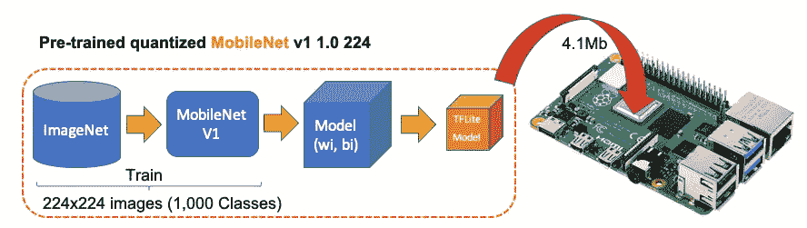

图片来源:作者创作

首先，让我们在 Raspberry Pi 上移动到一个工作目录(例如， *Image_Recognition* )。接下来，必须创建两个子目录，一个用于模型，另一个用于图像:

```
$ mkdir images
$ mkdir models
```

一旦进入模型目录，让我们下载预先训练好的模型(在这个[链接](https://www.tensorflow.org/lite/guide/hosted_models)，可以下载几个不同的模型)。我们将使用量化的 Mobilenet V1 模型，用 224x224 像素的图像进行预训练。可以从 [TensorFlow Lite 图片分类](https://www.tensorflow.org/lite/models/image_classification/overview)下载的 zip 文件，使用 *wget* :

```
$ cd models
$ wget [https://storage.googleapis.com/download.tensorflow.org/models/tflite/mobilenet_v1_1.0_224_quant_and_labels.zip](https://storage.googleapis.com/download.tensorflow.org/models/tflite/mobilenet_v1_1.0_224_quant_and_labels.zip)
```

接下来，解压缩文件:

```
$ unzip mobilenet_v1_1.0_224_quant_and_labels
```

下载了两个文件:

*   **mobilenet _ v1 _ 1.0 _ 224 _ quant . TF Lite**:tensor flow-Lite 转换模型
*   **Labels _ mobilenet _ quant _ v1 _ 224 . txt**:ImageNet 数据集 1000 个类标签

现在，获取一些图像(例如。png，。jpg)并将它们保存在创建的图像子目录中。

> 在 [GitHub](https://github.com/Mjrovai/TFLite_IA_at_the_Edge) 上，可以找到本教程使用的图片。

## Raspberry Pi OpenCV 和 Jupyter 笔记本安装

OpenCV(开源计算机视觉库)是一个开源的计算机视觉和机器学习软件库。在处理图像时，这是一种有益的支持。如果在 Mac 或 PC 上安装它非常简单，那么在 Raspberry Pi 上安装就有点“技巧”了，但是我推荐使用它。

请按照 Q-Engineering 的这个很棒的教程在你的树莓 Pi 上安装 OpenCV:在树莓 Pi 4 上安装 OpenCV 4.4.0。尽管该指南是为 Raspberry Pi 4 编写的，但也可以不做任何修改地用于 Raspberry 3 或 2。

接下来，安装 Jupyter 笔记本。它将成为我们的开发平台。

```
$ sudo pip3 install jupyter
$ jupyter notebook
```

此外，在 OpenCV 安装过程中，应该已经安装了 NumPy，如果现在没有安装，与 MatPlotLib 相同。

```
$ sudo pip3 install numpy
$ sudo apt-get install python3-matplotlib
```

完成了！我们已经准备好开始我们的人工智能之旅了！

## 图像分类推理

创建一个新的 Jupyter 笔记本并遵循以下步骤，或者从 GitHub 下载完整的笔记本。

导入库:

```
import numpy as np
import matplotlib.pyplot as plt
import cv2
import tflite_runtime.interpreter as tflite
```

加载 TFLite 模型并分配张量:

```
interpreter = tflite.Interpreter(model_path=’./models/mobilenet_v1_1.0_224_quant.tflite’)
interpreter.allocate_tensors()
```

获取输入和输出张量:

```
input_details = interpreter.get_input_details()
output_details = interpreter.get_output_details()
```

**输入细节**将为您提供所需的信息，告诉您应该如何为模型输入图像:

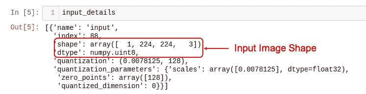

(1，224x224x3)的形状通知一个尺寸为:(224x224x3)的图像应该一个一个输入(批量尺寸:1)。dtype uint8 表示这些值是 8 位整数

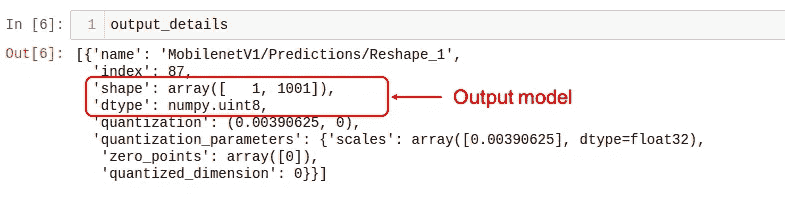

**输出细节**显示推理将产生 1001 个整数值(8 位)的数组。这些值是图像分类的结果，其中每个值是特定标签与图像相关的概率。

例如，假设我们想要对形状为(1220，1200，3)的图像进行分类。首先，我们需要将其调整为(224，224，3)并添加一个批处理维度 1，如输入细节中所定义的:(1，224，224，3)。推断结果将是一个大小为 1001 的数组，如下所示:

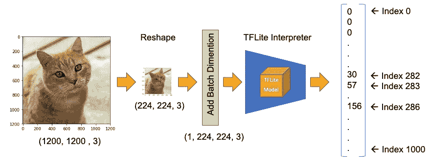

图片来源:作者创作—图片分类主要步骤

对这些操作进行编码的步骤是:

1.  输入图像并将其转换为 RGB (OpenCV 将图像读取为 BGR 图像):

```
image_path = './images/cat_2.jpg'
image = cv2.imread(image_path)
img = cv2.cvtColor(image, cv2.COLOR_BGR2RGB)
```

2.图像预处理、整形和添加批量尺寸:

```
img = cv2.resize(img, (224, 224))
input_data = np.expand_dims(img, axis=0)
```

3.指向用于测试的数据并运行解释器:

```
interpreter.set_tensor(input_details[0]['index'], input_data)
interpreter.invoke()
```

4.获取结果并将它们映射到类别:

```
predictions = interpreter.get_tensor(output_details[0][‘index’])[0]
```

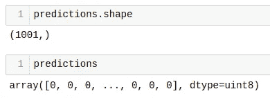

输出值(预测值)从 0 到 255 不等(8 位整数的最大值)。要获得范围从 0 到 1 的预测，输出值应除以 255。与最高值相关的数组索引是这种图像最可能的分类。

有了索引，我们必须找到它指定的类别(如汽车、猫或狗)。与模型一起下载的文本文件有一个与从 0 到 1，000 的每个索引相关联的标签。

让我们首先创建一个函数来加载。txt 文件作为字典:

```
def load_labels(path):
    with open(path, 'r') as f:
        return {i: line.strip() for i, line in enumerate(f.readlines())}
```

创建一个名为*标签*的字典，并检查其中的一些标签:

```
labels = load_labels('./models/labels_mobilenet_quant_v1_224.txt')
```

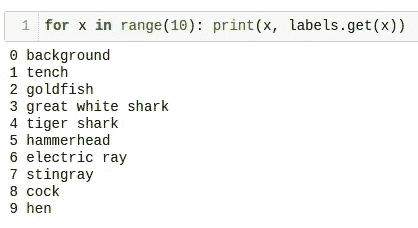

回到我们的例子，让我们得到前 3 个结果(最高概率):

```
top_k_indices = 3
top_k_indices = np.argsort(predictions)[::-1][:top_k_results]
```

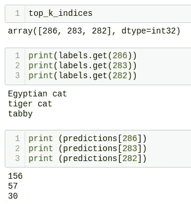

我们可以看到，前 3 个指数都与猫有关。预测内容是与每个标签相关联的概率。如前所述，除以 255。，我们可以得到一个从 0 到 1 的值。让我们创建一个循环来检查顶部结果，打印标签和概率:

```
for i in range(top_k_results):
    print("\t{:20}: {}%".format(
        labels[top_k_indices[i]],
        int((predictions[top_k_indices[i]] / 255.0) * 100)))
```

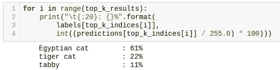

让我们创建一个函数，来平滑地对不同的图像执行推理:

```
def image_classification(image_path, labels, top_k_results=3):
    image = cv2.imread(image_path)
    img = cv2.cvtColor(image, cv2.COLOR_BGR2RGB)
    plt.imshow(img)img = cv2.resize(img, (w, h))
    input_data = np.expand_dims(img, axis=0)interpreter.set_tensor(input_details[0]['index'], input_data)
    interpreter.invoke()
    predictions = interpreter.get_tensor(output_details[0]['index'])[0]top_k_indices = np.argsort(predictions)[::-1][:top_k_results]print("\n\t[PREDICTION]        [Prob]\n")
    for i in range(top_k_results):
        print("\t{:20}: {}%".format(
            labels[top_k_indices[i]],
            int((predictions[top_k_indices[i]] / 255.0) * 100)))
```

下图显示了使用该函数的一些测试:

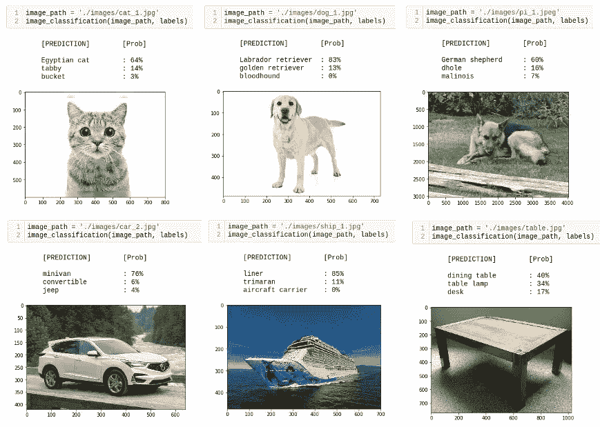

图片来源:作者根据公共数据集创作

整体表现惊人！从你输入内存卡中的图像路径开始，直到打印出结果，整个过程不到半秒钟，精度极高！

该功能可以很容易地应用于视频或现场摄像机的帧。本节讨论的笔记本和完整代码可以从 [GitHub](https://github.com/Mjrovai/TFLite_IA_at_the_Edge) 下载。

# 目标检测

利用图像分类，我们可以检测这样的图像的主要主题是什么。但是，如果几个物体在同一个图像上是主要的和感兴趣的，会发生什么呢？要解决它，我们可以使用一个对象检测模型！

给定图像或视频流，对象检测模型可以识别已知对象集合中的哪一个可能存在，并提供关于它们在图像中的位置的信息。

对于此任务，我们将下载一个使用 COCO(上下文中的公共对象)数据集预训练的 Mobilenet V1 模型。这个数据集有超过 200，000 个带标签的图像，分属 91 个类别。

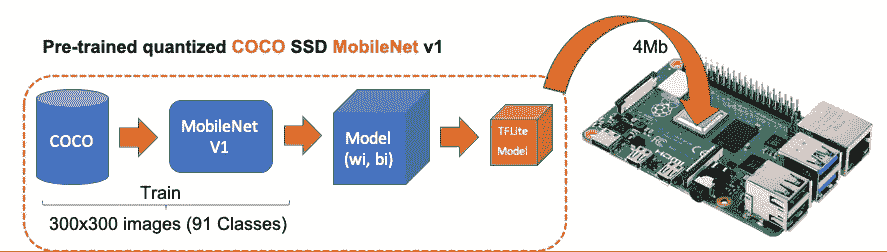

图片来源:作者创作

## 下载模型和标签

在 Raspberry 终端上运行命令:

```
$ cd ./models 
$ curl -O [http://storage.googleapis.com/download.tensorflow.org/models/tflite/coco_ssd_mobilenet_v1_1.0_quant_2018_06_29.zip](http://storage.googleapis.com/download.tensorflow.org/models/tflite/coco_ssd_mobilenet_v1_1.0_quant_2018_06_29.zip)
$ unzip coco_ssd_mobilenet_v1_1.0_quant_2018_06_29.zip
$ curl -O  [https://dl.google.com/coral/canned_models/coco_labels.txt](https://dl.google.com/coral/canned_models/coco_labels.txt)$ rm coco_ssd_mobilenet_v1_1.0_quant_2018_06_29.zip
$ rm labelmap.txt
```

在 *models* 子目录中，我们应该以 2 个新文件结束:

```
coco_labels.txt  
detect.tflite
```

对新图像执行推断的步骤与图像分类非常相似，除了:

*   输入:图像的形状必须为 300x300 像素
*   输出:不仅包括标签和概率(“得分”)，还包括对象在图像上所处位置的相对窗口位置(“边界框”)。

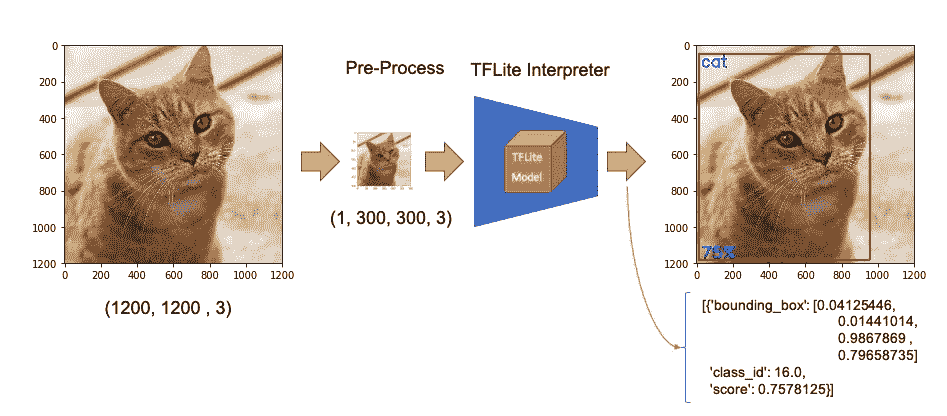

图片来源:作者创作

现在，我们必须加载标签和模型，分配张量。

```
labels = load_labels('./models/coco_labels.txt')
interpreter = Interpreter('./models/detect.tflite')
interpreter.allocate_tensors()
```

输入预处理和我们之前做的一样，但是输出应该被处理以获得更可读的输出。以下函数将对此有所帮助:

```
def set_input_tensor(interpreter, image):
    """Sets the input tensor."""
    tensor_index = interpreter.get_input_details()[0]['index']
    input_tensor = interpreter.tensor(tensor_index)()[0]
    input_tensor[:, :] = imagedef get_output_tensor(interpreter, index):
    """Returns the output tensor at the given index."""
    output_details = interpreter.get_output_details()[index]
    tensor = np.squeeze(interpreter.get_tensor(output_details['index']))
    return tensor
```

借助上述函数，detect_objects()将返回推理结果:

*   对象标签 id
*   得分
*   边界框，它将显示对象的位置。

我们已经包括了一个“阈值”来避免正确概率低的对象。通常情况下，我们应该考虑 50%以上的分数。

```
def detect_objects(interpreter, image, threshold):
    set_input_tensor(interpreter, image)
    interpreter.invoke()

    # Get all output details
    boxes = get_output_tensor(interpreter, 0)
    classes = get_output_tensor(interpreter, 1)
    scores = get_output_tensor(interpreter, 2)
    count = int(get_output_tensor(interpreter, 3)) results = []
    for i in range(count):
        if scores[i] >= threshold:
            result = {
                'bounding_box': boxes[i],
                'class_id': classes[i],
                'score': scores[i]
            }
            results.append(result)
    return results
```

如果我们将上述函数应用于一个整形的图像(与分类示例中使用的相同)，我们应该得到:

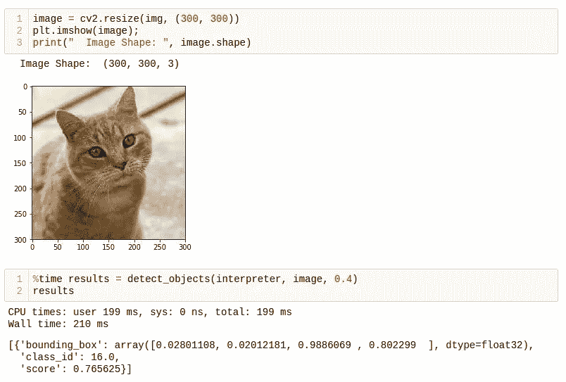

太好了！在不到 200 毫秒的时间内，以 77%的概率，在由“边界框”界定的区域上检测到 id 为 16 的物体:(0.028011084，0.020121813，0.9886069，0.802299)。这四个数字分别与 ymin、xmin、ymax 和 xmax 相关。

考虑到 y 从顶部(ymin)到底部(ymax ), x 从左侧(xmin)到右侧(xmax ),如下图所示:

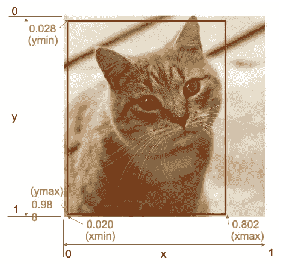

图片来源:作者创作

边界框有四个值，实际上，我们有左上角和右下角的坐标。有了两边，知道了图片的形状，就有可能画出物体周围的矩形。

接下来，我们应该找出 class_id 等于 16 意味着什么。打开文件 *coco_labels.txt，*作为一个字典，它的每个元素都有一个相关联的索引，检查索引 16，我们得到了预期的' cat '概率是从分数返回的值。

让我们创建一个通用函数来检测单个图片上的多个对象。第一个函数从图像路径开始，将执行推理，返回调整后的图像和结果(多个 id，每个 id 都有其分数和边界框:

```
def detectObjImg_2(image_path, threshold = 0.51):img = cv2.imread(image_path)
    img = cv2.cvtColor(img, cv2.COLOR_BGR2RGB)
    image = cv2.resize(img, (width, height),
                       fx=0.5,
                       fy=0.5,
                       interpolation=cv2.INTER_AREA)
    results = detect_objects(interpreter, image, threshold)return img, results
```

有了整形后的图像和推断结果，下面的函数可用于在对象周围绘制一个矩形，为每个对象指定其标签和概率:

```
def detect_mult_object_picture(img, results): HEIGHT, WIDTH, _ = img.shape
    aspect = WIDTH / HEIGHT
    WIDTH = 640
    HEIGHT = int(640 / aspect)
    dim = (WIDTH, HEIGHT) img = cv2.resize(img, dim, interpolation=cv2.INTER_AREA) for i in range(len(results)):
        id = int(results[i]['class_id'])
        prob = int(round(results[i]['score'], 2) * 100)

        ymin, xmin, ymax, xmax = results[i]['bounding_box']
        xmin = int(xmin * WIDTH)
        xmax = int(xmax * WIDTH)
        ymin = int(ymin * HEIGHT)
        ymax = int(ymax * HEIGHT) text = "{}: {}%".format(labels[id], prob) if ymin > 10: ytxt = ymin - 10
        else: ytxt = ymin + 15 img = cv2.rectangle(img, (xmin, ymin), (xmax, ymax),
                            COLORS[id],
                            thickness=2)
        img = cv2.putText(img, text, (xmin + 3, ytxt), FONT, 0.5, COLORS[id],
                          2) return img
```

下面是一些结果:

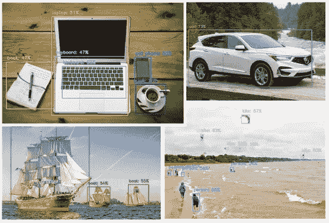

图片来源:作者创作

完整的代码可以在 [GitHub](https://github.com/Mjrovai/TFLite_IA_at_the_Edge) 找到。

## 使用摄像机的目标检测

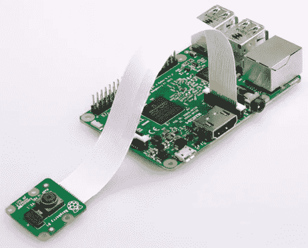

图片来源:树莓派基金会

如果您有一个连接到 Raspberry Pi 的 PiCam，则可以使用之前定义的相同功能，逐帧捕捉视频并执行对象识别。如果您的 Pi: [中没有可用的相机，请遵循本教程开始使用相机模块](https://projects.raspberrypi.org/en/projects/getting-started-with-picamera)。

首先，必须定义相机要捕捉的帧的大小。我们将使用 640x480。

```
WIDTH = 640
HEIGHT = 480
```

接下来，你必须校准摄像机:

```
cap = cv2.VideoCapture(0)
cap.set(3, WIDTH)
cap.set(4, HEIGHT)
```

并循环运行下面的代码。在按下“q”键之前，摄像机会一帧一帧地捕捉视频，并绘制带有相应标签和概率的边界框。

```
while True: timer = cv2.getTickCount()
    success, img = cap.read()
    img = cv2.flip(img, 0)
    img = cv2.flip(img, 1) fps = cv2.getTickFrequency() / (cv2.getTickCount() - timer)
    cv2.putText(img, "FPS: " + str(int(fps)), (10, 470),
                cv2.FONT_HERSHEY_SIMPLEX, 0.7, (0, 0, 255), 2) image = cv2.cvtColor(img, cv2.COLOR_BGR2RGB)
    image = cv2.resize(image, (width, height),
                       fx=0.5,
                       fy=0.5,
                       interpolation=cv2.INTER_AREA)
    start_time = time.time()
    results = detect_objects(interpreter, image, 0.55)
    elapsed_ms = (time.time() - start_time) * 1000 img = detect_mult_object_picture(img, results)
    cv2.imshow("Image Recognition ==> Press [q] to Exit", img)if cv2.waitKey(1) & 0xFF == ord('q'):
        breakcap.release()
cv2.destroyAllWindows()
```

下面可以看到树莓 Pi 屏幕上实时运行的视频。注意视频运行在 60 FPS(每秒帧数)左右，相当不错！。

下面是上述视频的一个截屏:

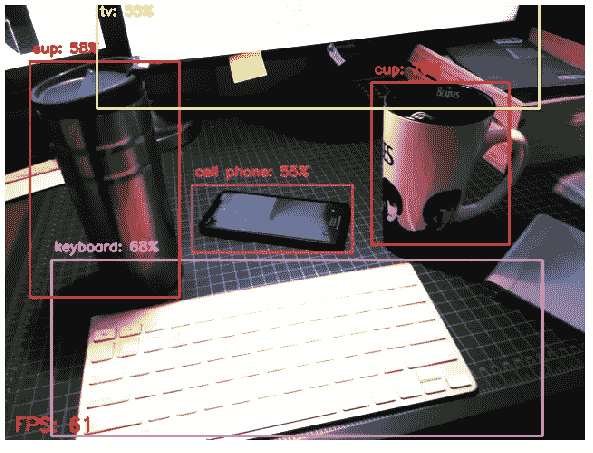

图片来源:作者创作

完整的代码可以在 [GitHub 上找到。](https://github.com/Mjrovai/TFLite_IA_at_the_Edge)

# 姿态估计

人工智能更令人兴奋和关键的领域之一是估计一个人的实时姿势，使机器能够理解人们在图像和视频中做什么。在我的文章[使用 TensorFlow2.x](/realtime-multiple-person-2d-pose-estimation-using-tensorflow2-x-93e4c156d45f) 进行实时多人 2D 姿势估计中深入探讨了姿势估计，但在这里的边缘，使用 Raspberry Pi 并在 TensorFlow Lite 的帮助下，可以轻松复制在 Mac 上完成的几乎相同的操作。

我们将在这个项目中使用的型号是 [PoseNet](https://github.com/tensorflow/tfjs-models/tree/master/posenet) 。我们将以与图像分类和对象检测相同的方式进行推理，其中图像通过预先训练的模型输入。PoseNet 带有几个不同版本的模型，对应于 MobileNet v1 架构和 ResNet50 架构的变化。在这个项目中，预训练的版本是 MobileNet V1，它比 ResNet 更小，更快，但不如 ResNet 准确。此外，有单独的模型用于单人和多人姿势检测。我们将探索为一个人训练的模型。

在这个[站点](https://storage.googleapis.com/tfjs-models/demos/posenet/camera.html)中，可以使用现场摄像机实时探索几个 PoseNet 模型和配置。

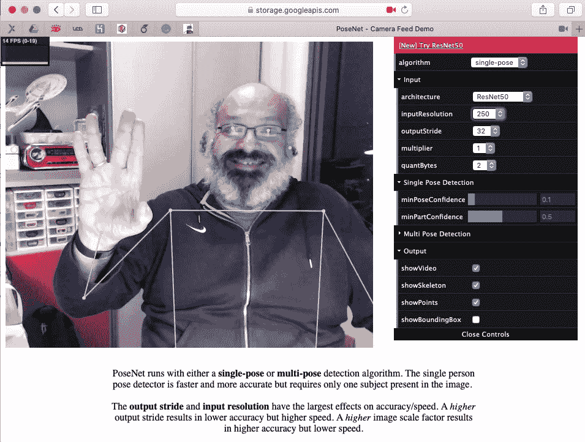

在 Raspberry Pi 上执行姿态估计的库与之前使用的相同。NumPy，MatPlotLib，OpenCV 和 TensorFlow Lite 解释器。

预训练的模型是[posenet _ mobilenet _ v1 _ 100 _ 257 x257 _ multi _ kpt _ stripped . TF Lite](https://storage.googleapis.com/download.tensorflow.org/models/tflite/posenet_mobilenet_v1_100_257x257_multi_kpt_stripped.tflite)，可以从上面的链接或者 [TensorFlow Lite —姿态估计概述网站](https://www.tensorflow.org/lite/models/pose_estimation/overview)下载。模型应该保存在 models 子目录中。

开始加载 TFLite 模型并分配张量:

```
interpreter = tflite.Interpreter(model_path='./models/posenet_mobilenet_v1_100_257x257_multi_kpt_stripped.tflite')
interpreter.allocate_tensors()
```

获取输入和输出张量:

```
input_details = interpreter.get_input_details()
output_details = interpreter.get_output_details()
```

与我们之前所做的一样，查看 input_details，可以看到用于姿态估计的图像应该是(1，257，257，3)，这意味着图像必须被整形为 257x257 像素。

让我们以一个简单的人形作为输入，这将帮助我们分析它:

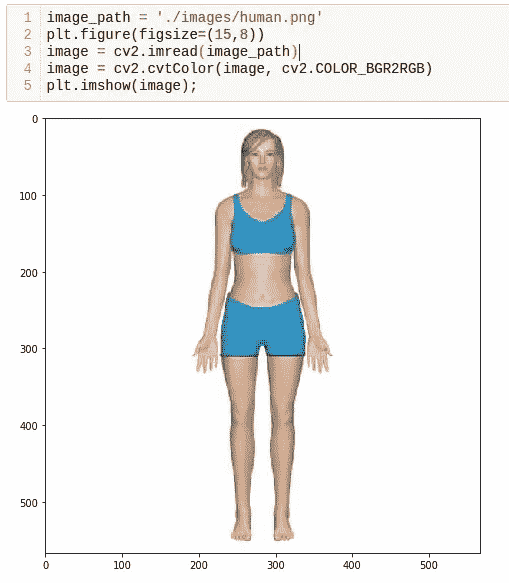

第一步是预处理图像。这个特殊的模型没有被量化，这意味着 dtype 是 float32。这些信息对于预处理输入图像至关重要，如下面的代码所示

```
image = cv2.resize(image, size) 
input_data = np.expand_dims(image, axis=0)
input_data = input_data.astype(np.float32)
input_data = (np.float32(input_data) - 127.5) / 127.5
```

对图像进行预处理后，现在是执行推理的时候了，向张量输入图像并调用解释器:

```
interpreter.set_tensor(input_details[0]['index'], input_data)
interpreter.invoke()
```

一篇非常有助于理解如何使用 PoseNet 的文章是 [Ivan Kunyakin](https://medium.com/@ikunyankin?source=post_page-----ea2e9249abbd----------------------) 教程的[姿势估计和与 TensorFlow lite 的匹配](https://medium.com/roonyx/pose-estimation-and-matching-with-tensorflow-lite-posenet-model-ea2e9249abbd)。Ivan 评论说，在输出向量中，找到关键点的关键是:

*   **热图**大小为(9，9，17)的 3D 张量，其对应于 17 个关键点(身体关节)中的每一个在图像的特定部分(9，9)中出现的概率。它用于定位关节的大致位置。
*   **偏移向量:**大小为(9，9，34)的 3D 张量，称为偏移向量。它用于更精确地计算关键点的位置。第三维的第一个 17 对应于 x 坐标，第二个 17 对应于 y 坐标。

```
output_details = interpreter.get_output_details()[0]
heatmaps = np.squeeze(interpreter.get_tensor(output_details['index']))output_details = interpreter.get_output_details()[1]
offsets = np.squeeze(interpreter.get_tensor(output_details['index']))
```

让我们创建一个函数，该函数将基于热图和偏移量返回包含所有 17 个关键点(或人的关节)的数组。

```
def get_keypoints(heatmaps, offsets): joint_num = heatmaps.shape[-1]
    pose_kps = np.zeros((joint_num, 2), np.uint32)
    max_prob = np.zeros((joint_num, 1)) for i in range(joint_num):
        joint_heatmap = heatmaps[:,:,i]
        max_val_pos = np.squeeze(
            np.argwhere(joint_heatmap == np.max(joint_heatmap)))
        remap_pos = np.array(max_val_pos / 8 * 257, dtype=np.int32)
        pose_kps[i, 0] = int(remap_pos[0] +
                             offsets[max_val_pos[0], max_val_pos[1], i])
        pose_kps[i, 1] = int(remap_pos[1] +
                             offsets[max_val_pos[0], max_val_pos[1],
                                         i + joint_num])
        max_prob[i] = np.amax(joint_heatmap) return pose_kps, max_prob
```

使用上述函数以及从输出张量提取的热图和偏移向量，图像推断的结果，我们得到:

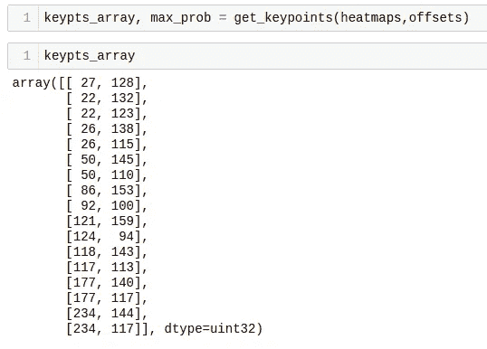

得到的数组显示了关于关节在 257×257 像素的图像上的位置的所有 17 个坐标(y，x)。使用下面的代码。可以在调整大小的图像上绘制每个关节。作为参考，数组索引已被标注，因此很容易识别每个关节:

```
y,x = zip(*keypts_array)
plt.figure(figsize=(10,10))
plt.axis([0, image.shape[1], 0, image.shape[0]])  
plt.scatter(x,y, s=300, color='orange', alpha=0.6)
img = cv2.cvtColor(image, cv2.COLOR_BGR2RGB)
plt.imshow(img)
ax=plt.gca() 
ax.set_ylim(ax.get_ylim()[::-1]) 
ax.xaxis.tick_top() 
plt.grid();for i, txt in enumerate(keypts_array):
    ax.annotate(i, (keypts_array[i][1]-3, keypts_array[i][0]+1))
```

结果，我们得到了图片:

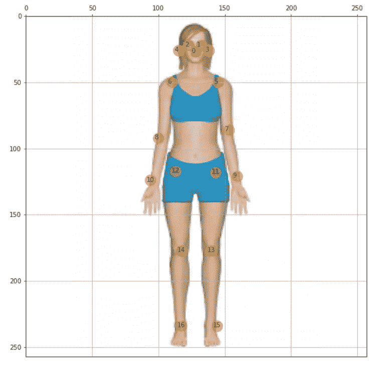

图片来源:作者创作

太好了，现在是时候创建一个通用函数来绘制“骨骼”，这是关节的连接。骨骼将被绘制为线条，这些线条是关键点 5 到 16 之间的连接，如上图所示。独立圆将用于关键点 0 至 4，与头部相关:

```
def join_point(img, kps, color='white', bone_size=1):

    if   color == 'blue'  : color=(255, 0, 0)
    elif color == 'green': color=(0, 255, 0)
    elif color == 'red':  color=(0, 0, 255)
    elif color == 'white': color=(255, 255, 255)
    else:                  color=(0, 0, 0) body_parts = [(5, 6), (5, 7), (6, 8), (7, 9), (8, 10), (11, 12), (5, 11),
                  (6, 12), (11, 13), (12, 14), (13, 15), (14, 16)] for part in body_parts:
        cv2.line(img, (kps[part[0]][1], kps[part[0]][0]),
                (kps[part[1]][1], kps[part[1]][0]),
                color=color,
                lineType=cv2.LINE_AA,
                thickness=bone_size)

    for i in range(0,len(kps)):
        cv2.circle(img,(kps[i,1],kps[i,0]),2,(255,0,0),-1)
```

通过调用该函数，我们得到了图像中身体的估计姿势:

```
join_point(img, keypts_array, bone_size=2)
plt.figure(figsize=(10,10))
plt.imshow(img);
```

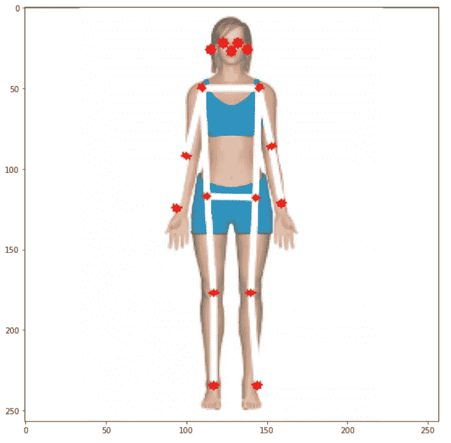

图片来源:作者创作

最后但同样重要的是，让我们创建一个通用函数，以图像路径作为起点来估计姿态:

```
def plot_pose(img, keypts_array, joint_color='red', bone_color='blue', bone_size=1):
    join_point(img, keypts_array, bone_color, bone_size)
    y,x = zip(*keypts_array)
    plt.figure(figsize=(10,10))
    plt.axis([0, img.shape[1], 0, img.shape[0]])  
    plt.scatter(x,y, s=100, color=joint_color)
    img = cv2.cvtColor(img, cv2.COLOR_BGR2RGB) plt.imshow(img)
    ax=plt.gca() 
    ax.set_ylim(ax.get_ylim()[::-1]) 
    ax.xaxis.tick_top() 
    plt.grid();
    return img def get_plot_pose(image_path, size, joint_color='red', bone_color='blue', bone_size=1):    
    image_original = cv2.imread(image_path)
    image = cv2.resize(image_original, size) 
    input_data = np.expand_dims(image, axis=0)
    input_data = input_data.astype(np.float32)
    input_data = (np.float32(input_data) - 127.5) / 127.5 interpreter.set_tensor(input_details[0]['index'], input_data)
    interpreter.invoke()

    output_details = interpreter.get_output_details()[0]
    heatmaps = np.squeeze(interpreter.get_tensor(output_details['index'])) output_details = interpreter.get_output_details()[1]
    offsets = np.squeeze(interpreter.get_tensor(output_details['index'])) keypts_array, max_prob = get_keypoints(heatmaps,offsets)
    orig_kps = get_original_pose_keypoints(image_original, keypts_array, size) img = plot_pose(image_original, orig_kps, joint_color, bone_color, bone_size)

    return orig_kps, max_prob, img
```

此时，只需一行代码，就可以检测图像上的姿态:

```
keypts_array, max_prob, img  = get_plot_pose(image_path, size, bone_size=3)
```

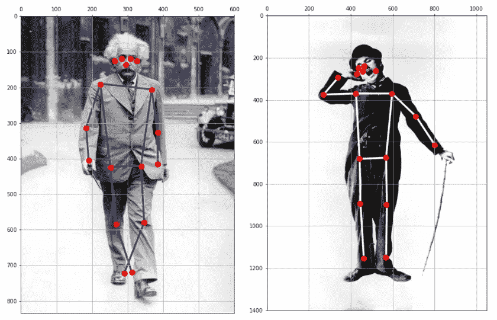

本节开发的所有代码都可以在 [GitHub](https://github.com/Mjrovai/TFLite_IA_at_the_Edge) 上获得。

> 另一个简单的步骤是将该功能应用于来自视频和现场摄像机的帧。我会留给你的！；-)

# 结论

TensorFlow Lite 是一个在边缘实现人工智能(更准确地说，是 ML)的伟大框架。在这里，我们探索了在 Raspberry Pi 上工作的 ML 模型，但 TFLite 现在越来越多地用于“边缘的边缘”，在非常小的微控制器上，在所谓的 *TinyML* 中。

一如既往，我希望这篇文章可以激励其他人在 AI 的奇幻世界中找到自己的路！

本文使用的所有代码都可以在 GitHub 项目上下载: [TFLite_IA_at_the_Edge。](https://github.com/Mjrovai/TFLite_IA_at_the_Edge)

来自世界南方的问候！

我的下一篇文章再见！

谢谢你

马塞洛

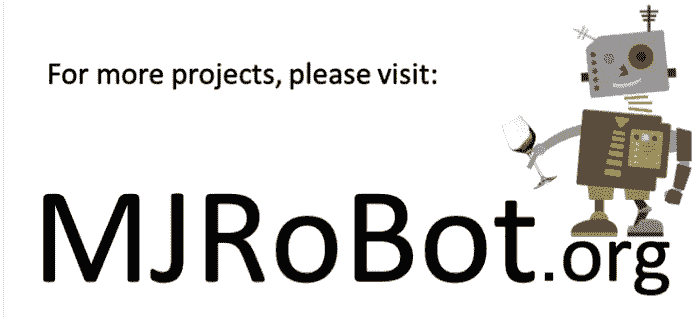