# 探索新加坡的非法毒品——数据透视

> 原文：<https://towardsdatascience.com/exploring-illegal-drugs-in-singapore-a-data-perspective-3716a75ee557?source=collection_archive---------31----------------------->

## [变更数据](https://towardsdatascience.com/tagged/data-for-change)

## *用 Python 通过探索性数据分析发现保健品的好、坏、丑*

> 所有的东西都是毒药，因为没有一样东西是没有毒性的。只有剂量才会使一件东西中毒。”― **帕拉塞尔苏斯**

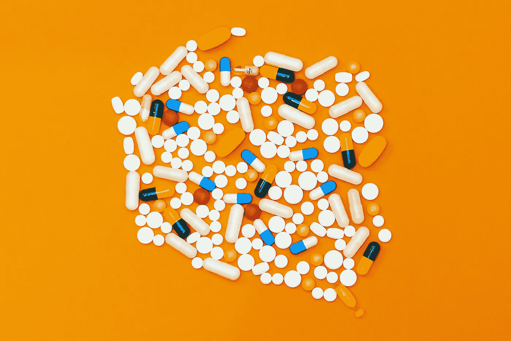

micha Parzuchowski 在 [Unsplash](https://unsplash.com/s/photos/assorted-medication?utm_source=unsplash&utm_medium=referral&utm_content=creditCopyText) 上拍摄的照片

# **执行摘要(又名 TL；博士)**

*   新加坡报道的大多数非法保健品都是为了增强性功能和减肥。
*   大多数违禁药品都有中文标签
*   最常见的剂型设计是绿色长方形胶囊
*   最常见的 5 种掺假药物是西地那非、西布曲明、他达拉非、酚酞和利多卡因

# **背景和动机**

贩卖假药和掺假药的有利可图的性质导致了非法保健品全球贸易的扩散。这也是由消费者对这些产品的需求增加以及购买这些产品的低成本所驱动的。明显的缺点是，食用这些来源可疑的保健品可能会给消费者带来严重的健康问题。

这些产品通常含有未声明的成分来增强效果，以吸引消费者服用。这些成分可能是有害的(尤其是在没有医疗监督的情况下服用)，过量或不足剂量，被禁止或尚未被评估用于人类的安全使用。

为了更好地了解新加坡的非法保健品贸易，我决定对 HSA 健康科学局公布的非法保健品清单进行分析。

这一分析是由我与第一批企业家伙伴(Shrey Chaturvedi)的一次谈话引发的，当时我们正在讨论东南亚假药市场中需要解决的潜在问题。我决定这是一个很好的机会来做这个与我喜欢的东西相关的迷你项目——药物和数据的交叉。

# **第一部分—数据来源**

HSA 报告的非法保健品数据库在第[页](https://oscar.hsa.gov.sg/Publication/ahpdm/faces/AHPPublication.jspx?_afrLoop=100474823794971100&_afrWindowMode=0&_adf.ctrl-state=i5k6sidwp_4)可供公众查看。虽然这份清单并不详尽，但它仍然是新加坡所有非法保健品交易的合理样本。

该数据集在网站上以数据表的形式呈现，并于 2020 年 8 月 15 日被访问和检索。

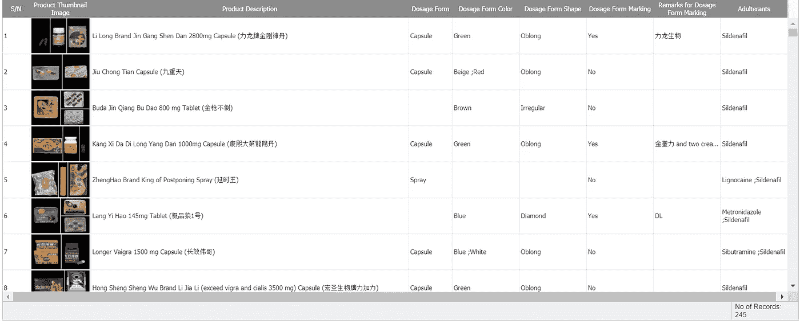

*HSA 非法保健品数据库搜索结果截图*

可用的功能如下:

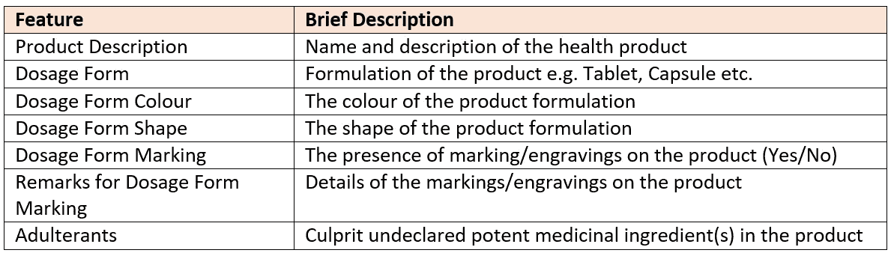

*数据集特征(列)和各自描述表*

网站上的数据库内容被手动转录并保存为 Excel ( *)。xlsx* )文件的方法。然后将其导入 Jupyter Notebook，以便使用 Python 3 进行进一步分析。

我在国外度假时遇到过街头假药小贩，我最初的假设是这些假药主要是生活用品。特别是，最畅销的可能是针对成年男性的壮阳药。

# **第二部分—数据清理**

在撰写本文时，HSA 非法保健品数据库中记录了总共 245 种报告的非法保健品。

在“剂型”栏中具有空值*的所有 54 行都与“产品说明”栏中显示的片剂相关联。因此，这些*空值*被填入“片剂”作为剂型条目，从而创建了以前未使用的“片剂”新剂型类别。最终数据集中每一列的 *null* 值的计数如下所示:*

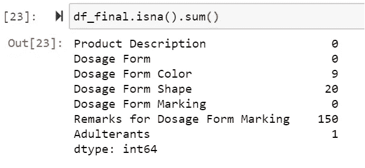

每列的空值的频率计数

形状和颜色的*零*值主要是由于包装成小瓶和瓶子的产品，与通常的口服片剂或胶囊相比，它们更难表征。

鉴于“剂型标记备注”一栏中存在大量缺失数据(即 61.2 *%* *NA* )，因此本次分析中省略了对产品标记的审查。

有 13 种产品的剂型注明为“药丸”，这是一个不具参考价值的分类。手动审查产品图像，以确定其确切的剂型(即片剂或胶囊)。

# **第三部分——探索性数据分析的见解**

现在是分析的主要部分，即观察到的模式和发现。

# **(一)产品描述**

产品说明给出了产品的名称，以及一些有用的(尽管是简短的)关于消费者预期用途的信息。鉴于我们在这里处理的是文本字符串，使用单词云生成器(带有 Python WordCloud 库)来说明这些描述中的文本频率是一个好主意。

在删除无信息的停用词(例如，“品牌”、“胶囊”、“胶囊”(中文意思是胶囊)“药片”)后，产生了以下词云:

*产品描述全字云*

很明显，这些单词大多是汉字的罗马化(即*汉语拼音*)。这表明许多产品主要以中文标注，解读这种全词云并不是理解这些产品本质的最佳方式。

鉴于单词 cloud 暗示了汉字的高出现率，那么看看在其产品描述中包含汉字的非法保健品的比例将是有趣的。

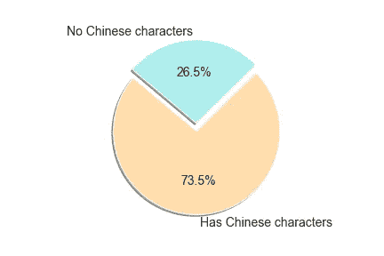

产品说明中含有汉字的非法保健品比例

可以看出，违禁药品清单以中文标注的产品为主(73.5%)。这可能意味着要么中国人是非法毒贩的主要目标群体，要么这些产品主要来自中国。

The next step is to generate a Chinese character word cloud. This was done by first using regular expression (*regex*) to extract all Chinese characters from the ‘Product Description’ column, and using Python’s *jieba* library to tokenize these Chinese characters. With certain Chinese stop words removed (e.g. 胶囊), the WordCloud library was used once again to generate a word cloud:

产品描述中包含汉字的产品**词云**

有了这个中文词云，就更容易理解非法保健品的本质了。

*   **Finding 1**
    The word America (‘美国’) occurs frequently, implying that dealers tend to market their counterfeit drugs as products of USA, likely to falsely augment its appeal, quality and legitimacy towards consumers. This assertion was confirmed when I looked at these specific products containing ‘美国’, and found these products to be branded with phrases like ‘America Warrior’ and ‘America Viagra’. Another country observed in the word cloud is Germany (‘德国’), meaning that drugs produced in Germany are also associated with strong branding.
*   **Finding 2**
    The two most common claims made by these health products relate to sexual performance and male genitalia (‘牛鞭’, ‘升阳’, ‘延时’, ‘魔根’), and weight loss (‘减肥’, ‘瘦身’). This is further supported by other frequently occurring nuanced words associated with sexual vitality (‘金聖力’, ‘战神’, ‘动力’, ‘天雄’, ‘神威’).
*   **Finding 3**
    There are several common words associated with dragon (‘龙牌’, ‘天龙’), which is not out of the ordinary since the dragon traditionally symbolizes potent and auspicious powers in Chinese culture.
*   **Finding 4**
    While drug names are not commonly mentioned in the Chinese descriptions, there is one obvious branded name that appeared frequently, which is Viagra (‘威哥’, ‘伟哥’).

分析不含任何中文字符的其他产品也很重要，这些产品占该非法药物数据集的 26.5%。删除英语和马来语停用词(如 Kapsul、Obat)后，生成的词云如下所示:

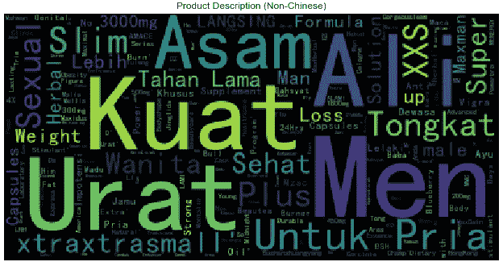

产品描述中无汉字的产品**的词云**

与之前看到的贴有中文标签的产品类似，这些产品似乎也是为男性减肥和增强性功能而销售的。这可以从英语词汇(如“男性”、“性”、“苗条”、“体重”)以及一些暗示性的马来语词汇(如“Kuat”(强壮)、“Untuk Pria”(男性)、“Tongkat Ali”(一种用于治疗勃起功能障碍的草药)中观察到。所有这些见解都支持早期的假设，即性增强药物是正在交易的主要假冒产品。

*   **发现 5** 单词 cloud exploration 的另一个发现是马来语短语‘Asam Urat’的出现，它在英语中的意思是*尿酸*。血液中高水平的尿酸是导致痛风的原因，马来语中尿酸的频繁出现表明市场上也有许多用于痛风治疗的假冒产品。

# **(ii)** **剂型**

这些非法保健品大多是口服固体剂型，即胶囊和片剂。

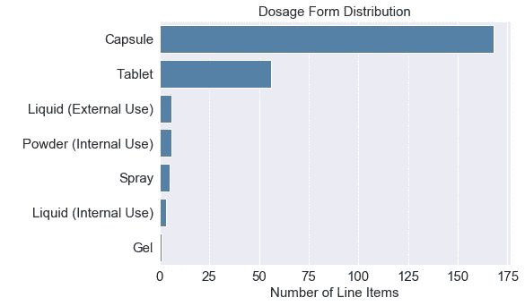

剂型的分发

这并不奇怪，因为口服制剂具有许多优点，例如:

*   易于制造、包装和运输
*   良好的化学和物理稳定性
*   生产成本相对较低
*   为消费者提供简单准确的剂量

# **(iii)** **剂型颜色和形状**

由于白色通常是口服药物最常见的颜色，所以看到**白色**也是这些非法保健品的主要颜色也就不足为奇了。接下来最常见的三种颜色恰好是红、蓝、绿的标准原色。

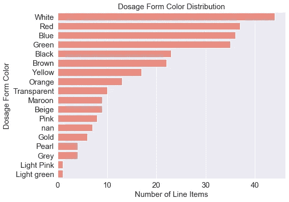

*剂型颜色分布*

就剂型形状而言，主要形状为**长方形**。

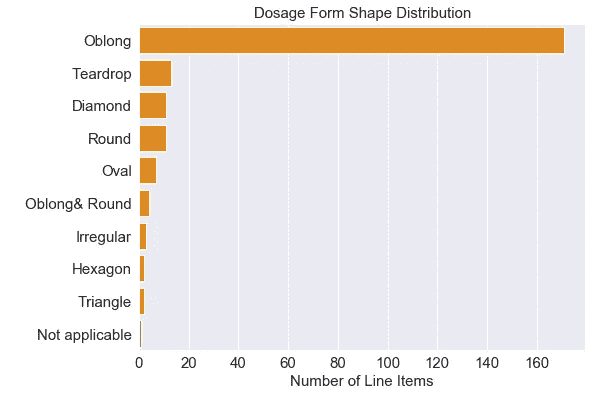

*剂型形状的分布*

单独看上面的图表，你可能会认为最常见的设计是白色长方形胶囊。然而，我们应该从剂型、颜色和形状的组合顺序来看待它。由此可见，最常见的剂型设计实际上是一种绿色椭圆形胶囊，而不是白色胶囊。

十大最常见的剂型设计

下面是一个绿色长方形胶囊的例子:

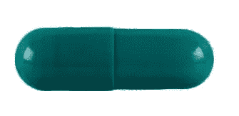

# (四)剂型标记

可以看出，这些非法保健品绝大多数(60.6%)上面没有任何标识。这使得确定这些药物的具体身份以及区分假冒产品和真产品变得更加困难。

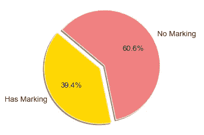

*带有和不带有标记/雕刻的产品分配*

# **(v)** **掺杂物**

掺假物是保健品中未被发现和未经批准的强效药物成分，这些掺假物是这些假冒产品被视为非法的主要原因。

由于意外误用、过度使用或与其他药物、潜在健康状况或补充剂中的其他成分相互作用，这些掺假物会导致**严重的不良健康影响**。

下表列出了这些非法产品中最常见的 10 种掺杂物。

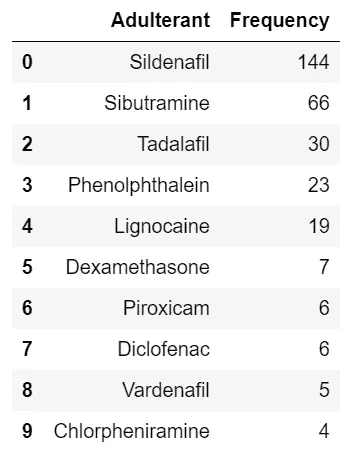

非法保健品中发现的 10 大掺假物

现在是时候介绍一些药理学知识了，描述一下上表中的五大掺假者。

***①西地那非
T5 是什么？***西地那非是非法保健品中最常见的掺杂物。西地那非是伟哥(商品名)中发现的活性化合物的通用名，用于治疗勃起功能障碍(ed)。

**趣闻:**西地那非最初是为治疗肺动脉高压和心绞痛(心脏病引起的胸痛)而开发的。然而，在临床试验中，研究人员发现该药物在诱导勃起方面比治疗心绞痛更有效。

**副作用:**虽然大多数副作用通常是轻微的(如脸红、头痛)，但有可能出现更严重的反应，如**视力丧失、阴茎异常勃起(持续而痛苦的勃起)和严重低血压**。当消费这些假冒产品时，这些风险肯定会被放大，其中所含的剂量监管不力。

***(2)*******西布曲明* 什么东西？**西布曲明是一种用于减肥的化合物。这支持了之前收集的观点，即减肥是非法保健品的常见目标。西布曲明通过增加产热并使使用者在饭后有饱腹感来发挥作用，它主要在肥胖患者群体中进行研究。*

***副作用:**已知它与心血管事件**风险增加**有关，如**心脏病发作、中风和高血压。***

****(3)*******他达拉非* 是什么？**与西地那非(即磷酸二酯酶-5 酶抑制剂)属于同一药物类别，他达拉非也用于治疗 ed，并与西地那非具有许多相似的特征。它的品牌名是 Cialis。**

*****(4)酚酞* 是什么？**酚酞是一种泻药，常见于掺假减肥产品中。多种含有酚酞和西布曲明的膳食补充剂[此前已被美国美国食品药品监督管理局(FDA)](https://pubmed.ncbi.nlm.nih.gov/30646238/) 召回，原因是它们未经批准包含在补充剂中。**

****副作用:**接触酚酞与[致癌性](https://pubmed.ncbi.nlm.nih.gov/8895745/)(即能致癌)有关。**

*****(5)利多卡因* 是什么？**利多卡因是一种麻醉剂，这意味着当局部应用于皮肤或粘液表面时，它是一种用于麻醉特定身体区域组织的药物。它通常以局部产品(如喷雾剂、凝胶剂)的形式出现，由于其麻木作用而用于控制早泄。**

****副作用:**局部使用一般有轻微的副作用，如瘙痒/发红，但非法产品的潜在劣质可能会导致意想不到的过敏/过敏皮肤反应。**

**从这里，我决定更仔细地观察这些含利多卡因的产品，以证实我的假设，即所有含利多卡因的补充剂都是局部剂型。**

**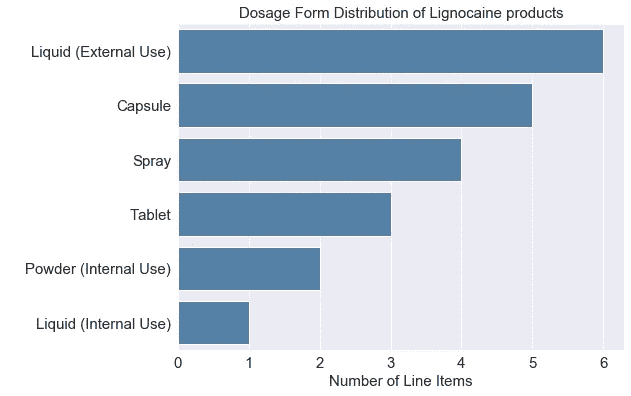**

**含利多卡因产品的剂型分布**

**尽管最常见的剂型确实是用于局部应用的东西(外用液体)，但我惊讶地发现还有相当多的口服胶囊和片剂产品也含有利多卡因，特别是因为利多卡因不是用于口服的。这当然是值得深入研究的事情。**

# ****接下来的步骤****

**该分析对新加坡非法保健品贸易中观察到的趋势和模式提供了一些见解，对 HSA 等当局可能有价值。例如，通过了解常见的营销主张和非法经销商针对的主要人群，可以开展专门策划的教育活动来提高认识，以便公众了解如何更好地保护自己。**

**能够访问更多数据(如购买地、生产国、报告日期、商贩/消费者概况等)。)也将有助于使这种分析在处理这种非法产品的兜售方面更有见地和有用。**

# **收拾东西**

**事实上，区分真货和假货是非常具有挑战性的。因此，友好的药剂师会给你一些建议:一定要从注册的医疗机构、诊所和药店购买药物和保健品。如果您确实遇到有人兜售此类非法产品，您可以通过电话(6866 3485)或电子邮件((hsa_is@hsa.gov.sg)向 HSA 执法部门举报**

**期待听到大家对以上分析的反馈。如果您想要一份代码副本，或者希望讨论更多关于该审查的内容，请随时在 [LinkedIn](https://www.linkedin.com/in/kennethleungty/) 上给我留言！**

***特别感谢* [*辜平雄*](https://sg.linkedin.com/in/koopingshung) *分享他对分析的反馈***

# **在你走之前**

**欢迎您加入**和我一起踏上数据科学学习之旅！**点击此[媒体](https://kennethleungty.medium.com/)页面，查看我的 [GitHub](https://github.com/kennethleungty) ，了解更多精彩的数据科学内容。同时，享受探索药物和数据科学的交集吧！**

# ****参考书目****

*   **药物评估和研究中心。(未注明)。假药。检索于 2020 年 8 月 15 日，来自[https://www . FDA . gov/drugs/buying-use-medicine-safety/fake-medicine](https://www.fda.gov/drugs/buying-using-medicine-safely/counterfeit-medicine)**
*   **如何识别掺假、假冒、不合格的保健品，你该怎么做。(未注明)。检索于 2020 年 8 月 15 日，来自[https://www . HSA . gov . SG/consumer-safety/articles/identify-掺假-假冒-不合格-健康产品](https://www.hsa.gov.sg/consumer-safety/articles/identify-adulterated-counterfeit-substandard-health-products)**
*   **新加坡发现非法保健品。(未注明)。检索于 2020 年 8 月 15 日，来自[https://www . HSA . gov . SG/在新加坡发现的非法健康产品](https://www.hsa.gov.sg/illegal-health-products-found-in-singapore)**
*   **掺假、假冒伪劣保健品的危害。(未注明)。检索于 2020 年 8 月 15 日，来自[https://www . HSA . gov . SG/consumer-safety/articles/launch-health-products](https://www.hsa.gov.sg/consumer-safety/articles/illegal-health-products)**
*   **用中文创建 wordcloud。(未注明)。2020 年 8 月 15 日检索，来自[https://a mueller . github . io/word _ cloud/auto _ examples/word cloud _ cn . html](https://amueller.github.io/word_cloud/auto_examples/wordcloud_cn.html)**