# 探索图像处理技术— OpenCV

> 原文：<https://towardsdatascience.com/exploring-image-processing-techniques-opencv-4860006a243?source=collection_archive---------2----------------------->

## 一些图像处理功能概述—利用 OpenCV-4.2.0 和 Python

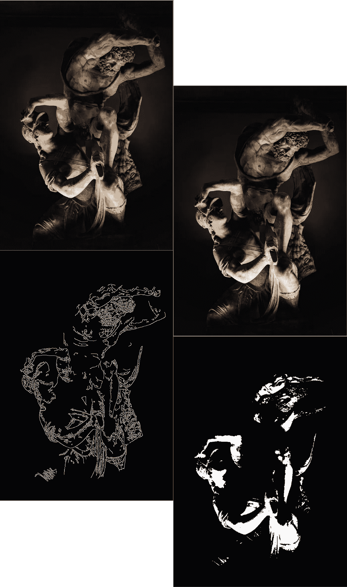

由 [Matteo Vistocco](https://unsplash.com/@mrsunflower94?utm_source=unsplash&utm_medium=referral&utm_content=creditCopyText) 在 [Unsplash](https://unsplash.com/s/photos/roman-sculptures?utm_source=unsplash&utm_medium=referral&utm_content=creditCopyText) 上拍摄的原始照片

我图像处理是属于计算机视觉的知识领域。机器学习的前提首先由计算机视觉理论奠定，应用一整套技术来处理和分析图像数据，以提取计算机和机器可能用于广泛应用的有价值的信息，例如:

*   **拼接**:将重叠的照片变成无缝的全景图
*   **变形**:通过平滑过渡改变或合并不同的图片来创建新的图片
*   **3D 建模**:将 2D 快照转换成 3D 合成
*   **人脸检测**:识别数字图像中的人脸
*   **视觉认证**:坐在网络摄像头前，自动将家人登录到电脑或手机上

> Vision 的预期目的是利用可靠的模型，从最简单和最基本的构建块中重建复杂、丰富多彩和生动的三维世界，这些模型有助于以可评估的方式解释图像。

预处理或图像处理是计算机视觉中的前一步，目标是将图像转换成适合进一步分析的形式。曝光校正、色彩平衡、图像降噪或提高图像锐度等操作非常重要，并且在大多数计算机视觉应用(如计算摄影甚至人脸识别)中需要非常小心才能获得可接受的结果。

在本文中，我打算利用一个非常流行的计算机视觉库 OpenCV 来介绍一些常用的图像处理技术。我将尝试简要描述每个操作是如何工作的，并更注重更实际地处理这个主题，为您提供您需要的所有代码，以便您对这些材料有亲身体验。

下面给出的图像将用于我们的实验。

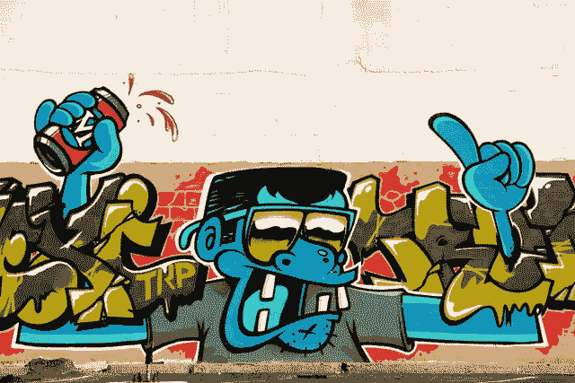

照片由[凯尔西·加森](https://unsplash.com/@kelcy?utm_source=unsplash&utm_medium=referral&utm_content=creditCopyText)在 [Unsplash](https://unsplash.com/s/photos/cartoon?utm_source=unsplash&utm_medium=referral&utm_content=creditCopyText) 上拍摄

# 概述:

1.  计算机视觉中的图像
2.  颜色:RGB 表示
3.  像素转换
4.  直方图均衡
5.  回旋

我在 Google Colab 笔记本中包含了本教程的所有代码，因此您可以继续学习。

 [## 谷歌联合实验室

### 编辑描述

colab.research.google.com](https://colab.research.google.com/drive/1c9SsagyzeFWgWzN9O-dpj5m3Ds4qOT2F?authuser=1) 

> **注意**:在开始之前，您应该在 windows 中配置一个 Anaconda 环境来使用 OpenCV。对于那些可能没有所需设置的人，我建议你看看我的文章，关于如何[在 windows 10](/install-and-configure-opencv-4-2-0-in-windows-10-python-7a7386ae024) 中用 python 安装和配置 OpenCV-4.2.0，否则这个教程的代码将无法使用。

# 计算机视觉中的图像

计算机视觉中的图像被定义为代表每个图像*像素中离散颜色或强度值的数字矩阵。*每幅图像都被视为可以以多种方式显示的输入数据，无论是像素值数组还是表示像素强度分布的多维图。图像可以用三个通道(蓝色、绿色和红色)的彩色分层、像素值从 0(黑色)到 255(白色)的灰度以及仅描绘黑色或白色值(0 或 1)的二进制渲染。

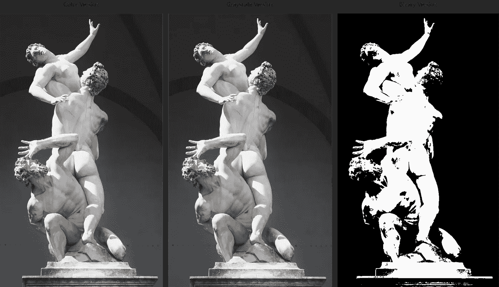

原始照片由 [Dim 7](https://unsplash.com/@dim7?utm_source=unsplash&utm_medium=referral&utm_content=creditCopyText) 在 [Unsplash](https://unsplash.com/s/photos/sculpture?utm_source=unsplash&utm_medium=referral&utm_content=creditCopyText) 上拍摄

图像基本上是以不同强度显示的数字块:

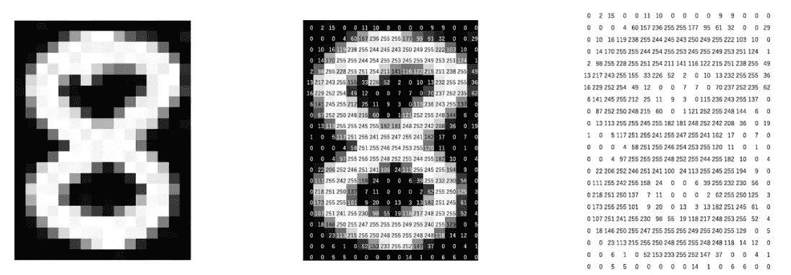

像素化图像，致谢:[从图像数据中提取特征的技术](http://www.analyticsvidhya.com/blog/2019/08/3-techniques-extract-features-from-image-data-machine-learning-python/)

# 颜色:RGB 表示

颜色空间由三个不同的通道红、绿、蓝表示。每个通道都源于人类视觉的所谓*三色本性*，因为我们有三个独立的感光体，每个感光体都选择性地对色谱的不同部分做出反应。在每通道 8 位的 RGB 系统中，三原色相加产生 16.777.216 种不同的颜色。

在 OpenCV 中，图像被转换成多维数组，这大大简化了它们的操作。例如，灰度图像被解释为像素从 0 到 255 变化的 2D 阵列。

原始图像的灰度版本

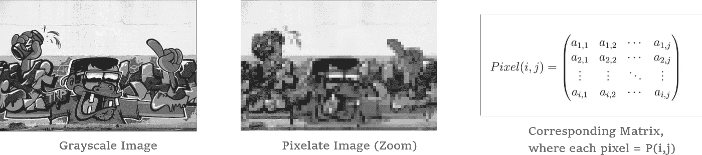

彩色图像稍微复杂一些，因为我们处理的是 3D 阵列，其中每个像素都在三个不同的颜色通道中呈现。将原始图像分割成蓝色、绿色和红色分量，以掌握颜色分层结构是如何工作的，这将是很有趣的。我们将使用两个基本的 OpenCV 方法来实现:

*   `split(src, dests)`:分割多维数组。
*   `mixChannels(srcs, dest, from_to)`:合并不同的频道。

如果我们打印结果通道的形状，我们会看到尺寸已经缩小到 1。每个通道都包含图像的 RGB 分量，但它是以一维灰度格式渲染的。

将图像拆分到其通道中

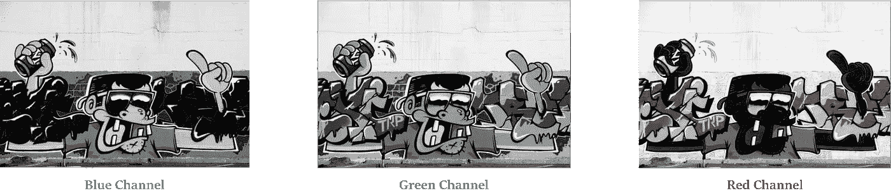

将每个通道放大到 3D 阵列将呈现所需的颜色。对于这种用法，`mixChannels()`派上了用场。

混合各个通道并显示蓝色、绿色和红色版本

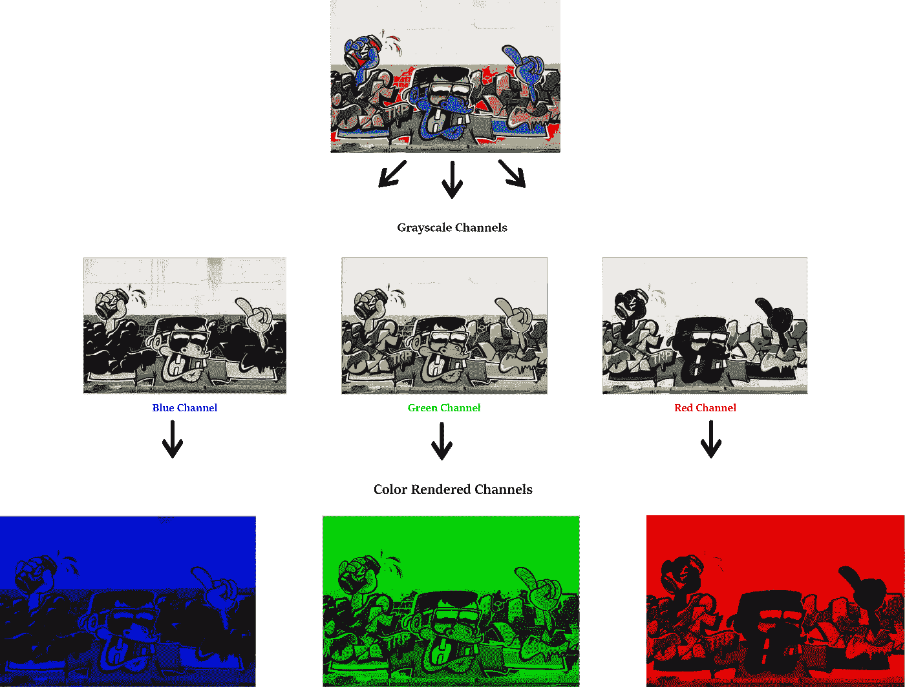

# 像素转换

应用于图像的最简单类型的操作是那些输入是像素并且对应的输出也是像素的操作。点运算符，也称为点运算符，被建模为获取一个或多个输入图像并产生输出图像的函数。在连续域中，它们可以表示为:

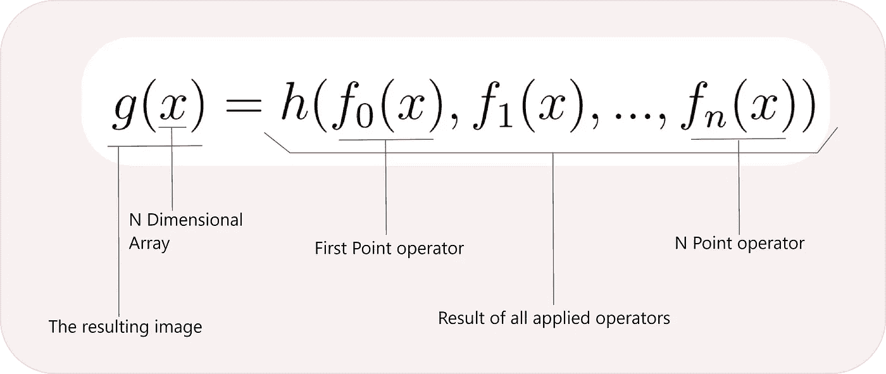

## 对比度调整

例如，我们可以应用局部点运算符来调整图像的对比度和亮度。将单个图像像素乘以一个常数并添加一个偏差，将使图像或多或少变亮，对比度或多或少变得明显。

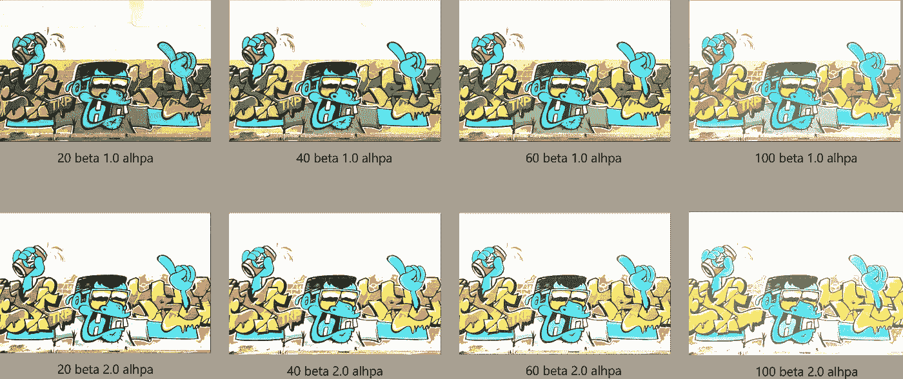

对比度调整示例

## 直方图均衡

绘制像素强度分布，我们可以看到一组图像的亮度值。因此，我们可以识别和纠正图像中最暗的区域，使其看起来更有吸引力。但真正的目标是找到一种自动化的过程，将光线均匀地分布在整个图像上，而不必逐个区域、逐个像素地检查。更明确地说，我们应用一个变换函数来将最频繁的亮度值均匀地分布在整个图像上。

首先，我们需要绘制一个直方图，显示颜色通道的强度分布:

直方图分析图

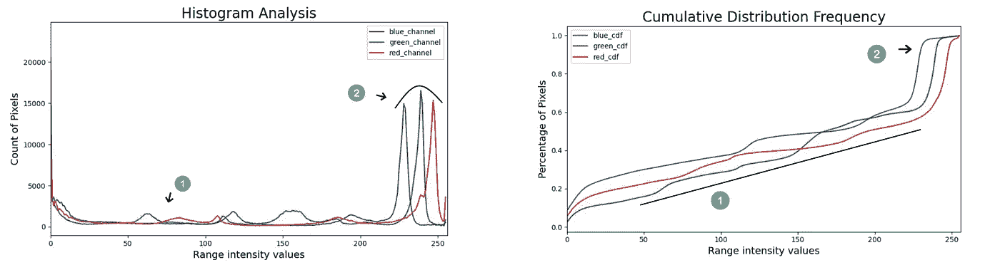

我们可以在直方图中区分两个区域:

*   **区域 1** :连续且相当相等的值，没有突变。我们在 CDF 图中观察到这些值的线性增长。
*   **区域 2** :图片达到高亮度值，这意味着范围值[230，250]被超过 62%的像素广泛表示。

直方图揭示了一个有趣的点:我们的图像的像素值被限制在某个特定的强度范围内(在 230 和 255 之间)，因此图像在特定的中心区域更亮，而忽略了其他区域。

应用均衡公式有助于将受限区域拉伸到任一直方图边界。这些值被扩展到最大值，以改善图像闪电。

应用于原始图像的直方图均衡化公式

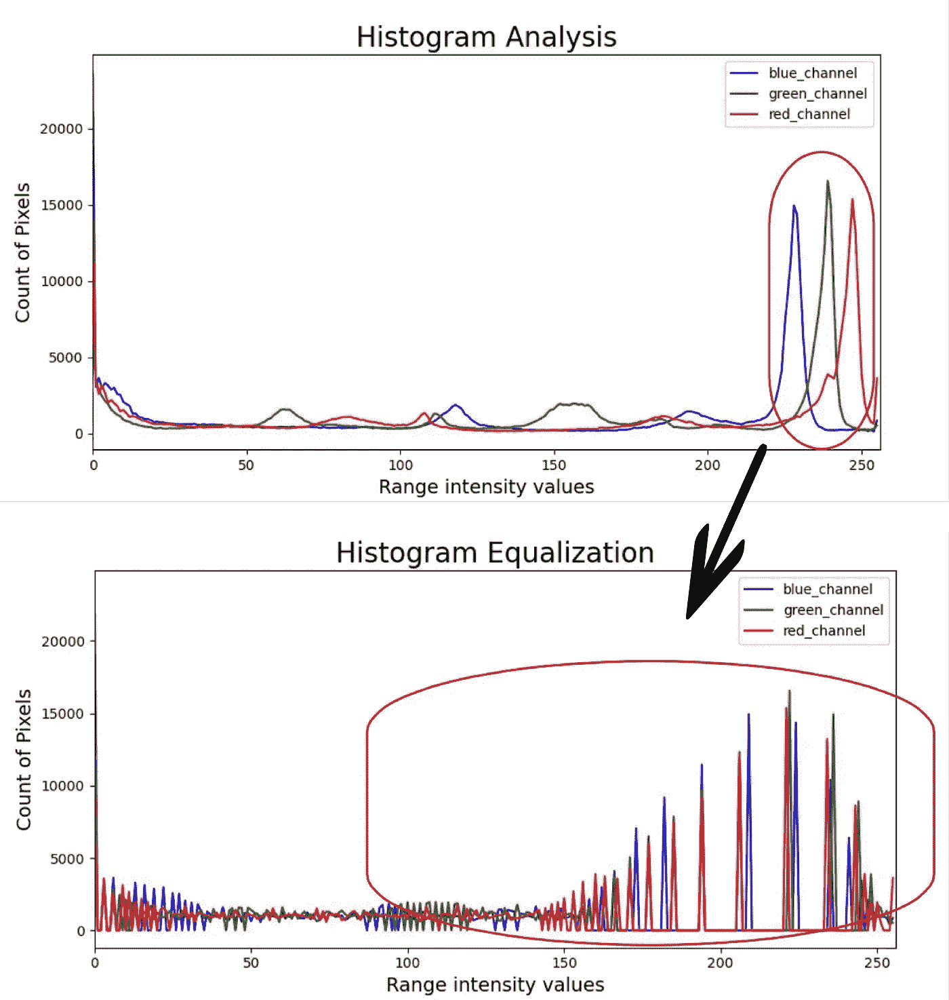

我们还可以查看新均衡图像的累积分布频率:我们观察到强度值的线性趋势增长，这意味着像素强度现在在图像中均匀分布，并且集中高强度 pic 的区域更有可能消失。

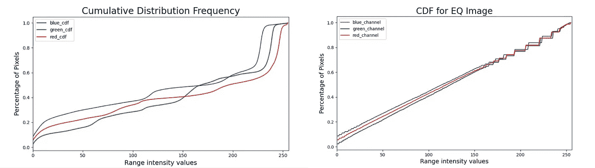

最后，我们可以在均衡的输出图像中看到，我们已经启发或揭示了在原始图像中暗淡的新区域。

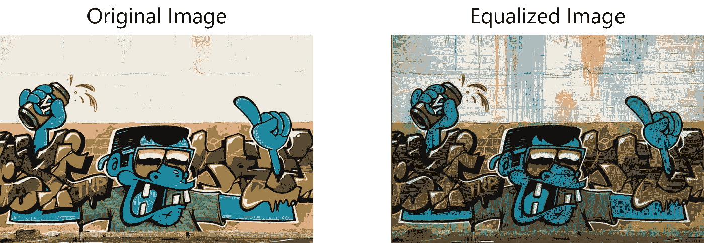

# 回旋

卷积是邻域操作符的集合，其操纵局部图像区域以产生预期的变换。从数学上来说，卷积两个函数会产生第三个函数，表示一个函数的形状如何被另一个函数修改。在图像处理中，每个卷积都是用特定变换的特定核来实现的。

卷积的例子，信用:[丹尼尔](https://giphy.com/explore/daniel)上[吉菲](https://giphy.com/gifs/blog-daniel-keypoints-i4NjAwytgIRDW)

卷积例子有:

*   **图像过滤**应用 2D 卷积，采用各种低通和高通滤波器，帮助去除噪声、模糊图像等。
*   **图像梯度**使用高斯滤波器和特殊内核进行图像边缘和轮廓检测。这种核的例子是拉普拉斯导数、索贝尔导数、沙尔导数等。

## 图像渐变

图像梯度技术提供了关于图像组成的非常有用的信息。梯度图像的每个像素测量原始图像中相同像素在给定方向上的强度变化。有了像素信息，我们观察到具有大梯度值的像素成为可能的边缘。因此，一些众所周知的边缘检测算法，如 Canny 边缘检测器，广泛使用梯度图像来提取轮廓。

## 拉普拉斯衍生物

图像的拉普拉斯算子突出了快速亮度变化的区域，它被广泛用作边缘检测的前一步。操作员通常将单个灰度图像作为输入，并生成另一个灰度图像作为输出。

拉普拉斯导数适用于 2D 函数，在我们的上下文中，我们微分的函数表示输入图像的灰度版本的像素强度值。灰度图像可以被认为是提供像素强度输出的两个输入(x 代表宽度，y 代表高度)的函数。

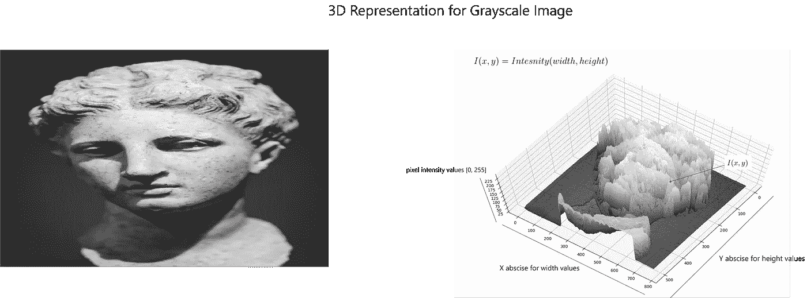

灰度图像的 3D 绘图，原始照片由[米卡](https://unsplash.com/@mikafinland?utm_source=unsplash&utm_medium=referral&utm_content=creditCopyText)在 [Unsplash](https://unsplash.com/s/photos/head-sculpture?utm_source=unsplash&utm_medium=referral&utm_content=creditCopyText) 上拍摄

拉普拉斯导数公式也可以表示为具有特定值的 3×3 核:

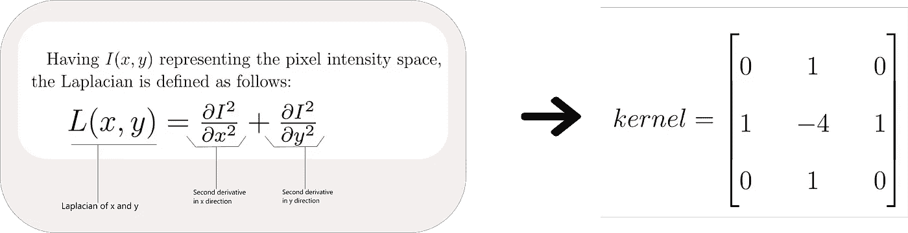

拉普拉斯解析公式

应用于原始图像的拉普拉斯滤波器示例:

拉普拉斯变换

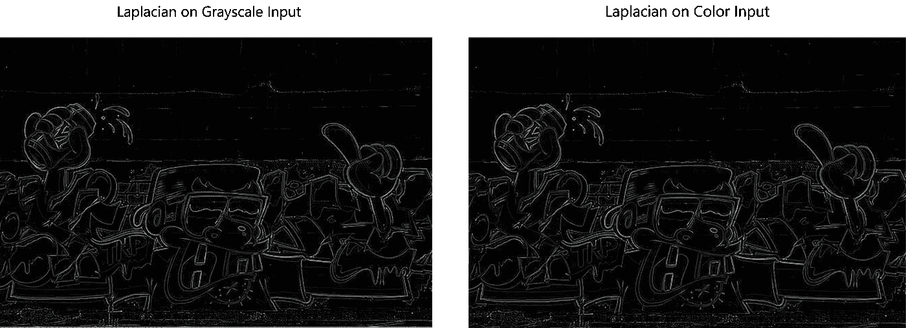

灰度和彩色图像输入的拉普拉斯滤波结果

# 总结想法

在本教程中，我们遇到了一些有趣的图像处理技术，解释了一些背后的理论，并提供了利用领先的计算机视觉库 OpenCV 的实践经验。

OpenCV 有大量的在线 T4 文档，在那里你可以学到更多的计算机视觉技术，比如特征检测和描述、计算摄影、物体检测等等。大部分内容以很酷的教程的形式呈现，鼓励你快速开始编码，并以一种有指导意义的方式体验这些材料。

我还建议你阅读 [*计算机视觉应用与算法*](https://www.springer.com/gp/book/9781848829343) *，*这是一本全面的书籍，它从科学和数学的角度很大程度上解释了所有关于图像处理和计算机视觉的理论。

另一篇值得一读的有趣文章是*什么样的图像处理技术实际应用于 ML 行业*在**Neptune . ai**by**[**Aigiomawu Ehiaghe**](https://www.linkedin.com/in/ehiaig/)。它说明了如何利用图像处理技术来增强现实世界行业中的计算机视觉模型。**

** [## ML 行业实际使用的图像处理技术有哪些？- neptune.ai

### 处理可用于提高图像质量，或帮助您从中提取有用的信息。这是…

海王星. ai](https://neptune.ai/blog/what-image-processing-techniques-are-actually-used-in-the-ml-industry) 

如果你喜欢这篇文章，请随时与你的朋友分享。可以看看 Github 里的项目。

 [## aymanehachham/图像处理-OpenCV

### 图像处理操作利用 OpenCV-4 . 2 . 0-aymanehachham/Image-Processing-OpenCV

github.com](https://github.com/aymanehachcham/Image-Processing-OpenCV)**