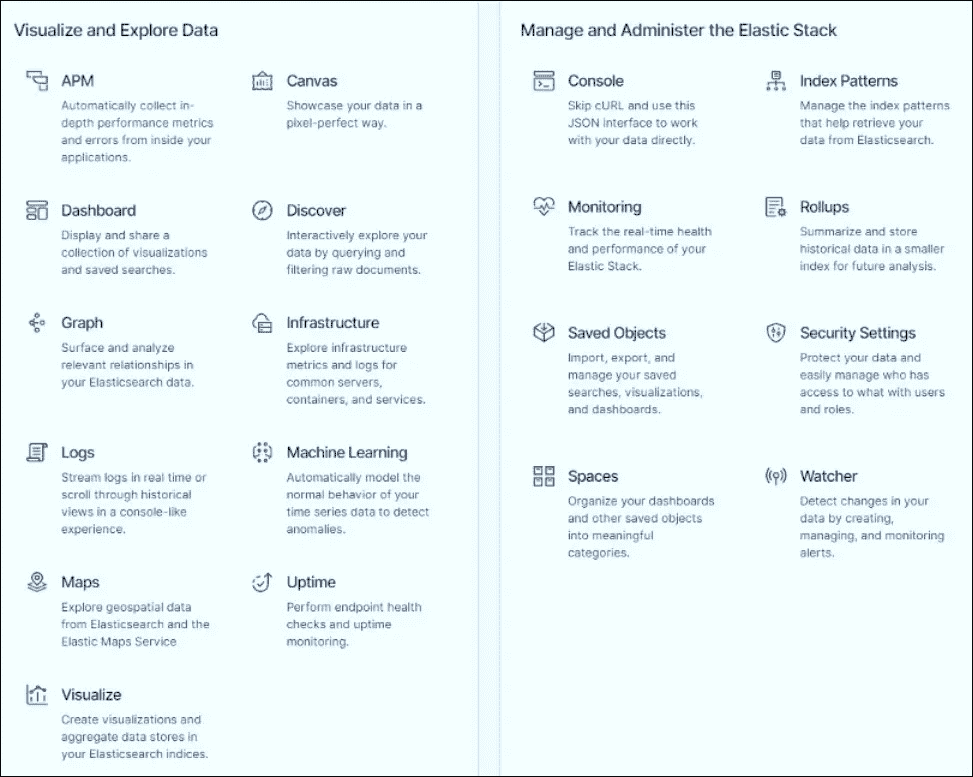

# 探索基巴纳

> 原文：<https://towardsdatascience.com/exploring-kibana-ae8a770e0303?source=collection_archive---------20----------------------->

## 可视化和分析 Elasticsearch 索引日志文件的通用工具

这些年来，基巴纳越来越受欢迎。大多数公司依靠 Kibana 强大的可视化和分析功能从每分钟生成的大量日志结果中进行推断。web 服务器生成日志包含有关系统使用、请求时间、请求位置和搜索字符串的重要数据。Kibana 使得实时分析这些数据变得轻而易举。

Kibana 是一个开源的、基于网络的数据可视化和分析工具。它可视化了由 Elasticsearch 框架索引的搜索输出。它是由 Elasticsearch 和 Logstash 以及 Kibana 组成的 ELK 堆栈的一个组成部分。Elasticsearch 是一个开源搜索引擎，用于实时存储、搜索和分析大量数据。它是几个搜索框架的核心。Logstash 用于收集和监控来自不同来源的日志。它充当了 Elasticsearch 的数据管道。这三个工具一起提供了一个伟大的开源平台来监视、可视化和分析日志数据。

> 本文旨在回答一些关于 Kibana 的常见问题。首先，有没有想过这个独特的名字“基巴纳”是如何产生的？基巴纳的创造者拉什德·卡汉想用外语为他的创新取一个朗朗上口的名字。他想选择一个与该应用程序功能相近的名称，即可视化日志数据。他认为最接近的是“木屋”，谷歌在斯瓦希里语中将其翻译为“基巴纳”。

# 为什么是基巴纳？

**开源且易于设置** : Kibana 的 USP 在于它是开源的且易于设置/使用。每个人都可以轻松设置和访问仪表板和报告。您只需要将您的 web 浏览器指向 Kibana 设置为默认端口 5601 的机器。它也可以托管在其他端口上。

**强大的可视化** : Kibana 提供了大量的可视化选项，如图表、直方图、条形图、热图、饼图和区域图，以快速分析数据。Kibana 的数据可视化能力不仅仅局限于数字。它还可以分析不同的数据类型，如文本和地理空间数据。

交互式仪表板:Kibana 的仪表板特性使报告和演示变得非常简单和吸引人。可视化可以根据添加的过滤器进行定制，从而使仪表板具有交互性。对数据的任何更改都会自动反映在仪表板中。

**报告:**使用 Kibana dashboard 可以生成详细而有见地的报告。该报告可以下载并以不同的格式使用，如 PDF 和 DOC。

# 基巴纳的积木

Kibana 的功能分为两大类:

**可视化和探索数据** —在这里您可以找到各种工具来探索、分析和可视化数据中的模式。您也可以创建仪表板和演示文稿。你也可以为分析后的数据建立机器学习模型。Canvas 是 Kibana 中另一个很棒的可视化和表示工具。它可用于可视化来自 Elasticsearch 的实时数据。Data Visualizer 是基本 Kibana 许可的一部分，它为生成的最大 100 MB 的日志提供异常检测功能。这有助于了解更多的数据，并以自动化的方式发现异常。

**管理弹性栈** —在这里可以配置安全设置，实时监控和跟踪弹性栈，组织工作空间。通过控制台，用户可以向 Elasticsearch 发送请求，并查看他们的请求历史。您可以使用索引模式 UI 创建新的索引模式和管理现有的模式。基于索引模式，将从 Elasticsearch 检索数据。

基巴纳积木

在数据操作和导出数据方面，Kibana 几乎没有限制。它不能聚合包含嵌套对象的字段。从保存的仪表板或报告中导出数据时存在约束。只能导出屏幕上当前可见的数据。

**总体来说，Kibana 是一个用户友好的工具，可以快速可视化和分析巨大的日志文件。**开源和配置为与 Elasticsearch 合作增加了它的受欢迎程度。Kibana 正在不断升级，并承诺未来会有更多有趣的功能。有关基巴纳的详细信息，请参考，*[*https://www.elastic.co/kibana*](https://www.elastic.co/kibana)*