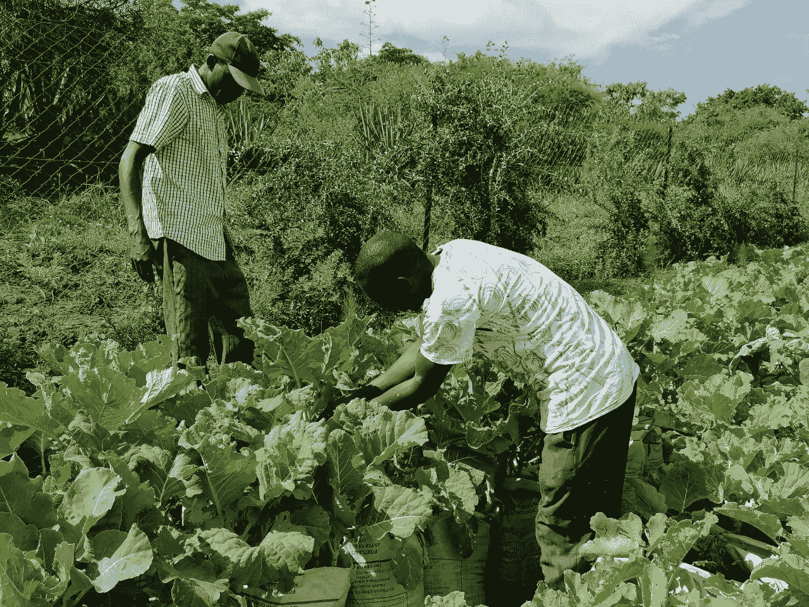
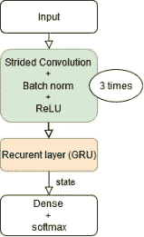
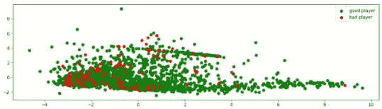
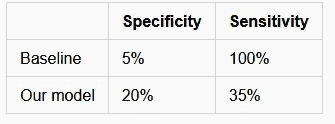
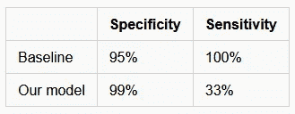

# 探索肯尼亚信用评分农民的机器学习解决方案

> 原文：<https://towardsdatascience.com/exploring-machine-learning-solutions-for-credit-scoring-farmers-in-kenya-8fb653db4b08?source=collection_archive---------16----------------------->

图片由 [SunCulture](http://www.sunculture.com/) 提供，经许可使用。

## 介绍

本文涵盖了 [SunCulture](http://www.sunculture.com/) 的一个数据科学项目，SunCulture 是一家位于肯尼亚内罗毕的太阳能初创公司，为小农户提供太阳能水泵、电视和照明。

它强调了我们在项目中探索的不同途径，哪些可行，哪些不可行，以及我们在这个过程中学到了什么。我们希望本文包含的信息能够帮助其他在非洲从事融资工作的公司从我们的经验中学习。

非洲的小规模农民通常被传统银行部门忽视，他们的融资选择非常少。但是怎么知道他们会不会还钱呢？传统的信用评分使用过去的信用记录作为主要指标，但对于许多 SunCulture 客户来说，这些信息是不可用的。

我们提议使用[物联网](https://en.wikipedia.org/wiki/Internet_of_things) (IoT)数据源的组合，包括土壤传感器和灌溉系统的水泵使用情况，这些数据已经可供该公司使用。

在 7 个月的时间里，我的任务是探索使用传感器数据进行信用评分的解决方案。这个想法是创建一个算法，根据他或她的物联网传感器数据作为输入，输出农民违约的概率。用专业术语来说，这是一个*时间序列分类*的问题。

时间序列数据一直是金融服务的主要兴趣，现在随着实时应用的兴起，零售和编程广告等其他领域正在将注意力转向时间序列数据驱动的应用。

在过去的几年中，云服务的几个主要参与者已经发布了用于处理时间序列数据的新产品。因此，理解机器学习在这个新兴领域中的作用和潜力是非常有趣的。

我们将谈论一个**失败的第一次尝试**，它引导我们**探索解决方案空间**。随着试验数量的增加，我们发现需要**组织试验**和**管理数据集。**最后，在任务结束时，我们意识到处理我们数据的一个显著特征的重要性:低违约率**。我将从介绍农民开始，因为我很幸运地认识了他们，并进行了实地考察:**

## **会见农民**

**当我联系到 SunCulture 的首席技术官和联合创始人查尔斯·尼科尔斯时，我正在网上寻找任务。**

**由于我当时恰好在肯尼亚，他们邀请我参观他们的总部，并派我去 Nanyuki 山区会见他们的一些客户(农民)。**

**此次实地考察的目的是了解农民面临的问题，并寻找技术解决方案。**

**亚历克斯·吉托帮助我了解了农业的基本知识。农场成功的五大标准是:**

*   **土壤肥力，由存在的养分来衡量**
*   **水特征**
*   **水的供应量**
*   **土地的面积**
*   **种植作物的市场价值。**

**我和一位新农民 Patrick Ngetha 聊了聊，他向我解释了他在 T2 的财务问题。市场价格和收获结果都存在很大的可变性和不确定性，例如由虫害造成的。这些收入在一年中不定期地出现几次。**

**他经营的主要成本是购买种子和支付工人工资。农民需要从公司购买高质量的种子，否则蔬菜找不到市场。**

**工人们需要在收获季节，也就是销售收入到来之前得到报酬，这进一步增加了现金流的压力。**

**他有潜力扩大自己的农场，目前农场面积约为半英亩，但他缺乏资金。**

**他试验了不同的作物，我的向导、阳光栽培农学家亚历克斯·吉陶(Alex Gitau)相信他有必要的技能将他的活动提升到一个新的水平。然而，他无法从银行获得资金。**

**实地考察并意识到该项目具有巨大的社会影响潜力是非常有意义的。所以我很有动力从我们的第一个模型开始。**

## **我们的第一个架构:TimeNet 有一个艰难的开始**

**TimeNet 是由 *P. Malhotra 等人*在论文中介绍的深度学习模型: [TimeNet:用于时间序列分类的预训练深度递归神经网络](https://arxiv.org/abs/1706.08838​)。这是一种无监督的方法，通俗地说，它将原始传感器数据转换成一个更小的汇总向量。然后，我们使用经典的机器学习方法，在我们的情况下是逻辑回归，来基于概要进行最终分类。**

**听起来很简单？嗯，我们有很多问题。**

**最主要的一点是让模型真正收敛。经常发生的是，在一次进行得相当顺利的训练中，模特突然“忘记了一切”。这在训练递归神经网络时相当频繁，被称为**梯度爆炸**。**

**为了解决这个问题，我们尝试扩展我们的计算能力，并开始在多个 GPU 实例上进行培训。在整整一个月和大约 15 次实验后，我们最终放弃了，因为这种设置无法正确地对单个贷款违约进行分类。**

**为什么 TimeNet 不起作用？这是一个太多的研究模型，没有足够的数据可供学习。**

## **探索解决方案空间**

**然后，我们继续使用深度神经网络在[时间序列分类中提出的模型:来自*王志广等人*的强大基线](https://arxiv.org/abs/1611.06455)。这是一篇更受欢迎的文章(从大约 500 次引用中可以看出)，并且附带了它所介绍的三个模型的代码。此外，训练他们的模型非常简单，这意味着收敛会很容易。**

**我们用他们的 ResNet 模型开始训练。不幸的是，第一次运行没有成功，很可能是由于我们的时间序列的长度。它们比文章中探讨的大多数都要长。**

**像 ResNet 这样的卷积模型有一个“模式大小”，称为**感受域**，这是它们可能检测到的最长模式的长度。例如，如果感受域是 24 小时，那么模型只能检测每天的模式，而不能检测每周的规律性。**

**根据我们的数据，默认 ResNet 的感受域出现了几十个小时，我们觉得这是不够的。这被证明是关键的观察。我们最终通过将感受野扩大到大约一周(使用**步长卷积**)得到了我们的第一个工作模型。**

**该模型比虚拟基线的特异性高 4 倍。**

**接下来的一段时间，从 11 月到 1 月，我们致力于尝试尽可能多的不同架构。**

**我们尝试了 14 种不同的模型。有些是最先进的，如《创意时代》中的，有些是更经典的机器学习，如 [DTW](https://en.wikipedia.org/wiki/Dynamic_time_warping) ，有些是我们自己的，如 ConvRNN。**

****

**ConvRNN 的层结构显示卷积输出直接进入 RNN 层。**

****ConvRNN** 是一种深度学习架构，由几个卷积层后跟一个递归层组成。所有图层都按顺序排列，如上图所示。这是一个端到端的模型:输入是传感器数据，最后一层的输出是默认概率。**

**卷积以时间序列作为输入，也产生时间序列输出。输出长度除以步距，例如步距为 2 将使长度减半。**

**由于存在多个连续发生的步长，我们可以实现时间序列长度的极大缩减。在某种意义上，卷积充当了智能“子采样器”。**

**如果传感器数据时间序列很长，这种尺寸的减小是很重要的。**递归神经网络**只能在**短时间序列**上有效训练，数量级为几百个点。**

**如果在原始数据上训练，递归层会发散，因此需要卷积来缩短时间维度。**

**最后，我们注意到这个模型的感受野理论上是无限的。这是循环层的优势，它能够在长范围内组合和积累信息。正如在 ResNet 模型讨论中提到的，一个大的感受域允许我们在不同的时间范围内理解农民的行为——从几天到几个季节。**

**该模型在深度学习架构中具有最佳性能。最初的想法来自查尔斯·尼科尔斯。到目前为止，我们还没有在文献中看到这种架构。**

**选择建筑的**教训是不要犹豫尝试新事物。即使有些事情以前没有做过，它仍然可以很好地工作。尽管为了简单起见，您可能仍然希望用现有的模型开始您的项目。****

## **组织实验**

**对于 14 种架构中的每一种，我们都有不同的运行和配置。在项目结束时，单独运行的总次数很容易就达到了数千次。数据科学项目的很大一部分是有效地管理它们。**

**每个实验，不管它是否带来了度量的改进，都需要被记录下来，以便我们可以用它来指导我们未来的决策。其中一些实验非常长，长达几天，因此我们保存了所有的关键信息，以避免以后必须重新运行。**

**起初，我使用了一个在线维基系统来记录实验。有一次，我们意识到我的很大一部分时间花在了记录实验上，而不是运行它们。然后我们开始使用一个名为[重量&偏差](http://www.wandb.com)的网站，这使得整个过程更有效率。**

****

**摘自《重量与偏见》的截图。在这里，我们可以看到不同模型的训练曲线绘制在同一时间线上。适用于绘图比较。**

**在这一点上还有其他问题:处理不断到来的新数据，版本化数据集，保持高数据质量。主要问题是必须管理两件事:快速做事，这需要固定的流程；探索解决方案空间，这需要灵活性。**

## **管理数据**

**我们将讨论数据管理的三个主要方面:数据版本化、数据处理和数据调试。**

**数据版本控制或 DVC 是管理数据集的一个非常有用的工具。它允许控制数据的修订，就像 git 控制代码一样。**

**每次更新都对应于一个**版本**，并保留所有先前版本的可访问记录。如果数据集更新被证明是一个错误，我们可以恢复以前的版本并取消更改。所以这是一种安全网。**

**在分布式环境中工作使得数据管理更加困难。在我们的例子中，我们同时使用了多达 5 台不同的机器，包括笔记本电脑和云实例。**

**这在机器学习中很常见，其中大部分工作是在本地机器上完成的，但训练是在强大的云实例上完成的。挑战在于同步数据。**

**我们建立了一个 Azure blob 存储，通过 DVC 将所有数据集中起来。这就像一个在线硬盘，只要你有凭证，就可以从任何地方访问。它不仅存储当前数据，还存储所有修订数据。这个 blob 存储器实际上是我们的**数据库**。**

**这允许机器通过使用推拉系统来同步和修改全局库。通常情况下，一旦工作机处理完一个数据集，*就会将其更新推送到中央存储器。然后，一台训练机器可以*从中央存储器中取出*最新数据。DVC 使这些操作变得非常容易。***

**我们使用脚本进行数据处理，因为它们比笔记本更容易重用和维护。像任何 UNIX 实用程序一样，可以从命令行直接调用脚本。它们执行“文件到文件”操作，即输入数据集和处理后的数据都写入磁盘，这简化了调试。**

**对于**数据调试**，我们意识到单元测试是不充分的。如果我们不实际绘制数据，很容易遗漏数据错误。同时，数据测试对于检查数据的基本健全性是有用的，比如异常值和格式。因此，我们决定同时使用正式测试和可视化。**

**这方面的自然工具是 Jupyter 笔记本。每个都包含一些图，如分布直方图，并显示随机选择的传感器几天的数据。这非常有用，因为许多错误都可以通过视觉检测出来。它还将显示基本的统计数据。从某种意义上说，笔记本可以作为特定资产的快速“身份证”。**

**笔记本也会包含测试。通常，我们**测试数据中的异常值和可能的问题**。如果我们期望数据有一个特定的属性，例如平均值是 0，那么我们为它编写一个测试。**

**测试的有趣之处在于它们对整个数据集进行操作，而可视化通常只能显示一些样本的详细信息。**

**最后，笔记本会自动转换成 Markdown 格式，然后保存到 Wiki 作为文档。通过使用 [Papermill](https://papermill.readthedocs.io/en/latest/) 动态执行笔记本，这一过程可以变得非常高效。**

## **处理低违约率**

**在项目的最后两个月，我们关注的是贷款违约数量的问题。在有数千个客户的测试集中，我们的违约数量只有几十个。这是一个不同于阶级失衡的问题，阶级失衡是一个低的违约*比率*，这里是一个低的总*比率* r。然而，我们有很多非违约可用。**

**深度学习需要大量高质量的数据。很有可能这些模型在默认数以千计的情况下会做得更好。深度学习大放异彩的所有例子，比如图像识别，都使用了庞大的数据集。**

**我们探索了**日复一日的训练**。该模型的想法是查看一天的数据，并输出它是属于好的还是坏的付款人。在对每一天进行预测之后，我们汇总输出结果，给出一个全局分数。**

**这项技术的主要优势在于，对于每个农民，我们都有很多天的数据。本质上，默认值的数量乘以数据集中的天数。所以我们有数千个默认值，非常适合深度学习。**

**不利的一面是，一天的数据可能包含的信息不足以对一个农民进行评分。**

**由于优秀支付者的数量很大，该模型在检测优秀支付者方面非常出色。它达到了 99%的特异性(相对于虚拟基线的 95%)和 30%的灵敏度。**

**该模型显然能够识别大多数严肃农民的日常习惯。**

**很难“凭直觉”确定谁会还钱，谁不会。**

**时间序列数据显示，一些用户只用了一次泵，但总是按时还款。类似地，一些人在很长一段时间内非常有规律地使用他们的泵，然而却违约了。**

**我们与初级数据科学家 Justin Nguyen 一起分析了主要的统计变量，如泵的平均使用量和方差。**

**我们总共考虑了 36 个特征。令人惊讶的是，这些基本特性带来的分类能力非常小，与虚拟基线相比，性能仅提高了 30%。​**

****这意味着好的付款人和坏的付款人之间的区别来自使用模式，这些模式太微妙了，无法用简单的特征工程来描述。****

****

***这里的农民是在特征空间中绘制的。我们很少观察到好的和坏的付款人之间的区别。这两个轴是 PCA 的两个第一主分量*。​**

**这项数据研究还揭示了一个有趣的模式:没有填写某些调查字段的农民更有可能违约。换句话说，缺失的信息可以改进预测模型，并且应该明确地添加到模型中。**

**我们也探索了不同的选择，比如[自我监督学习](https://en.wikipedia.org/wiki/Semi-supervised_learning​)。这是一种使用数据而不使用标签(默认或非默认)的方法。因为标签数量是我们的问题，这是一个很好的选择。它在训练时间和表现稳定性方面给了我们有趣的结果。**

**最后，自我监督学习和日复一日的训练都有给我们更稳定的指标的优势。由于模型是在数万天内评估的，它们的表现在统计学上非常有意义。这一点非常重要，尤其是当这些模型即将投入生产时。**

****我们学到了如何处理少量违约**:使用专业技术，比如自我监督学习。**

## **结果**

**我们试图通过与基线比较来解释我们的结果的质量，然后展示如何应用它们。**

**评估机器学习项目始终是一个挑战。度量值本身没有什么意义，因为它们依赖于所使用的数据。例如，90%的准确率可能是非常好的表现，也可能是非常差的表现，这取决于任务的难度。**

**为了给出更准确的描述，我们通过将我们的模型结果与总是预测相同类别的简单的**基线**模型进行对比来讨论我们的模型结果。**

**这样，我们就有了一个好的付款人基线，无论他的传感器读数如何，都可以预测农民会还钱。类似地，不良付款人基线总是预测违约。**

**注意，一些读者可能会反对这个基线太简单。然而，仅仅从传感器数据来看，很难检测出“不良付款人”，所以这种天真的基线实际上接近人类水平的表现。此外，我们还尝试了稍微复杂一点的基线，但它们的表现并不明显。**

**我们根据模型的**特异性**和**敏感性**来评估模型。特异性是真阳性与所有阳性的比率。直观上，高特异性(接近 100%)意味着很少有错误警报。**

**敏感度是所有真实病例中真实阳性的比率。直觉上，高灵敏度意味着很少有假阴性。**

****

***不良付款人分类结果***

****

***好的付款人分类结果***

**我们可以**将这些结果用于信用归属**。显然，信用归因的风险随着违约概率和贷款金额的增加而增加。**

**全球违约概率为 5%，但这些模型能够发现这一概率明显更高或更低的农民群体。然后，我们可以使用这些信息相应地调整贷款金额。**

**举个例子吧。如果好付款人分类将一个新农民归类为“好付款人”，那么我们知道违约的可能性是 1%(因为特异性是 99%)，比其他人低 5 倍。**

**有了这些信息，我们知道风险很低，给这个农民更多的贷款是有意义的。当然，发放更多的贷款会给公司带来更大的回报。**

**同样，我们可以使用不良付款人模型来减少被检测为“不良付款人”的农民的贷款金额，这反过来会减少我们的平均损失。**

**贷款增加或减少会影响多少农民？由于敏感度在 30%左右，我们可以估计它会影响大约三分之一的客户。**

## **结论**

**给小规模的非洲农民提供贷款将会使他们经济增长并改善他们的生活。这部分人在非洲大陆的总人口中占很大比例，因此很多人可能会从这种解决方案中受益。**

**根据传感器数据进行信用评分非常困难，因为这些数据只能间接预测金融稳定性。数据的特殊性是时间序列长，违约次数少。建立有效的解决方案必须考虑所有这些方面。从该项目中获得的三个主要的**技术成果**是:**

*   **从代码附带的流行研究文章开始**
*   **花时间找到一种有效的方法来组织实验，从数据准备到记录**
*   **了解了数据的主要特征后，最先进的模型只能在与它所针对的数据相似的数据上表现良好。**

**我感谢阳光文化和查尔斯·尼科尔斯给我这个机会，并希望这份报告对其他人有益。我们也对微软 Airband 给予我们免费的 Azure 点数表示感谢。**