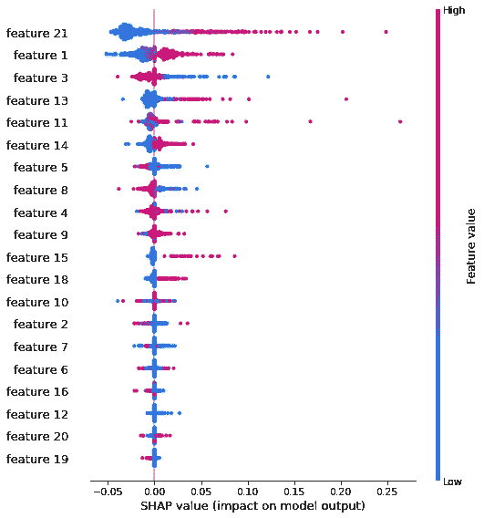

# 探索模型不可知解释的方法

> 原文：<https://towardsdatascience.com/exploring-methods-for-model-agnostic-interpretation-816304cb6e71?source=collection_archive---------36----------------------->

## 我们预览了几种模型不可知方法背后的思想

米歇尔·卡塔利萨诺在 [Unsplash](https://unsplash.com?utm_source=medium&utm_medium=referral) 上的照片

在你的模型中建立信任的一部分可以归结为简单地理解它的工作方式。可解释性允许我们看到模型的结果以及为什么做出预测。很多时候，这些方面可能会因为一些建模策略的复杂性而丢失。

在这里，我回顾了一些关于一些模型不可知的可解释性方法的背景，包括部分依赖图，H 统计量成对交互作用，和 SHAP。这篇文章是对我和他人参考的概念的直觉练习。

讨论的主题:

*   **部分依赖图**
*   **H-统计成对相互作用**
*   **SHAP**

# **部分依赖图**

低维可视化通常提供了一种获得直观见解的便捷方式。部分相关图(PDP)是一种与模型无关的方法，用于显示特征和预测之间的关系。通过回顾 PDP 的趋势，您可以开始梳理对功能行为的理解。

PDP 通常通过散点图显示连续变量，通过条形图显示分类变量。回归部分相关值是预测结果；对于分类，预测值可以作为概率。

PDP 的工作是将我们感兴趣的特性(通常是一个或两个)的结果在指定的值范围内进行平均。我们本质上忽略了一组特性，以确定我们感兴趣的另一组特性的依赖性。然后，我们通过用平均预测值绘制我们感兴趣的特征值来构建 PDP。

为了更深入地了解 PDP，我们参考了以下内容:

f 是模型。部分相关函数 fxs 是特征集 xs 上的模型。x 是感兴趣的特征， *xc* 剩余的补码。它们一起构成了完整的特征空间。Pc(xc)是 xc 的概率密度

由于我们无法对 xc 的所有值进行积分，我们可以通过对给定数据集取平均值来进行估算。上面的等式简化为:

从概念上讲，我们基本上保持感兴趣的特征 xs 不变，并在补集 xc 的所有其他组合上找到预测。我们对提供的数据集中的所有预测进行平均，以获得该实例的部分相关值。在我们为 xs 中指定范围的值生成每个实例的平均值之后，我们可以图形化地生成 PDP。

特征 3(绿色)显示，对于等于 0 的基于网格的实例，所提供数据集的平均预测值为 0.11。特征 3 的总体行为显示出与模型预测的负相关，而特征 2(蓝色)通常显示出不相关。

值得注意的是，PDP 本身可能容易产生误导性结果。因为我们在寻找平均值，所以可视化丢失了一些关于构成平均值的数据分布的信息。例如，可能存在可以指示不同依赖行为的看不见的聚类。该信息不会被 PDP 捕获。

为了阐明这种隐藏的信息，个人条件期望(ICE)图通常与 PDP 相结合，以审查每个观察的预测。ICE 图基本上是 PDP 中生成的图平均值的独立分解。

在这里，我们看到两组观察结果:一组为负相关，另一组为正相关 PDP(蓝色)没有捕捉到的行为，这本身表明没有相关性

# 成对相互作用

特征交互效应是模型解释的另一个重要方面。某些变量对模型输出的影响会随着其他变量的值而变化。

我们有办法捕捉这类信息。例如，在线性回归、实验设计和方差分析的背景下，采用特征多项式是检测交互作用的一种常见且强大的方法。

这里的线性模型有两个特点:

通过包括第四项多项式作为成对相互作用，我们可以考虑模型对相互作用效应的依赖性。β 系数的大小和符号提供了相对重要性和贡献的指示。

线性模型具有很强的可解释性，您可以通过系数了解输出相对于要素的变化情况。然而，当模型性能不足且不满足严格的线性模型假设时，我们可以寻找替代的、模型不可知的方法来研究成对相互作用。

下面，我们讨论双向 PDP、SHAP 依赖图和交互作用的 H 统计量。

**部分依赖图(双向):**视觉上，上面讨论的 PDP 可以扩展到单个特征之外。相反，如果我们对两个特征感兴趣，我们可以在三维空间中显示多变量图，或者使用如下所示的等高线图来检测相互作用。这些视觉效果很好地表现了特征和模型预测方面的行为。

双向交互的样本图，其中一个特性值的变化会影响另一个特性值的变化

**SHAP 依赖图**:基于 SHAP 的依赖图类似于 PDP 的依赖图，因为我们能够使用视觉来显示特征和预测之间的行为。每个点都是一个观测值，相应的 SHAP 值是该特征对给定预测的附加贡献。
*关于 SHAP 的更多细节将在下一节讨论。*

左边的图显示了特征 1 对预测的总体正关系，具有轻微的相互作用传播。右边的图显示了特征 1 和 4 之间的相互作用(或缺乏相互作用)。在某些情况下，我们看到特征 4 中较低的值通常会产生稍强的信号

H-statistic :对比视觉方法，我们也可以使用 Friedman H-statistic 通过计算找到特征交互的实际度量。这种与模型无关的方法建立在 PDP 奠定的基础之上。统计量基本上是通过将特征对的部分相关(PD)函数(其中 PD 方程中的 xs 由相互作用对组成)与其各自的单独 PD 函数进行比较来确定的。

H 统计量为每个特征对产生一个介于 0 和大约 1 之间的分数。值 0 对应于没有交互作用，值 1 意味着输出变化仅强烈依赖于感兴趣的特征之间的交互作用。

使用上面的部分相关性 *f* 可以将 H 统计检验描述如下:

一个比较直观的观点是，如果该对的 PD 函数完全由各个 PD 函数部分的总和来解释，则不存在相互作用。相反，如果 PD 函数的某些部分不能用和来解释，那就表明了两者之间某种程度的相互作用。因此，该方法观察特征 A 的贡献、特征 B 的贡献以及 A 和 B 之间交互的任何附加贡献

一旦我们将上面的测试应用于我们感兴趣的特征的每个组合，输出可以帮助显示交互的相对强度。如果我们有合理数量的这些特性，我们可以选择使用表格或图表(如条形图和带注释的热图)来更直观地表示这些指标。

H-统计得分表:我们看到特征 1 和 3 具有很强的相对相互作用

虽然 H-统计量适合于检测特征关系，但是它的一个局限性是这些度量不能提供关于感兴趣特征的重要性的很多信息。强相互作用不一定意味着对模型的全面影响。作者 Friedman 和 Popescu 在第 8.1 节中提到了通过修改上述方程来解释这一点的方法。

# **SHAP(沙普利加法解释)**

最后，SHAP 是一个更突出的和新兴的工具来处理模型解释。SHAP 值将重要性和贡献描述为要素对结果贡献的总和。特别是核 SHAP 方法产生了一种模型不可知的方式来解释为什么模型会做出某种预测。下面是一个温和的讨论 SHAP 的概念。

**Shapley 值:** SHAP 以 Shapley 值为基础，它起源于合作博弈论。Shapley 值寻求按特征公平分配预测贡献。其应用的一个常见例子是想象一个需要容纳不同飞机的机场。因为每架飞机需要不同长度的跑道，Shapley 值将是一个解决方案，根据相对要求在它们之间合理分配总成本。

Shapley 值可描述如下:

n 是特征的数量。s 是没有感兴趣特征 I 的子集特征。f 是模型

要打破上面的等式:

*   A 项是当引入 *i* 时，每个个体特征 *i* 对总体预测的贡献。
*   术语 B 通过在引入特征 *i* 之前和之后将特征组合在一起的不同方式来衡量术语 A。B 中的第一项是出现在 *i* 之前的特征排列，第二项是出现在之后的排列。
*   C 项是所有特性的平均值。

最终值是感兴趣的要素对结果的平均边际贡献。

在高层次上，Shapley 值背后的概念是通过比较将感兴趣的特征引入模型时所有可能排序的结果变化来捕捉重要性和贡献。

**SHAP:** 耦合特征独立性和局部模型线性的进一步条件，可以使用核 SHAP 来近似 Shapley 值。这种模型不可知的方法建立在 Shapley 值和在 LIME(局部可解释模型不可知解释)方法中发现的局部线性回归替代模型的基础上。

LIME 使用以下方法获得模型的局部解释:

l 是最小化损失函数。 *f* 是型号。 *g* 是训练好的线性解释模型。g 是更简单的、潜在可解释的模型族。πx 是局部加权核，ω是惩罚项

内核 SHAP 使用经典 Shapley 值的属性来生成 l、ω和πₓ的特定形式，作为恢复 Shapley 值的一种方式。非常整洁！

值得注意的是，SHAP 中的加权核πₓ将重点放在具有很少特征的子集以及具有几乎所有特征的子集上。直观地说，这是有意义的，因为您通过排除该特性(几乎完整的子集)或排除除该特性之外的所有特性(小子集)来捕获关于特定特性行为的更多信息。有关更深入的回顾，请参考第 3 节和第 4.1 节。

从概念上讲，每个特征的贡献通过采样特征子集来近似。基于所提供的训练数据，那些不存在于子集中的值被普遍的值所替代——基本上是每个特征的值的扰动。从不同特征子集的这些值中生成模拟目标数据，并如上所述进行加权。局部和加权线性回归模型在该数据上被训练为解释模型，其中最终系数对应于 SHAP 值。

总的来说，这种近似试图提供一种将上述概念应用于任何模型或函数的方法，这种方法在计算上比经典的 Shapley 值更实用，同时也减轻了使用 LIME 时出现的不太直观的行为。从这里开始，SHAP 值可用于描述行为的各种方式，使用相关的可视化，如下例所示。

**力图**:我们可以局部看到每个特征对单个预测的每个附加贡献。如果我们把每一个观察看作是整体总结的一部分，我们就可以在每一个预测中汇总这些观察。

**SHAP 值汇总**:图表显示了按重要性排序的特征，以及为每个观察点绘制的所有 SHAP 值。这可以给出特征效果的更全面的感觉。在下面的示例图中，要素 1 的高值通常对预测有相当积极的影响，而低值则有负面影响。

# 摘要

最后，我们看了几个模型不可知的策略，这些策略有助于解释模型，否则这些模型会太复杂而无法直接解释。这些方法包括:

*   部分依赖图(PDP)与个别条件期望图相结合，有助于提供对功能行为的一些视觉理解。我们研究了单个和成对 PDP，以了解依赖性趋势
*   接下来，我们在 PDP 奠定的基础上计算 H 统计量，这是一种检测和探索成对交互的方法
*   最后，我们讨论了 SHAP 及其整合的 Shapley 值和石灰方法，以了解功能的重要性和贡献

# **参考文献**

[1] Lundberg，s .，& Lee，S.-I. (2017)。"解释模型预测的统一方法."

[2]杰罗姆·弗里德曼(1999 年)。"贪婪函数逼近:梯度推进机."

[3]弗里德曼、杰罗姆 H .和波格丹一世 E .波佩斯库(2008)."通过规则集合的预测学习."

[4]克里斯托弗·莫尔纳尔。(2019)“可解释的机器学习。让黑盒模型变得可解释的指南。”