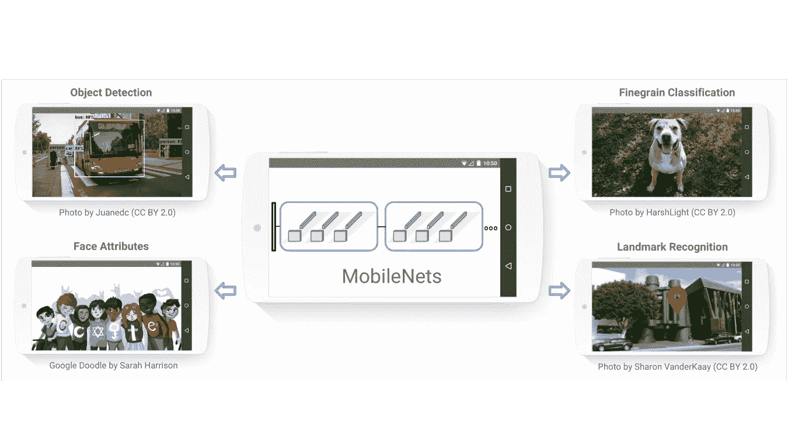
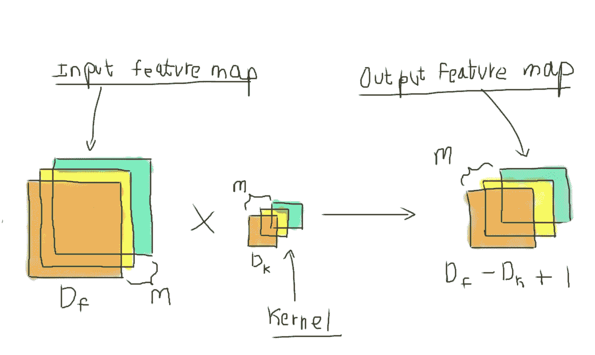
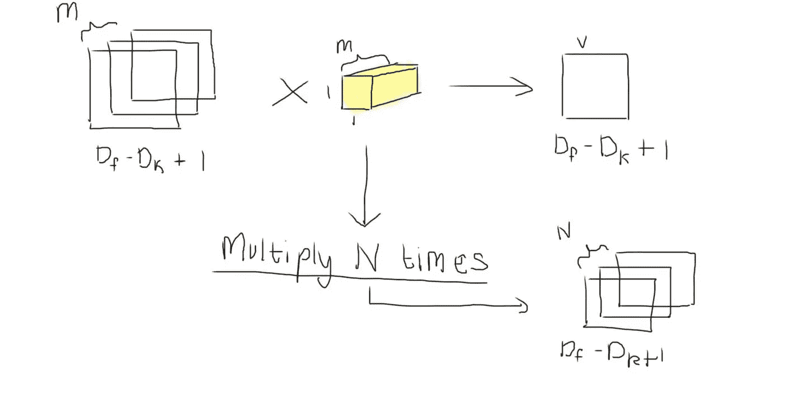
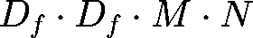
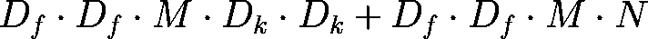
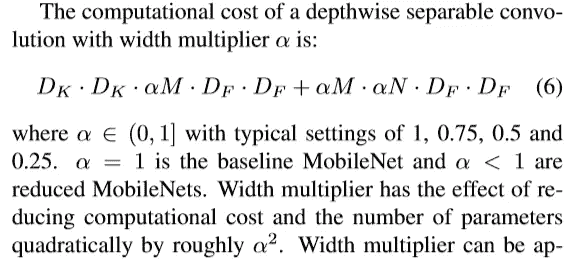
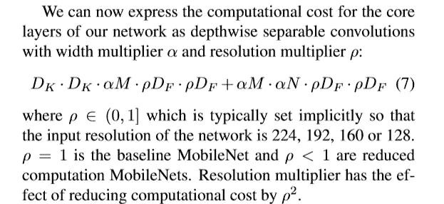
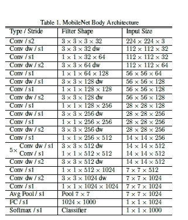
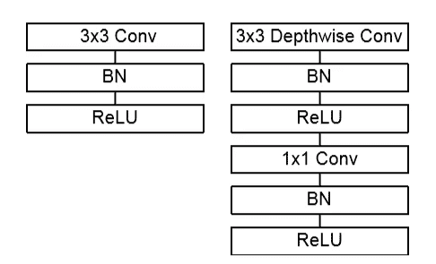

# 探索移动互联网:从纸张到 Keras

> 原文：<https://towardsdatascience.com/exploring-mobilenets-from-paper-to-keras-f01308ada818?source=collection_archive---------41----------------------->

## 拆卸 MobileNets，看看它们是如何轻便高效的。

照片由[安吉拉·孔波妮](https://unsplash.com/@angelacompagnone?utm_source=medium&utm_medium=referral)在 [Unsplash](https://unsplash.com?utm_source=medium&utm_medium=referral) 上拍摄

[MobileNets](https://arxiv.org/abs/1704.04861) 是流行的架构，用于图像分类、人脸检测、分割等等。它们在移动和嵌入式设备上的延迟是众所周知的。你可以从名字*“MobileNet”*中推断出这一点。由于使用了可分离卷积，它们的可训练参数数量少得多。如果你正在运行一个使用相机实时帧的图像分类模型，你可能需要一个快速、准确、占用移动设备更少内存的模型。

移动互联网的使用。[来源](https://www.arxiv-vanity.com/papers/1704.04861/)。

今天，我们将从它的[研究论文](https://arxiv.org/abs/1704.04861)到 TensorFlow ( Keras！).在进一步阅读这个故事之前，你可以确保以下几点，

1.  *如果你对可分卷积的概念不感兴趣，请阅读“* [*可分卷积基础介绍*](/a-basic-introduction-to-separable-convolutions-b99ec3102728) *”。*
2.  *[*Colab 笔记本*](https://colab.research.google.com/drive/1uUYdZk7EbOESRP7JFwHfsR7b9gUjxU75#scrollTo=K17Opyz2XLeN&forceEdit=true&sandboxMode=true) *仅包含 MobileNet V1 的 TF 实现。**
3.  **所有用粗体和斜体书写的术语，如* ***【示例】*** *都可以直接在研究论文中找到。**
4.  **你可能会在 GitHub 的*[*tensor flow/models*](https://github.com/tensorflow/models/blob/master/research/slim/nets/mobilenet/mobilenet.py)*repo 上看到 MobileNet 的实现。**

*我建议您在另一个选项卡中打开 MobileNet 的 TensorFlow 实现，*

* [## 移动网络 _With_TensorFlow

colab.research.google.com](https://colab.research.google.com/drive/1uUYdZk7EbOESRP7JFwHfsR7b9gUjxU75#scrollTo=K17Opyz2XLeN&forceEdit=true&sandboxMode=true) 

# MobileNets 使用可分离的卷积。但是什么是可分卷积呢？它们有什么“可分”之处？

可分离盘旋由下面的两个(分离的)盘旋组成。它们是深度方向卷积和点方向卷积。深度方向卷积接受一个特征图，在每个输入核上运行一个核。逐点卷积增加了输出通道的数量。

我强烈推荐阅读[齐-汪锋](https://towardsdatascience.com/@reina.wang)的[可分卷积基础介绍](/a-basic-introduction-to-separable-convolutions-b99ec3102728)。

 [## 可分卷积的基本介绍

### 解释空间可分离卷积，深度可分离卷积，以及在一个简单的。

towardsdatascience.com](/a-basic-introduction-to-separable-convolutions-b99ec3102728) 

> 在本文中，所有的卷积都被认为是填充的。所以在卷积之后，输入和输出特征图的大小是相同的。所以在下面两张图中， *Df — Dₖ + 1* 只等于 *Df* 。

## 深度方向回旋

深度方向的回旋。

假设，我们有尺寸为 *Df* 的 *M* 正方形特征地图。使用大小为 *Dₖ* 的内核，我们正在生成大小为 *Df — Dₖ + 1* 的输出特征图(假设没有填充，步长为 1)。我们对所有 m 个输入特征图重复这一过程，最后，我们剩下一个维度的特征图，*df—dₖ+1×df—dₖ+1×m。*注意，我们将对输入特征图的 *M* 个通道使用 *M* 个不同的核。这就是我们的 ***【深度方向卷积】*** 。

乘法次数(或文中提到的 ***【计算成本】*** )将为，

当你只为一个时期训练了你的模型并且你用完了内存的时候！

## 逐点卷积

逐点卷积。

上面生成的输出特征图有 *M* 个通道，而我们需要 *N* 个输出通道。因此，为了增加输出维度，我们使用了一个 *1 × 1* 卷积。这些被称为 ***【点态卷积】*** 。我们使用大小为 *1 × 1 × M* 的核，并产生大小为*df-dₖ+1×df-dₖ+1×1 的单一特征图。*我们将此重复 *N 次*并且我们留下大小为*df-dₖ+1×df-dₖ+1×n 的输出特征图。*

对于一个**标准卷积**，计算成本应该是，

对于**可分离卷积(深度方向+点方向)**，计算成本将是，

文中还计算了参数的缩减量。

[来源](https://arxiv.org/abs/1704.04861)

# 宽度和分辨率乘数

尽管 MobileNet 的可训练参数有了相当大的减少，但你仍然希望它快，为此我们引入了一个名为 ***【宽度乘数】*** 的参数。用 *α* 表示。因此，模型中的任何层都将接收 *αM* 特征图，并产生 *αN* 特征图。它使 MobileNet 型号*更薄*并增加了延迟。为简单起见，我们将设置α = 1.0，其中α ∈ ( 0，1)。

如文中所述的宽度倍增器。[来源](https://arxiv.org/abs/1704.04861)。

为了进一步降低计算成本，他们还引入了一个 ***【分辨率乘数】*** 记为ρ。它减少了输入图像以及每一层的内部表示。

如论文中所述的分辨率倍增器。[来源](https://arxiv.org/abs/1704.04861)。

# TensorFlow 实现(带 Keras)

首先，我们将从论文本身来看一下架构。它看起来像这样，

MobileNet 架构。[来源](https://arxiv.org/abs/1704.04861)

这里， **" *Conv /s2"*** 表示步长为 2 的卷积层(非深度方向)。 **" *Conv dw /s1"*** 表示步长为 1 的可分卷积。所有层之后是批处理规范化和 LeakyReLU 层。

具有 BatchNorm 和 LeakyReLU 的标准卷积层(右)。具有深度方向和 1 × 1 卷积(点方向)的可分离卷积(左)。[来源](https://arxiv.org/abs/1704.04861)

Keras 中的实现如下所示，

可分卷积。

最后，模型由 29 层包装而成，

组装模型。

我们将在[劳伦斯·莫罗尼](http://www.laurencemoroney.com/)的[石头剪刀布](http://www.laurencemoroney.com/rock-paper-scissors-dataset/)数据集上训练我们的模型。为了方便起见，它托管在 [TensorFlow 数据集](https://www.tensorflow.org/datasets)上。最初的 MobileNet 是在包括 ImageNet 在内的许多数据集上进行评估的。

你会在 [Colab 笔记本](https://colab.research.google.com/drive/1uUYdZk7EbOESRP7JFwHfsR7b9gUjxU75#scrollTo=K17Opyz2XLeN&forceEdit=true&sandboxMode=true)中找到培训部分。恭喜你。您刚刚从头开始创建了一个 MobileNet。

# 进一步探索…

# 结束了

[来源](https://giphy.com/stickers/giphytext-text-thanks-wordart-fVDbDA873476u25ubP)。

我希望你喜欢 MobileNet 的概念。如果你想在大数据集上训练模型，你可以通读研究论文。他们还包括一些超参数，这将有助于你的训练。谢谢，再见。*